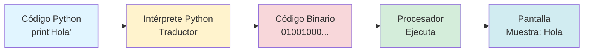
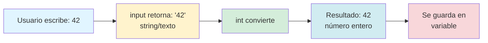

# Capítulo 2: Activando tu Superpoder: El Ritual del 'Hola Mundo'

## Introducción: El Momento en que las Ideas Cobran Vida

Durante los dos capítulos anteriores, has estado trabajando con ideas puras: algoritmos escritos en pseudocódigo, flujos lógicos dibujados en diagramas. Has aprendido a pensar como un programador, a descomponer problemas complejos en pasos manejables, a visualizar decisiones y caminos alternativos. Todo esto ha sido fundamental, pero ahora llega el momento mágico: ver tus ideas ejecutándose realmente en una computadora.

Imagina que durante meses has estado estudiando las reglas del ajedrez, memorizando movimientos, analizando estrategias en un tablero de papel. Todo ese conocimiento es valioso, pero solo cuando mueves tu primera pieza en una partida real, cuando ves cómo tu oponente responde y tienes que adaptar tu estrategia en tiempo real, es cuando realmente entiendes el juego. La programación funciona exactamente igual.

Python va a ser tu compañero de aventuras. No es solo un lenguaje de programación, es una herramienta que transforma tus ideas en acciones concretas. Cuando escribas `print("Hola, Mundo")` y presiones el botón de ejecutar, verás instantáneamente las palabras aparecer en pantalla. No hay intermediarios, no hay retrasos. Tu pensamiento se convierte en realidad digital en milisegundos.

Este capítulo marca el inicio de tu relación con Python. Vas a descubrir por qué este lenguaje se ha convertido en el favorito de millones de programadores alrededor del mundo, desde estudiantes de tu edad hasta ingenieros que construyen satélites espaciales. Vas a escribir tu primer programa funcional, vas a provocar tu primer error intencionalmente (y aprender por qué los errores son tus mejores maestros), y vas a empezar a sentir ese poder de crear cosas que antes solo existían en tu imaginación.

> **💡 Objetivo del Capítulo:**
> Al final de este capítulo, habrás escrito y ejecutado tu primer programa en Python, entenderás qué es un lenguaje de programación y cómo funciona, dominarás las funciones básicas `print()` e `input()`, y sabrás cómo interactuar con el REPL de Python para experimentar con código en tiempo real.

## Python: El Lenguaje que Habla Como Humano

Antes de escribir tu primera línea de código, necesitas entender qué hace especial a Python entre los cientos de lenguajes de programación que existen. La respuesta corta es: Python fue diseñado desde cero para ser legible por humanos, no solo por computadoras.

La mayoría de los lenguajes de programación fueron creados por ingenieros para ingenieros, con sintaxis compacta pero críptica. Python fue creado por un programador llamado Guido van Rossum en 1991 con una filosofía radicalmente diferente: el código debería ser tan fácil de leer como el inglés bien escrito. De hecho, Guido se inspiró en el grupo de comedia británico Monty Python (de ahí el nombre del lenguaje), porque creía que programar debería ser divertido y accesible, no intimidante y exclusivo.

### Comparación: El Mismo Programa en Tres Lenguajes

Veamos un ejemplo concreto de lo que significa "legible por humanos". Este es el mismo programa escrito en tres lenguajes diferentes, todos hacen exactamente lo mismo: pedir tu nombre y saludarte personalmente.

**En un lenguaje llamado C (creado en 1972):**

```c
#include <stdio.h>
int main() {
    char nombre[50];
    printf("¿Cuál es tu nombre? ");
    scanf("%s", nombre);
    printf("¡Hola, %s! Bienvenido.\n", nombre);
    return 0;
}
```

**En un lenguaje llamado Java (creado en 1995):**

```java
import java.util.Scanner;
public class Saludo {
    public static void main(String[] args) {
        Scanner scanner = new Scanner(System.in);
        System.out.print("¿Cuál es tu nombre? ");
        String nombre = scanner.nextLine();
        System.out.println("¡Hola, " + nombre + "! Bienvenido.");
    }
}
```

**Ahora mira el mismo programa en Python:**

```python
nombre = input("¿Cuál es tu nombre? ")
print(f"¡Hola, {nombre}! Bienvenido.")
```

¿Ves la diferencia? El programa en Python tiene solo dos líneas y puedes entender qué hace cada una casi sin explicación. La primera línea pide tu nombre usando `input()` y lo guarda en una variable llamada `nombre`. La segunda línea imprime un saludo personalizado usando `print()`. No hay rituales misteriosos con símbolos extraños, no hay configuraciones complejas antes de empezar. Solo instrucciones directas y claras.

Esta claridad no significa que Python sea un lenguaje "de juguete" o menos poderoso. Todo lo contrario. Python es usado por Instagram para manejar millones de fotos diarias, por Spotify para generar tus playlists personalizadas, por la NASA para analizar datos de Marte, por Google en sus sistemas de búsqueda, por Netflix para recomendar series. Es un lenguaje profesional de nivel industrial que simplemente decidió ser amigable con los humanos.

## Python en el Mundo Real: De lo Cotidiano a lo Extraordinario

Antes de sumergirnos en escribir código, quiero que entiendas el alcance real de lo que estás aprendiendo. Python no es solo una herramienta académica que usarás en este libro y luego olvidarás. Es una habilidad que puede abrirte puertas en prácticamente cualquier campo que te interese.

Python no es un lenguaje de juguete que solo se usa en clases. Es la herramienta que construye el mundo digital que usas todos los días:

| Si te interesa... | Python trabaja en... | Haciendo qué |
|---|---|---|
| 🎵 Música y entretenimiento | Spotify, Netflix | Recomienda canciones y series analizando patrones de millones de usuarios |
| 🚀 Ciencia y exploración | NASA (helicóptero en Marte) | Controla robots autónomos que navegan en otros planetas |
| 📱 Redes sociales | Instagram | Procesa millones de fotos diarias: comprime, filtra, almacena |
| 🏦 Finanzas | Bancos y fintechs | Detecta fraudes analizando patrones sospechosos en transacciones |
| 🎮 Videojuegos | EVE Online, Civilization IV | Maneja la lógica del juego, IA de personajes, sistemas de eventos |
| 🧬 Investigación científica | Laboratorios médicos | Analiza datos de COVID, secuencias genéticas, resultados clínicos |
| 🎨 Arte y creatividad | Aplicaciones de IA generativa | Crea arte, música y contenido usando inteligencia artificial |
| 🌤️ Meteorología | Servicios climáticos | Procesa datos satelitales para predecir el clima |

La lista continúa y crece cada día. Lo fascinante es que todos estos usos diferentes comparten los mismos conceptos fundamentales que vas a aprender en este libro: variables, decisiones, bucles, funciones. Un ingeniero de Spotify y un científico de la NASA usan las mismas herramientas básicas, solo las aplican a problemas diferentes.

> **💡 Perspectiva del Programador:**
> Una de las razones por las que Python es tan popular es su filosofía de "baterías incluidas": viene con miles de bibliotecas (paquetes de código pre-escrito) para prácticamente cualquier tarea imaginable. ¿Necesitas procesar imágenes? Usa PIL. ¿Quieres analizar datos? Usa Pandas. ¿Crear un sitio web? Usa Django o Flask. Es como tener un enorme set de LEGO donde las piezas ya están diseñadas para encajar perfectamente.

## Perspectiva del Programador: Los Lenguajes de Programación son Traductores

Aquí está el concepto fundamental que ilumina todo: tu computadora no entiende Python. De hecho, tu computadora no entiende ningún lenguaje de programación. Lo único que entiende es un código increíblemente simple llamado "código binario": secuencias infinitas de unos y ceros.

Cada cosa que hace tu computadora, desde mostrar esta palabra en pantalla hasta reproducir un video, se reduce finalmente a millones de unos y ceros que activan o desactivan transistores microscópicos dentro del procesador. Es como si tu computadora solo supiera decir "sí" (1) o "no" (0), pero lo dice miles de millones de veces por segundo con una precisión perfecta.

Programar en código binario sería prácticamente imposible para humanos. Imagina tener que escribir algo como:

```
01001000 01101111 01101100 01100001
```

Solo para hacer que la computadora muestre la palabra "Hola". Necesitarías años para escribir un programa simple y sería casi imposible detectar errores.

Aquí es donde entran los lenguajes de programación como Python. Funcionan como **traductores universales**. Tú escribes instrucciones en un lenguaje que los humanos pueden leer y entender (`print("Hola")`), y Python lo traduce automáticamente a los millones de unos y ceros que tu computadora necesita para ejecutar esa instrucción.

Este proceso de traducción ocurre en milisegundos y es completamente invisible para ti. No necesitas preocuparte por los unos y ceros, no necesitas entender cómo funciona el procesador a nivel de transistores, no necesitas saber qué voltajes se están aplicando a qué circuitos. Python se encarga de todo eso. Tú solo necesitas escribir código claro y lógico, y Python hace el trabajo pesado de convertirlo en algo que la máquina pueda ejecutar.



> **📝 Nota:**
> Técnicamente, Python es un "lenguaje interpretado", lo que significa que traduce tu código línea por línea mientras se ejecuta, en lugar de traducir todo el programa de una vez antes de ejecutarlo (como hacen los "lenguajes compilados" como C o C++). Esta diferencia hace que Python sea más lento en ejecución pura que C, pero infinitamente más fácil de usar y depurar. Para el 99% de las tareas que realizarás, esa diferencia de velocidad es irrelevante.

## Tu Primer Programa: El Ritual del "Hola, Mundo"

Existe una tradición en programación que se remonta a 1978, cuando el legendario programador Brian Kernighan escribió un libro sobre el lenguaje C. Estableció que el primer programa que cualquier persona debe escribir al aprender un lenguaje nuevo es uno que simplemente muestre las palabras "Hola, Mundo" en pantalla.

¿Por qué esta tradición ha persistido durante casi cincuenta años? Porque ese programa minimalista logra algo profundo: confirma que todo el sistema funciona. Que Python está instalado correctamente, que puede ejecutar código, que puede comunicarse contigo mostrando información. Es como verificar que el micrófono funciona antes de dar un concierto. Es un punto de partida universal que conecta a todos los programadores del mundo, sin importar cuándo empezaron o qué lenguaje usan.

### Escribiendo tu Primer Programa

Abre tu terminal o línea de comandos. Si estás en Windows, busca "cmd" o "PowerShell". Si estás en Mac o Linux, abre "Terminal". Escribe:

```bash
python3
```

O simplemente:

```bash
python
```

Deberías ver algo como esto aparecer:

```
Python 3.11.4 (main, Jun 20 2023, 17:23:00)
[GCC 11.3.0] on linux
Type "help", "copyright", "credits" or "license" for more information.
>>>
```

Esos tres símbolos `>>>` se llaman el **prompt** de Python. Es Python diciéndote: "Estoy listo. Dame una instrucción." Este modo interactivo se llama REPL (Read-Eval-Print-Loop: Leer-Evaluar-Imprimir-Repetir), y es tu laboratorio de experimentos donde puedes probar código instantáneamente.

Ahora, escribe exactamente esto:

```python
print("Hola, Mundo")
```

Presiona Enter. Verás:

```
Hola, Mundo
```

**¡Felicidades!** Acabas de escribir y ejecutar tu primer programa en Python. No importa que sea simple. Lo que importa es que cruzaste la frontera entre teoría y práctica. Le diste una instrucción a una computadora y la siguió al pie de la letra.

### Anatomía de tu Primer Programa

Analicemos cada parte de esa línea de código:

```python
print("Hola, Mundo")
```

**`print`** es una **función**. Piensa en una función como un comando especializado que le dice a Python que haga algo específico. En este caso, `print` le dice a Python: "Muestra algo en pantalla."

Los **paréntesis `()`** son donde le das a la función los datos que necesita para trabajar. Son como el espacio donde pones los ingredientes para una receta.

**`"Hola, Mundo"`** es el dato que le pasas a la función print. Nota las comillas dobles. En Python, cualquier texto que quieras usar literalmente debe ir entre comillas (pueden ser dobles `"` o simples `'`, pero deben coincidir al inicio y al final). Sin las comillas, Python pensaría que "Hola" es el nombre de una variable o comando, no texto literal.

> **⚠️ Errores Comunes:**
> **Error #1 - Olvidar las comillas:**
> ```python
> print(Hola, Mundo)
> ```
> Esto produce: `NameError: name 'Hola' is not defined`. Python piensa que "Hola" es una variable que no existe.
>
> **Error #2 - Comillas desbalanceadas:**
> ```python
> print("Hola, Mundo')
> ```
> Esto produce: `SyntaxError: EOL while scanning string literal`. Python esperaba que cierres con el mismo tipo de comilla con que abriste.
>
> **Error #3 - Olvidar los paréntesis:**
> ```python
> print "Hola, Mundo"
> ```
> Esto produce: `SyntaxError: Missing parentheses in call to 'print'`. En Python 3, print siempre necesita paréntesis.

### Experimentando con Variaciones

Ahora que entiendes la estructura básica, experimenta con variaciones. En el REPL de Python (todavía debería estar abierto con el prompt `>>>`), prueba estos comandos uno por uno:

```python
print("Mi primer programa en Python")
```

```python
print('Las comillas simples también funcionan')
```

```python
print("Puedo mostrar números:", 42, 100, 2024)
```

```python
print("Python", "puede", "mostrar", "múltiples", "cosas")
```

Nota cómo `print()` puede recibir múltiples elementos separados por comas, y automáticamente los separa con espacios cuando los muestra.

> **💡 Consejo:**
> Cuando le das múltiples cosas a `print()` separadas por comas, Python automáticamente pone un espacio entre cada una. Si quieres controlar exactamente qué va entre los elementos, puedes usar el parámetro `sep`. Por ejemplo:
> ```python
> print("Python", "es", "genial", sep="-")
> # Muestra: Python-es-genial
> ```

## Conversando con Python: La Función `input()`

Un programa que solo muestra información es útil, pero limitado. La verdadera magia ocurre cuando tu programa puede interactuar contigo, hacer preguntas, recibir respuestas, y adaptar su comportamiento según lo que le digas. Aquí es donde entra `input()`.

### Tu Primer Programa Interactivo

Sal del REPL de Python (escribe `exit()` o presiona Ctrl+D en Mac/Linux o Ctrl+Z en Windows). Ahora vamos a crear un archivo de programa real.

Crea un archivo nuevo llamado `saludo.py` (la extensión `.py` le dice al sistema operativo que es un archivo Python). Abre ese archivo en cualquier editor de texto y escribe:

**Archivo: `saludo.py`**
```python
nombre = input("¿Cuál es tu nombre? ")
print(f"¡Hola, {nombre}! Bienvenido a Python.")
```

Guarda el archivo y ejecútalo desde la terminal:

```bash
python saludo.py
```

El programa mostrará:

```
¿Cuál es tu nombre?
```

El cursor parpadeará, esperando que escribas algo. Escribe tu nombre y presiona Enter. Verás:

```
¡Hola, Carlos! Bienvenido a Python.
```

(Suponiendo que escribiste "Carlos", obviamente mostrará el nombre que tú escribiste.)

### Entendiendo `input()` y las Variables

Analicemos ese programa línea por línea:

```python
nombre = input("¿Cuál es tu nombre? ")
```

Aquí están ocurriendo varias cosas simultáneamente:

1. **`input("¿Cuál es tu nombre? ")`** hace dos cosas:
   - Muestra en pantalla el texto entre comillas (la pregunta)
   - Detiene completamente el programa y espera a que escribas algo y presiones Enter

2. **`nombre =`** crea una **variable** llamada `nombre` y guarda en ella lo que escribiste. Una variable es como una caja etiquetada donde Python almacena información para usarla después. Puedes nombrar tus variables casi como quieras (con algunas reglas que veremos pronto), y puedes guardar en ellas texto, números, listas, o cualquier tipo de dato.

3. **El signo `=`** en programación no significa "es igual a" como en matemáticas. Significa "asigna" o "guarda". Estás diciéndole a Python: "Toma lo que está a la derecha del igual y guárdalo en la variable que está a la izquierda."

```python
print(f"¡Hola, {nombre}! Bienvenido a Python.")
```

Esta línea tiene algo nuevo: la letra `f` antes de las comillas. Esto se llama un **f-string** (formatted string literal) y es una de las características más útiles de Python moderno. La `f` le dice a Python: "En este texto, las cosas entre llaves `{}` son variables, y quiero que muestres su contenido, no el nombre."

Sin la `f`, Python mostraría literalmente:

```
¡Hola, {nombre}! Bienvenido a Python.
```

Con la `f`, Python entiende que debe buscar la variable `nombre` y mostrar lo que contiene:

```
¡Hola, Carlos! Bienvenido a Python.
```

> **📝 Nota:**
> Antes de Python 3.6, los programadores tenían que usar métodos más complicados para insertar variables en strings, como `.format()` o el operador `%`. Los f-strings son más nuevos, más claros, y más eficientes. Si ves código antiguo que usa esos métodos, funcionan pero son menos elegantes que los f-strings.

### Reglas para Nombrar Variables

Python es flexible con nombres de variables, pero tiene algunas reglas estrictas:

**✅ Permitido:**
- Letras minúsculas: `nombre`, `edad`, `ciudad`
- Letras mayúsculas: `Nombre`, `EDAD` (pero por convención se usan solo para constantes)
- Números (pero no al inicio): `edad2`, `nombre1`, `producto_final`
- Guiones bajos: `nombre_completo`, `precio_con_iva`, `_variable_privada`

**❌ No permitido:**
- Comenzar con número: `2nombres` ❌
- Espacios: `nombre completo` ❌ (usa `nombre_completo`)
- Caracteres especiales: `nombre-completo` ❌, `precio$` ❌, `email@` ❌
- Palabras reservadas de Python: `print`, `input`, `if`, `for`, `while`, etc.

**Convenciones (no obligatorias pero muy recomendadas):**
- Usa nombres descriptivos: `edad` es mejor que `e`, `precio_total` es mejor que `pt`
- Usa snake_case (palabras separadas por guiones bajos): `nombre_completo`, `precio_con_descuento`
- Evita nombres de una sola letra excepto en casos obvios como `i` para índices o `x`, `y` para coordenadas

> **💡 Consejo:**
> Tu código se leerá muchas más veces de las que se escribirá. Un nombre claro como `temperatura_promedio` vale las 10 teclas extra que cuesta escribir, comparado con leer `tp` seis meses después y olvidar qué significaba.

## Trabajando con Números: El Tipo de Dato Importa

Hasta ahora, todo lo que hemos guardado en variables ha sido texto (strings). Pero Python también trabaja con números, y hay una distinción crucial que debes entender.

### El Problema: Suma de Números vs. Concatenación de Texto

Crea un nuevo archivo llamado `suma_problema.py`:

**Archivo: `suma_problema.py`**
```python
numero1 = input("Ingresa un número: ")
numero2 = input("Ingresa otro número: ")
resultado = numero1 + numero2
print(f"La suma es: {resultado}")
```

Ejecuta el programa:

```bash
python suma_problema.py
```

Cuando te pida números, escribe `5` y luego `3`. El programa mostrará:

```
La suma es: 53
```

¡Espera! 5 + 3 debería ser 8, no 53. ¿Qué pasó?

El problema es que `input()` **siempre devuelve texto (un string)**, incluso si escribes números. Cuando Python ve:

```python
resultado = numero1 + numero2  # numero1 es "5", numero2 es "3"
```

Interpreta el operador `+` como "concatenar (unir) textos", no como "sumar números". Entonces hace `"5" + "3"` que resulta en `"53"`, no en el número `8`.

### La Solución: Conversión de Tipos con `int()`

Para hacer matemáticas reales, necesitas convertir los strings a números usando la función `int()` (de "integer" = entero):

**Archivo: `suma_correcta.py`**
```python
numero1 = int(input("Ingresa un número: "))
numero2 = int(input("Ingresa otro número: "))
resultado = numero1 + numero2
print(f"La suma es: {resultado}")
```

Ahora cuando ingreses `5` y `3`, el programa mostrará correctamente:

```
La suma es: 8
```

### Entendiendo la Conversión de Tipos

```python
numero1 = int(input("Ingresa un número: "))
```

Aquí hay dos funciones trabajando juntas:

1. **`input(...)`** ejecuta primero (las funciones siempre se ejecutan de adentro hacia afuera). Muestra el mensaje, espera tu respuesta, y devuelve lo que escribiste como string.

2. **`int(...)`** toma ese string y lo convierte a un número entero que Python puede usar para matemáticas.

Es como una cadena de producción: el input sale como texto, pasa por la máquina `int()` que lo transforma en número, y ese número se guarda en la variable.



> **⚠️ Advertencia:**
> Si intentas convertir algo que no es un número válido, Python lanzará un error:
> ```python
> edad = int(input("Tu edad: "))
> # Usuario escribe: "veinte"
> # Error: ValueError: invalid literal for int() with base 10: 'veinte'
> ```
> En capítulos futuros aprenderás a manejar estos errores elegantemente con try/except.

### Otros Tipos de Conversión

Python tiene varias funciones de conversión útiles:

| Función | Qué hace | Ejemplo |
|---------|----------|---------|
| `int()` | Convierte a número entero | `int("42")` → `42` |
| `float()` | Convierte a número decimal | `float("3.14")` → `3.14` |
| `str()` | Convierte a texto | `str(42)` → `"42"` |

**Ejemplo práctico:**

```python
# Calculadora simple de propinas
cuenta = float(input("Monto de la cuenta: "))
propina_porcentaje = float(input("Porcentaje de propina (ej: 15): "))
propina = cuenta * (propina_porcentaje / 100)
total = cuenta + propina
print(f"Propina: S/. {propina:.2f}")
print(f"Total a pagar: S/. {total:.2f}")
```

Nota el `:.2f` en el f-string. Esto le dice a Python que muestre el número con exactamente 2 decimales, perfecto para dinero.

## Laboratorio 1: Perfil Personal Interactivo

### Objetivo
Crear un programa que recopile información del usuario y genere un perfil personalizado.

### Instrucciones

Crea un programa que:

1. Pida el nombre del usuario
2. Pida su edad (asegúrate de convertirla a número entero)
3. Pida su ciudad
4. Pida su comida favorita
5. Calcule en qué año nació (año actual menos edad)
6. Muestre un resumen con toda la información de forma organizada

**Ejemplo de ejecución:**

```
=== CREADOR DE PERFIL ===
Nombre: Ana
Edad: 16
Ciudad: Lima
Comida favorita: Pizza

=== TU PERFIL ===
Nombre: Ana
Naciste en: 2008
Vives en: Lima
Tu comida favorita es: Pizza
```

### Criterio de Éxito

- El programa debe usar `input()` correctamente
- Debe convertir la edad a número usando `int()`
- Debe calcular el año de nacimiento correctamente
- Debe usar f-strings para el output
- El formato debe ser claro y organizado

## Laboratorio 2: Calculadora de Proporciones

### Objetivo
Practicar conversión de tipos y operaciones matemáticas básicas.

### Instrucciones

Crea un programa que ayude a escalar recetas de cocina. El programa debe:

1. Pedir cuántas porciones tiene la receta original
2. Pedir la cantidad de un ingrediente para esa receta (ej: 200 gramos de harina)
3. Pedir cuántas porciones quieres hacer
4. Calcular cuánto del ingrediente necesitas para las nuevas porciones
5. Mostrar el resultado

**Ejemplo de ejecución:**

```
=== ESCALADOR DE RECETAS ===
Porciones originales: 4
Cantidad de harina (g): 200
Porciones que quieres: 10

Para 10 porciones necesitas: 500.0 g de harina
```

### Pista

Usa la fórmula: `cantidad_nueva = (cantidad_original / porciones_originales) * porciones_nuevas`

### Criterio de Éxito

- Convierte todos los inputs numéricos correctamente
- Realiza el cálculo correctamente
- Muestra el resultado con formato claro

## El REPL: Tu Laboratorio de Experimentos

Antes de cerrar este capítulo, quiero que entiendas completamente el poder del REPL (el modo interactivo de Python que usaste al principio). Es una herramienta que usarás constantemente, incluso cuando seas un programador experimentado.

### ¿Qué es el REPL?

REPL significa **Read-Eval-Print-Loop** (Leer-Evaluar-Imprimir-Repetir):

1. **Read (Leer):** Python lee lo que escribes después del prompt `>>>`
2. **Eval (Evaluar):** Python ejecuta esa instrucción
3. **Print (Imprimir):** Python muestra el resultado
4. **Loop (Repetir):** Vuelve al paso 1, esperando tu siguiente comando

### Ventajas del REPL

**Experimentación instantánea:** Puedes probar una idea en segundos sin crear un archivo. ¿Quieres saber qué pasa si divides 10 entre 3? Escribe `10 / 3` y presiona Enter.

**Calculadora poderosa:** El REPL es una calculadora que entiende matemáticas complejas:

```python
>>> 2 + 2
4
>>> 15 * 7
105
>>> 100 / 3
33.333333333333336
>>> 2 ** 10  # Potencias
1024
>>> (5 + 3) * 2
16
```

Nota cómo no necesitas escribir `print()`. En el REPL, Python automáticamente muestra el resultado de cualquier expresión que escribas. Es perfecto para probar ideas rápidamente.

**Prueba de funciones:** Puedes experimentar con funciones sin compromiso:

```python
>>> nombre = "Carlos"
>>> edad = 15
>>> print(f"{nombre} tiene {edad} años")
Carlos tiene 15 años
>>> edad = edad + 1
>>> print(f"El próximo año {nombre} tendrá {edad} años")
El próximo año Carlos tendrá 16 años
```

El REPL es tu laboratorio personal. Cuando en capítulos futuros aprendas un concepto nuevo y quieras probarlo rápidamente sin crear un archivo completo, el REPL será tu mejor amigo. Es donde los programadores profesionales prueban ideas, verifican sintaxis, y experimentan antes de escribir código permanente.

> **💡 Consejo:**
> La diferencia entre el REPL y escribir programas en archivos es simple: el REPL es como tener una conversación casual donde cada cosa que dices desaparece cuando termina la charla. Los archivos de programas son como escribir un libro que guardas y puedes ejecutar las veces que quieras.

## Desde la Trinchera

"Durante mi primer mes aprendiendo a programar, cometí el mismo error probablemente cien veces: olvidaba las comillas en los print statements. Veía el error `NameError` y me frustraba porque 'ya había escrito el nombre correctamente'. Tardé semanas en entender que el problema no era que el nombre estuviera mal escrito, sino que Python pensaba que era una variable cuando en realidad quería mostrar texto. El día que finalmente hice la conexión mental entre 'texto literal necesita comillas' y 'nombre de variable no necesita comillas', algo hizo clic en mi cerebro. Desde ese momento, ese error nunca volvió a aparecer.

Ahora, cinco años después, cuando enseño programación, puedo predecir exactamente cuándo un estudiante va a cometer ese error solo por cómo estructura su pensamiento. Y siempre les digo: este error no significa que seas malo programando, significa que tu cerebro aún está aprendiendo a pensar en dos niveles simultáneos: el nivel de las palabras que significan cosas para humanos, y el nivel de los nombres que significan cosas para Python."

— Desarrolladora Full Stack, cinco años de experiencia

## Para Recordar

| Concepto | Qué significa y cómo se usa |
|---|---|
| **Python** | Un lenguaje de programación diseñado para ser legible por humanos. Traduce tus instrucciones claras en código binario que la computadora ejecuta. |
| **print()** | La función que muestra información en pantalla. Todo lo que pongas entre las comillas se mostrará exactamente como está escrito: `print("tu mensaje aquí")` |
| **input()** | La función que le pide información al usuario. Detiene el programa, espera que escribas algo, y guarda tu respuesta: `nombre = input("¿Tu nombre?")` |
| **Variables** | Contenedores con nombre donde guardas información para usarla después. Se crean con el signo igual: `edad = 15` |
| **Strings (textos)** | Cualquier texto en Python debe ir entre comillas: `"así"` o `'así'`. Sin comillas, Python pensará que es nombre de variable. |
| **F-strings** | La forma profesional de insertar variables en texto. Usa `f` antes de las comillas y `{}` para las variables: `print(f"Hola {nombre}")` |
| **int()** | Convierte texto a número entero. Necesario cuando usas input() y quieres hacer matemáticas: `edad = int(input("¿Edad?"))` |
| **float()** | Convierte a número decimal para cálculos con decimales: `precio = float(input("Precio: "))` |
| **REPL** | Tu laboratorio de experimentos. Escribe `python` o `python3` en la terminal para probarlo. El prompt `>>>` espera tus comandos. |

**Regla de oro para evitar el bug más común:** Si quieres mostrar texto exacto, usa comillas. Si quieres mostrar el contenido de una variable, NO uses comillas. `print("nombre")` muestra la palabra "nombre". `print(nombre)` muestra lo que guardaste en la variable nombre.

## Preguntas de Reflexión

1. Python es usado tanto por estudiantes de doce años aprendiendo sus primeros programas como por ingenieros de la NASA programando misiones a Marte. ¿Qué características crees que debe tener un lenguaje para servir a audiencias tan diferentes?

2. El programa "Hola, Mundo" parece trivial, pero es una tradición que ha persistido por casi cincuenta años en programación. ¿Por qué crees que algo tan simple se ha mantenido relevante durante tanto tiempo? ¿Qué representa simbólicamente ese primer programa?

3. Cuando usas `input()`, el programa se detiene completamente y espera a que escribas algo. Esto rompe el flujo normal donde las computadoras hacen las cosas instantáneamente. ¿Por qué crees que es importante que un programa pueda detenerse y esperar input humano? ¿Qué tipos de programas no funcionarían sin esta capacidad?

4. Piensa en apps que usas todos los días: Instagram, WhatsApp, YouTube. Todas necesitan interactuar contigo constantemente: mostrar información y recibir tus acciones. ¿Puedes identificar momentos específicos donde esas apps están usando el equivalente de `print()` (mostrar algo) y el equivalente de `input()` (esperar que hagas algo)?

## Desafío Extra: Tu Primer Programa Personalizado

Ahora que entiendes los bloques básicos de construcción, vamos a combinarlos en algo más interesante. Tu desafío es crear un programa que haga lo siguiente:

**Nivel Básico:**

1. Pide el nombre del usuario usando `input()` y guárdalo en una variable
2. Pide su edad usando `input()`, convierte la respuesta a número entero usando `int()`, y guárdalo en otra variable
3. Pide su color favorito usando `input()` y guárdalo en una tercera variable
4. Muestra un mensaje personalizado que use las tres variables

El mensaje debe incluir:
- Un saludo usando el nombre
- Una observación sobre su edad, calculando cuántos años tendrá en una década
- Una referencia a su color favorito, diciéndole que es un color excelente

El programa completo debe verse natural, como una conversación amigable, no como un interrogatorio robótico.

**Nivel Avanzado:**

Agrega estas mejoras:
- Pregunta también su comida favorita y su animal favorito
- Crea un mensaje más elaborado que combine los cinco datos de forma creativa

Por ejemplo: "Hola Ana, con 14 años y amante del color azul, te imagino en 10 años a los 24, disfrutando pizza mientras observas delfines en el océano. ¡El futuro pinta genial!"

No hay una única respuesta correcta para este desafío. Lo importante es que practiques combinando `input()`, variables, conversión de tipos con `int()`, y f-strings para crear output personalizado. Mientras más creativo seas con el mensaje final, mejor.

## Cierre: El Puente Entre Pensamiento y Máquina

Si completaste este capítulo con atención, ya no eres la misma persona que empezó a leerlo. Cruzaste una frontera invisible pero real. Escribiste código que se ejecutó en una computadora real. Viste tus palabras transformarse en instrucciones que una máquina siguió al pie de la letra.

Los conceptos que aprendiste en los dos capítulos anteriores—el pensamiento algorítmico y los diagramas de flujo—finalmente tienen una voz tangible. Ese rectángulo en tu diagrama que decía "mostrar mensaje" ahora es una línea real de Python: `print()`. Ese paralelogramo que decía "pedir datos al usuario" ahora es `input()`. La conexión entre el pensamiento abstracto y la ejecución concreta está completa.

Pero esto es solo el principio. Hasta ahora has escrito programas lineales: el código se ejecuta línea por línea, de arriba hacia abajo, sin desviaciones. No hay decisiones, no hay repeticiones, no hay lógica compleja. Es como saber las letras del alfabeto pero aún no saber formar palabras.

En el próximo capítulo vas a configurar Google Colab, tu laboratorio digital donde podrás crear programas más complejos sin preocuparte por instalaciones. Allí descubrirás por qué Python distingue entre el número 5 y el texto "5", y cómo esa distinción te permitirá construir una calculadora de propinas que realmente funcione en un restaurante real. Vas a aprender que no todos los datos son iguales, y que elegir el tipo correcto es como elegir la herramienta correcta para cada trabajo: puedes intentar martillar un clavo con un destornillador, pero no funcionará bien.

Pero antes de avanzar, tómate un momento para reflexionar sobre lo que lograste hoy. Escribiste tu primer programa en un lenguaje de programación real. Hiciste que una computadora siguiera tus instrucciones exactas. Creaste algo de la nada usando solo lógica y texto. Ese es el poder de la programación, y apenas estás empezando a descubrirlo.