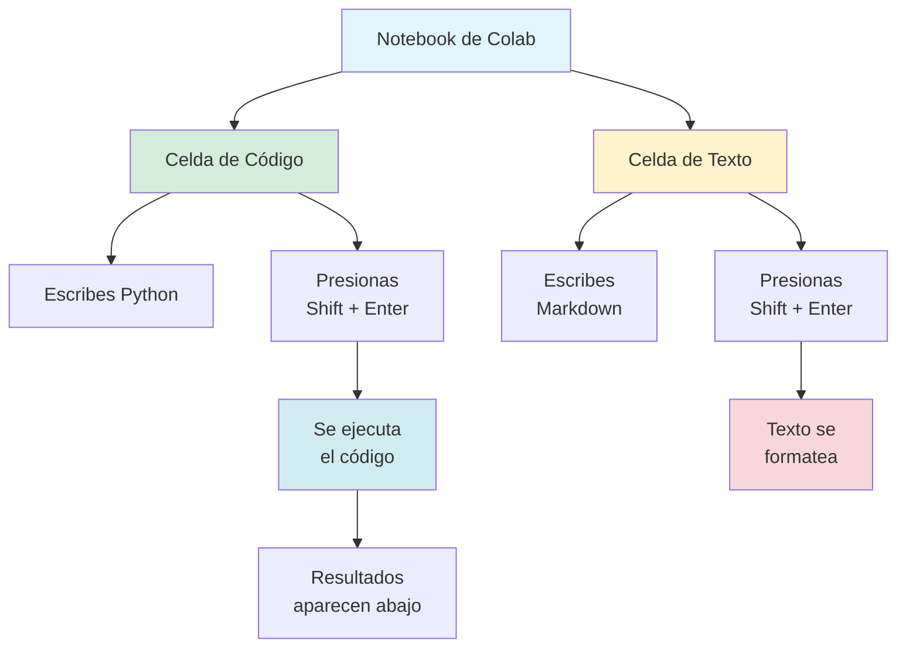
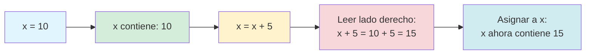
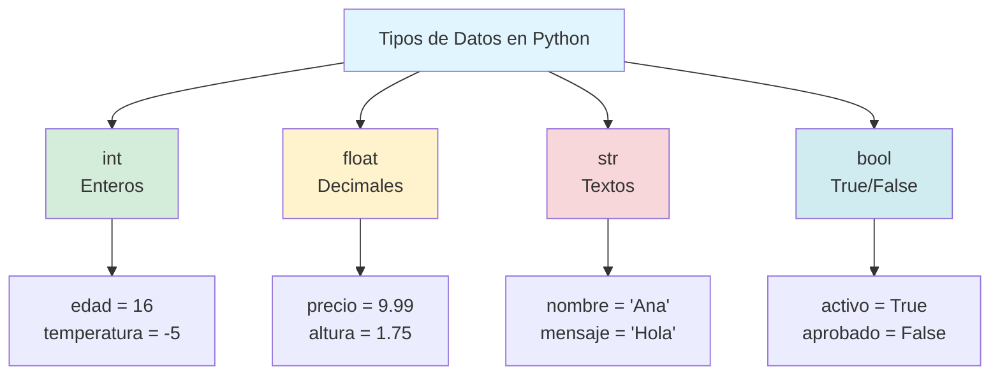

# Capítulo 3: Tu Laboratorio en la Nube — Google Colab, Variables y el Lenguaje de los Datos

## Introducción: El Momento en que tu Taller se Vuelve Portátil

Imagina por un momento que eres un carpintero aprendiz. Has estado practicando con herramientas prestadas, aprendiendo los principios básicos de cómo funcionan los martillos, las sierras y los clavos. Pero ahora ha llegado el momento de tener tu propio taller, un espacio donde puedas experimentar libremente, cometer errores sin consecuencias, guardar tus proyectos y volver a ellos cuando quieras.

En el capítulo anterior, escribiste tu primer programa en Python y viste cómo las palabras que escribes se transforman en acciones que la computadora ejecuta. Usaste el REPL, que es como trabajar sobre una mesa de trabajo temporal: útil para probar ideas rápidas, pero todo desaparece cuando cierras la sesión. Ahora vas a configurar algo mucho más poderoso: **Google Colab**, tu laboratorio digital permanente en la nube.

Google Colab es como tener un taller de carpintería profesional que vive en internet. No importa si estás en la computadora de tu casa, en la biblioteca, o en la laptop de un amigo: tus proyectos, tus herramientas y tu progreso siempre estarán ahí, esperándote. No necesitas instalar nada. No necesitas configurar nada complicado. Solo necesitas un navegador web y una conexión a internet.

Pero Google Colab es más que solo un lugar donde escribir código. Es un entorno diseñado específicamente para aprender y experimentar. Puedes escribir explicaciones junto a tu código, ejecutar partes de un programa sin tener que ejecutar todo, ver los resultados inmediatamente, y guardar todo automáticamente. Es como tener un cuaderno mágico donde tus notas pueden cobrar vida y ejecutarse.

En este capítulo vas a hacer tres cosas fundamentales. Primero, vas a configurar tu cuenta de Google Colab y aprender a navegar por su interfaz como un profesional. Segundo, vas a descubrir qué son realmente las variables: esas cajas mágicas donde guardas información para usarla después. Y tercero, vas a entender que no todos los datos son iguales, que Python distingue entre números, textos, y valores de verdadero o falso, y que saber elegir el tipo correcto de dato es como saber elegir la herramienta correcta para cada trabajo.

Al final de este capítulo, tendrás tu propio espacio de trabajo digital configurado y funcionando, y entenderás cómo hacer que Python recuerde información y la manipule de formas cada vez más sofisticadas. Estarás listo para construir programas que no solo ejecuten instrucciones, sino que piensen, decidan y se adapten.

> **💡 Objetivo del Capítulo:**
> Al finalizar este capítulo, tendrás Google Colab completamente configurado, comprenderás profundamente qué son las variables y cómo funcionan, dominarás los cuatro tipos de datos fundamentales de Python (int, float, str, bool), y sabrás cómo convertir entre tipos según las necesidades de tu programa.

## Configurando tu Cuenta: El Ritual de Iniciación Digital

Antes de poder experimentar con código, necesitas crear tu espacio de trabajo en Google Colab. El proceso es sorprendentemente simple, pero cada paso tiene su propósito y te ayudará a entender cómo funciona esta herramienta.

### Paso 1: Verificar tu Cuenta de Google

Google Colab requiere una cuenta de Google para funcionar. Esto tiene sentido porque Colab guarda tus notebooks automáticamente en Google Drive, asegurando que nunca pierdas tu trabajo. Si ya tienes una cuenta de Gmail, una cuenta de YouTube, o usas cualquier servicio de Google, ya tienes todo lo necesario. Si no tienes una cuenta de Google, necesitarás crear una, lo cual es completamente gratuito y toma aproximadamente tres minutos.

Abre tu navegador web (Chrome, Firefox, Safari, Edge, cualquiera funciona) y ve a `gmail.com`. Si no has iniciado sesión, verás un botón que dice "Crear cuenta". Sigue el proceso estándar: elige un nombre de usuario, crea una contraseña segura, proporciona un número de teléfono para recuperación. No necesitas pagar nada, no necesitas proporcionar información de tarjeta de crédito. Es genuinamente gratuito.

Una vez que tengas tu cuenta de Google activa y hayas iniciado sesión, estás listo para el siguiente paso.

### Paso 2: Acceder a Google Colab por Primera Vez

Con tu cuenta de Google activa en el navegador, abre una nueva pestaña y navega a la dirección `colab.research.google.com`. Esta es la URL oficial de Google Colaboratory, el nombre completo de la herramienta que la mayoría de las personas simplemente llama "Colab".

La primera vez que entres, verás una pantalla de bienvenida que explica brevemente qué es Colab. Puedes leer esta introducción si quieres, pero vamos a cubrir todo lo que necesitas saber de forma mucho más detallada en este capítulo. Por ahora, simplemente cierra ese diálogo de bienvenida haciendo clic en la X o en cualquier área fuera del cuadro.

### Paso 3: Crear tu Primer Notebook

Después de cerrar la bienvenida, verás una ventana emergente que te ofrece varias opciones: abrir un notebook de ejemplo, abrir uno desde GitHub, o crear uno nuevo. Lo que quieres es la opción más simple: crear un notebook completamente vacío y nuevo. Busca el botón o enlace que dice "Nuevo Notebook" o "New Notebook" (la interfaz puede estar en español o inglés dependiendo de tu configuración de Google).

Haz clic en "Nuevo Notebook" y espera unos segundos. Google está creando un documento especial solo para ti, asignándole un espacio en tu Google Drive, y configurando un pequeño servidor temporal que ejecutará tu código. Cuando el proceso termine, verás una pantalla blanca limpia con una celda rectangular vacía esperándote.

Felicidades. Acabas de crear tu primer notebook de Google Colab. Ese rectángulo vacío es tu lienzo, tu espacio de experimentación, tu laboratorio portátil.

### Paso 4: Renombrar tu Notebook con un Nombre Significativo

En la parte superior izquierda de la pantalla, verás un nombre genérico como "Untitled0.ipynb" o "Sin título 0.ipynb". Ese ".ipynb" al final significa "Interactive Python Notebook", el formato de archivo que usa Colab. Pero "Sin título" no es un nombre muy útil cuando eventualmente tengas docenas de notebooks.

Haz clic directamente sobre ese nombre. Se volverá editable, como un campo de texto. Escribe algo descriptivo: "Mi Primer Notebook" o "Experimentos Capítulo 3" o simplemente "Práctica Python". El nombre que elijas es solo para tu organización personal, así que elige algo que te ayude a encontrar este notebook después cuando tengas muchos otros.

Presiona Enter después de escribir el nuevo nombre. Google Colab guarda automáticamente este cambio. De hecho, Colab guarda automáticamente todo lo que hagas, todo el tiempo. No existe un botón de "guardar" porque no lo necesitas. Cada cambio que hagas se sincroniza con tu Google Drive en segundos.

### Paso 5: Entender Dónde Viven tus Notebooks

Abre una nueva pestaña en tu navegador y ve a `drive.google.com`. Este es tu Google Drive, el espacio de almacenamiento en la nube que viene con tu cuenta de Google. Busca en la lista de carpetas una que se llama "Colab Notebooks" o dentro de "My Drive". Dentro de esa carpeta, verás tu notebook recién creado con el nombre que le diste.

Este es un detalle importante que muchas personas pasan por alto: tus notebooks de Colab no viven en algún servidor misterioso de Google al que no puedes acceder. Viven en tu propio Google Drive, en una carpeta específica. Esto significa que tú tienes control total. Puedes renombrar los archivos desde Drive, puedes moverlos a otras carpetas para organizarlos mejor, puedes descargarlos a tu computadora si quieres, e incluso puedes compartirlos con otras personas exactamente como compartirías cualquier documento de Google.

Vuelve a la pestaña de tu notebook de Colab. Ahora que entiendes la configuración básica, es momento de explorar la interfaz y aprender a usarla como un profesional.

> **📝 Nota:**
> Google Colab utiliza servidores temporales para ejecutar tu código. Cuando cierras un notebook o pasas mucho tiempo sin usarlo, ese servidor se desconecta automáticamente. Esto es normal y esperado. Tu código guardado en el notebook permanece intacto, pero las variables que tenías en memoria desaparecen. Cuando vuelvas a abrir el notebook, simplemente ejecuta las celdas de nuevo para recrear tu entorno de trabajo.

## Anatomía de un Notebook: Conociendo tu Nuevo Taller

La interfaz de Google Colab está diseñada con un propósito claro: hacer que escribir, ejecutar y documentar código sea lo más fluido posible. Cada elemento de la pantalla tiene una función específica, y entender cómo funcionan todos juntos te hará mucho más eficiente.

### La Barra de Menú Superior

En la parte superior de la pantalla, verás una barra con varias opciones: Archivo, Editar, Ver, Insertar, Entorno de ejecución, Herramientas, Ayuda. Esta barra funciona como los menús de cualquier aplicación moderna, pero hay algunos elementos que debes conocer específicamente.

**Menú "Archivo"**: Aquí puedes crear notebooks nuevos, abrir notebooks existentes, y descargar tu notebook en diferentes formatos. La opción más útil aquí es "Descargar", que te permite obtener una copia local de tu notebook en formato .ipynb (que puedes abrir en otras aplicaciones como Jupyter) o incluso como un archivo .py de Python puro.

**Menú "Entorno de ejecución"**: Este es crucial. Aquí es donde puedes ejecutar todas las celdas de tu notebook de una vez, reiniciar el entorno de Python si algo sale mal, o cambiar el tipo de procesador que usa tu código (aunque esto es avanzado y no lo necesitarás por ahora).

### Las Celdas: Los Bloques de Construcción

Un notebook de Colab está compuesto por **celdas**. Cada celda es un bloque rectangular que puede contener uno de dos tipos de contenido: código Python ejecutable, o texto explicativo en formato Markdown.

**Celdas de Código**: Son las celdas donde escribes Python. Se reconocen por el pequeño ícono de "play" (triángulo) a la izquierda. Cuando escribes código en una celda y presionas el botón de play (o usas el atajo de teclado Shift + Enter), Python ejecuta ese código y muestra los resultados inmediatamente debajo de la celda.

**Celdas de Texto**: Estas celdas te permiten escribir explicaciones, notas, títulos, listas, incluso insertar imágenes. Usan un formato llamado Markdown que es muy simple: los textos entre asteriscos se vuelven negritas, los signos numeral crean encabezados, etc. Son perfectas para documentar qué hace tu código, por qué lo escribiste de cierta forma, o qué aprendiste.



### Creando y Ejecutando tu Primera Celda

En la celda vacía que apareció cuando creaste el notebook, escribe exactamente esto:

```python
print("¡Mi laboratorio en Colab está funcionando!")
nombre = "Python"
print(f"Hola desde {nombre}")
```

Ahora presiona Shift + Enter (o haz clic en el ícono de play a la izquierda de la celda). Verás que debajo de la celda aparece:

```
¡Mi laboratorio en Colab está funcionando!
Hola desde Python
```

¡Perfecto! Acabas de ejecutar código Python en Google Colab. Nota cómo el resultado apareció inmediatamente debajo de la celda. Esta retroalimentación instantánea es una de las ventajas más grandes de trabajar en notebooks.

### Agregando Nuevas Celdas

Para agregar una nueva celda, puedes:
- Hacer clic en el botón "+ Código" en la parte superior del notebook
- Hacer clic en el botón "+ Texto" para agregar una celda de texto
- Usar el menú "Insertar" y seleccionar "Celda de código" o "Celda de texto"
- Pasar el mouse por el espacio entre dos celdas y hacer clic en "+ Código" o "+ Texto" que aparecen

Practica agregando una celda de texto. Cuando la celda aparezca, escribe:

```markdown
# Mi Primer Experimento con Variables
Este notebook explora cómo funcionan las variables en Python.
```

Presiona Shift + Enter. Verás que el texto se formatea bonito, con el encabezado grande y el resto como texto normal.

> **💡 Consejo:**
> Alterna siempre entre celdas de código y celdas de texto. Usa las celdas de texto para explicar QUÉ estás haciendo y POR QUÉ. Cuando vuelvas a este notebook en dos meses, esas explicaciones te ayudarán a recordar tu proceso de pensamiento. Es como dejar migas de pan para tu yo futuro.

### Atajos de Teclado Esenciales

Memoriza estos atajos para trabajar mucho más rápido:

| Atajo | Acción |
|-------|--------|
| **Shift + Enter** | Ejecutar celda actual y avanzar a la siguiente |
| **Ctrl + Enter** | Ejecutar celda actual sin avanzar |
| **Alt + Enter** | Ejecutar celda y crear nueva celda debajo |
| **Ctrl + M B** | Crear celda nueva debajo |
| **Ctrl + M A** | Crear celda nueva arriba |
| **Ctrl + M D** | Eliminar celda actual |

No necesitas memorizarlos todos ahora, pero Shift + Enter es absolutamente esencial y lo usarás cientos de veces por día.

## Variables: Las Cajas Mágicas de la Memoria

Ahora que tienes tu laboratorio configurado, es momento de entender uno de los conceptos más fundamentales de la programación: las **variables**.

### La Analogía de las Cajas Etiquetadas

Imagina que tienes un armario gigante lleno de cajas de cartón. Cada caja puede guardar algo adentro: un libro, una pelota, un número escrito en un papel, una foto. Para saber qué hay en cada caja sin tener que abrirlas todas, escribes una etiqueta en el exterior: "Libros favoritos", "Juguetes", "Documentos importantes".

Las variables en Python funcionan exactamente así. Son **contenedores etiquetados** donde guardas información. La etiqueta es el **nombre de la variable**, y lo que guardas adentro es el **valor**. Python recuerda perfectamente qué pusiste en cada caja, y puedes pedirle que te muestre el contenido en cualquier momento simplemente usando el nombre.

### Creando tu Primera Variable

En una nueva celda de código en tu notebook, escribe:

```python
edad = 16
```

Ejecuta la celda. No aparecerá ningún resultado, y eso está bien. Lo que acabas de hacer fue crear una caja llamada `edad` y poner el número `16` adentro. Python ahora recuerda que la variable `edad` contiene `16`.

Para ver el contenido de la variable, escribe en una nueva celda:

```python
print(edad)
```

Verás:

```
16
```

Python buscó en su memoria la caja llamada `edad`, vio que contenía `16`, y mostró ese valor.

### El Signo Igual No Significa "Igualdad"

Aquí hay algo crucial que confunde a muchos principiantes. En matemáticas, cuando escribes `x = 5`, estás diciendo "x es igual a 5" (una afirmación de igualdad). En programación, cuando escribes `edad = 16`, estás diciendo "**asigna** el valor 16 a la variable edad" (una instrucción de acción).

El signo `=` en Python no compara, **asigna**. Siempre funciona de derecha a izquierda: toma lo que está a la derecha del igual y lo guarda en la variable que está a la izquierda.

```python
x = 10      # Asigna 10 a x
x = x + 5   # Toma el valor actual de x (10), súmale 5, guarda el resultado (15) de vuelta en x
```

Esa segunda línea `x = x + 5` no tiene sentido en matemáticas (¿cómo puede x ser igual a sí misma más 5?), pero en programación es perfectamente válida. Lee el lado derecho primero: "toma x (que es 10), súmale 5, obtienes 15". Luego lee el lado izquierdo: "guarda ese 15 de vuelta en x". Ahora x vale 15.



### Variables Pueden Cambiar (Por Eso se Llaman "Variables")

Crea una nueva celda y ejecuta este código línea por línea, observando cómo cambia el valor:

```python
dinero = 100
print(f"Tengo: {dinero} soles")

dinero = dinero - 30  # Gasté 30 soles
print(f"Después de comprar algo: {dinero} soles")

dinero = dinero + 50  # Me dieron 50 soles
print(f"Después de recibir dinero: {dinero} soles")
```

Resultado:

```
Tengo: 100 soles
Después de comprar algo: 70 soles
Después de recibir dinero: 120 soles
```

La variable `dinero` cambió tres veces durante la ejecución del programa. Primero fue 100, luego 70, luego 120. Esto es completamente normal y esperado. Las variables "varían" (cambian de valor) durante la ejecución del programa.

> **📝 Nota:**
> Existe un concepto llamado "constantes" que son valores que no deberían cambiar durante la ejecución (por ejemplo, el valor de PI). Por convención, se escriben en MAYÚSCULAS completas (`PI = 3.14159`), pero técnicamente Python no te impide cambiarlas. Es una convención humana, no una restricción del lenguaje.

### Múltiples Variables Trabajando Juntas

Las variables realmente muestran su poder cuando las combinas:

```python
nombre = "Ana"
apellido = "Martínez"
edad = 16
ciudad = "Lima"

nombre_completo = nombre + " " + apellido
presentacion = f"Hola, soy {nombre_completo}, tengo {edad} años y vivo en {ciudad}."

print(presentacion)
```

Resultado:

```
Hola, soy Ana Martínez, tengo 16 años y vivo en Lima.
```

Aquí creamos cinco variables (`nombre`, `apellido`, `edad`, `ciudad`, `nombre_completo`) y las combinamos para generar un mensaje personalizado. Cada variable guarda un pedazo de información, y las unimos como piezas de LEGO para construir algo más grande.

## El Lenguaje de los Tipos: No Todos los Datos son Iguales

Python distingue entre diferentes "tipos" de datos porque diferentes tipos de información requieren diferentes operaciones. No tiene sentido intentar "sumar" dos nombres, así como no tiene sentido "multiplicar" textos. Python organiza los datos en categorías (tipos) para saber qué operaciones son válidas.

### Los Cuatro Tipos Fundamentales

Python tiene cuatro tipos de datos básicos que usarás constantemente:

#### 1. Enteros (int - integer)

Los **enteros** son números completos sin decimales: positivos, negativos, o cero.

```python
edad = 16
temperatura = -5
habitantes = 1000000
cero = 0
```

**Operaciones comunes con enteros:**

```python
suma = 10 + 5          # 15
resta = 10 - 5         # 5
multiplicacion = 10 * 5  # 50
division = 10 / 5      # 2.0 (nota: el resultado es float, no int)
division_entera = 10 // 3  # 3 (descarta la parte decimal)
residuo = 10 % 3       # 1 (el resto de la división)
potencia = 2 ** 10     # 1024 (2 elevado a la 10)
```

> **⚠️ Advertencia:**
> Cuando divides dos enteros con `/`, Python siempre devuelve un float (número decimal), incluso si el resultado es exacto. `10 / 5` da `2.0`, no `2`. Si quieres el resultado como entero, usa `//` (división entera).

#### 2. Flotantes (float - floating point)

Los **flotantes** son números con decimales. Se llaman "punto flotante" porque el punto decimal puede "flotar" a diferentes posiciones según el número.

```python
altura = 1.75
precio = 9.99
pi = 3.14159
temperatura = -3.5
```

**Operaciones con flotantes:**

```python
suma_decimal = 1.5 + 2.3    # 3.8
producto = 2.5 * 4.0        # 10.0
division_precisa = 7.0 / 2.0  # 3.5
```

**Precaución con flotantes:**

Los flotantes tienen una limitación técnica: no pueden representar todos los decimales con precisión perfecta. Esto puede causar resultados inesperados:

```python
resultado = 0.1 + 0.2
print(resultado)
# Muestra: 0.30000000000000004 (¡no exactamente 0.3!)
```

Esto no es un bug de Python, es una limitación matemática de cómo las computadoras representan decimales internamente. Para cálculos donde la precisión decimal es crítica (como dinero), usa el módulo `decimal` de Python en programas avanzados.

> **💡 Consejo:**
> Para la mayoría de los cálculos cotidianos, esta imprecisión microscópica es irrelevante. Pero si estás programando un sistema bancario o científico donde cada decimal cuenta, es algo que debes tener en mente.

#### 3. Cadenas de Texto (str - string)

Las **cadenas** (strings) son secuencias de caracteres: letras, números, símbolos, espacios. Siempre van entre comillas simples `'` o dobles `"`.

```python
nombre = "Carlos"
mensaje = 'Hola, mundo'
direccion = "Av. Principal 123"
codigo = "ABC-2024"
```

**Operaciones con strings:**

```python
# Concatenación (unir cadenas)
nombre = "Ana"
apellido = "García"
completo = nombre + " " + apellido  # "Ana García"

# Repetición
risa = "ja" * 3  # "jajaja"

# Longitud
cantidad_letras = len("Python")  # 6

# Acceso a caracteres individuales (índice comienza en 0)
primera_letra = "Python"[0]  # "P"
ultima_letra = "Python"[-1]  # "n"

# Métodos útiles
mayusculas = "python".upper()    # "PYTHON"
minusculas = "PYTHON".lower()    # "python"
capitalizado = "python".capitalize()  # "Python"
```

**F-strings para formateo:**

```python
nombre = "Luis"
edad = 17
altura = 1.78

# Forma antigua (no recomendada)
mensaje_antiguo = "Hola, " + nombre + ", tienes " + str(edad) + " años"

# Forma moderna con f-strings (recomendada)
mensaje_moderno = f"Hola, {nombre}, tienes {edad} años y mides {altura}m"
```

Los f-strings son increíblemente poderosos porque automáticamente convierten los tipos compatibles a texto cuando los insertas. No necesitas llamar `str()` manualmente.

> **📝 Nota:**
> Puedes usar comillas simples `'` o dobles `"` indistintamente, pero si tu texto contiene un tipo de comilla, usa el otro tipo para delimitar:
> ```python
> frase = "It's a beautiful day"  # Correcto (comillas dobles contienen simple)
> frase = 'He said "Hello"'       # Correcto (comillas simples contienen dobles)
> ```

#### 4. Booleanos (bool - boolean)

Los **booleanos** solo pueden tener dos valores: `True` (verdadero) o `False` (falso). Se usan para decisiones y lógica.

```python
esta_lloviendo = True
tengo_hambre = False
es_mayor_de_edad = True
aprobado = False
```

**Operaciones lógicas con booleanos:**

```python
# Operador AND (y) - ambos deben ser True
resultado = True and True    # True
resultado = True and False   # False

# Operador OR (o) - al menos uno debe ser True
resultado = True or False    # True
resultado = False or False   # False

# Operador NOT (no) - invierte el valor
resultado = not True         # False
resultado = not False        # True
```

**Comparaciones que producen booleanos:**

```python
edad = 16

es_mayor = edad >= 18        # False
es_adolescente = edad >= 13 and edad < 20  # True
puede_votar = edad >= 18     # False
es_exactamente_16 = edad == 16  # True (nota: == para comparar, = para asignar)
no_es_18 = edad != 18        # True
```

Nota los operadores de comparación:
- `==` (igual a) - no confundir con `=` (asignación)
- `!=` (diferente de)
- `>` (mayor que)
- `<` (menor que)
- `>=` (mayor o igual que)
- `<=` (menor o igual que)



### La Función type(): Tu Detector de Tipos

Cuando no estés seguro qué tipo de dato contiene una variable, usa la función `type()`:

```python
edad = 16
altura = 1.75
nombre = "Carlos"
activo = True

print(type(edad))      # <class 'int'>
print(type(altura))    # <class 'float'>
print(type(nombre))    # <class 'str'>
print(type(activo))    # <class 'bool'>
```

Esta función es invaluable para depurar errores. Cuando algo no funciona como esperabas, `type()` te dice exactamente qué tipo de dato estás manejando.

## Conversión entre Tipos: El Arte de la Transformación

A menudo necesitarás convertir datos de un tipo a otro. Python proporciona funciones de conversión para los cuatro tipos básicos:

### De String a Número

```python
# input() siempre devuelve string
edad_texto = input("¿Tu edad? ")  # Usuario escribe: 16
print(type(edad_texto))           # <class 'str'>

# Convertir a entero para hacer matemáticas
edad_numero = int(edad_texto)
print(type(edad_numero))          # <class 'int'>

# Ahora puedes hacer operaciones
en_cinco_anos = edad_numero + 5
print(f"En 5 años tendrás {en_cinco_anos} años")
```

### De Número a String

```python
puntos = 1500
mensaje = "Tienes " + str(puntos) + " puntos"
# O mejor aún, usa f-strings que convierten automáticamente:
mensaje = f"Tienes {puntos} puntos"
```

### Entre Int y Float

```python
# Int a Float
entero = 10
decimal = float(entero)  # 10.0

# Float a Int (descarta la parte decimal)
decimal = 9.99
entero = int(decimal)    # 9 (no redondea, solo elimina decimales)
```

### Conversión a Booleano

Cualquier valor puede convertirse a booleano, pero Python tiene reglas específicas sobre qué se considera `True` y qué `False`:

```python
# Valores que se consideran False:
bool(0)        # False (el número cero)
bool(0.0)      # False (el decimal cero)
bool("")       # False (string vacío)
bool(None)     # False (valor especial que significa "nada")

# TODO lo demás se considera True:
bool(1)        # True
bool(-5)       # True (¡incluso negativos!)
bool(0.1)      # True
bool("hola")   # True
bool(" ")      # True (incluso un espacio cuenta como "algo")
```

> **⚠️ Errores Comunes:**
> **Error #1 - Intentar hacer matemáticas con strings:**
> ```python
> numero = "5"
> resultado = numero + 3  # TypeError: can only concatenate str to str
> # Solución: resultado = int(numero) + 3
> ```
>
> **Error #2 - Convertir texto no-numérico a int:**
> ```python
> edad = int("dieciséis")  # ValueError: invalid literal for int()
> # Solo strings que contienen dígitos pueden convertirse: int("16")
> ```
>
> **Error #3 - Perder precisión al convertir float a int:**
> ```python
> precio = 9.99
> precio_entero = int(precio)  # 9, no 10 (no redondea, trunca)
> # Para redondear: round(precio) da 10
> ```

## Laboratorio 1: Calculadora de Propinas Mejorada

### Objetivo
Crear una calculadora de propinas que maneje múltiples tipos de datos y convierta entre ellos apropiadamente.

### Instrucciones

En tu notebook de Google Colab, crea un programa que:

1. Pida al usuario el monto total de la cuenta (float)
2. Pida el porcentaje de propina que quiere dejar (int o float, por ejemplo 15 para 15%)
3. Pida cuántas personas compartirán la cuenta (int)
4. Calcule:
   - El monto de la propina
   - El total con propina incluida
   - Cuánto paga cada persona si dividen equitativamente
5. Muestre todos los resultados con formato de dinero (2 decimales)

**Ejemplo de ejecución:**

```
=== CALCULADORA DE PROPINAS ===
Monto de la cuenta: 250.50
Porcentaje de propina (ej: 15): 18
Número de personas: 4

=== RESULTADOS ===
Subtotal: S/. 250.50
Propina (18%): S/. 45.09
Total con propina: S/. 295.59
Cada persona paga: S/. 73.90
```

### Pistas

- Usa `float(input(...))` para números decimales
- Usa `int(input(...))` para números enteros
- Calcula propina como: `cuenta * (porcentaje / 100)`
- Usa f-strings con formato: `f"S/. {monto:.2f}"` para mostrar 2 decimales

### Criterio de Éxito

- El programa maneja correctamente conversiones de tipos
- Los cálculos son matemáticamente correctos
- El formato de salida es claro y profesional
- El programa usa variables con nombres descriptivos

## Laboratorio 2: Perfil de Estudiante

### Objetivo
Practicar trabajando con los cuatro tipos de datos simultáneamente.

### Instrucciones

Crea un programa que recopile información de un estudiante y genere un perfil completo:

1. Pide nombre (string)
2. Pide edad (int)
3. Pide promedio de notas (float, escala 0-20)
4. Pregunta si está aprobado (el usuario escribe "True" o "False")

Luego calcula y muestra:
- Toda la información ingresada
- El tipo de dato de cada variable usando `type()`
- En cuántos años será mayor de edad (si tiene menos de 18)
- Si su promedio es mayor a 13.5 (usando comparación booleana)

**Ejemplo de ejecución:**

```
=== REGISTRO DE ESTUDIANTE ===
Nombre: María
Edad: 16
Promedio: 15.5
¿Aprobado? (True/False): True

=== PERFIL COMPLETO ===
Nombre: María (tipo: <class 'str'>)
Edad: 16 años (tipo: <class 'int'>)
Promedio: 15.5 (tipo: <class 'float'>)
Aprobado: True (tipo: <class 'bool'>)

En 2 años serás mayor de edad.
Tu promedio es mayor a 13.5: True
```

### Pistas

- Para el booleano, puedes pedir que escriban "True" o "False" y luego convertir con `eval()` o comparar el string
- Calcula años para mayoría de edad: `18 - edad`
- Usa comparación: `promedio > 13.5` produce un booleano

### Criterio de Éxito

- Maneja correctamente los cuatro tipos de datos
- Usa `type()` para mostrar tipos
- Realiza cálculos y comparaciones correctamente
- Formato de salida es organizado y legible

## Laboratorio 3: Conversor Universal

### Objetivo
Dominar las conversiones entre tipos y entender cuándo son necesarias.

### Instrucciones

Crea un programa que:

1. Pida un número entero
2. Pida un número decimal
3. Pida un texto que contenga números (ej: "42")
4. Pida un valor booleano

Luego realiza y muestra las siguientes conversiones:
- El entero como float, string, y booleano
- El decimal como int (muestra cómo pierde precisión), string, y booleano
- El texto-número como int y float
- El booleano como int y string

**Ejemplo de ejecución:**

```
=== CONVERSOR DE TIPOS ===
Ingresa un número entero: 15
Ingresa un decimal: 3.14
Ingresa texto con número: 100
Ingresa True o False: True

=== CONVERSIONES ===
15 (int) convertido a:
  - float: 15.0
  - string: "15"
  - bool: True

3.14 (float) convertido a:
  - int: 3 (perdió 0.14)
  - string: "3.14"
  - bool: True

"100" (string) convertido a:
  - int: 100
  - float: 100.0

True (bool) convertido a:
  - int: 1
  - string: "True"
```

### Pistas

- Almacena el resultado de cada conversión en una variable
- Muestra claramente qué se perdió o cambió en cada conversión
- Usa f-strings para formatear la salida

### Criterio de Éxito

- Todas las conversiones son correctas
- El programa explica claramente qué pasa en cada conversión
- Formato es educativo y muestra el antes y después

## Desafío Extra: Inventario Personal con Múltiples Tipos

Este es un desafío más complejo que integra todo lo aprendido.

### Instrucciones

Crea un programa de inventario personal que maneje diferentes tipos de items y sus propiedades:

**Para el nivel básico:**

El programa debe pedir al usuario que ingrese un item de su inventario personal:

1. Nombre del item (string)
2. Categoría (string: "libro", "videojuego", "electrónico", etc.)
3. Valor estimado en dinero (float)
4. Cantidad que posee (int)
5. Si está en buen estado (bool: el usuario escribe "True" o "False")

Luego calcular automáticamente:
- El valor total de esa categoría (valor unitario multiplicado por cantidad)
- Un porcentaje de depreciación del 10% si no está en buen estado

Finalmente mostrar un reporte formateado que incluya:
- Toda la información ingresada
- Los cálculos realizados
- El tipo de dato de cada variable (usando `type()`)

**Para el nivel avanzado:**

Después de procesar el primer item, permite al usuario ingresar un segundo item de diferente categoría y muestra:
- El valor total combinado de ambos items
- Cuál de los dos items tiene más valor
- El promedio de valor de los items ingresados

### Pistas

- Usa `input()` para capturar cada dato
- Recuerda convertir los tipos apropiadamente: `int()` para cantidades, `float()` para precios
- Para el booleano, puedes pedir que el usuario escriba "True" o "False" como texto y luego convertirlo
- Usa f-strings con formato de decimales (`.2f`) para mostrar los precios de forma profesional

Este desafío no tiene una única solución correcta. Lo importante es que practiques estructurar un programa más grande, manejar diferentes tipos de datos simultáneamente, y presentar información de forma clara y útil.

## Para Recordar

| Concepto | Qué es y cómo se usa |
|---|---|
| **Google Colab** | Tu laboratorio digital en la nube. Combina código ejecutable con texto explicativo en "notebooks". Todo se guarda automáticamente en tu Google Drive. |
| **Celdas de código vs texto** | Código: ejecutan Python y muestran resultados. Texto: permiten documentar usando Markdown. Ejecuta celdas con Shift + Enter. |
| **Variables** | Cajas etiquetadas donde guardas información. Se crean con `nombre = valor`. Python las recuerda hasta que las cambies o termines la sesión. |
| **Tipos de datos básicos** | `int` (enteros), `float` (decimales), `str` (texto entre comillas), `bool` (True/False). Cada tipo tiene operaciones específicas que puede realizar. |
| **Conversión de tipos** | `int()`, `float()`, `str()`, `bool()` convierten entre tipos. Necesario cuando `input()` da texto pero necesitas números para calcular. |
| **F-strings** | La forma moderna de combinar variables con texto. Sintaxis: `f"texto {variable} más texto"`. Convierte automáticamente tipos compatibles. |
| **Input() siempre devuelve texto** | Aunque el usuario escriba números, `input()` los entrega como strings. Convierte explícitamente si necesitas hacer matemáticas. |
| **type()** | Función que te dice qué tipo de dato contiene una variable. Tu herramienta de diagnóstico cuando algo no funciona como esperabas. |

**Regla de oro:** Cuando combines datos de diferentes tipos (especialmente números con texto), siempre convierte todo al mismo tipo primero, o usa f-strings que manejan la conversión automáticamente.

## Preguntas de Reflexión

1. ¿Por qué crees que Google Colab se diseñó para guardar automáticamente todo tu trabajo sin necesidad de un botón "guardar"? ¿Qué ventajas y posibles desventajas tiene este enfoque comparado con aplicaciones tradicionales?

2. En matemáticas, el signo igual significa "estas dos cosas son lo mismo" (por ejemplo, 2 + 2 = 4). En programación, el signo igual significa "asigna este valor a esta variable" (por ejemplo, edad = 15). ¿Por qué crees que se eligió usar el mismo símbolo para dos conceptos diferentes? ¿Crees que esto causa confusión o ayuda a la comprensión?

3. Python distingue estrictamente entre el número 5 y el texto "5", pero muchas calculadoras de bolsillo no hacen esta distinción. ¿En qué situaciones de la vida real es importante mantener esta diferencia? ¿Puedes pensar en situaciones donde mezclar números con texto causaría problemas graves?

4. Las variables en programación se llaman "variables" porque sus valores pueden variar (cambiar). Pero en matemáticas, cuando dices "sea X = 5", generalmente X mantiene ese valor durante todo el problema. ¿Por qué crees que en programación es tan importante que los valores puedan cambiar? ¿Qué tipo de problemas no podrías resolver si las variables fueran permanentes?

## Cierre: Tu Laboratorio Está Completo, Tu Arsenal Está Cargado

Si completaste este capítulo con atención y realizaste las actividades, ya no eres simplemente alguien que puede escribir líneas sueltas de código. Ahora tienes un espacio de trabajo profesional configurado en la nube, entiendes cómo Python categoriza y maneja diferentes tipos de información, y sabes cómo hacer que tus programas conversen con los usuarios.

Los conceptos que aprendiste en este capítulo son los cimientos sobre los que se construye absolutamente todo lo demás en programación. Cada programa que escribirás, desde el más simple hasta el más complejo, usará variables para recordar información. Cada interacción con usuarios requerirá que captures input y muestres output. Cada cálculo dependerá de que entiendas la diferencia entre números enteros, decimales y texto.

Google Colab es ahora tu taller personal. Puedes volver aquí desde cualquier computadora con internet, abrir tus notebooks, experimentar con nuevas ideas, probar soluciones a problemas, y construir un portafolio de tu aprendizaje. Cada notebook que crees es evidencia tangible de tu progreso.

Pero hasta ahora, tus programas han sido lineales: ejecutan instrucciones en secuencia de arriba hacia abajo, sin variación. Es como tener una receta que solo puede preparar un plato exacto de una sola forma. Lo que falta es la capacidad de que tus programas tomen decisiones, que evalúen situaciones y reaccionen de forma diferente según las circunstancias.

En el próximo capítulo, vas a darle un cerebro a tus programas. Aprenderás sobre estructuras condicionales: cómo hacer que Python evalúe si algo es verdadero o falso y tome diferentes caminos según el resultado. Vas a programar un sistema que decide si alguien puede entrar a un evento según su edad, una calculadora de impuestos que aplica diferentes tasas según el monto, un clasificador de calificaciones que determina si aprobaste o no. Tus programas dejarán de ser recetas rígidas y se convertirán en sistemas inteligentes que se adaptan.

Pero antes de avanzar, tómate un momento para apreciar cuánto has logrado en solo tres capítulos. Puedes crear variables, manipularlas, convertirlas entre tipos, capturar información de usuarios, realizar cálculos complejos, y presentar resultados de forma profesional. Tienes un laboratorio digital configurado y funcionando. Sabes navegar por una interfaz de programación profesional. Estas son habilidades reales y valiosas.

El viaje continúa, y cada paso te hace más poderoso.