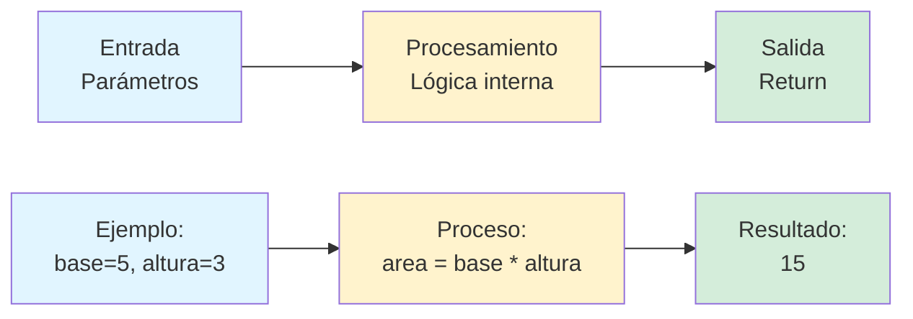
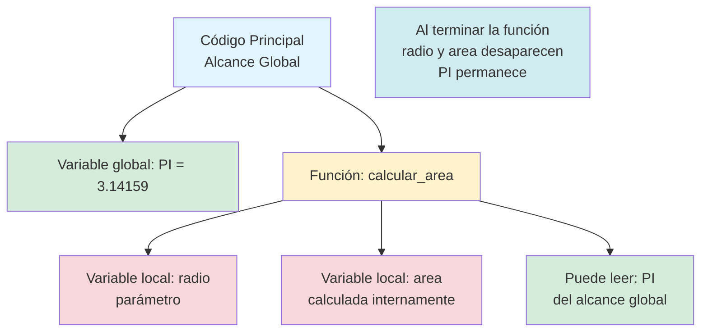

# Capítulo 7: Divide y Vencerás — Creando tus Propias Herramientas con Funciones

## Introducción: La Magia de No Repetirse

Imagina que eres un chef profesional. Cada vez que necesitas picar cebolla, ¿empiezas desde cero explicándote a ti mismo cómo sostener el cuchillo, cómo hacer los cortes, en qué ángulo inclinar la hoja? Por supuesto que no. Después de años de práctica, simplemente ejecutas el movimiento automáticamente. Tu cerebro ha convertido una secuencia compleja de pasos en una sola "acción mental" que se activa con un pensamiento: "picar cebolla".

Las funciones en programación funcionan exactamente así. Son tu forma de enseñarle a Python una nueva habilidad, darle un nombre, y después simplemente llamar a esa habilidad por su nombre cada vez que la necesites. Sin tener que repetir todo el proceso desde cero.

Después de dominar condiciones, bucles y estructuras de datos en los capítulos anteriores, has estado escribiendo código que probablemente empieza a verse así: bloques largos donde repites patrones similares una y otra vez. Quizás calculas promedios varias veces en tu programa, o validas entradas del usuario en múltiples lugares, o formateas mensajes de la misma manera repetidamente. Cada vez que haces esto, estás escribiendo el mismo código (o casi el mismo) en diferentes partes de tu programa.

Esto no es solo tedioso. Es peligroso. Porque si más adelante descubres un error en ese código repetido, o si necesitas cambiar cómo funciona algo, tendrás que encontrar y modificar cada copia de ese código por separado. Es como si un chef tuviera que reaprender a picar cebolla cada mañana, y cualquier mejora en su técnica solo aplicara a las cebollas que pique después de aprenderla, no a las que ya picó.

En este capítulo vas a aprender a escribir funciones: bloques de código reutilizables que puedes nombrar, guardar y ejecutar tantas veces como necesites con solo escribir su nombre. Las funciones son la herramienta que transforma tu código de una lista larga de instrucciones repetitivas en una colección organizada de herramientas especializadas que trabajan juntas.

Pero las funciones son mucho más que una forma de evitar copiar y pegar código. Son la base de cómo los programadores profesionales organizan su pensamiento. Cuando enfrentas un problema complejo, la pregunta clave no es "¿cómo programo esto?", sino "¿en qué funciones puedo dividir este problema?". Esta forma de pensar, llamada "descomposición funcional", es una de las habilidades más valiosas que puedes desarrollar como programador.

Al final de este capítulo, habrás transformado tu forma de programar. Pasarás de escribir código que "funciona" a escribir código que es elegante, mantenible y profesional. Aprenderás a pensar en términos de herramientas reutilizables en lugar de instrucciones únicas. Y descubrirás que las funciones no solo hacen tu código más corto, sino que lo hacen más fácil de entender, más fácil de probar y más fácil de mejorar.

> **💡 Objetivo del Capítulo:**
> Al finalizar este capítulo, dominarás la creación y uso de funciones en Python. Comprenderás los parámetros, valores de retorno, el alcance de variables, la documentación con docstrings, y el principio de responsabilidad única. Aprenderás a descomponer problemas complejos en funciones simples y reutilizables, y a componer funciones para construir soluciones elegantes.

## ¿Qué es una Función Realmente?

Antes de sumergirte en la sintaxis de Python, necesitas entender el concepto fundamental. Una función es un bloque de código que realiza una tarea específica y que puedes ejecutar (o "llamar") desde cualquier parte de tu programa simplemente usando su nombre.

Piensa en las funciones como máquinas especializadas en una fábrica. Cada máquina tiene un propósito claro: una corta metal, otra pinta piezas, otra las ensambla. Cuando necesitas cortar metal, no reprogramas toda la línea de producción; simplemente envías el material a la máquina de corte. La máquina sabe exactamente qué hacer, produce un resultado, y te lo devuelve.

Las funciones en programación operan con la misma lógica. Puedes pensar en ellas como teniendo tres componentes esenciales:

**Primero, la entrada** (también llamada "parámetros" o "argumentos"): es la información que le proporcionas a la función para que pueda hacer su trabajo. Siguiendo la analogía de la fábrica, es el material crudo que le pasas a la máquina. Una función que calcula el promedio de números necesita recibir esos números como entrada. Una función que valida contraseñas necesita recibir la contraseña a validar.

**Segundo, el procesamiento**: es lo que la función hace internamente con la información que recibió. Este es el "cómo" de la función, el algoritmo que ejecuta para realizar su tarea. Aquí es donde vive toda la lógica: los cálculos, las validaciones, las transformaciones. Esta parte está oculta del resto de tu programa; solo importa que la función haga bien su trabajo.

**Tercero, la salida** (también llamada "valor de retorno"): es el resultado que la función produce después de procesar la entrada. No todas las funciones necesitan devolver algo, pero muchas lo hacen. Una función que calcula un promedio devuelve ese promedio. Una función que valida una contraseña devuelve True o False. Una función que formatea texto devuelve el texto formateado.

Ya has usado funciones sin darte cuenta. Cada vez que escribes `print()`, `len()`, `type()`, o `input()`, estás llamando a funciones que Python incluye por defecto. Estas funciones fueron escritas por los desarrolladores de Python, y tú simplemente las usas. Ahora vas a aprender a escribir tus propias funciones, creando herramientas personalizadas para tus necesidades específicas.



## Anatomía de una Función en Python

Vamos a construir una función desde cero para que veas cada parte del proceso. Empezaremos con un problema sencillo: necesitas calcular el área de un rectángulo muchas veces en tu programa, y estás cansado de escribir `base * altura` una y otra vez.

La sintaxis para definir una función en Python tiene esta estructura básica:

```python
def nombre_de_la_funcion(parametro1, parametro2):
    # Aquí va el código que ejecuta la función
    resultado = parametro1 * parametro2
    return resultado
```

Analicemos cada elemento de esta estructura:

**La palabra clave `def`** le dice a Python "estoy a punto de definir una función nueva". Es la señal que inicia toda definición de función, sin excepción. Viene de "define", en inglés.

**El nombre de la función** viene después de `def`. Los nombres de funciones siguen las mismas reglas que los nombres de variables: pueden contener letras, números y guiones bajos, pero no pueden empezar con un número, y por convención usamos minúsculas con guiones bajos para separar palabras. Pero aquí hay algo importante: el nombre de una función debe describir qué hace, no cómo lo hace. `calcular_area` es un buen nombre. `multiplicar_dos_numeros` es técnicamente correcto pero menos útil, porque no describe el propósito sino la implementación.

**Los paréntesis** después del nombre contienen los parámetros: las variables que la función espera recibir cuando la llames. Puedes tener cero, uno, o múltiples parámetros separados por comas. Estos parámetros son como espacios en blanco que se llenarán con valores reales cuando uses la función.

**Los dos puntos (:)** al final de la primera línea marcan el inicio del cuerpo de la función, igual que con `if`, `for` y `while`. Todo lo que viene después, indentado cuatro espacios, es parte de la función.

**Dentro del cuerpo** escribes el código que realiza la tarea. Aquí puedes usar todos los conceptos que has aprendido: variables, condiciones, bucles, listas, diccionarios, lo que necesites. Los parámetros funcionan como variables normales dentro de la función.

**La palabra clave `return`** marca el final lógico de la función y especifica qué valor va a devolver al código que la llamó. Cuando Python encuentra un `return`, la función termina inmediatamente y el valor después de `return` se envía de vuelta.

### Tu Primera Función: Calculadora de Área

Ahora veamos una función real y completa:

```python
def calcular_area_rectangulo(base, altura):
    """Calcula el área de un rectángulo dados su base y altura."""
    area = base * altura
    return area
```

Nota algo nuevo aquí: la línea entre comillas triples justo después de la definición. Esta es una "docstring" (cadena de documentación), y es una convención profesional en Python. La docstring explica qué hace la función, qué parámetros espera, y qué devuelve. No es obligatoria para que el código funcione, pero es una práctica excelente que te recomiendo adoptar desde ahora. Cuando vuelvas a tu código dentro de tres meses, esa docstring te recordará instantáneamente qué hace la función sin tener que leer su implementación.

Para usar esta función (o "llamarla"), simplemente escribes su nombre seguido de paréntesis con los valores que quieres pasarle como parámetros:

```python
resultado = calcular_area_rectangulo(5, 3)
print(f"El área es: {resultado}")
```

Output esperado:
```
El área es: 15
```

Cuando Python ejecuta esta llamada, sucede lo siguiente internamente: Python encuentra la definición de `calcular_area_rectangulo`, toma el valor 5 y lo asigna al parámetro `base`, toma el valor 3 y lo asigna al parámetro `altura`, ejecuta el código dentro de la función con estos valores, encuentra el `return area`, y sustituye toda la llamada `calcular_area_rectangulo(5, 3)` con el valor 15.

### Funciones Sin Parámetros

No todas las funciones necesitan recibir información. Algunas funciones simplemente ejecutan una tarea fija:

```python
def mostrar_menu():
    """Muestra el menú principal de opciones."""
    print("=== MENÚ PRINCIPAL ===")
    print("1. Nueva partida")
    print("2. Cargar partida")
    print("3. Configuración")
    print("4. Salir")

# Llamar la función sin argumentos
mostrar_menu()
```

Output esperado:
```
=== MENÚ PRINCIPAL ===
1. Nueva partida
2. Cargar partida
3. Configuración
4. Salir
```

### Funciones Sin Return

Algunas funciones realizan acciones pero no necesitan devolver un valor:

```python
def saludar_usuario(nombre):
    """Imprime un saludo personalizado."""
    print(f"¡Hola, {nombre}! Bienvenido al programa.")
    print("Estamos felices de tenerte aquí.")

# Esta función no tiene return, solo imprime
saludar_usuario("Ana")
```

Output esperado:
```
¡Hola, Ana! Bienvenido al programa.
Estamos felices de tenerte aquí.
```

Técnicamente, estas funciones devuelven `None` (el valor especial de Python que significa "nada"), pero ese detalle raramente importa en la práctica.

> **📝 Nota:**
> Aunque ambos estilos (con y sin `return`) son válidos, las funciones que devuelven valores son generalmente más versátiles y reutilizables. Una función que calcula algo y lo devuelve puede usarse en muchos contextos diferentes, mientras que una función que solo imprime está limitada a mostrar información en pantalla.

## Parámetros y Argumentos: La Entrada de tus Funciones

Los términos "parámetros" y "argumentos" a menudo se usan de forma intercambiable, pero técnicamente tienen significados ligeramente diferentes. Los **parámetros** son las variables que defines en la declaración de la función. Los **argumentos** son los valores reales que pasas cuando llamas a la función.

```python
def sumar(a, b):  # 'a' y 'b' son parámetros
    return a + b

resultado = sumar(5, 3)  # 5 y 3 son argumentos
```

### Parámetros Posicionales

La forma más común de pasar argumentos es por posición. El primer argumento se asigna al primer parámetro, el segundo al segundo, y así sucesivamente:

```python
def presentar_persona(nombre, edad, ciudad):
    """Presenta a una persona con su información básica."""
    print(f"Nombre: {nombre}")
    print(f"Edad: {edad} años")
    print(f"Ciudad: {ciudad}")

# Los argumentos se asignan por posición
presentar_persona("Ana", 16, "Lima")
```

Output esperado:
```
Nombre: Ana
Edad: 16 años
Ciudad: Lima
```

El orden importa absolutamente. Si cambias el orden de los argumentos, el resultado será incorrecto o generará un error:

```python
presentar_persona("Lima", "Ana", 16)  # ❌ Orden incorrecto
```

Output incorrecto:
```
Nombre: Lima
Edad: Ana años
Ciudad: 16
```

### Argumentos por Nombre (Keyword Arguments)

Python te permite especificar exactamente qué valor va a qué parámetro usando el nombre del parámetro:

```python
# Argumentos por nombre - el orden no importa
presentar_persona(ciudad="Lima", nombre="Ana", edad=16)
```

Output esperado (correcto):
```
Nombre: Ana
Edad: 16 años
Ciudad: Lima
```

Esta técnica es especialmente útil cuando una función tiene muchos parámetros y quieres hacer explícito qué valor corresponde a qué parámetro.

### Parámetros con Valores por Defecto

Puedes darle a los parámetros valores por defecto que se usarán si no se proporciona un argumento:

```python
def crear_usuario(nombre, rol="usuario", activo=True):
    """Crea un perfil de usuario con valores por defecto para rol y estado."""
    return {
        "nombre": nombre,
        "rol": rol,
        "activo": activo
    }

# Usando todos los valores por defecto
usuario1 = crear_usuario("Ana")
print(usuario1)  # {'nombre': 'Ana', 'rol': 'usuario', 'activo': True}

# Sobrescribiendo el rol
usuario2 = crear_usuario("Carlos", rol="admin")
print(usuario2)  # {'nombre': 'Carlos', 'rol': 'admin', 'activo': True}

# Sobrescribiendo múltiples valores
usuario3 = crear_usuario("María", rol="moderador", activo=False)
print(usuario3)  # {'nombre': 'María', 'rol': 'moderador', 'activo': False}
```

> **⚠️ Advertencia:**
> Los parámetros con valores por defecto siempre deben ir después de los parámetros sin valores por defecto:
> ```python
> def funcion(requerido, opcional="valor"):  # ✅ Correcto
>     pass
> 
> def funcion(opcional="valor", requerido):  # ❌ SyntaxError
>     pass
> ```

## El Return: La Salida de tus Funciones

La instrucción `return` es lo que hace que una función sea verdaderamente útil. Te permite capturar el resultado del trabajo de la función y usarlo en cualquier parte de tu programa.

### Return Básico

```python
def calcular_promedio(numeros):
    """Calcula y retorna el promedio de una lista de números."""
    suma = sum(numeros)
    cantidad = len(numeros)
    promedio = suma / cantidad
    return promedio

calificaciones = [85, 92, 78, 90, 88]
resultado = calcular_promedio(calificaciones)
print(f"El promedio es: {resultado:.1f}")
```

Output esperado:
```
El promedio es: 86.6
```

### Return Múltiple: Devolviendo Varios Valores

Python permite que una función devuelva múltiples valores usando tuplas:

```python
def calcular_estadisticas(numeros):
    """Calcula y retorna el mínimo, máximo y promedio de una lista."""
    minimo = min(numeros)
    maximo = max(numeros)
    promedio = sum(numeros) / len(numeros)
    return minimo, maximo, promedio  # Retorna una tupla

calificaciones = [85, 92, 78, 90, 88]
min_nota, max_nota, prom_nota = calcular_estadisticas(calificaciones)

print(f"Mínima: {min_nota}")
print(f"Máxima: {max_nota}")
print(f"Promedio: {prom_nota:.1f}")
```

Output esperado:
```
Mínima: 78
Máxima: 92
Promedio: 86.6
```

### Return Temprano: Saliendo Antes de Tiempo

A veces quieres terminar una función antes de llegar al final de su código. Esto es común en validaciones:

```python
def dividir(numerador, denominador):
    """Divide dos números, retornando None si el denominador es cero."""
    if denominador == 0:
        print("Error: No se puede dividir por cero")
        return None  # Salir temprano de la función
    
    resultado = numerador / denominador
    return resultado

# Uso normal
print(dividir(10, 2))  # 5.0

# Caso especial
print(dividir(10, 0))  # Error: No se puede dividir por cero, luego None
```

Output esperado:
```
5.0
Error: No se puede dividir por cero
None
```

> **💡 Perspectiva del Programador:**
> Usar `return` temprano para manejar casos especiales o errores es una práctica común llamada "guard clauses" (cláusulas de guardia). Hace tu código más legible al manejar los casos excepcionales primero, dejando el flujo principal para el final.

## Alcance de Variables: Local vs Global

Entender el alcance (o "scope") de las variables es crucial para evitar errores confusos. El alcance determina dónde en tu código una variable puede ser accedida.

### Variables Locales

Las variables creadas dentro de una función son **locales** a esa función. Solo existen mientras la función se ejecuta y desaparecen cuando la función termina:

```python
def calcular_cuadrado(numero):
    resultado = numero ** 2  # 'resultado' es local a esta función
    return resultado

cuadrado = calcular_cuadrado(5)
print(cuadrado)  # 25 - esto funciona

print(resultado)  # ❌ NameError: name 'resultado' is not defined
# La variable 'resultado' no existe fuera de la función
```

Esto es una característica, no un bug. El alcance local evita que funciones diferentes interfieran entre sí accidentalmente.

### Variables Globales

Las variables definidas fuera de cualquier función son **globales** y pueden ser leídas (pero no modificadas fácilmente) desde dentro de funciones:

```python
PI = 3.14159  # Variable global

def calcular_area_circulo(radio):
    # Podemos leer PI dentro de la función
    area = PI * radio ** 2
    return area

print(calcular_area_circulo(5))  # Funciona correctamente
```

Sin embargo, intentar modificar una variable global desde dentro de una función requiere la palabra clave `global` (que generalmente debes evitar):

```python
contador = 0  # Variable global

def incrementar_mal():
    contador = contador + 1  # ❌ UnboundLocalError
    # Python cree que quieres crear una variable local llamada 'contador'

def incrementar_bien():
    global contador  # Indica que queremos usar la variable global
    contador = contador + 1  # ✅ Ahora funciona

incrementar_bien()
print(contador)  # 1
```

> **⚠️ Advertencia:**
> Evita depender de variables globales dentro de funciones. En su lugar, pasa toda la información necesaria como parámetros y devuelve resultados con `return`. Esto hace tus funciones más predecibles, más fáciles de probar y menos propensas a errores:
> 
> ```python
> # ❌ Malo: depende de variable global
> contador = 0
> def incrementar():
>     global contador
>     contador += 1
> 
> # ✅ Bueno: función pura
> def incrementar(valor):
>     return valor + 1
> 
> contador = 0
> contador = incrementar(contador)
> ```



## Documentando tus Funciones: Docstrings Profesionales

Una función bien documentada es una función que otros (incluido tu yo futuro) pueden entender y usar sin necesidad de leer su implementación completa. Las docstrings son la forma estándar de documentar funciones en Python.

### Formato Básico de Docstring

```python
def calcular_impuesto(monto, tasa=0.18):
    """
    Calcula el impuesto sobre un monto dado.
    
    Args:
        monto (float): El monto base sobre el cual calcular el impuesto.
        tasa (float, optional): La tasa de impuesto como decimal. Default: 0.18
    
    Returns:
        float: El monto del impuesto calculado.
    
    Examples:
        >>> calcular_impuesto(100)
        18.0
        >>> calcular_impuesto(100, 0.21)
        21.0
    """
    return monto * tasa
```

Una buena docstring incluye:
- Una breve descripción de qué hace la función
- Descripción de cada parámetro (tipo y propósito)
- Descripción de lo que retorna
- Ejemplos de uso (opcional pero muy útil)

### Por Qué Importa la Documentación

Considera estas dos versiones de la misma función:

**Sin documentación:**
```python
def p(n):
    s = 0
    for i in n:
        s += i
    return s / len(n)
```

**Con documentación:**
```python
def calcular_promedio(numeros):
    """
    Calcula el promedio aritmético de una lista de números.
    
    Args:
        numeros (list): Lista de números (int o float) para promediar.
        
    Returns:
        float: El promedio de los números proporcionados.
        
    Raises:
        ZeroDivisionError: Si la lista está vacía.
    """
    suma = 0
    for numero in numeros:
        suma += numero
    return suma / len(numeros)
```

La segunda versión es infinitamente más clara. El nombre descriptivo y la docstring te dicen exactamente qué hace la función, qué necesita, y qué devuelve, sin necesidad de leer el código.

> **💡 Consejo:**
> Escribe la docstring antes de escribir el código de la función. Esto te obliga a pensar claramente sobre qué debe hacer la función, creando una "especificación" que luego implementas. Este enfoque se llama "desarrollo guiado por documentación" y es sorprendentemente efectivo.

## El Principio de Responsabilidad Única

Cada función debe hacer una cosa y hacerla bien. Este es quizás el principio más importante del diseño de funciones. Si te encuentras usando la palabra "y" para describir qué hace tu función, probablemente necesitas dividirla en múltiples funciones.

### Ejemplo: Función que Hace Demasiado

```python
# ❌ Mala práctica: una función que hace demasiado
def procesar_pedido_y_enviar_email_y_actualizar_inventario(pedido):
    """Procesa un pedido, envía confirmación y actualiza stock."""
    # Validar pedido
    if not pedido.get("items"):
        return False
    
    # Calcular total
    total = 0
    for item in pedido["items"]:
        total += item["precio"] * item["cantidad"]
    
    # Actualizar inventario
    for item in pedido["items"]:
        # código para actualizar stock...
        pass
    
    # Enviar email
    mensaje = f"Su pedido por ${total} ha sido procesado"
    # código para enviar email...
    
    return True
```

Esta función tiene demasiadas responsabilidades. Es difícil de entender, probar y mantener.

### Ejemplo: Funciones con Responsabilidad Única

```python
# ✅ Buena práctica: funciones especializadas
def validar_pedido(pedido):
    """Verifica que un pedido tenga la estructura correcta."""
    return bool(pedido.get("items"))

def calcular_total_pedido(items):
    """Calcula el total de un conjunto de items."""
    total = 0
    for item in items:
        total += item["precio"] * item["cantidad"]
    return total

def actualizar_inventario(items):
    """Reduce el stock según los items del pedido."""
    for item in items:
        # código para actualizar stock...
        pass

def enviar_confirmacion_email(email, total):
    """Envía un email de confirmación con el total del pedido."""
    mensaje = f"Su pedido por ${total} ha sido procesado"
    # código para enviar email...

def procesar_pedido(pedido):
    """Procesa un pedido completo usando funciones especializadas."""
    if not validar_pedido(pedido):
        return False
    
    items = pedido["items"]
    total = calcular_total_pedido(items)
    actualizar_inventario(items)
    enviar_confirmacion_email(pedido["email"], total)
    
    return True
```

Ahora cada función hace una cosa específica y puede ser entendida, probada y reutilizada independientemente. La función `procesar_pedido` coordina las demás, pero cada paso está claramente definido.

## Composición de Funciones: Construyendo con Bloques

La verdadera potencia de las funciones emerge cuando las combinas. Funciones simples pueden construir funciones más complejas, que a su vez pueden usarse para construir sistemas completos.

### Ejemplo: Sistema de Análisis de Texto

```python
def contar_palabras(texto):
    """Cuenta el número de palabras en un texto."""
    palabras = texto.split()
    return len(palabras)

def contar_caracteres(texto):
    """Cuenta el número de caracteres (sin espacios) en un texto."""
    sin_espacios = texto.replace(" ", "")
    return len(sin_espacios)

def calcular_promedio_longitud_palabra(texto):
    """Calcula la longitud promedio de las palabras en un texto."""
    palabras = texto.split()
    if not palabras:
        return 0
    
    total_caracteres = sum(len(palabra) for palabra in palabras)
    return total_caracteres / len(palabras)

def analizar_texto(texto):
    """
    Realiza un análisis completo de un texto.
    
    Usa múltiples funciones especializadas para generar un reporte completo.
    """
    return {
        "total_palabras": contar_palabras(texto),
        "total_caracteres": contar_caracteres(texto),
        "promedio_longitud": calcular_promedio_longitud_palabra(texto)
    }

# Usar el sistema completo
texto = "Python es un lenguaje de programación poderoso y elegante"
analisis = analizar_texto(texto)

print(f"Palabras: {analisis['total_palabras']}")
print(f"Caracteres: {analisis['total_caracteres']}")
print(f"Promedio: {analisis['promedio_longitud']:.1f} caracteres por palabra")
```

Output esperado:
```
Palabras: 9
Caracteres: 50
Promedio: 6.7 caracteres por palabra
```

Observa cómo cada función hace una cosa simple, pero juntas crean una herramienta de análisis sofisticada. Este es el poder de la composición.

## Laboratorio 1: Calculadora de Estadísticas

### Objetivo
Crear un conjunto de funciones reutilizables para calcular estadísticas básicas sobre listas de números.

### Contexto
Vas a construir una biblioteca de funciones matemáticas que podrás usar en múltiples proyectos.

### Instrucciones

**Nivel 1 (Funcional):**

Implementa estas cuatro funciones básicas:

```python
def calcular_promedio(numeros):
    """
    Calcula el promedio de una lista de números.
    
    Args:
        numeros (list): Lista de números (int o float).
    
    Returns:
        float: El promedio de los números.
    """
    # Tu código aquí
    pass

def encontrar_maximo(numeros):
    """Encuentra y retorna el valor máximo de una lista."""
    # Tu código aquí
    pass

def encontrar_minimo(numeros):
    """Encuentra y retorna el valor mínimo de una lista."""
    # Tu código aquí
    pass

def contar_aprobados(calificaciones, nota_minima=13):
    """
    Cuenta cuántas calificaciones están por encima de la nota mínima.
    
    Args:
        calificaciones (list): Lista de calificaciones.
        nota_minima (float): Nota mínima para aprobar. Default: 13.
    
    Returns:
        int: Cantidad de calificaciones aprobatorias.
    """
    # Tu código aquí
    pass
```

Prueba tus funciones con esta lista:

```python
calificaciones = [15, 18, 12, 16, 19, 11, 17, 14]

print(f"Promedio: {calcular_promedio(calificaciones):.1f}")
print(f"Máxima: {encontrar_maximo(calificaciones)}")
print(f"Mínima: {encontrar_minimo(calificaciones)}")
print(f"Aprobados: {contar_aprobados(calificaciones)}")
```

**Nivel 2 (Mejorado):**

Agrega estas funciones más avanzadas:

```python
def clasificar_por_rango(calificaciones):
    """
    Clasifica las calificaciones en rangos y devuelve un diccionario:
    - "Excelente" (18-20)
    - "Bueno" (15-17)
    - "Regular" (11-14)
    - "Deficiente" (0-10)
    
    Returns:
        dict: Diccionario con cantidad de notas en cada rango.
    """
    # Tu código aquí
    pass

def generar_reporte_completo(nombre_estudiante, calificaciones):
    """
    Genera un reporte detallado usando todas las funciones anteriores.
    Debe incluir: promedio, máxima, mínima, cantidad de aprobados,
    clasificación por rangos, y estado general (Aprobado/Reprobado).
    """
    # Tu código aquí
    pass
```

**Nivel 3 (Personalizado):**

Expande el sistema para manejar múltiples estudiantes usando esta estructura:

```python
estudiantes = {
    "Ana García": [15, 18, 16, 17, 19],
    "Carlos Mendoza": [12, 14, 13, 11, 15],
    "María Torres": [18, 19, 20, 18, 19],
    "José Ramírez": [10, 11, 9, 12, 10]
}
```

Implementa:
- Función que encuentre al estudiante con mejor promedio
- Función que identifique estudiantes en riesgo (promedio menor a 12)
- Función que genere un ranking ordenado por promedio
- Función de comparación que muestre diferencias entre dos estudiantes

### Criterio de Éxito

Nivel 1: Todas las funciones básicas funcionan correctamente con la lista de prueba.

Nivel 2: Las funciones avanzadas generan reportes completos y clasificaciones precisas.

Nivel 3: El sistema maneja múltiples estudiantes y genera análisis comparativos.

## Laboratorio 2: Validador de Datos

### Objetivo
Crear un conjunto de funciones para validar diferentes tipos de entrada del usuario.

### Contexto
En aplicaciones reales, validar la entrada del usuario es crucial. Vas a construir validadores reutilizables.

### Instrucciones

**Nivel 1 (Funcional):**

Implementa estas funciones de validación:

```python
def validar_email(email):
    """
    Valida que un email tenga formato básico correcto.
    Debe contener exactamente un '@' y al menos un '.' después del '@'.
    
    Returns:
        bool: True si es válido, False si no.
    """
    # Tu código aquí
    pass

def validar_telefono(telefono):
    """
    Valida que un teléfono peruano tenga 9 dígitos y empiece con 9.
    
    Returns:
        bool: True si es válido, False si no.
    """
    # Tu código aquí
    pass

def validar_edad(edad):
    """
    Valida que una edad sea un número entre 0 y 120.
    
    Returns:
        bool: True si es válida, False si no.
    """
    # Tu código aquí
    pass
```

**Nivel 2 (Mejorado):**

Crea una función que use todos los validadores:

```python
def registrar_usuario():
    """
    Solicita datos al usuario y valida cada uno.
    Repite hasta que todos los datos sean válidos.
    
    Returns:
        dict: Diccionario con los datos validados del usuario.
    """
    # Tu código aquí
    pass
```

**Nivel 3 (Personalizado):**

Agrega validadores más sofisticados:
- Validar que una contraseña cumpla requisitos de seguridad
- Validar formato de DNI peruano (8 dígitos)
- Validar que una fecha esté en formato DD/MM/AAAA

### Criterio de Éxito

Cada función de validación rechaza correctamente entradas inválidas y acepta entradas válidas. El sistema completo guía al usuario hasta obtener datos correctos.

## Para Recordar

Las funciones transforman tu forma de programar porque te permiten pensar en términos de herramientas reutilizables en lugar de secuencias únicas de instrucciones. Una función bien diseñada hace una cosa específica, la hace bien, y puede ser entendida sin necesidad de leer su implementación.

Los parámetros son las entradas que una función necesita para hacer su trabajo, y el `return` es la salida que produce. No todas las funciones necesitan devolver algo, algunas existen solo para realizar acciones, pero la mayoría de las funciones útiles devuelven resultados que pueden ser usados por otras partes de tu programa.

El alcance de las variables es crucial: las variables definidas dentro de una función son locales y desaparecen cuando la función termina. Esto es bueno porque evita que funciones diferentes interfieran entre sí. Evita depender de variables globales dentro de funciones; en su lugar, pasa toda la información necesaria como parámetros.

La composición de funciones, donde una función usa otras funciones para realizar su tarea, es la base de la programación modular. Construir programas grandes a partir de funciones pequeñas y bien definidas hace tu código más fácil de entender, probar y modificar.

Los nombres de funciones importan enormemente. Un buen nombre describe qué hace la función sin necesidad de leer su código. Invierte tiempo en nombrar tus funciones de manera descriptiva y consistente.

Documentar tus funciones con docstrings no es opcional si quieres escribir código profesional. Una buena docstring explica qué hace la función, qué parámetros espera, qué devuelve, y cualquier efecto secundario importante.

Finalmente, el principio de responsabilidad única: cada función debe hacer una cosa y hacerla bien. Si estás usando la palabra "y" para describir qué hace tu función, probablemente necesitas dividirla en múltiples funciones más pequeñas.

## Preguntas de Reflexión

1. Piensa en un programa que hayas escrito anteriormente (quizás en los capítulos previos de este libro). ¿Qué partes de ese programa podrían haberse escrito como funciones? ¿Hubo algún código que repetiste múltiples veces? ¿Cómo rediseñarías ese programa ahora que entiendes funciones?

2. Las funciones son fundamentales en casi todos los lenguajes de programación, no solo Python. ¿Por qué crees que el concepto de funciones es tan universal? ¿Qué problema fundamental de la programación resuelven las funciones?

3. Considera tu vida diaria fuera de la programación. ¿Qué tareas repetitivas realizas que podrían beneficiarse del pensamiento "funcional"? ¿Hay procesos que podrías "modularizar" creando "funciones mentales" que ejecutas sin pensar en todos los detalles cada vez?

4. Cuando diseñas una función nueva, ¿cómo decides qué debería ser un parámetro y qué debería ser calculado o definido dentro de la función? ¿Qué hace que una función sea más flexible y reutilizable versus una que es muy específica para un solo caso de uso?

5. Has aprendido que las funciones deben hacer "una cosa y hacerla bien". Pero ¿cómo defines exactamente "una cosa"? ¿Dónde trazas la línea entre una función que es demasiado simple y una que es demasiado compleja?

## Cierre: El Poder de la Abstracción

Ahora tienes el poder de dividir problemas complejos en piezas manejables usando funciones. Puedes crear herramientas personalizadas, reutilizar código de manera elegante, y organizar tus programas de forma modular y profesional. Has transformado tu manera de pensar sobre la programación: ya no ves los programas como listas largas de instrucciones, sino como colecciones de herramientas especializadas que colaboran.

Pero hasta ahora, todos tus programas han existido en el vacío. Escribes código, lo ejecutas, obtiene un resultado, y después el programa termina y todo desaparece. No has aprendido todavía cómo guardar información de manera permanente, cómo leer datos existentes, o cómo estructurar proyectos completos que resuelven problemas del mundo real.

En el Capítulo 8, vas a dar un paso gigante hacia la programación profesional. Aprenderás a pensar como un arquitecto de software antes de escribir una sola línea de código. Descubrirás el arte de diseñar soluciones completas: cómo dividir un proyecto grande en partes manejables, cómo planificar la estructura de tu código, y cómo transformar requisitos ambiguos en programas concretos y funcionales.

Este es el momento en que pasas de escribir scripts individuales a construir aplicaciones reales. Prepárate para una de las transformaciones más importantes en tu viaje como programador.