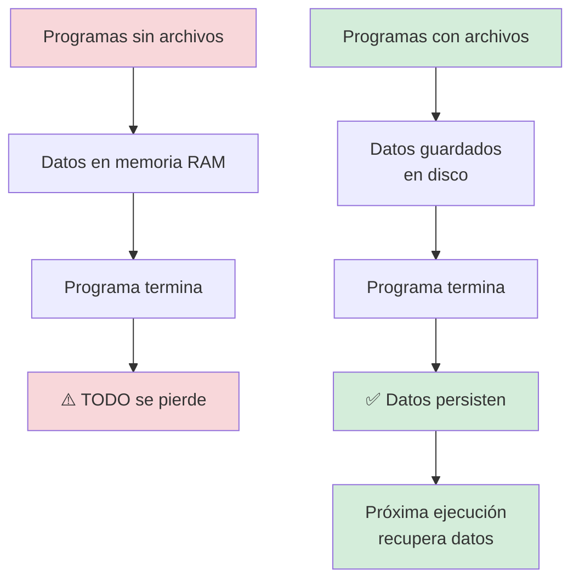

# Capítulo 9: El Mundo Real en tu Código — Archivos, CSV y Datos Externos

## Introducción: El Momento de la Verdad Digital

Imagina que has estado practicando tus habilidades de combate en un videojuego durante semanas. Has dominado todos los movimientos, conoces cada combo perfecto, y tu técnica es impecable. Pero hay un problema: cada vez que apagas la consola, todo tu progreso desaparece. Tu personaje vuelve al nivel 1, tu inventario está vacío, tus logros se evanescen como si nunca hubieran existido.

Frustrante, ¿verdad?

Hasta ahora, tus programas en Python han funcionado exactamente así. Escribes código brillante, creas listas llenas de información, calculas promedios, filtras datos... pero en el momento en que tu programa termina de ejecutarse, toda esa información se desvanece en el aire digital. Es como construir castillos de arena que la marea se lleva cada noche.

**Pero hoy, todo eso cambia.**

En este capítulo vas a aprender a hacer que tus programas tengan **memoria permanente**. Vas a descubrir cómo guardar información en archivos que sobreviven después de que tu código termine de ejecutarse, cómo leer datos que otras personas o sistemas han creado, y cómo trabajar con uno de los formatos más universales del mundo digital: los archivos CSV (esos archivos que puedes abrir con Excel, Google Sheets o cualquier hoja de cálculo).

Esta es la frontera donde tus programas dejan de ser ejercicios de práctica y se convierten en **herramientas reales** capaces de interactuar con el mundo exterior. Porque la verdad es que los datos más interesantes no viven dentro de tu código: viven en archivos, en bases de datos, en la nube, en sistemas externos. Y aprender a conectar tu código con esos datos es lo que separa un programa de juguete de una aplicación profesional.

Piénsalo: cada vez que guardas un juego, descargas una lista de reproducción de Spotify, exportas tus contactos desde tu teléfono, o tu profesor te comparte una hoja de cálculo con calificaciones... alguien escribió código que trabaja con archivos exactamente de la manera que estás a punto de aprender.

> **💡 Objetivo del Capítulo:**
> Al finalizar este capítulo, dominarás la lectura y escritura de archivos de texto, comprenderás cómo trabajar con archivos CSV como bases de datos portátiles, sabrás manejar errores comunes relacionados con archivos, y podrás construir programas persistentes que recuerdan información entre ejecuciones. Aprenderás el puente entre tus programas efímeros y el mundo permanente de la información.

### ¿Qué Vas a Lograr en Este Capítulo?

Al final de esta misión, serás capaz de crear y escribir archivos de texto planos desde Python, leer y procesar información almacenada en archivos externos, trabajar con archivos CSV como si fueran bases de datos portátiles, organizar y analizar datos del mundo real como listas de contactos, registros de ventas e inventarios, y construir programas persistentes que recuerdan información entre ejecuciones.

Esto significa que podrás crear un sistema de gestión de inventario que no olvide tus productos, un diario digital que acumule entradas día tras día, o un analizador de datos que procese archivos que tú o cualquier otra persona haya creado.

**La regla fundamental:** Los archivos son el puente entre tus programas efímeros y el mundo permanente de la información. Dominarlos es como aprender a hablar el idioma universal de los datos.

Prepárate para dar el salto más importante en tu viaje de programación: el momento en que tu código trasciende la pantalla y empieza a transformar información real.



## La Anatomía de un Archivo: Entendiendo el Sistema de Almacenamiento

Antes de empezar a escribir código que manipule archivos, necesitas entender qué es realmente un archivo desde la perspectiva de Python.

Piensa en un archivo como una **caja de seguridad digital** con tres características esenciales: tiene un nombre y una ubicación (su dirección en el sistema de archivos), contiene información organizada de alguna manera específica, y requiere permisos para abrirlo, leerlo o modificarlo.

Cuando trabajas con archivos desde Python, esencialmente estás haciendo tres cosas: tu programa procesa datos en memoria, el archivo almacena esos datos en disco permanentemente, y estableces una conexión temporal entre ambos para transferir información.

### Los Tres Modos de Operación Fundamentales

Cada vez que abres un archivo en Python, debes especificar tu **intención**: ¿qué planeas hacer con él?

| Modo | Símbolo | ¿Qué hace? | ¿Crea el archivo si no existe? | ¿Borra contenido previo? |
|------|---------|------------|-------------------------------|-------------------------|
| **Lectura** | `'r'` | Solo lee, no puede escribir | ❌ No (da error) | ❌ No |
| **Escritura** | `'w'` | Escribe desde cero | ✅ Sí | ⚠️ **SÍ** (¡cuidado!) |
| **Añadir** | `'a'` | Escribe al final del archivo | ✅ Sí | ❌ No |

Visualicemos cómo funciona cada modo. El modo lectura (`'r'`) toma un archivo existente, solo lo lee sin modificar nada, y el archivo queda sin cambios. El modo escritura (`'w'`) toma un archivo existente o no, borra todo su contenido, escribe desde cero, y el archivo queda completamente reemplazado. El modo añadir (`'a'`) toma un archivo existente, mantiene su contenido, añade al final, y el resultado es el contenido antiguo más el contenido nuevo.

> **💡 Perspectiva del Programador: El Contrato con el Archivo**
>
> Cuando abres un archivo, estás firmando un contrato temporal con el sistema operativo. Le estás diciendo: "Necesito acceso a este recurso por un momento, te prometo devolverlo cuando termine".
>
> El sistema operativo te da un manejador de archivo (file handler), que es como una llave temporal que te permite interactuar con ese archivo. Cuando terminas, debes devolver la llave cerrando el archivo, para que otros programas (o tu propio programa más adelante) puedan acceder a él.
>
> Imagina una biblioteca: no puedes llevarte los libros para siempre. Los tomas prestados, los usas, y luego los devuelves para que otros puedan leerlos. Si no los devuelves, nadie más podrá acceder a ellos. Los archivos funcionan exactamente igual.

## Tu Primer Archivo: Escritura Básica de Texto

Vamos a crear nuestro primer archivo de texto. Este es el equivalente digital de abrir un cuaderno en blanco y escribir tu primera línea.

### El Método Clásico: Abrir, Escribir, Cerrar

```python
# Paso 1: Abrir el archivo en modo escritura
archivo = open('mi_primer_archivo.txt', 'w')

# Paso 2: Escribir contenido
archivo.write('¡Hola, mundo de los archivos!\n')
archivo.write('Esta línea también se guarda.\n')
archivo.write('Y esta es la tercera línea.')

# Paso 3: CRÍTICO - Cerrar el archivo
archivo.close()

print("✅ Archivo creado exitosamente")
```

¿Qué está pasando aquí? La función `open('mi_primer_archivo.txt', 'w')` crea (o sobrescribe) un archivo llamado `mi_primer_archivo.txt` en la misma carpeta donde se ejecuta tu código. El método `archivo.write()` escribe el texto exacto que le pases. Importante: no añade saltos de línea automáticamente, por eso agregamos `\n` manualmente. Finalmente, `archivo.close()` es crucial: libera el archivo y garantiza que todo lo que escribiste realmente se guarde en disco.

Output esperado cuando abres el archivo `mi_primer_archivo.txt` con cualquier editor de texto:
```
¡Hola, mundo de los archivos!
Esta línea también se guarda.
Y esta es la tercera línea.
```

### El Método Profesional: El Gestor de Contexto `with`

Hay un problema con el método anterior: si tu código tiene un error en medio de la escritura, el archivo podría no cerrarse correctamente, causando pérdida de datos o archivos corruptos.

La solución profesional es usar la palabra clave `with`, que garantiza que el archivo se cierre automáticamente, incluso si algo sale mal:

```python
# Esta es la forma que los programadores profesionales usan
with open('diario_digital.txt', 'w') as archivo:
    archivo.write('=== Mi Diario Digital ===\n')
    archivo.write('Hoy aprendí a trabajar con archivos.\n')
    archivo.write('Es más poderoso de lo que pensaba.\n')
    # El archivo se cierra automáticamente al salir del bloque 'with'

print("✅ Diario guardado de forma segura")
```

¿Por qué es mejor `with`? Con el método clásico, abres el archivo, escribes, pero si hay un error, no estás seguro de si se cerró correctamente. Con el método `with`, abres dentro del contexto, escribes, y aunque haya un error, el archivo se cierra siempre automáticamente al salir del bloque indentado.

> **⚠️ Advertencia Crítica:**
> El modo `'w'` es destructivo. Si abres un archivo existente en modo `'w'`, Python borrará todo su contenido antes de escribir. Si el archivo tenía información valiosa, se perderá permanentemente sin posibilidad de recuperación. Usa `'w'` solo cuando estés completamente seguro de que quieres empezar desde cero.

## Leyendo Archivos: Recuperando Información Almacenada

Crear archivos es solo la mitad de la historia. La verdadera magia ocurre cuando puedes leer información que tú u otros han guardado previamente.

### Lectura Completa: Todo de una Vez

```python
# Leer todo el contenido del archivo como un string
with open('mi_primer_archivo.txt', 'r') as archivo:
    contenido = archivo.read()
    print(contenido)
```

El método `.read()` devuelve todo el contenido del archivo como un único string largo. Es simple y directo, pero tiene una limitación: si el archivo es muy grande (digamos, 500 MB), intentará cargar todo en memoria, lo cual podría hacer que tu programa se quede sin memoria y falle.

### Lectura Línea por Línea: El Método Eficiente

Para archivos grandes o cuando necesitas procesar cada línea individualmente, lee línea por línea:

```python
with open('mi_primer_archivo.txt', 'r') as archivo:
    for linea in archivo:
        print(f"Procesando: {linea.strip()}")
```

Este enfoque es mucho más eficiente porque solo mantiene una línea en memoria a la vez. El método `.strip()` elimina espacios en blanco y saltos de línea al principio y al final de cada línea, lo cual es casi siempre lo que quieres cuando procesas texto.

### Leer Todas las Líneas en una Lista

A veces quieres todas las líneas pero en una estructura que puedas manipular fácilmente:

```python
with open('mi_primer_archivo.txt', 'r') as archivo:
    lineas = archivo.readlines()
    
print(f"El archivo tiene {len(lineas)} líneas")
for i, linea in enumerate(lineas, start=1):
    print(f"Línea {i}: {linea.strip()}")
```

El método `.readlines()` devuelve una lista donde cada elemento es una línea del archivo. Esto te permite usar todas las herramientas de listas que ya conoces: acceso por índice, slicing, búsqueda, etc.

## Modo Append: Añadiendo Sin Destruir

El modo append (`'a'`) es perfecto cuando quieres agregar información a un archivo existente sin borrar lo que ya tiene. Es ideal para logs, diarios, o cualquier cosa donde acumules datos con el tiempo.

```python
# Primera ejecución del programa
with open('log_actividades.txt', 'a') as archivo:
    archivo.write('2024-01-03 10:30 - Usuario inició sesión\n')

# Segunda ejecución (horas después)
with open('log_actividades.txt', 'a') as archivo:
    archivo.write('2024-01-03 14:45 - Usuario guardó documento\n')

# Tercera ejecución
with open('log_actividades.txt', 'a') as archivo:
    archivo.write('2024-01-03 16:20 - Usuario cerró sesión\n')
```

Después de estas tres ejecuciones, el archivo `log_actividades.txt` contendrá:
```
2024-01-03 10:30 - Usuario inició sesión
2024-01-03 14:45 - Usuario guardó documento
2024-01-03 16:20 - Usuario cerró sesión
```

Cada llamada añadió su línea al final sin afectar las líneas anteriores. Esto es fundamentalmente diferente al modo `'w'`, que habría borrado las líneas previas cada vez.

## Archivos CSV: El Formato Universal de Datos Tabulares

CSV significa "Comma-Separated Values" (Valores Separados por Comas), y es probablemente el formato de intercambio de datos más importante que existe. Si alguna vez has exportado datos desde Excel, Google Sheets, o cualquier base de datos, probablemente obtuviste un archivo CSV.

### ¿Por Qué CSV es Tan Importante?

Los archivos CSV tienen varias ventajas poderosas. Son universales, pueden abrirse en Excel, Google Sheets, editores de texto, y prácticamente cualquier herramienta de análisis de datos. Son legibles por humanos, si abres un CSV con un editor de texto, puedes entender su contenido inmediatamente. Son simples, no requieren software especializado para crearlos o leerlos. Y son eficientes, para millones de filas de datos, CSV sigue siendo sorprendentemente eficiente.

Un archivo CSV típico se ve así cuando lo abres con un editor de texto:

```
nombre,edad,ciudad,puntuacion
Ana,16,Lima,850
Carlos,17,Cusco,720
María,16,Arequipa,950
Diego,18,Trujillo,680
```

La primera línea contiene los encabezados (nombres de las columnas). Cada línea posterior representa una fila de datos. Las comas separan las columnas. Es como una hoja de cálculo, pero en formato de texto plano.

### Escribiendo un Archivo CSV Desde Python

Python incluye el módulo `csv` específicamente diseñado para trabajar con este formato:

```python
import csv

# Datos de estudiantes que queremos guardar
estudiantes = [
    ["Ana", 16, "Lima", 850],
    ["Carlos", 17, "Cusco", 720],
    ["María", 16, "Arequipa", 950],
    ["Diego", 18, "Trujillo", 680]
]

# Escribir el archivo CSV
with open('estudiantes.csv', 'w', newline='') as archivo:
    escritor = csv.writer(archivo)
    
    # Primero escribimos los encabezados
    escritor.writerow(['nombre', 'edad', 'ciudad', 'puntuacion'])
    
    # Luego escribimos cada fila de datos
    for estudiante in estudiantes:
        escritor.writerow(estudiante)

print("✅ Archivo CSV creado exitosamente")
```

El parámetro `newline=''` es importante: evita que se agreguen líneas en blanco extra en algunos sistemas operativos. El objeto `csv.writer(archivo)` crea un escritor especializado que maneja todos los detalles complicados del formato CSV. El método `.writerow()` escribe una lista como una fila, separando automáticamente los elementos con comas.

### Leyendo un Archivo CSV: El Método Básico

```python
import csv

with open('estudiantes.csv', 'r') as archivo:
    lector = csv.reader(archivo)
    
    # Leer y saltar el encabezado
    encabezado = next(lector)
    print(f"Columnas: {encabezado}")
    
    # Procesar cada fila de datos
    for fila in lector:
        nombre, edad, ciudad, puntuacion = fila
        print(f"{nombre} ({edad} años) de {ciudad}: {puntuacion} puntos")
```

Output esperado:
```
Columnas: ['nombre', 'edad', 'ciudad', 'puntuacion']
Ana (16 años) de Lima: 850 puntos
Carlos (17 años) de Cusco: 720 puntos
María (16 años) de Arequipa: 950 puntos
Diego (18 años) de Trujillo: 680 puntos
```

La función `next(lector)` lee y salta la primera línea (el encabezado). Cada fila subsecuente es una lista donde cada elemento corresponde a una columna.

### Leyendo CSV Como Diccionarios: El Método Profesional

Acceder a los datos por índice numérico (`fila[0]`, `fila[1]`) es propenso a errores. ¿Qué pasa si el orden de las columnas cambia? Aquí es donde `DictReader` brilla:

```python
import csv

with open('estudiantes.csv', 'r') as archivo:
    lector = csv.DictReader(archivo)
    
    for estudiante in lector:
        # Accedemos por nombre de columna, no por índice
        nombre = estudiante['nombre']
        edad = int(estudiante['edad'])  # Recuerda convertir los tipos
        ciudad = estudiante['ciudad']
        puntuacion = int(estudiante['puntuacion'])
        
        if puntuacion >= 800:
            print(f"⭐ {nombre} de {ciudad}: {puntuacion} puntos - ¡Destacado!")
```

Output esperado:
```
⭐ Ana de Lima: 850 puntos - ¡Destacado!
⭐ María de Arequipa: 950 puntos - ¡Destacado!
```

Con `DictReader`, cada fila es un diccionario donde las claves son los nombres de las columnas del encabezado. Esto hace el código mucho más legible y resistente a cambios en el orden de las columnas.

> **📝 Nota Importante:**
> Cuando lees desde CSV, todo viene como strings. Incluso los números. Si necesitas hacer matemáticas con un valor, debes convertirlo explícitamente: `int(estudiante['edad'])`, `float(estudiante['puntuacion'])`, etc.

## Manejo de Errores con Archivos: Programación Defensiva

Los archivos son recursos externos sobre los cuales tu programa tiene control limitado. El archivo podría no existir, podría estar corrupto, o el usuario podría no tener permisos para accederlo. Un programa profesional anticipa y maneja estos problemas elegantemente.

### El Error Más Común: Archivo No Encontrado

```python
# ❌ Código frágil que falla abruptamente
archivo = open('datos.csv', 'r')  # Si no existe, programa explota

# ✅ Código robusto que maneja el error
try:
    with open('datos.csv', 'r') as archivo:
        contenido = archivo.read()
        print("✅ Archivo leído exitosamente")
except FileNotFoundError:
    print("❌ Error: El archivo 'datos.csv' no existe")
    print("Por favor verifica el nombre y la ubicación del archivo")
```

El bloque `try-except` captura el error y te permite responder de forma controlada en lugar de que el programa se detenga abruptamente con un mensaje críptico.

### Validación Proactiva con `os.path.exists()`

A veces prefieres verificar si un archivo existe antes de intentar abrirlo:

```python
import os

nombre_archivo = 'configuracion.txt'

if os.path.exists(nombre_archivo):
    with open(nombre_archivo, 'r') as archivo:
        config = archivo.read()
        print(f"✅ Configuración cargada desde {nombre_archivo}")
else:
    print(f"⚠️ No se encontró {nombre_archivo}")
    print("Creando configuración por defecto...")
    with open(nombre_archivo, 'w') as archivo:
        archivo.write("usuario=invitado\nidioma=español\n")
    print("✅ Configuración por defecto creada")
```

Este patrón es común: si el archivo existe, úsalo; si no, créalo con valores por defecto. Es exactamente lo que hacen muchas aplicaciones cuando se ejecutan por primera vez.

## Proyecto Integrador: Sistema de Inventario Persistente

Ahora vamos a construir algo real: un sistema de gestión de inventario que guarda productos en un archivo CSV y permite operaciones completas de gestión. Este proyecto integra todo lo aprendido.

### Nivel 1: Funciones Básicas

```python
import csv
import os

ARCHIVO_INVENTARIO = 'inventario.csv'

def crear_inventario_si_no_existe():
    """Crea el archivo CSV con encabezados si no existe."""
    if not os.path.exists(ARCHIVO_INVENTARIO):
        with open(ARCHIVO_INVENTARIO, 'w', newline='') as archivo:
            escritor = csv.writer(archivo)
            escritor.writerow(['nombre', 'cantidad', 'precio'])
        print("✅ Archivo de inventario creado")

def agregar_producto(nombre, cantidad, precio):
    """Añade un producto nuevo al inventario."""
    with open(ARCHIVO_INVENTARIO, 'a', newline='') as archivo:
        escritor = csv.writer(archivo)
        escritor.writerow([nombre, cantidad, precio])
    print(f"✅ Producto '{nombre}' agregado al inventario")

def listar_inventario():
    """Muestra todos los productos del inventario."""
    print("\n=== INVENTARIO ACTUAL ===")
    with open(ARCHIVO_INVENTARIO, 'r') as archivo:
        lector = csv.DictReader(archivo)
        for producto in lector:
            nombre = producto['nombre']
            cantidad = producto['cantidad']
            precio = producto['precio']
            print(f"- {nombre}: {cantidad} unidades a S/. {precio} c/u")

def calcular_valor_total():
    """Calcula el valor total del inventario."""
    total = 0
    with open(ARCHIVO_INVENTARIO, 'r') as archivo:
        lector = csv.DictReader(archivo)
        for producto in lector:
            cantidad = int(producto['cantidad'])
            precio = float(producto['precio'])
            total += cantidad * precio
    return total

# Programa principal
crear_inventario_si_no_existe()

# Agregar algunos productos
agregar_producto("Laptop", 10, 850.00)
agregar_producto("Mouse", 50, 15.50)
agregar_producto("Teclado", 30, 45.00)

# Ver el inventario
listar_inventario()

# Calcular valor total
valor = calcular_valor_total()
print(f"\n💰 Valor total del inventario: S/. {valor:.2f}")
```

Output esperado:
```
✅ Archivo de inventario creado
✅ Producto 'Laptop' agregado al inventario
✅ Producto 'Mouse' agregado al inventario
✅ Producto 'Teclado' agregado al inventario

=== INVENTARIO ACTUAL ===
- Laptop: 10 unidades a S/. 850.0 c/u
- Mouse: 50 unidades a S/. 15.5 c/u
- Teclado: 30 unidades a S/. 45.0 c/u

💰 Valor total del inventario: S/. 9525.00
```

### Nivel 2: Operaciones Avanzadas

Ahora vamos a agregar funciones para actualizar el stock y buscar productos:

```python
def buscar_producto(nombre_buscar):
    """Busca un producto por nombre y retorna su información."""
    with open(ARCHIVO_INVENTARIO, 'r') as archivo:
        lector = csv.DictReader(archivo)
        for producto in lector:
            if producto['nombre'].lower() == nombre_buscar.lower():
                return producto
    return None

def actualizar_stock(nombre, nueva_cantidad):
    """Actualiza la cantidad de un producto específico."""
    # Leer todos los productos
    productos = []
    with open(ARCHIVO_INVENTARIO, 'r') as archivo:
        lector = csv.DictReader(archivo)
        for producto in lector:
            if producto['nombre'].lower() == nombre.lower():
                producto['cantidad'] = str(nueva_cantidad)
            productos.append(producto)
    
    # Reescribir el archivo con los datos actualizados
    with open(ARCHIVO_INVENTARIO, 'w', newline='') as archivo:
        campos = ['nombre', 'cantidad', 'precio']
        escritor = csv.DictWriter(archivo, fieldnames=campos)
        escritor.writeheader()
        escritor.writerows(productos)
    
    print(f"✅ Stock de '{nombre}' actualizado a {nueva_cantidad}")

def vender_producto(nombre, cantidad_vendida):
    """Reduce el stock cuando se vende un producto."""
    producto = buscar_producto(nombre)
    if not producto:
        print(f"❌ Producto '{nombre}' no encontrado")
        return
    
    stock_actual = int(producto['cantidad'])
    if cantidad_vendida > stock_actual:
        print(f"❌ Stock insuficiente. Solo hay {stock_actual} unidades")
        return
    
    nuevo_stock = stock_actual - cantidad_vendida
    actualizar_stock(nombre, nuevo_stock)
    print(f"✅ Venta registrada: {cantidad_vendida} unidades de '{nombre}'")

# Uso de las nuevas funciones
vender_producto("Mouse", 5)
vender_producto("Laptop", 2)

listar_inventario()
```

### Nivel 3: Menú Interactivo Completo

Finalmente, creamos un menú que permita al usuario interactuar con el sistema:

```python
def mostrar_menu():
    """Muestra el menú principal de opciones."""
    print("\n" + "="*40)
    print("    SISTEMA DE INVENTARIO")
    print("="*40)
    print("1. Añadir producto")
    print("2. Actualizar stock")
    print("3. Vender producto")
    print("4. Ver inventario completo")
    print("5. Ver valor total")
    print("6. Productos con stock bajo")
    print("7. Salir")
    print("="*40)

def productos_stock_bajo(minimo=5):
    """Muestra productos con stock menor al mínimo especificado."""
    print(f"\n⚠️  PRODUCTOS CON STOCK BAJO (< {minimo} unidades)")
    encontrados = False
    with open(ARCHIVO_INVENTARIO, 'r') as archivo:
        lector = csv.DictReader(archivo)
        for producto in lector:
            cantidad = int(producto['cantidad'])
            if cantidad < minimo:
                print(f"  - {producto['nombre']}: {cantidad} unidades")
                encontrados = True
    
    if not encontrados:
        print("  ✅ Todos los productos tienen stock suficiente")

def ejecutar_sistema():
    """Función principal que ejecuta el sistema en un bucle."""
    crear_inventario_si_no_existe()
    
    while True:
        mostrar_menu()
        opcion = input("\nElige una opción (1-7): ")
        
        if opcion == "1":
            nombre = input("Nombre del producto: ")
            cantidad = int(input("Cantidad: "))
            precio = float(input("Precio unitario: "))
            agregar_producto(nombre, cantidad, precio)
        
        elif opcion == "2":
            nombre = input("Nombre del producto: ")
            nueva_cantidad = int(input("Nueva cantidad: "))
            actualizar_stock(nombre, nueva_cantidad)
        
        elif opcion == "3":
            nombre = input("Nombre del producto: ")
            cantidad = int(input("Cantidad a vender: "))
            vender_producto(nombre, cantidad)
        
        elif opcion == "4":
            listar_inventario()
        
        elif opcion == "5":
            valor = calcular_valor_total()
            print(f"\n💰 Valor total del inventario: S/. {valor:.2f}")
        
        elif opcion == "6":
            productos_stock_bajo()
        
        elif opcion == "7":
            print("\n👋 ¡Hasta luego!")
            break
        
        else:
            print("\n❌ Opción inválida. Por favor elige 1-7")

# Ejecutar el sistema
if __name__ == "__main__":
    ejecutar_sistema()
```

Este sistema completo demuestra cómo los archivos CSV pueden funcionar como una base de datos simple pero efectiva para proyectos pequeños y medianos.

## Bug Común: El Archivo Fantasma

Uno de los errores más frustrantes para principiantes es el `FileNotFoundError` cuando están seguros de que el archivo existe. Veamos por qué pasa y cómo solucionarlo.

**Síntoma:** Tu código explota con:
```
FileNotFoundError: [Errno 2] No such file or directory: 'mi_archivo.csv'
```

Pero tú estás seguro de que el archivo existe. Lo ves en tu carpeta de descargas, ¡incluso lo puedes abrir con Excel!

**¿Por qué pasa esto?**

Python no busca el archivo en todo tu computador. Solo busca en la **carpeta de trabajo actual** (donde se ejecuta tu script). Es como si le dijeras a un robot "tráeme el libro" sin decirle en qué habitación está.

Escenario típico en la estructura de carpetas: tienes Documentos, dentro está la carpeta descargas donde vive `mi_archivo.csv`, y la carpeta mis_programas donde se ejecuta tu código `analizar.py`. Cuando tu código hace `open('mi_archivo.csv', 'r')`, Python busca en `mis_programas/`, no en `descargas/`.

**La solución profesional:**

Primero, verifica la carpeta de trabajo actual:
```python
import os
print("Estoy trabajando en:", os.getcwd())
```

Segundo, verifica si el archivo existe antes de abrirlo:
```python
if os.path.exists('mi_archivo.csv'):
    print("✅ Archivo encontrado")
else:
    print("❌ Archivo no encontrado en esta carpeta")
```

Tercero, tienes tres opciones: mover el archivo a la carpeta correcta, usar la ruta completa (absoluta) del archivo, o cambiar la ruta relativa usando `'../descargas/mi_archivo.csv'`.

**Ejemplo de código robusto:**
```python
import os

nombre_archivo = 'datos.csv'

if not os.path.exists(nombre_archivo):
    print(f"⚠️ Error: '{nombre_archivo}' no existe en {os.getcwd()}")
    print("💡 Verifica que el archivo esté en la carpeta correcta")
else:
    with open(nombre_archivo, 'r') as archivo:
        print("✅ Archivo cargado correctamente")
        # Tu código aquí
```

**Regla de oro:** Si abres archivos creados por el usuario o externos, siempre verifica su existencia primero. Tu código debe ser defensivo.

## Para Recordar

Los archivos de texto son el puente entre tu código efímero y la persistencia permanente. El modo escritura (`'w'`) borra todo y escribe desde cero, úsalo con cuidado. El modo añadir (`'a'`) escribe al final sin borrar, perfecto para logs y diarios. El modo lectura (`'r'`) solo lee y no puede modificar el archivo.

El `with` statement garantiza cierre automático del archivo, siempre úsalo para evitar pérdida de datos. Los archivos CSV son el formato universal para datos tabulares, legibles tanto por humanos como por máquinas.

`csv.DictReader` te permite leer CSV accediendo por nombre de columna, lo cual es mucho más legible que usar índices numéricos. El método `.strip()` elimina espacios y saltos de línea, es esencial al leer archivos para limpiar los datos.

El manejo de errores es crítico cuando trabajas con archivos, ya que pueden fallar de muchas formas. Siempre usa `try/except` para `FileNotFoundError` y verifica la existencia de archivos con `os.path.exists()` cuando sea necesario.

## Preguntas de Reflexión

1. **Persistencia vs. Volatilidad:** Piensa en las apps que usas diariamente (WhatsApp, Spotify, juegos). ¿Qué información necesitan guardar permanentemente y cuál puede ser temporal? ¿Cómo crees que organizan esos datos?

2. **El Dilema del Formato:** Tienes que compartir una lista de 100 contactos con alguien que no sabe programar. ¿Le enviarías un archivo `.txt`, un `.csv`, o un archivo de Python con una lista? ¿Por qué? ¿Qué criterios estás usando para decidir?

3. **Ética de los Datos:** Tu programa ahora puede leer y escribir archivos de cualquier usuario. ¿Qué responsabilidades éticas tienes al manejar información que podría ser personal o sensible? ¿Cómo garantizarías que tu código respeta la privacidad?

4. **Escalabilidad:** Has creado un sistema de inventario que funciona perfecto con 50 productos. ¿Qué pasaría si intentaras usar el mismo archivo CSV para 500,000 productos? ¿En qué momento un CSV deja de ser una buena solución y necesitas algo más robusto (como una base de datos)?

5. **Automatización Real:** Identifica una tarea repetitiva en tu vida que involucre datos (organizar tu música, llevar registro de tus gastos, seguimiento de hábitos). ¿Cómo podrías usar archivos CSV y Python para automatizar o simplificar esa tarea?

## Cierre: El Umbral de lo Profesional

Felicidades. Con este capítulo has cruzado una frontera invisible pero crucial en tu viaje de programación.

Tus programas ya no son islas aisladas que solo existen mientras se ejecutan. Ahora son **sistemas persistentes** capaces de acumular conocimiento, procesar información real, e interactuar con el ecosistema digital más amplio.

Piensa en lo que acabas de aprender. Tus programas ahora tienen memoria, pueden recordar información entre sesiones. Puedes importar datos del mundo real, desde hojas de cálculo hasta exportaciones de otros sistemas. Puedes exportar resultados que otras personas o programas pueden usar. Has aprendido a usar CSV, el formato de intercambio de datos más ubicuo del planeta.

Esta habilidad cambia fundamentalmente el tipo de proyectos que puedes abordar. Ya no estás limitado a ejercicios sintéticos. Puedes construir un sistema de gestión de biblioteca personal, analizar tus propios datos de Spotify o YouTube, crear dashboards automatizados que procesen reportes semanales, o desarrollar herramientas que realmente resuelvan problemas en tu escuela, tu hogar o tu comunidad.

Pero con este poder viene una nueva responsabilidad: la gestión cuidadosa de la información. Un error en modo `'w'` puede borrar datos valiosos permanentemente. Un CSV mal formateado puede romper sistemas que dependen de él. Un archivo sin las validaciones adecuadas puede llevar a conclusiones erróneas.

En el próximo capítulo, vas a dar el siguiente salto: aprenderás a visualizar datos. Porque los números en un CSV cuentan una historia, pero una gráfica bien diseñada hace que esa historia sea imposible de ignorar.

Tus archivos CSV se convertirán en gráficos de barras, líneas de tendencia y visualizaciones interactivas que transforman datos crudos en insights accionables.

Hasta ahora has aprendido a capturar datos. Pronto aprenderás a hacerlos hablar.