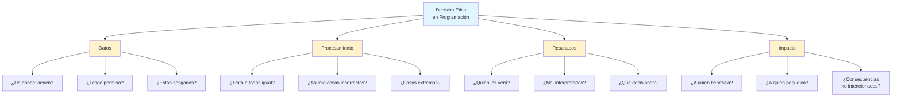

# Capítulo 11: El Código del Héroe — Programación Ética y Responsable

## Introducción: El Poder Conlleva Responsabilidad

Felicitaciones. Has llegado muy lejos en este viaje. Dominas variables, estructuras de control, funciones, manipulación de datos y visualización. En este punto, tienes el conocimiento técnico para crear programas que pueden procesar información de miles de personas, automatizar decisiones importantes o influir en cómo otros ven el mundo a través de visualizaciones de datos.

Pero aquí hay una pregunta incómoda que debemos hacernos: ¿tener la habilidad de hacer algo significa que deberíamos hacerlo?

Imagina que has creado un programa que analiza las calificaciones de todos los estudiantes de tu escuela y genera automáticamente predicciones sobre quién "tiene probabilidades de éxito" y quién no. Técnicamente, es un proyecto impresionante. Has aplicado todo lo que aprendiste: lectura de archivos CSV, procesamiento de datos, tal vez hasta algunas visualizaciones elegantes. Funciona perfectamente.

Pero detente un momento. ¿Qué pasaría si esas predicciones son incorrectas? ¿Qué pasa si el programa considera que tener un mal año significa que alguien "no tiene futuro"? ¿Qué ocurre si maestros o directores empiezan a tomar decisiones basándose en esos números generados por tu código?

Este capítulo trata sobre algo que raramente se enseña en los tutoriales de programación, pero que separa a los programadores excepcionales de los simplemente competentes: la ética y la responsabilidad. No vamos a programar mucho aquí. En cambio, vamos a desarrollar el músculo más importante de un programador: el juicio crítico.

Porque la realidad es esta: el código que escribes tiene consecuencias reales en vidas reales. Y cuanto más poderoso sea tu código, mayores serán esas consecuencias.

> **💡 Objetivo del Capítulo:**
> Al finalizar este capítulo, comprenderás los dilemas éticos fundamentales en programación relacionados con privacidad, sesgo algorítmico, transparencia y accesibilidad. Desarrollarás un marco de pensamiento crítico para evaluar las implicaciones éticas de tu código, aprenderás a identificar y mitigar sesgos en datos y algoritmos, conocerás principios de diseño inclusivo y accesible, y desarrollarás el hábito de preguntarte no solo "¿puede hacerse?" sino "¿debe hacerse?".

## La Anatomía de una Decisión Ética en Programación

Cuando enfrentas una decisión ética en programación, generalmente implica uno o más de estos elementos fundamentales.

Primero están los **datos**: de dónde vienen, si tienes permiso para usarlos, y si son representativos o están sesgados. Luego está el **procesamiento**: si tu algoritmo trata a todos por igual, si estás asumiendo cosas que no deberías, y qué sucede con los casos extremos. Los **resultados** también importan: quién verá estos resultados, cómo podrían ser mal interpretados, y qué decisiones se tomarán basándose en ellos. Finalmente está el **impacto**: a quién beneficia esto, a quién podría perjudicar, y si hay consecuencias no intencionadas.

Vamos a explorar cada uno de estos elementos en profundidad, porque cada uno representa un punto donde tus decisiones como programador importan.



## 1. La Privacidad: No Todos los Datos Deberían Ser Procesados

### El Principio del Consentimiento Informado

Piensa en tu información personal como en las llaves de tu casa. Tú decides a quién se las das y para qué propósito. Si le das una copia a un amigo para que riegue tus plantas mientras estás de vacaciones, esperarías que use esas llaves solo para regar las plantas, no para revisar tus cajones o hacer copias para otros.

Los datos personales funcionan exactamente igual. Cuando alguien comparte su información, ya sea directamente o a través de formularios, aplicaciones o servicios, lo hace con una expectativa implícita de propósito limitado y respeto.

### Caso de Estudio: El Analizador de Redes Sociales

Imagina este escenario: has aprendido a usar APIs (interfaces de programación de aplicaciones) y descubres que puedes acceder a las publicaciones públicas de redes sociales. Decides crear un programa que recopila todas las publicaciones públicas de personas de tu ciudad, analiza sus sentimientos como positivo o negativo, crea perfiles sobre qué temas le importan a cada persona, y genera un mapa de "quién influye en quién".

Pregunta crítica: ¿el hecho de que esta información sea técnicamente "pública" significa que deberías recopilarla y analizarla de esta manera?

La respuesta es compleja, pero hay guías para pensar en esto. Hazte estas preguntas del test de privacidad: ¿las personas que publicaron esa información esperarían que fuera usada de esta manera? ¿Cambiaría algo si fueras tú quien está siendo analizado? ¿Estarías cómodo explicándole a cada una de esas personas exactamente qué hiciste con su información?

> **💡 Perspectiva del Programador: La Paradoja de la Información Pública**
>
> Aquí hay algo fascinante: algo puede ser públicamente accesible pero no públicamente analizable a escala.
>
> Piénsalo así: si caminas por la calle, tu rostro es "público" porque cualquiera puede verte. Pero si alguien te siguiera todo el día, fotografiándote en cada lugar que visitas, registrando con quién hablas y a qué hora, y luego vendiera esa información, ¿seguiría siendo solo "información pública"? Claro que no. Cruzaría una línea ética clara.
>
> La programación nos da el superpoder de analizar información a una escala que sería imposible manualmente. Este superpoder viene con la responsabilidad de preguntarnos si el hecho de que podamos hacerlo significa que debamos hacerlo.

### Reglas de Oro para Manejo de Datos Personales

Nunca almacenes contraseñas en texto plano ni guardes información sensible sin protección. En cambio, aplica estos tres principios fundamentales.

**Principio 1: Mínima Recopilación**

Solo pide lo que realmente necesitas para que tu programa funcione:

```python
# ✅ Buena práctica: solicita solo lo necesario
datos_registro = {
    "nombre_usuario": input("Nombre de usuario: "),
    "email": input("Email: ")
}
# No pidas teléfono, dirección, edad, si no los necesitas
```

**Principio 2: Anonimización**

Separa la identidad de los datos cuando sea posible usando técnicas como el hashing:

```python
import hashlib

def anonimizar_id(email):
    """
    Convierte un email en un ID anónimo irreversible.
    
    ¿Qué es un "hash" y por qué es irreversible?
    Piensa en un hash como una máquina trituradora de papel súper especial:
    - Metes un documento (tu email) → sale confeti (el código)
    - El mismo documento SIEMPRE produce el mismo confeti
    - Pero si solo tienes el confeti, NUNCA puedes reconstruir el documento original
    
    Esto es perfecto para privacidad: podemos identificar al mismo usuario
    sin necesidad de guardar su email real.
    """
    return hashlib.sha256(email.encode()).hexdigest()[:16]

# Ejemplo:
# usuario123@email.com → "7a8b9c4d3e2f1a5b"
# Siempre el mismo código para el mismo email, pero irreversible
```

**Principio 3: Agregación**

Trabaja con grupos, no individuos. Reporta estadísticas agregadas en lugar de datos individuales:

```python
# ✅ Buena práctica: reporta agregados
edades = [14, 15, 14, 16, 15, 14]
promedio_edad = sum(edades) / len(edades)
print(f"Edad promedio del grupo: {promedio_edad:.1f}")

# ❌ Mala práctica: expone datos individuales
# "María tiene 14, Juan 15, Ana 14..." ← invasivo e innecesario
```

## 2. El Sesgo: Cuando el Código Hereda Nuestros Prejuicios

### La Ilusión de la Objetividad

Existe un mito peligroso sobre la programación: que el código es "objetivo" o "neutral". Después de todo, es solo matemáticas y lógica, ¿verdad?

Falso. El código es escrito por humanos, entrenado con datos creados por humanos, y usado para tomar decisiones que afectan a humanos. En cada uno de esos puntos, los sesgos pueden colarse.

### Historia Real Simplificada: El Sistema de Reclutamiento

Una empresa grande creó un sistema de inteligencia artificial para ayudar a contratar personal. Le dieron miles de CVs de contrataciones exitosas del pasado, y el sistema aprendió qué características predecían "buen candidato".

El problema surgió rápidamente: el sistema comenzó a penalizar CVs que incluían la palabra "mujer" o menciones de universidades femeninas. ¿Por qué? Porque los datos históricos reflejaban que la empresa había contratado principalmente hombres en el pasado. El algoritmo "aprendió" que ser hombre era una característica deseable para el éxito.

El código no tenía prejuicios intencionales. Pero heredó los sesgos históricos presentes en los datos.

### Tipos Comunes de Sesgo en Programación

El **sesgo de muestreo** ocurre cuando tus datos no representan a toda la población. Si entrenas un sistema de reconocimiento facial solo con rostros de personas de piel clara, funcionará mal con personas de piel oscura. No es porque el algoritmo sea "racista", es porque nunca aprendió a reconocer esa diversidad.

El **sesgo de confirmación** sucede cuando diseñas tu programa esperando ciertos resultados. Si crees que "los buenos estudiantes siempre tienen buena asistencia", podrías diseñar un sistema que penalice desproporcionadamente a estudiantes con problemas de salud o responsabilidades familiares.

El **sesgo de proxy** es como juzgar un libro por su portada.
Imagina que quieres prohibir la música "agresiva" en la escuela, así que prohíbes el "Heavy Metal".
* **Intención:** Reducir agresividad.
* **Realidad:** Estás excluyendo a un grupo específico de estudiantes que visten de negro y les gusta esa cultura, aunque sean pacíficos.
* **El Proxy:** El género musical actuó como un "proxy" (un sustituto) para juzgar la personalidad de los estudiantes. En código, usar "Código Postal" suele ser un proxy tramposo para juzgar el nivel económico sin preguntarlo directamente.

### Código que Reconoce su Sesgo

```python
def evaluar_estudiante(datos_estudiante):
    """
    Sistema de evaluación que INTENTA mitigar sesgos.
    
    ⚠️ Advertencia: Este sistema puede contener sesgos no intencionados
    relacionados con acceso a recursos tecnológicos, situaciones familiares,
    y diferencias culturales en estilos de aprendizaje.
    """
    
    # ❌ Sesgo potencial: asumir que todos tienen internet estable
    # if datos_estudiante["entregas_online"] < 8:
    #     puntaje -= 20  # Penaliza desproporcionadamente a estudiantes sin recursos
    
    # ✅ Mejor enfoque: contextualizar
    entregas_totales = datos_estudiante["entregas_online"]
    entregas_posibles = datos_estudiante["total_asignaciones"]
    
    if entregas_posibles > 0:
        tasa_entrega = entregas_totales / entregas_posibles
        # Evalúa proporción, no números absolutos
    
    # ❌ Sesgo potencial: asumir que participación oral = comprensión
    # Penaliza a estudiantes introvertidos o con diferente cultura de comunicación
    
    # ✅ Mejor enfoque: múltiples formas de demostrar comprensión
    participacion_total = (
        datos_estudiante["participacion_oral"] +
        datos_estudiante["participacion_escrita"] +
        datos_estudiante["proyectos_completados"]
    )
    
    return {
        "puntaje": calcular_puntaje(datos_estudiante),
        "nota": "Este puntaje es UNA perspectiva, no LA verdad absoluta sobre el estudiante"
    }
```

> **📝 Nota Importante:**
> No existe código completamente libre de sesgos. El objetivo no es perfección imposible, sino conciencia constante. Pregúntate siempre: ¿quién podría verse perjudicado por las suposiciones en mi código? ¿Qué casos estoy sin darme cuenta dejando fuera?

## 3. La Transparencia: El Derecho a Entender

### La Caja Negra que Decide tu Futuro

Imagina que solicitas un préstamo para comprar tu primera computadora para programar. El banco usa un sistema automático que analiza tu solicitud y la rechaza instantáneamente. Cuando preguntas por qué, te dicen: "La computadora decidió que no. No sabemos por qué, solo seguimos lo que dice el algoritmo".

¿Te parecería justo? ¿Cómo podrías mejorar si no sabes qué salió mal?

Este es el problema de la **opacidad algorítmica**: sistemas que toman decisiones importantes sobre las vidas de las personas sin que nadie, ni siquiera sus creadores, pueda explicar exactamente por qué tomaron esas decisiones.

### El Principio de Explicabilidad

Cuando tu código toma decisiones que afectan a personas, esas personas tienen derecho a entender cómo se tomó esa decisión. No necesitan ver el código fuente, pero sí necesitan una explicación comprensible del proceso.

```python
def recomendar_nivel_curso(estudiante):
    """
    Recomienda nivel de curso basándose en múltiples factores.
    
    Este sistema ES TRANSPARENTE porque:
    1. Explica qué factores considera
    2. Muestra el peso de cada factor
    3. Permite que humanos revisen y anular la decisión
    """
    
    factores = {
        "promedio_previo": estudiante["promedio"] * 0.40,  # 40% del peso
        "autoevaluacion": estudiante["nivel_confianza"] * 0.20,  # 20%
        "recomendacion_profesor": estudiante["recomendacion"] * 0.25,  # 25%
        "prueba_diagnostico": estudiante["prueba"] * 0.15  # 15%
    }
    
    puntaje_total = sum(factores.values())
    
    # Determinar recomendación
    if puntaje_total >= 75:
        nivel = "Avanzado"
    elif puntaje_total >= 50:
        nivel = "Intermedio"
    else:
        nivel = "Principiante"
    
    # Generar explicación legible
    explicacion = f"""
    RECOMENDACIÓN: {nivel} (Puntaje: {puntaje_total:.1f}/100)
    
    CÓMO SE CALCULÓ:
    - Promedio previo ({estudiante['promedio']}): {factores['promedio_previo']:.1f} puntos (40% peso)
    - Tu autoevaluación ({estudiante['nivel_confianza']}): {factores['autoevaluacion']:.1f} puntos (20% peso)
    - Recomendación profesor ({estudiante['recomendacion']}): {factores['recomendacion_profesor']:.1f} puntos (25% peso)
    - Prueba diagnóstico ({estudiante['prueba']}): {factores['prueba_diagnostico']:.1f} puntos (15% peso)
    
    NOTA: Esta es una RECOMENDACIÓN, no una decisión final.
    Puedes solicitar revisión manual si sientes que no refleja tu nivel real.
    """
    
    return {
        "nivel": nivel,
        "puntaje": puntaje_total,
        "factores": factores,
        "explicacion": explicacion
    }

# Uso del sistema
resultado = recomendar_nivel_curso({
    "promedio": 85,
    "nivel_confianza": 70,
    "recomendacion": 80,
    "prueba": 75
})

print(resultado["explicacion"])
```

Este sistema es transparente porque muestra su trabajo como lo haría un humano. No es una caja negra misteriosa, es un proceso comprensible que puedes cuestionar, revisar y mejorar.

## 4. La Accesibilidad: Código para Todos, No Solo para Algunos

### El Mito del Usuario "Normal"

Hay una tendencia peligrosa en programación: diseñar para el "usuario promedio". El problema es que ese usuario promedio no existe. Cada persona interactúa con la tecnología de manera diferente basándose en sus capacidades, contexto y necesidades.

Considera estas realidades que tu código debe contemplar. Algunas personas tienen discapacidad visual y usan lectores de pantalla. Otras tienen discapacidad motora y no pueden usar ratón con precisión. Hay usuarios con daltonismo que no pueden distinguir ciertos colores. Personas mayores que necesitan texto más grande. Usuarios en dispositivos móviles con pantallas pequeñas. Personas con conexiones lentas de internet. Usuarios que hablan español como segundo idioma.

Si tu programa solo funciona bien para una persona joven, con visión perfecta, usando una computadora de escritorio con internet rápido y español nativo, entonces has excluido a la mayoría de los usuarios potenciales.

### Principios de Diseño Inclusivo

**Principio 1: Nunca confíes solo en el color**

```python
# ❌ Problema: solo usa color para comunicar
print("\033[91mError: Archivo no encontrado\033[0m")  # Texto rojo
# Alguien con daltonismo no verá la diferencia

# ✅ Solución: usa símbolos + color
print("❌ Error: Archivo no encontrado")
print("⚠️ Advertencia: Conexión lenta")
print("✅ Éxito: Archivo guardado")
```

**Principio 2: Proporciona alternativas textuales**

```python
def mostrar_progreso_accesible(porcentaje):
    """
    Barra de progreso que funciona tanto visualmente como con lectores de pantalla.
    """
    barra_visual = "█" * int(porcentaje / 10) + "░" * (10 - int(porcentaje / 10))
    texto_alternativo = f"Progreso: {porcentaje}% completado"
    
    # Muestra ambos
    print(f"[{barra_visual}] {texto_alternativo}")

# Salida: [████████░░] Progreso: 80% completado
```

**Principio 3: No asumas capacidades del usuario**

```python
# ❌ Asume que puede escribir rápido
print("Tienes 5 segundos para responder...")
time.sleep(5)

# ✅ Respeta ritmos diferentes
print("Presiona Enter cuando estés listo para continuar...")
input()  # Espera sin límite de tiempo
```

**Principio 4: Mensajes de error útiles en lenguaje claro**

```python
# ❌ Error críptico
print("Error 4X7B: Invalid input")

# ✅ Error útil y accionable
print("""
❌ Error: No se pudo procesar tu entrada

Problema: Ingresaste letras donde se esperaban números
Solución: Intenta ingresar solo números (ejemplo: 25)

¿Necesitas ayuda? Escribe 'ayuda' para ver instrucciones
""")
```

## 5. La Sostenibilidad del Código: Pensar en el Futuro

### Código Legible es Código Mantenible

Dentro de seis meses, tú mismo serás un "usuario futuro" de tu código. Y probablemente no recordarás por qué tomaste ciertas decisiones o qué hace exactamente esa función con el nombre críptico.

Escribir código sostenible no es sobre ser perfecto, es sobre ser considerado con tu yo futuro y con otros que puedan trabajar con tu código.

```python
# ❌ Código insostenible
def p(d):
    r = 0
    for i in d:
        if i > 50:
            r += i * 1.2
        else:
            r += i
    return r / len(d)

# ✅ Código sostenible
def calcular_promedio_con_bonificacion(calificaciones):
    """
    Calcula el promedio de calificaciones con bonificación para notas altas.
    
    Regla de bonificación:
    - Notas mayores a 50: se multiplican por 1.2 (bonificación del 20%)
    - Notas 50 o menos: se mantienen sin cambios
    
    Args:
        calificaciones (list): Lista de calificaciones numéricas
    
    Returns:
        float: Promedio calculado con bonificaciones aplicadas
    
    Ejemplo:
        >>> calcular_promedio_con_bonificacion([40, 60, 70])
        64.0  # (40 + 72 + 84) / 3
    """
    suma_con_bonificacion = 0
    
    for nota in calificaciones:
        if nota > 50:
            # Bonificación del 20% para notas sobresalientes
            nota_con_bonificacion = nota * 1.2
            suma_con_bonificacion += nota_con_bonificacion
        else:
            # Sin bonificación para notas regulares
            suma_con_bonificacion += nota
    
    promedio = suma_con_bonificacion / len(calificaciones)
    return promedio
```

La segunda versión es más larga, pero infinitamente más mantenible. Cuando vuelvas a este código en seis meses o cuando otro programador necesite modificarlo, entenderán inmediatamente qué hace y por qué.

## Laboratorio: Sistema de Recomendación Ético

### Objetivo
Diseñar un sistema de recomendación de cursos que aplique principios éticos de privacidad, transparencia y equidad.

### Contexto
Vas a crear un sistema que recomiende nivel de curso (Principiante/Intermedio/Avanzado) basándose en múltiples factores, pero diseñado conscientemente para evitar sesgos comunes.

### Instrucciones

**Nivel 1: Sistema Básico con Transparencia**

Implementa un sistema que considere tres factores: promedio de calificaciones previas (0-100), autoevaluación del estudiante (0-100), y resultado de prueba diagnóstica (0-100). Calcula un puntaje ponderado y recomienda nivel basándose en umbrales claros. Genera una explicación legible que muestre cómo se calculó la recomendación y el peso de cada factor.

**Nivel 2: Mitigación de Sesgos**

Identifica al menos tres sesgos potenciales en tu sistema básico. Ejemplos: ¿penaliza a estudiantes con ansiedad en exámenes? ¿asume que todos tienen igual acceso a recursos? ¿favorece cierto estilo de aprendizaje? Modifica tu código para mitigar estos sesgos. Documenta qué cambios hiciste y por qué. Añade advertencias sobre limitaciones del sistema.

**Nivel 3: Transparencia y Simulación**

Implementa una función que permita al usuario "jugar" con los factores para entender cómo afectan la recomendación. Añade un modo de validación donde puedas probar el sistema con perfiles diversos (estudiante con ansiedad, estudiante con recursos limitados, estudiante introvertido, etc.). Documenta casos donde el sistema podría fallar y cómo un humano debería revisar esos casos.

**Criterio de Éxito:**

Un maestro puede entender el proceso sin ayuda técnica. El sistema "muestra su trabajo" como lo haría un humano. Es fácil identificar si el sistema está funcionando correctamente o no. Los sesgos están documentados y, donde sea posible, mitigados.

### ⚠️ Errores Comunes: Probar solo el "Camino Feliz" (Happy Path)

Un error ético muy común en programadores novatos es probar su código **solo con datos que saben que van a funcionar**.

* *Tú:* "Ingreso edad: 15". *Programa:* Funciona.
* *Tú:* "¡Listo! Terminé."

Esto se llama probar solo el **Happy Path**. Pero el mundo real es caótico.
¿Qué pasa si un usuario ingresa edad: -5? ¿O edad: "quince"? ¿O edad: 150?

Si tu código asume que el usuario siempre será perfecto, fallará. Y si ese código decide quién recibe una beca, ese fallo es un problema ético.
**Solución:** Sé tu propio "abogado del diablo". Intenta romper tu propio código con los datos más extraños que se te ocurran.

## Para Recordar

La privacidad requiere preguntarse: no todos los datos disponibles deben ser procesados. La cuestión crítica es si las personas esperarían que uses su información de esa manera. El sesgo en código hereda los prejuicios de sus datos y creadores. Prueba con casos diversos, no solo con el usuario promedio o típico.

La transparencia significa que si no puedes explicar cómo funciona tu algoritmo en dos minutos, necesitas simplificarlo o documentarlo mejor. Las decisiones automatizadas que afectan a personas deben ser explicables. La accesibilidad implica diseñar para todos, no solo para usuarios como tú. La exclusión a menudo no es intencional, es resultado del descuido.

La sostenibilidad del código se basa en que código claro es mejor que código "inteligente". Tu yo futuro y otros programadores te lo agradecerán. Los comentarios y la documentación no son opcionales cuando el código afecta decisiones sobre personas.

## Preguntas de Reflexión

1. Piensa en una aplicación o sitio web que uses regularmente. ¿Qué datos tuyos está recopilando? ¿Te sientes cómodo con cómo esa información podría estar siendo usada? ¿Por qué sí o por qué no?

2. Imagina que creas un programa exitoso que miles de personas usan. Alguien lo utiliza de una manera que nunca imaginaste y causa daño a otras personas. ¿Cuánta responsabilidad tienes como creador del código? ¿Dónde termina tu responsabilidad y comienza la del usuario?

3. En tu opinión, ¿cuál es más importante: un programa que es súper eficiente y funciona increíblemente bien, o un programa que es ético pero tal vez menos eficiente? ¿Hay situaciones donde uno es más importante que el otro?

4. Considera tu propio código de los capítulos anteriores. Si alguien con una capacidad visual diferente, o que habla español como segundo idioma, intentara usar tus programas, ¿podrían hacerlo fácilmente? ¿Qué cambiarías ahora con tu nueva perspectiva?

5. Las grandes empresas tecnológicas tienen equipos completos dedicados a "ética de IA" y "diseño inclusivo". Sin embargo, muchos productos aún tienen problemas significativos. ¿Por qué crees que es tan difícil crear tecnología verdaderamente ética? ¿Qué se necesitaría cambiar en la industria?

## Anexo: Checklist del Programador Ético

Guarda este checklist y consúltalo cada vez que escribas código que procese información de personas, tome decisiones automáticas, muestre información a usuarios, o guarde y transmita datos.

### Antes de Escribir el Código
¿Realmente necesito estos datos? ¿Tengo permiso para usarlos? ¿Qué pasa si estos datos se filtran?

### Mientras Escribo
¿Funciona para alguien que no sea como yo? ¿Los nombres de variables son claros? ¿Agregué comentarios en partes complejas? ¿Estoy asumiendo género, edad, ubicación o idioma?

### Antes de Ejecutar
¿Probé con datos raros o extremos? ¿Puedo explicar cómo funciona en dos minutos? ¿Qué pasa si alguien malintencionado usa mi código? ¿Estaría orgulloso si esto aparece en las noticias?

### Si Respondiste No a Alguna
Detente. Reflexiona. Mejora el código. Busca consejo si no estás seguro.

### Recuerda
El código que escribes hoy puede afectar vidas reales mañana. Esa responsabilidad es un privilegio, no una carga.

El objetivo es que estas preguntas se vuelvan automáticas. Que antes de escribir `if usuario["edad"]` instintivamente te preguntes: ¿realmente necesito la edad aquí o estoy asumiendo algo? Ese hábito mental es lo que separa a los programadores buenos de los excepcionales.

## Cierre: Del Algoritmo al Impacto

Has completado un viaje extraordinario. Comenzaste el Capítulo 0 aprendiendo a pensar en algoritmos, a descomponer problemas, a escribir instrucciones precisas. Desde entonces, dominaste variables, condicionales, bucles, funciones, estructuras de datos, manejo de archivos y visualización.

Pero este capítulo es posiblemente el más importante de todos, porque trata de algo que ningún tutorial de programación puede enseñarte por sí solo: juicio.

El mundo necesita programadores competentes, eso es cierto. Pero mucho más que eso, el mundo necesita programadores responsables. Personas que escriben código entendiendo que cada `if`, cada bucle `for`, cada función que procesa datos de personas reales tiene el potencial de hacer bien o causar daño.

La realidad es que los problemas técnicos son solucionables. La sintaxis se aprende. Los bugs se corrigen. Pero los dilemas éticos, las preguntas sobre privacidad, las decisiones sobre sesgo y equidad, esas son las cuestiones que definirán qué tipo de futuro digital construimos.

Y aquí está la parte emocionante: tú ahora eres parte de esa construcción. Tienes las habilidades técnicas y, más importante aún, tienes las herramientas conceptuales para hacer preguntas difíciles y tomar decisiones reflexivas.

Cada proyecto que construyas de ahora en adelante es una oportunidad para demostrar que el código puede ser poderoso y ético, eficiente y accesible, innovador y responsable. No son objetivos opuestos. Son complementarios.

Y cuando otros programadores te digan "eso es demasiado complicado" o "no tenemos tiempo para pensar en eso", recuerda: lo complicado es arreglar el daño después. Lo costoso es perder la confianza de las personas. Lo difícil es vivir con las consecuencias de código irresponsable.

Prevenir esos problemas diseñando bien desde el principio no es más difícil. Es simplemente pensar. Y ya has demostrado que sabes hacer eso extraordinariamente bien.

En el próximo y último capítulo, vas a poner toda tu habilidad técnica, creatividad y responsabilidad ética en un proyecto final que integrará todo lo que has aprendido: tu panel de control personalizado. Será tu obra maestra. Tu declaración como programador ético y capaz.

Nos vemos allí.