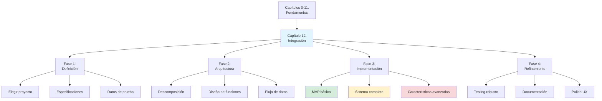

# Capítulo 12: Proyecto Final — Tu Panel de Control Personalizado

## Introducción: El Momento de la Verdad — De Aprendiz a Creador

Has recorrido un camino extraordinario. Empezaste sin saber qué era un algoritmo, y ahora dominas estructuras de datos, funciones, manejo de archivos y visualización. Has aprendido a pensar antes de codificar, a diseñar soluciones antes de escribir la primera línea. Pero sobre todo, has desarrollado la mentalidad de un programador: la capacidad de descomponer problemas complejos en pasos manejables y convertir ideas en código funcional.

Este capítulo final no es una lección más. Es tu examen de graduación autodirigido, tu oportunidad de demostrar todo lo aprendido creando algo significativo: un **Panel de Control Personalizado** que resuelva un problema real que te importe.

Piensa en este proyecto como la construcción de tu propia nave espacial. Ya conoces cómo funcionan los motores que son las funciones, el sistema de navegación que incluye condicionales y bucles, el almacenamiento de carga mediante estructuras de datos, y los instrumentos de medición a través de la visualización. Ahora vas a ensamblar todas estas piezas en una máquina completamente funcional que haga algo útil en tu vida real.

¿Por qué un panel de control? Porque es la interfaz perfecta entre datos y decisiones. Los pilotos usan paneles de control para monitorear el estado de sus aviones. Los ingenieros los usan para vigilar sistemas complejos. Los analistas los usan para convertir números en insights. Tú vas a crear el tuyo para cualquier cosa que te importe, desde tu progreso en videojuegos hasta tus hábitos de estudio, desde tus finanzas personales hasta tu entrenamiento deportivo.

Este capítulo es diferente. No te daré las respuestas paso a paso. Te daré el mapa, las herramientas y la brújula, pero tú trazarás tu propio camino. Esto no es un tutorial detallado, es una guía de arquitectura para que diseñes, construyas y perfecciones tu propio sistema desde cero.

> **💡 Objetivo del Capítulo:**
> Al finalizar este proyecto final, habrás integrado todos los conocimientos del libro en un sistema completo y funcional. Demostrarás tu capacidad para planificar arquitectura de software, implementar funcionalidades complejas integrando múltiples conceptos, crear visualizaciones que cuenten historias con datos, manejar errores y casos especiales de forma robusta, documentar código de manera profesional, y aplicar principios éticos de privacidad y transparencia. Este será tu portafolio tangible como programador.



## Fase 1: Exploración y Definición del Problema

Antes de escribir una sola línea de código, necesitas responder con total claridad: ¿qué problema vas a resolver?

### El Arte de Elegir un Buen Proyecto

No todos los proyectos son iguales. Un buen proyecto final debe cumplir estos criterios fundamentales.

El proyecto debe tener **relevancia personal**, debe importarte genuinamente. Si el problema no te motiva, abandonarás a mitad de camino. Pregúntate si usarías esto realmente y si te ayudaría en tu día a día. Debe tener un **alcance realista**, lo suficientemente complejo para demostrar tus habilidades pero no tan ambicioso que te abrume. Recuerda la regla de oro de la ingeniería de software: si puedes construirlo en ocho a doce horas de trabajo enfocado, es el tamaño perfecto.

Necesitas **datos accesibles** para trabajar. Pueden ser datos que generes tú mismo registrando información diariamente, datos que ya tengas como calificaciones o gastos, o datos que puedas descargar de internet. Sin datos, no hay panel de control. Finalmente, debe permitir **visualización significativa**, los datos deben poder contarse como una historia visual. Piensa qué gráfico o comparación revelaría algo interesante o útil.

### Señales de Advertencia: Proyectos Problemáticos

Antes de comprometerte con una idea, verifica que no cumpla ninguna de estas señales de alerta. Si tu proyecto tiene dos o más de estas características, redefínelo antes de empezar.

**Alerta 1: Red Social Completa**

Un proyecto que intente crear una aplicación estilo Instagram, Twitter o TikTok con usuarios, posts, comentarios, likes, sistema de seguidores y notificaciones está destinado a fallar. Las redes sociales requieren bases de datos relacionales, autenticación, backend, frontend, hosting y otras tecnologías que no cubrimos en este libro. Es un proyecto de seis meses para un equipo profesional.

Una versión realista sería una galería personal de fotos, un sistema que lee una carpeta local de imágenes, las categoriza por fecha o etiquetas, y genera un álbum HTML con miniaturas y descripciones.

**Alerta 2: Predicción de Bolsa o Criptomonedas con IA**

Un sistema que prediga precios de acciones usando machine learning y genere recomendaciones de compra y venta automáticas falla porque la predicción financiera requiere machine learning avanzado, APIs de tiempo real con autenticación, comprensión profunda de mercados, y gestión de riesgo financiero real. Además, crear la ilusión de que puedes predecir mercados es éticamente problemático.

Una versión realista sería un rastreador de portafolio personal que registra tus compras de acciones ficticias, calcula rendimiento histórico comparando con valores reales descargados, y visualiza diversificación.

**Alerta 3: Juego Multijugador 3D**

Un videojuego con gráficos tridimensionales, múltiples jugadores conectados en red, sistema de niveles, inventario, combate y economía virtual falla porque el desarrollo de juegos serio requiere engines especializados como Unity o Unreal, programación gráfica, networking y física, ninguna de las cuales cubrimos.

Una versión realista sería un juego de trivia basado en texto que carga preguntas desde CSV, las presenta aleatoriamente, lleva puntaje, categoriza dificultad, y genera un leaderboard local.

**Alerta 4: Datos que No Existen**

Un proyecto para analizar patrones de consumo de streaming de tu familia cuando nadie en tu familia usa servicios de streaming ni tienes acceso a datos falla porque sin datos reales, terminarás inventando datos ficticios que no revelan nada interesante. El proyecto se convierte en un ejercicio vacío de generación de números aleatorios.

Una versión realista primero investiga qué datos puedes obtener realmente, como tus calificaciones escolares, historial de gastos en efectivo, tiempo de uso de celular con Screen Time, o libros que posees, y luego diseña el proyecto alrededor de datos accesibles.

**Alerta 5: Requiere Quince Funciones Diferentes**

Un sistema de gestión escolar completo con módulos para estudiantes, profesores, horarios, calificaciones, asistencia, biblioteca, cafetería, transporte, pagos y comunicación padres-escuela falla porque si tu lista de funcionalidades tiene más de cinco ítems principales, el alcance es demasiado amplio para ocho a treinta horas de trabajo. Terminarás con todo a medias y nada funcionando realmente bien.

Una versión realista se enfoca en un módulo bien hecho, como un rastreador de calificaciones personales que registra solo tu desempeño académico, calculando promedios por materia, visualizando evolución temporal, e identificando materias que necesitan más estudio.

> **📝 La Regla de Oro del Alcance:**
> Si puedes explicar tu proyecto completo en una oración de menos de veinte palabras, probablemente tiene el alcance correcto.
>
> Ejemplo correcto: "Sistema que registra gastos diarios, los categoriza automáticamente, y visualiza en qué gasto más."
>
> Ejemplo sobreambicioso: "Plataforma integral de finanzas personales con presupuestos, inversiones, metas de ahorro, alertas, sincronización bancaria, recomendaciones con IA, compartir con familia, y exportación a contabilidad profesional."

### 📋 Menú de Proyectos Sugeridos

Elige uno que te apasione o mezcla ideas:

| Categoría | 💡 Idea del Proyecto | 📊 Datos Necesarios | 📈 Visualización Clave |
|-----------|----------------------|---------------------|------------------------|
| **Gestión Personal** | **Rastreador de Hábitos** | Check diario (Sí/No) de ejercicio, lectura, agua. | Mapa de calor (Heatmap) de consistencia mensual. |
| **Finanzas** | **Control de Gastos** | Fecha, monto, categoría (comida, transporte), descripción. | Gráfico de torta: ¿En qué gasto más dinero? |
| **Entretenimiento** | **Biblioteca Gamer** | Videojuego, horas jugadas, puntaje personal, género. | Barras: Horas jugadas por género de juego. |
| **Salud** | **Diario de Sueño** | Hora de dormir, hora de despertar, calidad (1-5). | Línea: Evolución de horas de sueño vs Calidad. |
| **Estudios** | **Optimizador de Notas** | Materia, nota examen, peso (%), fecha. | Línea: Tendencia de notas por materia. |

### Tu Documento de Especificaciones: El Plano de Construcción

Una vez elegido tu proyecto, necesitas crear un documento de diseño antes de escribir código. Este documento funciona como el plano de construcción de tu sistema y te guiará durante todo el desarrollo.

Usa este template para tu documento de especificaciones. Comienza con el **nombre del proyecto** y una descripción en una o dos oraciones explicando qué hace y por qué es útil. Define el **problema que resuelve**, describiendo la situación actual sin tu sistema y cómo mejorará con él. Identifica a tu **usuario objetivo**, explicando quién usará esto y en qué contexto lo usarán.

Lista los **datos necesarios** especificando el origen de los datos (¿los generarás?, ¿ya los tienes?, ¿los descargarás?), el formato de almacenamiento (¿CSV?, ¿JSON?, ¿TXT?), y los campos o columnas exactos que necesitas, incluyendo el tipo de dato de cada uno.

Define las **funcionalidades principales**, no más de cinco características centrales que el sistema debe tener. Para cada una, describe brevemente qué hace y cómo ayuda al usuario. Describe tus **visualizaciones planeadas**, explicando qué gráficos crearás y qué historia contará cada uno (evolución temporal, comparación de categorías, distribución, correlaciones).

Finalmente, define tu **criterio de éxito** con al menos tres tests específicos que te dirán si el proyecto está completo y funcionando correctamente. Cada test debe especificar un escenario y el resultado esperado.

**Ejemplo Completo Resuelto:**

Aquí tienes un ejemplo completamente desarrollado para que veas cómo se ve un documento de especificaciones sólido.

```
PROYECTO: Control de Hábitos de Lectura

1. PROBLEMA QUE RESUELVE:
   Quiero leer más libros, pero pierdo la motivación fácilmente. Necesito 
   visualizar mi progreso para mantenerme comprometido y descubrir patrones 
   en mis hábitos de lectura que me ayuden a leer de forma más constante.

2. USUARIO OBJETIVO:
   Yo mismo, un lector que quiere desarrollar el hábito de lectura constante
   y entender qué factores afectan mi rendimiento de lectura.

3. DATOS NECESARIOS:
   - Origen: Registro manual diario en archivo CSV que actualizaré cada noche
   - Formato: CSV con las columnas fecha, libro, páginas_leídas, tiempo_minutos, estado_ánimo
   - Campos específicos:
     * fecha (string en formato YYYY-MM-DD, ej: "2025-01-15")
     * libro (string, nombre del libro, ej: "El Señor de los Anillos")
     * páginas_leídas (entero positivo, ej: 45)
     * tiempo_minutos (entero positivo, tiempo de sesión, ej: 60)
     * estado_ánimo (string con tres valores posibles: "motivado", "neutral", "cansado")
   
4. FUNCIONALIDADES PRINCIPALES:
   - Agregar nueva sesión de lectura: formulario simple que valide datos y los añada al CSV
   - Calcular estadísticas: promedio de páginas por día, promedio de tiempo por día, total acumulado
   - Identificar libro favorito: detectar en qué libro he avanzado más páginas
   - Detectar mejor racha: encontrar la secuencia más larga de días consecutivos leyendo
   - Mostrar progreso de libros: listar libros en proceso con porcentaje completado

5. VISUALIZACIONES PLANIFICADAS:
   - Gráfico de barras: Páginas leídas por día en los últimos treinta días para ver patrones semanales
   - Gráfico circular: Distribución de tiempo total entre diferentes libros para ver preferencias
   - Gráfico de línea: Tendencia de páginas por semana a lo largo del tiempo para ver mejora
   - Gráfico de dispersión: Relación entre estado de ánimo y páginas leídas para entender motivación

6. CRITERIOS DE ÉXITO:
   - Test 1: Si registro cinco sesiones de lectura con páginas 45, 38, 52, 41, 49 el sistema 
     debe calcular correctamente el promedio de cuarenta y cinco páginas por día
   - Test 2: Si leo tres días seguidos (15-16-17), luego salto un día y leo dos más (19-20), 
     el sistema debe identificar que mi mejor racha es tres días consecutivos
   - Test 3: Los cuatro gráficos se generan sin errores y son legibles cuando tengo al menos 
     dos semanas de datos registrados (mínimo catorce registros en el CSV)
   - Test 4: Si intento agregar una sesión con fecha inválida o páginas negativas, el sistema
     debe rechazarla con un mensaje de error claro y no corromper el archivo CSV
```

Este ejemplo muestra el nivel de detalle que necesitas antes de empezar a programar. Cada elemento está específicamente definido, no hay ambigüedades sobre qué construirás ni cómo sabrás que funciona.

## Fase 2: Arquitectura del Sistema

Ahora que sabes qué construirás, necesitas planear cómo lo construirás. Esta es la fase de diseño arquitectónico donde descompondrás tu sistema en componentes manejables.

### Descomposición en Componentes: El Principio de Responsabilidad Única

Todo sistema complejo se construye ensamblando piezas más simples. Tu panel de control debe organizarse en módulos donde cada módulo tiene una responsabilidad claramente definida.

El **módulo de gestión de datos** maneja toda la persistencia e incluye funciones para cargar datos desde CSV verificando que el archivo existe, guardar nuevos datos en CSV sin corromper información existente, validar formato de datos antes de guardarlos, y manejar errores de lectura y escritura con mensajes útiles.

El **módulo de procesamiento** transforma datos crudos en información útil con funciones para calcular estadísticas como promedios, totales, máximos y mínimos, filtrar datos por criterios específicos como rango de fechas o categorías, ordenar y categorizar información de formas útiles, y detectar patrones o tendencias en series temporales.

El **módulo de visualización** crea gráficos profesionales usando Matplotlib con funciones para generar gráficos de líneas, barras, dispersión o circulares según sea apropiado, personalizar colores, títulos y etiquetas para comunicación clara, crear paneles con múltiples subplots para análisis completo, y exportar gráficos como imágenes de alta resolución.

El **módulo de interfaz** maneja toda la interacción con el usuario mediante funciones para mostrar menús de opciones organizados lógicamente, capturar y validar entrada del usuario antes de procesarla, mostrar resultados formateados de forma legible y profesional, y proporcionar mensajes de error útiles que expliquen qué salió mal.

El **módulo de utilidades** contiene funciones auxiliares para tareas comunes como formatear fechas en diferentes formatos, validar tipos de datos y convertir cuando sea necesario, generar reportes de texto formateados, y cualquier otra función de soporte que uses en múltiples lugares.

Finalmente, el **programa principal** orquesta todo integrando los módulos anteriores, implementando el flujo principal del programa con un bucle de menú, coordinando llamadas entre componentes, y manejando el ciclo de vida de la aplicación desde inicio hasta cierre.

```mermaid
graph TD
    A[Programa Principal] --> B[Gestión de Datos]
    A --> C[Procesamiento]
    A --> D[Visualización]
    A --> E[Interfaz Usuario]
    A --> F[Utilidades]
    
    B --> B1[cargar_datos_csv]
    B --> B2[guardar_datos_csv]
    B --> B3[validar_registro]
    
    C --> C1[calcular_estadisticas]
    C --> C2[filtrar_datos]
    C --> C3[detectar_patrones]
    
    D --> D1[crear_grafico_barras]
    D --> D2[crear_grafico_lineas]
    D --> D3[generar_panel_completo]
    
    E --> E1[mostrar_menu]
    E --> E2[capturar_entrada]
    E --> E3[mostrar_resultados]
    
    F --> F1[formatear_fecha]
    F --> F2[validar_numero]
    F --> F3[generar_reporte_texto]
    
    style A fill:#e1f5ff
    style B fill:#d4edda
    style C fill:#d4edda
    style D fill:#d4edda
    style E fill:#d4edda
    style F fill:#d4edda
```



### Diseño de Funciones: Definiendo Interfaces Antes del Código

Para cada componente, diseña las funciones específicas que necesitarás. No escribas el código todavía, solo define las interfaces: nombre de la función, qué parámetros recibe, qué retorna, y qué casos especiales maneja.

Este es el template profesional para diseñar interfaces de funciones. Cada función debe tener un nombre descriptivo que explique qué hace, una lista clara de parámetros con sus tipos, una especificación de qué retorna incluyendo el tipo, y documentación de comportamiento especial o casos edge.

**Template de Diseño de Función:**

```python
def nombre_descriptivo_de_la_accion(parametros_necesarios):
    """
    Descripción clara de QUÉ hace la función (no cómo lo hace).
    
    Esta función resuelve [problema específico] y es útil cuando
    [contexto de uso]. Maneja [casos especiales importantes].
    
    Args:
        parametro1 (tipo): Descripción de qué representa y restricciones
        parametro2 (tipo): Descripción de qué representa y restricciones
    
    Returns:
        tipo: Descripción de qué devuelve y formato exacto
        None: Si ocurre [condición específica]
    
    Raises:
        TipoError: Si [condición que causa este error]
    
    Example:
        >>> resultado = nombre_funcion(valor1, valor2)
        >>> print(resultado)
        Salida esperada con formato exacto
    
    Notes:
        - Consideración especial 1
        - Consideración especial 2
    """
    pass  # La implementación vendrá después
```

Veamos ejemplos concretos aplicados al proyecto de hábitos de lectura.

**Ejemplo 1: Función de Carga de Datos**

```python
def cargar_datos_desde_csv(nombre_archivo):
    """
    Carga datos desde un archivo CSV y los retorna como lista de diccionarios.
    
    Esta función es el punto de entrada para todos los datos del sistema.
    Maneja casos como archivo no existente, archivo vacío, y datos mal
    formateados, retornando siempre una lista (puede estar vacía) para
    que el resto del código pueda trabajar sin preocuparse por None.
    
    Args:
        nombre_archivo (str): Ruta relativa o absoluta al archivo CSV.
                             Ejemplo: 'datos_lectura.csv' o '/ruta/completa/datos.csv'
    
    Returns:
        list: Lista de diccionarios donde cada diccionario representa una fila.
              Las claves son los nombres de las columnas del CSV.
              Retorna lista vacía [] si hay cualquier problema con el archivo.
    
    Example:
        >>> datos = cargar_datos_desde_csv('lectura.csv')
        >>> if datos:
        ...     print(f"Cargados {len(datos)} registros")
        ... else:
        ...     print("No hay datos disponibles")
        Cargados 15 registros
    
    Notes:
        - Si el archivo no existe, imprime advertencia y retorna []
        - Si el CSV está vacío, imprime advertencia y retorna []
        - Convierte automáticamente tipos numéricos (strings "45" → int 45)
        - Normaliza nombres de columnas (quita espacios, minúsculas)
    """
    pass

def validar_formato_fecha(fecha_string):
    """
    Verifica que una fecha tenga formato ISO válido (YYYY-MM-DD).
    
    Esta validación es crítica antes de guardar datos para mantener
    consistencia en el archivo CSV y permitir ordenamiento cronológico.
    
    Args:
        fecha_string (str): Fecha a validar, esperada en formato 'YYYY-MM-DD'
    
    Returns:
        bool: True si la fecha es válida y está en formato correcto.
              False si el formato es incorrecto o la fecha no existe.
    
    Example:
        >>> validar_formato_fecha('2025-01-15')
        True
        >>> validar_formato_fecha('15/01/2025')
        False
        >>> validar_formato_fecha('2025-02-30')  # 30 de febrero no existe
        False
    """
    pass

def agregar_nuevo_registro(datos_nuevos, nombre_archivo):
    """
    Añade un nuevo registro al CSV existente sin sobrescribir datos previos.
    
    Esta función es más segura que reescribir todo el archivo porque
    solo añade al final, reduciendo el riesgo de pérdida de datos si
    algo falla durante la operación.
    
    Args:
        datos_nuevos (dict): Diccionario con las claves que coinciden con
                            las columnas del CSV. Ejemplo:
                            {'fecha': '2025-01-15', 'libro': 'El Quijote',
                             'paginas_leidas': 45, 'tiempo_minutos': 60,
                             'estado_animo': 'motivado'}
        nombre_archivo (str): Ruta al archivo CSV donde añadir el registro
    
    Returns:
        bool: True si el registro se guardó exitosamente.
              False si hubo algún error durante el guardado.
    
    Raises:
        ValueError: Si datos_nuevos está vacío o falta alguna columna requerida
    
    Example:
        >>> nuevo = {'fecha': '2025-01-15', 'libro': 'El Quijote',
        ...          'paginas_leidas': 45, 'tiempo_minutos': 60,
        ...          'estado_animo': 'motivado'}
        >>> exito = agregar_nuevo_registro(nuevo, 'lectura.csv')
        >>> if exito:
        ...     print("Registro añadido correctamente")
        Registro añadido correctamente
    
    Notes:
        - Valida que todas las columnas requeridas estén presentes
        - Crea el archivo CSV automáticamente si no existe
        - Usa modo append para no sobrescribir datos existentes
    """
    pass
```

**Ejemplo 2: Funciones de Análisis**

```python
def calcular_promedio_campo(datos, nombre_campo):
    """
    Calcula el promedio de un campo numérico en un conjunto de datos.
    
    Esta función es útil para obtener métricas como páginas promedio por día
    o tiempo promedio de sesión. Maneja robustamente casos edge como datos
    vacíos o campos con valores no numéricos, permitiendo que el código
    que la llama no tenga que preocuparse por validaciones exhaustivas.
    
    Args:
        datos (list): Lista de diccionarios, cada uno representa un registro.
                     Ejemplo: [{'paginas_leidas': 45}, {'paginas_leidas': 38}]
        nombre_campo (str): Nombre exacto del campo a promediar.
                           Debe existir en los diccionarios como clave.
                           Ejemplo: 'paginas_leidas' o 'tiempo_minutos'
    
    Returns:
        float: Promedio calculado, redondeado a dos decimales para legibilidad.
               Retorna 0.0 si no hay datos válidos para promediar.
    
    Example:
        >>> datos = [
        ...     {'libro': 'Libro A', 'paginas_leidas': 45},
        ...     {'libro': 'Libro B', 'paginas_leidas': 38},
        ...     {'libro': 'Libro C', 'paginas_leidas': 52}
        ... ]
        >>> promedio = calcular_promedio_campo(datos, 'paginas_leidas')
        >>> print(f"Promedio: {promedio} páginas")
        Promedio: 45.0 páginas
    
    Notes:
        - Ignora silenciosamente valores no numéricos en vez de fallar
        - Si todos los valores son no numéricos, retorna 0.0
        - Si la lista está vacía, retorna 0.0 (no genera error)
        - Si el campo no existe en ningún registro, retorna 0.0
    """
    pass

def encontrar_mejor_racha(lista_fechas):
    """
    Identifica la secuencia más larga de días consecutivos con actividad.
    
    Esta función analiza una lista de fechas y encuentra cuántos días
    seguidos hubo actividad sin interrupciones. Es útil para motivación
    personal mostrando: "Tu mejor racha fue de 7 días seguidos".
    
    Args:
        lista_fechas (list): Lista de strings en formato 'YYYY-MM-DD'.
                            No necesita estar ordenada, la función se encarga.
                            Ejemplo: ['2025-01-15', '2025-01-16', '2025-01-18']
    
    Returns:
        int: Número máximo de días consecutivos encontrados.
             Retorna 0 si la lista está vacía.
             Retorna 1 si solo hay fechas aisladas sin secuencias.
    
    Example:
        >>> fechas = ['2025-01-01', '2025-01-02', '2025-01-04', '2025-01-05']
        >>> racha = encontrar_mejor_racha(fechas)
        >>> print(f"Mejor racha: {racha} días")
        Mejor racha: 2 días
        
        >>> # Explicación: La racha más larga fue 01-01 y 01-02 (dos días seguidos)
        >>> # El día 03 falta, así que se reinicia la cuenta
        >>> # Luego hay otra racha de dos días: 04 y 05
        >>> # La función retorna el máximo: 2
    
    Notes:
        - Ordena automáticamente las fechas antes de analizar
        - Ignora fechas duplicadas (las cuenta como un solo día)
        - Si hay fechas con formato inválido, las ignora silenciosamente
    """
    pass

def obtener_totales_por_categoria(datos, campo_categoria, campo_valor):
    """
    Suma valores agrupándolos por categoría para análisis comparativo.
    
    Esta función es perfecta para preguntas como "¿En qué libro he
    leído más páginas en total?" o "¿Cuánto tiempo dedico a cada género?".
    
    Args:
        datos (list): Lista de diccionarios con los datos completos
        campo_categoria (str): Nombre del campo usado para agrupar.
                              Ejemplo: 'libro' para agrupar por libro
        campo_valor (str): Nombre del campo numérico a sumar.
                          Ejemplo: 'paginas_leidas' para total de páginas
    
    Returns:
        dict: Diccionario donde las claves son las categorías únicas y
              los valores son las sumas totales. Ordenado de mayor a menor.
              Ejemplo: {'El Quijote': 340, '1984': 220, 'Cien Años': 180}
    
    Example:
        >>> datos = [
        ...     {'libro': 'El Quijote', 'paginas_leidas': 45},
        ...     {'libro': '1984', 'paginas_leidas': 30},
        ...     {'libro': 'El Quijote', 'paginas_leidas': 52}
        ... ]
        >>> totales = obtener_totales_por_categoria(datos, 'libro', 'paginas_leidas')
        >>> for libro, total in totales.items():
        ...     print(f"{libro}: {total} páginas")
        El Quijote: 97 páginas
        1984: 30 páginas
    
    Notes:
        - Retorna diccionario vacío si no hay datos válidos
        - Ignora registros donde falta la categoría o el valor
        - El resultado está ordenado de mayor a menor por total
    """
    pass
```

**Ejemplo 3: Funciones de Visualización**

```python
def crear_grafico_barras(datos, campo_x, campo_y, titulo, color='steelblue'):
    """
    Genera gráfico de barras profesional para comparar categorías.
    
    Este tipo de gráfico es ideal para responder "¿Qué día leí más?" o
    "¿Qué libro consumió más tiempo?". Las barras permiten comparación
    visual instantánea entre diferentes valores.
    
    Args:
        datos (list): Lista de diccionarios con los datos a graficar
        campo_x (str): Campo para el eje X (categorías).
                      Ejemplo: 'fecha' o 'libro'
        campo_y (str): Campo para el eje Y (valores numéricos).
                      Ejemplo: 'paginas_leidas' o 'tiempo_minutos'
        titulo (str): Título descriptivo del gráfico.
                     Ejemplo: 'Páginas Leídas por Día - Enero 2025'
        color (str): Color de las barras, puede ser nombre o código hex.
                    Default: 'steelblue'
    
    Returns:
        None: Muestra el gráfico en pantalla
    
    Side Effects:
        - Crea ventana de Matplotlib con el gráfico
        - Guarda automáticamente imagen en carpeta 'visualizaciones/'
          con nombre basado en el título
    
    Example:
        >>> datos = [
        ...     {'fecha': '2025-01-15', 'paginas_leidas': 45},
        ...     {'fecha': '2025-01-16', 'paginas_leidas': 38}
        ... ]
        >>> crear_grafico_barras(datos, 'fecha', 'paginas_leidas',
        ...                      'Mi Progreso Semanal')
        ✓ Gráfico guardado en: visualizaciones/mi_progreso_semanal.png
    
    Notes:
        - Añade automáticamente etiquetas de eje con formato legible
        - Incluye grid horizontal sutil para facilitar lectura de valores
        - Ajusta tamaño de figura según cantidad de datos
        - Si campo_x contiene fechas, las formatea automáticamente
    """
    pass

def crear_grafico_lineas(datos, campo_x, campo_y, titulo, color='darkblue'):
    """
    Genera gráfico de líneas para mostrar tendencias temporales.
    
    Las líneas son perfectas para ver evolución: "¿Estoy leyendo más
    con el tiempo?" o "¿Mi velocidad de lectura mejora?". Revelan
    patrones que serían invisibles en tablas de números.
    
    Args:
        datos (list): Lista de diccionarios ordenados cronológicamente
        campo_x (str): Campo para eje X, usualmente fechas o tiempo
        campo_y (str): Campo numérico para eje Y (lo que queremos ver evolucionar)
        titulo (str): Título que explica qué tendencia muestra
        color (str): Color de la línea, default 'darkblue'
    
    Returns:
        None: Muestra el gráfico con la tendencia
    
    Example:
        >>> # Datos de promedio semanal de páginas
        >>> datos_semanales = [
        ...     {'semana': 1, 'promedio': 42},
        ...     {'semana': 2, 'promedio': 48},
        ...     {'semana': 3, 'promedio': 55}
        ... ]
        >>> crear_grafico_lineas(datos_semanales, 'semana', 'promedio',
        ...                      'Evolución de mi Velocidad de Lectura')
    
    Notes:
        - Añade marcadores en cada punto de dato para facilitar lectura
        - Incluye línea de tendencia punteada si hay más de 5 puntos
        - Formatea automáticamente fechas si campo_x es temporal
        - Destaca puntos máximo y mínimo con anotaciones
    """
    pass

def generar_panel_completo(datos):
    """
    Crea dashboard con múltiples visualizaciones en un solo panel.
    
    Esta es la función estrella que integra todo el análisis en una
    vista comprehensiva. Muestra cuatro gráficos simultáneos que cuentan
    la historia completa de los datos: volumen, distribución, tendencia
    y correlaciones.
    
    Args:
        datos (list): Lista completa de diccionarios con todos los registros
    
    Returns:
        None: Muestra panel completo y lo guarda como imagen
    
    Example:
        >>> datos_completos = cargar_datos_desde_csv('lectura.csv')
        >>> if len(datos_completos) >= 14:  # Mínimo dos semanas
        ...     generar_panel_completo(datos_completos)
        ... else:
        ...     print("Necesitas al menos 14 días de datos para el panel")
        ✓ Panel generado con 4 visualizaciones
        ✓ Guardado en: visualizaciones/panel_completo_2025-01-15.png
    
    Layout del Panel:
        ┌─────────────────┬─────────────────┐
        │ Barras:         │ Circular:       │
        │ Páginas/día     │ Distribución    │
        │ (últimos 30)    │ por libro       │
        ├─────────────────┼─────────────────┤
        │ Línea:          │ Dispersión:     │
        │ Tendencia       │ Ánimo vs        │
        │ semanal         │ páginas         │
        └─────────────────┴─────────────────┘
    
    Notes:
        - Requiere mínimo 14 registros para generar visualizaciones significativas
        - Cada subplot incluye título y estadística relevante
        - Usa esquema de colores coherente en todo el panel
        - Optimiza automáticamente tamaño de figura (12x10 inches)
    """
    pass
```

**Ejemplo 4: Funciones de Interfaz**

```python
def mostrar_menu_principal():
    """
    Despliega menú de opciones del panel de control.
    
    La interfaz es la primera impresión del usuario. Este menú debe ser
    claro, organizado y facilitar la navegación sin confusión.
    
    Returns:
        None: Imprime el menú en consola con formato profesional
    
    Example Output:
        ==================================================
              PANEL DE CONTROL - HÁBITOS DE LECTURA
        ==================================================
        1. Agregar nueva sesión de lectura
        2. Ver estadísticas generales
        3. Mostrar gráficos de progreso
        4. Analizar mejor racha de lectura
        5. Exportar reporte completo
        0. Salir
        ==================================================
    
    Notes:
        - Usa emojis sutiles para mejorar legibilidad
        - Numera desde 1 (más intuitivo que empezar en 0)
        - Opción de salir siempre es 0 (convención estándar)
        - Longitud de línea divisoria ajustada para legibilidad
    """
    pass

def capturar_entrada_validada(mensaje, tipo_esperado, min_valor=None, max_valor=None):
    """
    Captura input del usuario con validación automática y reintentos.
    
    Esta función elimina la necesidad de escribir try-except y validaciones
    repetidas en cada punto donde pides entrada al usuario. Maneja el ciclo
    completo de pedir, validar y reintentar si es necesario.
    
    Args:
        mensaje (str): Prompt que se mostrará al usuario.
                      Ejemplo: "Ingresa las páginas leídas: "
        tipo_esperado (type): El tipo de dato esperado (int, float, str).
                             La función convertirá automáticamente el input.
        min_valor (int/float): Valor mínimo aceptable (opcional).
                              Ejemplo: min_valor=0 para rechazar negativos
        max_valor (int/float): Valor máximo aceptable (opcional).
                              Ejemplo: max_valor=1000 para páginas razonables
    
    Returns:
        Valor del tipo especificado, garantizado dentro de los rangos válidos
    
    Example:
        >>> paginas = capturar_entrada_validada(
        ...     "¿Cuántas páginas leíste? ",
        ...     int,
        ...     min_valor=1,
        ...     max_valor=500
        ... )
        ¿Cuántas páginas leíste? -10
        ❌ Error: El valor debe estar entre 1 y 500. Intenta de nuevo.
        ¿Cuántas páginas leíste? abc
        ❌ Error: Debes ingresar un número entero. Intenta de nuevo.
        ¿Cuántas páginas leíste? 45
        >>> print(paginas)
        45
    
    Notes:
        - Bucle infinito hasta obtener entrada válida
        - Mensajes de error específicos según tipo de problema
        - Permite al usuario cancelar con 'salir' o 'cancelar'
        - Trim automático de espacios en blanco
    """
    pass

def mostrar_resultados_formateados(titulo, datos_dict, unidad=""):
    """
    Presenta resultados de forma visual y organizada.
    
    En vez de prints dispersos, esta función crea presentaciones
    consistentes y profesionales de cualquier conjunto de resultados.
    
    Args:
        titulo (str): Encabezado de la sección de resultados.
                     Ejemplo: "ESTADÍSTICAS GENERALES"
        datos_dict (dict): Diccionario con resultados a mostrar.
                          Claves son las etiquetas, valores son los datos.
                          Ejemplo: {'Promedio páginas/día': 45.3,
                                   'Total libros': 3}
        unidad (str): Unidad opcional para añadir a valores numéricos.
                     Ejemplo: "páginas", "minutos", "libros"
    
    Returns:
        None: Imprime resultados con formato de tabla
    
    Example:
        >>> resultados = {
        ...     'Promedio páginas/día': 45.3,
        ...     'Promedio tiempo/día': 62.5,
        ...     'Total de sesiones': 28,
        ...     'Mejor racha': 7
        ... }
        >>> mostrar_resultados_formateados(
        ...     "TUS ESTADÍSTICAS", resultados, "páginas/minutos"
        ... )
        
        ════════════════════════════════════════
           TUS ESTADÍSTICAS
        ════════════════════════════════════════
        Promedio páginas/día ........... 45.30
        Promedio tiempo/día ............ 62.50
        Total de sesiones .............. 28
        Mejor racha .................... 7 días
        ════════════════════════════════════════
    
    Notes:
        - Alinea valores automáticamente para legibilidad
        - Formatea números con dos decimales si son float
        - Ajusta ancho de columna según texto más largo
        - Usa caracteres unicode para marcos elegantes
    """
    pass
```

Este inventario completo de funciones diseñadas te da una arquitectura sólida antes de escribir una sola línea de implementación. Cada función tiene un propósito claro, parámetros bien definidos, y comportamiento especificado. Ahora cuando empieces a implementar, sabrás exactamente qué debe hacer cada función y cómo encaja en el sistema completo.

## Fase 3: Implementación Incremental por Niveles

### 📂 Organizando tu Espacio de Trabajo

Antes de empezar, crea una carpeta para tu proyecto y organízala así para mantener el orden profesional:

```text
📁 MiProyectoFinal/
│
├── 📄 main.py              # Tu código principal (Nivel 1, 2, 3)
├── 📄 datos.csv            # Tu archivo de datos (¡Crea uno de prueba!)
├── 📄 README.txt           # Instrucciones de tu proyecto
│
└── 📁 visualizaciones/     # Carpeta vacía donde se guardarán los gráficos
    └── (aquí aparecerán tus imágenes .png)
```

Regla de Oro: Mantén tu código (.py) y tus datos (.csv) en la misma carpeta raíz al principio para evitar problemas de rutas.


**Por qué agregarlo:** Previene el error #1 de los principiantes (rutas de archivos) antes de que ocurra y enseña higiene de proyecto.

No intentes construir todo de una vez. La clave del éxito es un enfoque incremental donde cada nivel agrega funcionalidad sobre el anterior. Cada nivel es un proyecto completo y funcional, solo que el siguiente añade más capacidades.

### Nivel 1: Producto Mínimo Viable (MVP)

El objetivo del MVP es crear la versión más simple que demuestre que tu idea funciona. Deberías poder construir esto en cuatro a seis horas de trabajo enfocado.

**Funcionalidades del Nivel 1:**

Tu sistema debe poder cargar datos desde un archivo CSV existente usando una función básica de carga sin manejo sofisticado de errores todavía. Calcula al menos una estadística simple sobre los datos como un promedio general, un total acumulado, o un conteo básico. Genera un gráfico básico mostrando los datos sin preocuparte todavía por personalización estética detallada. Implementa un menú simple con tres opciones fundamentales: ver datos cargados, ver la estadística calculada, generar el gráfico, y salir del programa.

El código debe ejecutarse de principio a fin sin errores fatales. Los mensajes de error pueden ser simples por ahora, pero el programa no debe crashear abruptamente dejando al usuario confundido.

**Implementación Completa del MVP:**

Aquí tienes un ejemplo completamente funcional del MVP para el proyecto de hábitos de lectura. Este código demuestra exactamente qué significa un MVP: funcional pero básico.

```python
# ============================================
# PROYECTO: Control de Hábitos de Lectura - MVP
# VERSIÓN: 1.0 (Mínimo Viable)
# ============================================

import pandas as pd
import matplotlib.pyplot as plt

# === CONFIGURACIÓN ===
ARCHIVO_DATOS = 'datos_lectura.csv'

# === FUNCIÓN 1: Cargar Datos ===
def cargar_datos():
    """Carga datos desde CSV, retorna DataFrame."""
    try:
        df = pd.read_csv(ARCHIVO_DATOS)
        print(f"✓ Datos cargados: {len(df)} registros")
        return df
    except FileNotFoundError:
        print(f"❌ No se encontró el archivo '{ARCHIVO_DATOS}'")
        return pd.DataFrame()  # DataFrame vacío

# === FUNCIÓN 2: Calcular Estadística Básica ===
def calcular_promedio_paginas(df):
    """Calcula y muestra promedio de páginas leídas."""
    if df.empty:
        print("No hay datos para analizar")
        return 0
    
    promedio = df['paginas_leidas'].mean()
    print(f"\n📊 Promedio de páginas por día: {promedio:.1f}")
    return promedio

# === FUNCIÓN 3: Generar Gráfico Básico ===
def generar_grafico_barras(df):
    """Crea gráfico de barras simple."""
    if df.empty:
        print("No hay datos para graficar")
        return
    
    plt.figure(figsize=(10, 6))
    plt.bar(df['fecha'], df['paginas_leidas'])
    plt.title('Páginas Leídas por Día')
    plt.xlabel('Fecha')
    plt.ylabel('Páginas')
    plt.xticks(rotation=45)
    plt.tight_layout()
    plt.show()
    print("✓ Gráfico generado")

# === FUNCIÓN 4: Menú Simple ===
def mostrar_menu():
    """Muestra opciones disponibles."""
    print("\n" + "="*40)
    print("  PANEL DE LECTURA - Versión MVP")
    print("="*40)
    print("1. Ver datos cargados")
    print("2. Calcular promedio de páginas")
    print("3. Generar gráfico")
    print("0. Salir")
    print("="*40)

# === PROGRAMA PRINCIPAL ===
def ejecutar_mvp():
    """Función principal que coordina el MVP."""
    print("🚀 Iniciando Panel de Lectura MVP...")
    
    # Cargar datos al inicio
    datos = cargar_datos()
    
    if datos.empty:
        print("❌ No hay datos para trabajar. Programa terminado.")
        return
    
    # Bucle del menú
    while True:
        mostrar_menu()
        opcion = input("\n👉 Elige opción (0-3): ").strip()
        
        if opcion == "1":
            print("\n--- DATOS CARGADOS ---")
            print(datos.head(10))  # Muestra primeras 10 filas
            
        elif opcion == "2":
            calcular_promedio_paginas(datos)
            
        elif opcion == "3":
            generar_grafico_barras(datos)
            
        elif opcion == "0":
            print("\n👋 ¡Hasta luego!")
            break
            
        else:
            print("❌ Opción no válida")

# === PUNTO DE ENTRADA ===
if __name__ == "__main__":
    ejecutar_mvp()
```

**Criterio de Éxito del MVP:**

Tu programa ejecuta de principio a fin sin errores fatales cuando hay un CSV válido. Puedes demostrarle a alguien la funcionalidad básica en menos de dos minutos. El código tiene docstrings básicos en cada función explicando qué hace. Los datos se cargan correctamente desde el CSV y aparecen cuando seleccionas la opción uno. El gráfico se genera y muestra correctamente cuando seleccionas la opción tres. El promedio calculado es matemáticamente correcto cuando lo verificas manualmente.

**Checkpoint del MVP:**

Antes de avanzar al Nivel 2, verifica estos puntos. Si el programa carga el CSV y muestra al menos algunos registros sin error, marca el primer check. Si el promedio calculado coincide con lo que obtendrías sumando manualmente y dividiendo, marca el segundo. Si el gráfico aparece con barras que representan tus datos correctamente, marca el tercero. Si puedes navegar el menú completo sin que el programa crashee, marca el cuarto.

Si marcaste los cuatro checks, felicitaciones, tu MVP está completo y eres oficialmente capaz de construir un sistema funcional desde cero. Si falla alguno, no avances todavía. Dedica tiempo a debuggear ese componente específico hasta que funcione perfectamente. Un MVP sólido es la base para todo lo demás.

### Nivel 2: Sistema Completo y Robusto

Ahora expandes el MVP con funcionalidades completas y manejo robusto de errores. Deberías invertir seis a diez horas adicionales en este nivel para transformar tu prototipo en un sistema realmente utilizable.

**Ampliación de Funcionalidades:**

Implementa gestión completa de datos permitiendo no solo cargar, sino también agregar nuevos registros mediante un formulario validado, editar registros existentes seleccionándolos por fecha o identificador, y eliminar registros con confirmación de seguridad. Todos los cambios deben persistir correctamente en el CSV sin corromper datos existentes.

Amplía las estadísticas para incluir múltiples cálculos como promedio y mediana para entender distribución, máximo y mínimo para identificar extremos, desviación estándar si quieres medir consistencia, y totales por categoría como por libro o por mes. Cada estadística debe presentarse con contexto que explique qué significa.

Crea al menos tres visualizaciones diferentes usando distintos tipos de gráficos. Un gráfico de líneas para tendencias temporales mostrando evolución de páginas por semana. Un gráfico de barras para comparaciones como páginas por día en el último mes. Un gráfico circular para distribución como porcentaje de tiempo dedicado a cada libro. Organiza estas visualizaciones en un panel usando subplots para mostrarlas simultáneamente.

Mejora sustancialmente la interfaz de usuario con un menú organizado en categorías lógicas agrupando funciones relacionadas. Añade confirmaciones para acciones destructivas como eliminar datos preguntando si está seguro antes de ejecutar. Incluye mensajes informativos durante operaciones largas como procesando datos o generando visualizaciones. Aplica formato consistente y profesional en toda la salida con alineación de columnas y uso coherente de símbolos.

**Robustez y Validación:**

Implementa manejo completo de errores usando try-except para operaciones que pueden fallar. Maneja archivos no encontrados indicando dónde debería estar el archivo. Captura datos en formato incorrecto explicando qué formato se esperaba. Detecta valores fuera de rango esperado como páginas negativas o fechas futuras. Gestiona operaciones sobre datos vacíos sin crashear el programa.

Valida toda entrada del usuario antes de procesarla. Verifica tipos de datos correctos convirtiendo strings a números cuando sea necesario. Confirma rangos válidos rechazando valores imposibles como mil páginas en una sesión. Valida formatos esperados especialmente para fechas que deben ser YYYY-MM-DD.

Proporciona mensajes de error claros y útiles que expliquen exactamente qué salió mal, cómo el usuario puede corregir el problema, y qué acción tomar a continuación. Nunca muestres códigos crípticos ni stack traces completos que confundan al usuario.

**Implementación del Nivel 2:**

Aquí está el código expandido con todas las mejoras del Nivel 2. Este es sustancialmente más robusto que el MVP.

```python
# ============================================
# PROYECTO: Control de Hábitos de Lectura - v2.0
# VERSIÓN: 2.0 (Sistema Completo)
# ============================================

import pandas as pd
import matplotlib.pyplot as plt
from datetime import datetime
import os

# === CONFIGURACIÓN ===
ARCHIVO_DATOS = 'datos_lectura.csv'
CARPETA_VISUALIZACIONES = 'visualizaciones'

# Crear carpeta para gráficos si no existe
if not os.path.exists(CARPETA_VISUALIZACIONES):
    os.makedirs(CARPETA_VISUALIZACIONES)

# === MÓDULO: GESTIÓN DE DATOS ===

def cargar_datos_robusto():
    """
    Carga datos con manejo robusto de errores.
    
    Returns:
        DataFrame con datos o DataFrame vacío si hay problemas
    """
    try:
        if not os.path.exists(ARCHIVO_DATOS):
            print(f"⚠️ Archivo '{ARCHIVO_DATOS}' no existe. Creando nuevo...")
            crear_archivo_vacio()
            return pd.DataFrame(columns=['fecha', 'libro', 'paginas_leidas', 
                                        'tiempo_minutos', 'estado_animo'])
        
        df = pd.read_csv(ARCHIVO_DATOS)
        
        # Validar que tenga las columnas esperadas
        columnas_requeridas = ['fecha', 'libro', 'paginas_leidas', 'tiempo_minutos', 'estado_animo']
        if not all(col in df.columns for col in columnas_requeridas):
            print(f"❌ El archivo no tiene el formato correcto")
            print(f"   Columnas esperadas: {columnas_requeridas}")
            return pd.DataFrame(columns=columnas_requeridas)
        
        # Convertir tipos de datos
        df['paginas_leidas'] = pd.to_numeric(df['paginas_leidas'], errors='coerce')
        df['tiempo_minutos'] = pd.to_numeric(df['tiempo_minutos'], errors='coerce')
        
        # Eliminar filas con valores inválidos
        df = df.dropna(subset=['paginas_leidas', 'tiempo_minutos'])
        
        print(f"✓ Datos cargados: {len(df)} registros válidos")
        return df
        
    except Exception as e:
        print(f"❌ Error inesperado al cargar datos: {e}")
        return pd.DataFrame(columns=['fecha', 'libro', 'paginas_leidas', 
                                    'tiempo_minutos', 'estado_animo'])

def crear_archivo_vacio():
    """Crea archivo CSV con encabezados si no existe."""
    df = pd.DataFrame(columns=['fecha', 'libro', 'paginas_leidas', 
                               'tiempo_minutos', 'estado_animo'])
    df.to_csv(ARCHIVO_DATOS, index=False)
    print(f"✓ Archivo '{ARCHIVO_DATOS}' creado con encabezados")

def validar_fecha(fecha_str):
    """
    Valida que fecha esté en formato YYYY-MM-DD y sea válida.
    
    Returns:
        tuple: (es_valida: bool, mensaje_error: str)
    """
    try:
        fecha = datetime.strptime(fecha_str, '%Y-%m-%d')
        
        # Verificar que no sea fecha futura
        if fecha > datetime.now():
            return False, "La fecha no puede ser futura"
        
        # Verificar que no sea demasiado antigua (más de 2 años)
        if fecha.year < datetime.now().year - 2:
            return False, "La fecha es demasiado antigua (máximo 2 años atrás)"
        
        return True, ""
        
    except ValueError:
        return False, "Formato inválido. Usa YYYY-MM-DD (ejemplo: 2025-01-15)"

def agregar_sesion_interactiva(df):
    """
    Captura datos de nueva sesión con validación completa.
    
    Returns:
        DataFrame actualizado con nuevo registro
    """
    print("\n" + "="*50)
    print("  AGREGAR NUEVA SESIÓN DE LECTURA")
    print("="*50)
    
    # Capturar fecha con validación
    while True:
        fecha = input("\nFecha (YYYY-MM-DD): ").strip()
        es_valida, mensaje = validar_fecha(fecha)
        if es_valida:
            break
        print(f"❌ {mensaje}")
    
    # Capturar libro
    libro = input("Libro: ").strip()
    while not libro:
        print("❌ El nombre del libro no puede estar vacío")
        libro = input("Libro: ").strip()
    
    # Capturar páginas con validación
    while True:
        try:
            paginas = int(input("Páginas leídas: "))
            if 1 <= paginas <= 500:
                break
            print("❌ Las páginas deben estar entre 1 y 500")
        except ValueError:
            print("❌ Debes ingresar un número entero")
    
    # Capturar tiempo con validación
    while True:
        try:
            tiempo = int(input("Tiempo (minutos): "))
            if 1 <= tiempo <= 300:
                break
            print("❌ El tiempo debe estar entre 1 y 300 minutos")
        except ValueError:
            print("❌ Debes ingresar un número entero")
    
    # Capturar estado de ánimo con opciones
    estados_validos = ['motivado', 'neutral', 'cansado']
    print(f"\nEstado de ánimo ({'/'.join(estados_validos)})")
    while True:
        estado = input("Estado: ").strip().lower()
        if estado in estados_validos:
            break
        print(f"❌ Debe ser: {', '.join(estados_validos)}")
    
    # Crear nuevo registro
    nuevo_registro = {
        'fecha': fecha,
        'libro': libro,
        'paginas_leidas': paginas,
        'tiempo_minutos': tiempo,
        'estado_animo': estado
    }
    
    # Añadir al DataFrame
    df = pd.concat([df, pd.DataFrame([nuevo_registro])], ignore_index=True)
    
    # Guardar en CSV
    df.to_csv(ARCHIVO_DATOS, index=False)
    
    print("\n✅ Sesión agregada exitosamente")
    return df

# === MÓDULO: ANÁLISIS ===

def calcular_estadisticas_completas(df):
    """
    Calcula y muestra conjunto completo de estadísticas.
    """
    if df.empty:
        print("⚠️ No hay datos para analizar")
        return
    
    print("\n" + "="*50)
    print("  ESTADÍSTICAS GENERALES")
    print("="*50)
    
    # Estadísticas de páginas
    print("\n📖 PÁGINAS:")
    print(f"  Promedio por día: {df['paginas_leidas'].mean():.1f}")
    print(f"  Mediana: {df['paginas_leidas'].median():.1f}")
    print(f"  Máximo en un día: {df['paginas_leidas'].max()}")
    print(f"  Mínimo en un día: {df['paginas_leidas'].min()}")
    print(f"  Total acumulado: {df['paginas_leidas'].sum()}")
    
    # Estadísticas de tiempo
    print("\n⏱️  TIEMPO:")
    print(f"  Promedio por día: {df['tiempo_minutos'].mean():.1f} minutos")
    print(f"  Total acumulado: {df['tiempo_minutos'].sum()} minutos")
    print(f"  Horas totales: {df['tiempo_minutos'].sum() / 60:.1f}")
    
    # Estadísticas por libro
    print("\n📚 POR LIBRO:")
    libros = df.groupby('libro').agg({
        'paginas_leidas': 'sum',
        'tiempo_minutos': 'sum'
    }).sort_values('paginas_leidas', ascending=False)
    
    for libro, datos in libros.iterrows():
        print(f"  {libro}:")
        print(f"    - Páginas: {datos['paginas_leidas']}")
        print(f"    - Tiempo: {datos['tiempo_minutos']} min")
    
    # Estadísticas de consistencia
    print("\n🔥 CONSISTENCIA:")
    total_dias = len(df)
    print(f"  Total de sesiones: {total_dias}")
    
    # Calcular racha más larga
    df_sorted = df.sort_values('fecha')
    fechas = pd.to_datetime(df_sorted['fecha'])
    rachas = []
    racha_actual = 1
    
    for i in range(1, len(fechas)):
        dias_diferencia = (fechas.iloc[i] - fechas.iloc[i-1]).days
        if dias_diferencia == 1:
            racha_actual += 1
        else:
            rachas.append(racha_actual)
            racha_actual = 1
    rachas.append(racha_actual)
    
    mejor_racha = max(rachas) if rachas else 1
    print(f"  Mejor racha: {mejor_racha} días consecutivos")

# === MÓDULO: VISUALIZACIÓN ===

def generar_panel_visualizaciones(df):
    """
    Crea panel con 4 visualizaciones diferentes.
    """
    if len(df) < 5:
        print("⚠️ Necesitas al menos 5 registros para generar visualizaciones significativas")
        return
    
    print("\n📊 Generando visualizaciones...")
    
    fig, ((ax1, ax2), (ax3, ax4)) = plt.subplots(2, 2, figsize=(15, 10))
    fig.suptitle('Panel Completo de Análisis de Lectura', fontsize=16, fontweight='bold')
    
    # Gráfico 1: Barras - Páginas por día
    df_sorted = df.sort_values('fecha').tail(20)  # Últimos 20 días
    ax1.bar(range(len(df_sorted)), df_sorted['paginas_leidas'], color='steelblue')
    ax1.set_title('Páginas Leídas (Últimos 20 Días)')
    ax1.set_xlabel('Día')
    ax1.set_ylabel('Páginas')
    ax1.grid(axis='y', alpha=0.3)
    
    # Gráfico 2: Circular - Distribución por libro
    libros_total = df.groupby('libro')['paginas_leidas'].sum()
    ax2.pie(libros_total, labels=libros_total.index, autopct='%1.1f%%', startangle=90)
    ax2.set_title('Distribución de Páginas por Libro')
    
    # Gráfico 3: Línea - Tendencia semanal
    df['fecha_dt'] = pd.to_datetime(df['fecha'])
    df_weekly = df.set_index('fecha_dt').resample('W')['paginas_leidas'].sum()
    ax3.plot(df_weekly.index, df_weekly.values, marker='o', linewidth=2, color='darkgreen')
    ax3.set_title('Tendencia Semanal de Páginas')
    ax3.set_xlabel('Semana')
    ax3.set_ylabel('Total Páginas')
    ax3.grid(True, alpha=0.3)
    ax3.tick_params(axis='x', rotation=45)
    
    # Gráfico 4: Dispersión - Estado vs Páginas
    estados_map = {'motivado': 3, 'neutral': 2, 'cansado': 1}
    df['estado_num'] = df['estado_animo'].map(estados_map)
    colores = df['estado_animo'].map({'motivado': 'green', 'neutral': 'blue', 'cansado': 'red'})
    ax4.scatter(df['estado_num'], df['paginas_leidas'], c=colores, s=100, alpha=0.6)
    ax4.set_title('Estado de Ánimo vs Páginas Leídas')
    ax4.set_xlabel('Estado (1=Cansado, 2=Neutral, 3=Motivado)')
    ax4.set_ylabel('Páginas')
    ax4.set_xticks([1, 2, 3])
    ax4.set_xticklabels(['Cansado', 'Neutral', 'Motivado'])
    ax4.grid(True, alpha=0.3)
    
    plt.tight_layout()
    
    # Guardar imagen
    nombre_archivo = f"panel_completo_{datetime.now().strftime('%Y-%m-%d')}.png"
    ruta_completa = os.path.join(CARPETA_VISUALIZACIONES, nombre_archivo)
    plt.savefig(ruta_completa, dpi=300, bbox_inches='tight')
    print(f"✓ Panel guardado en: {ruta_completa}")
    
    plt.show()

# === MÓDULO: INTERFAZ ===

def mostrar_menu_completo():
    """Menú organizado del sistema completo."""
    print("\n" + "="*50)
    print("     PANEL DE CONTROL - HÁBITOS DE LECTURA v2.0")
    print("="*50)
    print("\n📊 ANÁLISIS:")
    print("  1. Ver estadísticas completas")
    print("  2. Generar panel de visualizaciones")
    print("\n✏️  GESTIÓN DE DATOS:")
    print("  3. Agregar nueva sesión")
    print("  4. Ver últimos 10 registros")
    print("\n⚙️  SISTEMA:")
    print("  5. Exportar reporte completo")
    print("  0. Salir")
    print("="*50)

def exportar_reporte_texto(df):
    """Genera reporte de texto con resumen completo."""
    if df.empty:
        print("⚠️ No hay datos para exportar")
        return
    
    nombre_reporte = f"reporte_{datetime.now().strftime('%Y-%m-%d_%H-%M')}.txt"
    
    with open(nombre_reporte, 'w', encoding='utf-8') as f:
        f.write("="*60 + "\n")
        f.write("  REPORTE DE HÁBITOS DE LECTURA\n")
        f.write("="*60 + "\n")
        f.write(f"Generado: {datetime.now().strftime('%Y-%m-%d %H:%M')}\n")
        f.write(f"Total de registros: {len(df)}\n\n")
        
        f.write("ESTADÍSTICAS GENERALES:\n")
        f.write("-" * 40 + "\n")
        f.write(f"Promedio páginas/día: {df['paginas_leidas'].mean():.1f}\n")
        f.write(f"Total páginas leídas: {df['paginas_leidas'].sum()}\n")
        f.write(f"Total tiempo: {df['tiempo_minutos'].sum() / 60:.1f} horas\n\n")
        
        f.write("POR LIBRO:\n")
        f.write("-" * 40 + "\n")
        libros = df.groupby('libro')['paginas_leidas'].sum().sort_values(ascending=False)
        for libro, paginas in libros.items():
            f.write(f"{libro}: {paginas} páginas\n")
    
    print(f"✓ Reporte exportado: {nombre_reporte}")

# === PROGRAMA PRINCIPAL ===

def ejecutar_sistema_completo():
    """Función principal del sistema v2.0."""
    print("🚀 Iniciando Sistema de Lectura v2.0...")
    
    datos = cargar_datos_robusto()
    
    while True:
        mostrar_menu_completo()
        opcion = input("\n👉 Elige opción (0-5): ").strip()
        
        if opcion == "1":
            calcular_estadisticas_completas(datos)
            
        elif opcion == "2":
            generar_panel_visualizaciones(datos)
            
        elif opcion == "3":
            datos = agregar_sesion_interactiva(datos)
            
        elif opcion == "4":
            print("\n--- ÚLTIMOS 10 REGISTROS ---")
            if not datos.empty:
                print(datos.tail(10).to_string(index=False))
            else:
                print("No hay registros")
            
        elif opcion == "5":
            exportar_reporte_texto(datos)
            
        elif opcion == "0":
            print("\n👋 ¡Excelente trabajo! Sigue leyendo y creciendo.")
            break
            
        else:
            print("❌ Opción no válida. Intenta de nuevo.")
        
        input("\nPresiona Enter para continuar...")

# === PUNTO DE ENTRADA ===
if __name__ == "__main__":
    ejecutar_sistema_completo()
```

**Criterio de Éxito del Nivel 2:**

El sistema maneja elegantemente todos los casos de error comunes sin crashear. Puedes procesar múltiples conjuntos de datos diferentes sin problemas de formato. Las visualizaciones en el panel son claras y están bien etiquetadas mostrando información útil. Un usuario nuevo puede entender cómo usar el sistema navegando el menú sin tu ayuda. El código está bien organizado con funciones modulares cada una haciendo una cosa específica. Los mensajes de error son claros y útiles indicando exactamente qué está mal y cómo arreglarlo. Puedes agregar, ver y analizar datos en una sesión completa sin problemas.

Si cumples todos estos criterios, tu sistema ha alcanzado el estándar de Nivel 2 y ya es algo que podrías usar realmente en tu vida diaria. Es robusto, completo y funcional.

### 🧠 Concepto Clave: ¿Qué es una "Anomalía"?

Para que tu programa sepa qué es "raro", usamos la **Desviación Estándar**. Imagina que tus sesiones de lectura normales son así:

```text
Páginas leídas: 10  20  45  50  55  60  90
                    |_______|_______|
                        Zona Normal
```

- Promedio (Media): 50 páginas.
- Desviación: Digamos que normalmente varías +/- 15 páginas.
- Anomalía: El día que leíste 10 (muy poco) o 90 (muchísimo) está fuera de tu "Zona Normal".

### Nivel 3: Características Avanzadas y Pulido Profesional

Este nivel transforma tu proyecto de "funciona bien" a "es impresionante". Aquí es donde añades las características que hacen que otros programadores digan "wow, esto está muy bien hecho". Invierte de ocho a catorce horas adicionales para alcanzar este nivel de pulido profesional.

**Características Avanzadas del Nivel 3:**

Implementa un sistema de alertas inteligentes que detecte automáticamente patrones interesantes en tus datos. Las alertas de tendencias comparan períodos recientes contra períodos anteriores, por ejemplo comparando las últimas dos semanas contra las dos semanas previas para detectar mejoras o caídas significativas. Las alertas de anomalías identifican días donde tu comportamiento fue inusual, días donde leíste tres veces más de lo normal o sesiones excepcionalmente largas. Las alertas de metas permiten que definas objetivos personales y el sistema te notifica automáticamente del progreso hacia esas metas.

Añade capacidades de exportación avanzada permitiendo generar reportes en formato PDF con gráficos integrados usando bibliotecas como ReportLab. Permite exportar gráficos en alta resolución con opciones de tamaño y formato. Crea resúmenes ejecutivos automáticos que destaquen los hallazgos más importantes en lenguaje natural. Implementa funcionalidad para compartir visualizaciones directamente por email o redes sociales si es relevante para tu proyecto.

Implementa análisis comparativo temporal que compare automáticamente este mes contra el mes anterior calculando porcentajes de cambio. Compara tu mejor mes históricamente contra tu desempeño actual. Identifica automáticamente tus mejores y peores períodos con explicaciones de qué los hizo especiales. Calcula tasas de crecimiento mostrando si estás mejorando de forma consistente o si hay fluctuaciones.

Añade filtrado y búsqueda avanzada que permita filtrar datos por múltiples criterios simultáneos, por ejemplo mostrar solo sesiones de un libro específico en un rango de fechas cuando estabas motivado. Implementa búsqueda por texto en campos específicos para encontrar rápidamente registros. Permite guardar combinaciones de filtros como favoritos para reutilizarlos fácilmente. Añade ordenamiento flexible por cualquier columna en orden ascendente o descendente.

Implementa configuración personalizable donde el usuario puede ajustar el sistema a sus preferencias. Permite elegir unidades de medida si tu proyecto maneja diferentes sistemas. Deja que seleccionen esquemas de color para los gráficos eligiendo entre paletas predefinidas. Permite definir umbrales personalizados para las alertas según sus objetivos específicos. Guarda todas estas preferencias entre sesiones en un archivo de configuración.

**Sistema de Alertas Inteligentes - Implementación Completa:**

El sistema de alertas es una de las características más impresionantes del Nivel 3. Aquí está la implementación completa que analiza tus datos y te notifica proactivamente de patrones importantes.

```python
# ============================================
# MÓDULO: SISTEMA DE ALERTAS INTELIGENTES
# ============================================

from datetime import datetime, timedelta
import pandas as pd
import numpy as np

class SistemaAlertas:
    """
    Sistema inteligente que analiza datos y genera alertas automáticas.
    
    Este sistema implementa tres tipos de alertas:
    1. Alertas de tendencias (comparación temporal)
    2. Alertas de anomalías (detección de valores atípicos)
    3. Alertas de metas (seguimiento de objetivos)
    """
    
    def __init__(self, df, metas_usuario=None):
        """
        Inicializa el sistema de alertas.
        
        Args:
            df (DataFrame): Datos completos del usuario
            metas_usuario (dict): Diccionario con metas definidas por el usuario
                                 Ejemplo: {'paginas_diarias': 50, 'dias_mes': 20}
        """
        self.df = df
        self.metas = metas_usuario or {}
        self.alertas_generadas = []
    
    def analizar_tendencias(self, periodo_dias=14):
        """
        Detecta tendencias comparando período reciente vs anterior.
        
        Esta función divide tus datos en dos períodos iguales y compara
        el rendimiento entre ellos. Si detecta cambios significativos
        (más del 15%), genera una alerta.
        
        Args:
            periodo_dias (int): Días a analizar en cada período (default: 14)
        
        Returns:
            list: Lista de alertas generadas
        """
        if len(self.df) < periodo_dias * 2:
            return []  # Necesitamos datos suficientes
        
        # Ordenar por fecha y obtener datos recientes
        df_sorted = self.df.sort_values('fecha')
        datos_recientes = df_sorted.tail(periodo_dias)
        datos_anteriores = df_sorted.tail(periodo_dias * 2).head(periodo_dias)
        
        # Calcular promedios de cada período
        promedio_reciente = datos_recientes['paginas_leidas'].mean()
        promedio_anterior = datos_anteriores['paginas_leidas'].mean()
        
        # Calcular cambio porcentual
        if promedio_anterior > 0:
            cambio_porcentual = ((promedio_reciente - promedio_anterior) / promedio_anterior) * 100
        else:
            cambio_porcentual = 0
        
        # Generar alerta si el cambio es significativo (>15%)
        if abs(cambio_porcentual) >= 15:
            tipo_cambio = "mejora" if cambio_porcentual > 0 else "disminución"
            emoji = "📈" if cambio_porcentual > 0 else "📉"
            
            alerta = {
                'tipo': 'tendencia',
                'severidad': 'media' if abs(cambio_porcentual) < 30 else 'alta',
                'titulo': f"{emoji} {tipo_cambio.capitalize()} en tu rendimiento",
                'mensaje': f"Tu promedio de páginas/día ha {'aumentado' if cambio_porcentual > 0 else 'disminuido'} "
                          f"un {abs(cambio_porcentual):.1f}% en los últimos {periodo_dias} días.\n"
                          f"Período anterior: {promedio_anterior:.1f} páginas/día\n"
                          f"Período reciente: {promedio_reciente:.1f} páginas/día",
                'sugerencia': self._generar_sugerencia_tendencia(cambio_porcentual)
            }
            
            self.alertas_generadas.append(alerta)
        
        return self.alertas_generadas
    
    def detectar_anomalias(self, desviaciones_std=2):
        """
        Identifica días donde el comportamiento fue inusual.
        
        Utiliza desviación estándar para encontrar valores que se alejan
        significativamente de tu promedio normal. Un valor es anómalo si
        está a más de 2 desviaciones estándar de la media.
        
        Args:
            desviaciones_std (float): Umbral de desviaciones estándar (default: 2)
        
        Returns:
            list: Lista de alertas de anomalías detectadas
        """
        if len(self.df) < 10:
            return []  # Necesitamos muestra suficiente
        
        # Calcular estadísticas
        media = self.df['paginas_leidas'].mean()
        std = self.df['paginas_leidas'].std()
        
        # Encontrar valores anómalos
        umbral_superior = media + (desviaciones_std * std)
        umbral_inferior = media - (desviaciones_std * std)
        
        anomalias_positivas = self.df[self.df['paginas_leidas'] > umbral_superior]
        anomalias_negativas = self.df[self.df['paginas_leidas'] < umbral_inferior]
        
        # Generar alertas para anomalías positivas (días excepcionales)
        for _, registro in anomalias_positivas.iterrows():
            veces_promedio = registro['paginas_leidas'] / media
            
            alerta = {
                'tipo': 'anomalia_positiva',
                'severidad': 'info',
                'titulo': f"🌟 Día excepcional detectado",
                'mensaje': f"El {registro['fecha']} leíste {registro['paginas_leidas']} páginas, "
                          f"¡{veces_promedio:.1f}x tu promedio normal de {media:.1f}!\n"
                          f"Libro: {registro['libro']}\n"
                          f"Estado: {registro['estado_animo']}",
                'sugerencia': f"Analiza qué hizo especial ese día. ¿Fue el libro? "
                             f"¿Tu estado de ánimo? Intenta replicar esas condiciones."
            }
            
            self.alertas_generadas.append(alerta)
        
        # Generar alertas para anomalías negativas (días de bajo rendimiento)
        for _, registro in anomalias_negativas.head(3).iterrows():  # Solo las 3 más bajas
            alerta = {
                'tipo': 'anomalia_negativa',
                'severidad': 'baja',
                'titulo': f"⚠️ Día de bajo rendimiento",
                'mensaje': f"El {registro['fecha']} solo leíste {registro['paginas_leidas']} páginas, "
                          f"significativamente menos que tu promedio de {media:.1f}.\n"
                          f"Estado ese día: {registro['estado_animo']}",
                'sugerencia': "No te preocupes, todos tenemos días lentos. Lo importante es la consistencia a largo plazo."
            }
            
            self.alertas_generadas.append(alerta)
        
        return self.alertas_generadas
    
    def verificar_metas(self):
        """
        Compara progreso actual contra metas definidas por el usuario.
        
        Las metas deben estar definidas en self.metas al inicializar.
        Ejemplo de metas:
        {
            'paginas_diarias': 50,  # Meta de páginas por día
            'dias_mes': 20,         # Meta de días leyendo por mes
            'libros_año': 24        # Meta de libros completados por año
        }
        
        Returns:
            list: Lista de alertas sobre progreso de metas
        """
        if not self.metas:
            return []
        
        # Verificar meta de páginas diarias
        if 'paginas_diarias' in self.metas:
            meta_paginas = self.metas['paginas_diarias']
            promedio_actual = self.df['paginas_leidas'].mean()
            porcentaje_meta = (promedio_actual / meta_paginas) * 100
            
            emoji = "🎯" if porcentaje_meta >= 100 else "📊"
            estado = "¡Superada!" if porcentaje_meta >= 100 else "En progreso"
            
            alerta = {
                'tipo': 'meta',
                'severidad': 'alta' if porcentaje_meta >= 100 else 'media',
                'titulo': f"{emoji} Meta de Páginas Diarias - {estado}",
                'mensaje': f"Meta: {meta_paginas} páginas/día\n"
                          f"Tu promedio actual: {promedio_actual:.1f} páginas/día\n"
                          f"Progreso: {porcentaje_meta:.1f}%",
                'sugerencia': self._generar_sugerencia_meta(porcentaje_meta, 'paginas')
            }
            
            self.alertas_generadas.append(alerta)
        
        # Verificar meta de días de lectura por mes
        if 'dias_mes' in self.metas:
            meta_dias = self.metas['dias_mes']
            
            # Calcular días únicos del mes actual
            df_mes_actual = self.df[pd.to_datetime(self.df['fecha']).dt.month == datetime.now().month]
            dias_leidos = len(df_mes_actual)
            porcentaje_meta = (dias_leidos / meta_dias) * 100
            
            emoji = "🔥" if porcentaje_meta >= 100 else "📅"
            
            alerta = {
                'tipo': 'meta',
                'severidad': 'media',
                'titulo': f"{emoji} Meta de Días de Lectura - Mes Actual",
                'mensaje': f"Meta: {meta_dias} días este mes\n"
                          f"Días leídos hasta ahora: {dias_leidos}\n"
                          f"Progreso: {porcentaje_meta:.1f}%\n"
                          f"Días restantes del mes: {self._dias_restantes_mes()}",
                'sugerencia': f"Necesitas leer {max(0, meta_dias - dias_leidos)} días más para cumplir tu meta."
            }
            
            self.alertas_generadas.append(alerta)
        
        return self.alertas_generadas
    
    def _generar_sugerencia_tendencia(self, cambio_porcentual):
        """Genera sugerencia personalizada según la tendencia."""
        if cambio_porcentual > 0:
            return "¡Excelente progreso! Mantén este ritmo y analiza qué cambió para continuar mejorando."
        else:
            return "Tu ritmo ha bajado. Revisa tu agenda: ¿Tienes menos tiempo libre? ¿Cambiaste de libro a uno menos atractivo?"
    
    def _generar_sugerencia_meta(self, porcentaje, tipo_meta):
        """Genera sugerencia personalizada según progreso de meta."""
        if porcentaje >= 100:
            return "¡Felicitaciones! Has superado tu meta. Considera aumentarla para seguir creciendo."
        elif porcentaje >= 80:
            return "Estás muy cerca. Un pequeño esfuerzo adicional y alcanzarás tu objetivo."
        elif porcentaje >= 50:
            return "Vas por buen camino. Mantén la consistencia para llegar a tu meta."
        else:
            return "Necesitas aumentar tu ritmo significativamente. Intenta sesiones más cortas pero más frecuentes."
    
    def _dias_restantes_mes(self):
        """Calcula días restantes del mes actual."""
        hoy = datetime.now()
        ultimo_dia = (hoy.replace(day=1) + timedelta(days=32)).replace(day=1) - timedelta(days=1)
        return (ultimo_dia - hoy).days + 1
    
    def generar_reporte_alertas(self):
        """
        Ejecuta todos los análisis y genera reporte completo de alertas.
        
        Este es el método principal que debes llamar para obtener todas
        las alertas disponibles en un formato organizado y legible.
        
        Returns:
            dict: Diccionario con alertas organizadas por tipo y prioridad
        """
        # Limpiar alertas previas
        self.alertas_generadas = []
        
        # Ejecutar todos los análisis
        self.analizar_tendencias()
        self.detectar_anomalias()
        self.verificar_metas()
        
        # Organizar alertas por severidad
        alertas_organizadas = {
            'alta': [a for a in self.alertas_generadas if a['severidad'] == 'alta'],
            'media': [a for a in self.alertas_generadas if a['severidad'] == 'media'],
            'baja': [a for a in self.alertas_generadas if a['severidad'] == 'baja'],
            'info': [a for a in self.alertas_generadas if a['severidad'] == 'info']
        }
        
        return alertas_organizadas
    
    def mostrar_alertas(self):
        """
        Muestra todas las alertas en consola con formato profesional.
        
        Este método presenta las alertas al usuario de forma clara y
        organizada, priorizando las más importantes primero.
        """
        alertas = self.generar_reporte_alertas()
        
        # Contar total de alertas
        total = sum(len(alertas[sev]) for sev in alertas)
        
        if total == 0:
            print("\n✅ No hay alertas en este momento. ¡Todo marcha bien!")
            return
        
        print("\n" + "="*60)
        print(f"  🔔 SISTEMA DE ALERTAS - {total} alertas detectadas")
        print("="*60)
        
        # Mostrar alertas de alta prioridad primero
        for severidad in ['alta', 'media', 'baja', 'info']:
            alertas_nivel = alertas[severidad]
            
            if not alertas_nivel:
                continue
            
            print(f"\n{'='*60}")
            print(f"  PRIORIDAD: {severidad.upper()}")
            print(f"{'='*60}")
            
            for i, alerta in enumerate(alertas_nivel, 1):
                print(f"\n{i}. {alerta['titulo']}")
                print("-" * 60)
                print(alerta['mensaje'])
                if 'sugerencia' in alerta:
                    print(f"\n💡 Sugerencia: {alerta['sugerencia']}")
                print()

# === INTEGRACIÓN CON EL SISTEMA PRINCIPAL ===

def menu_sistema_alertas(df):
    """
    Menú interactivo para el sistema de alertas.
    
    Permite al usuario configurar metas y ver alertas personalizadas.
    """
    print("\n" + "="*50)
    print("  SISTEMA DE ALERTAS INTELIGENTES")
    print("="*50)
    print("\n1. Ver alertas con configuración básica")
    print("2. Configurar metas personalizadas")
    print("3. Ver solo alertas de tendencias")
    print("4. Ver solo anomalías detectadas")
    print("0. Volver al menú principal")
    
    opcion = input("\n👉 Elige opción: ").strip()
    
    if opcion == "1":
        # Alertas con metas por defecto
        metas_defecto = {
            'paginas_diarias': 50,
            'dias_mes': 20
        }
        sistema = SistemaAlertas(df, metas_defecto)
        sistema.mostrar_alertas()
        
    elif opcion == "2":
        print("\n--- CONFIGURAR METAS PERSONALIZADAS ---")
        
        try:
            paginas = int(input("Meta de páginas por día: "))
            dias = int(input("Meta de días de lectura por mes: "))
            
            metas_personalizadas = {
                'paginas_diarias': paginas,
                'dias_mes': dias
            }
            
            sistema = SistemaAlertas(df, metas_personalizadas)
            sistema.mostrar_alertas()
            
        except ValueError:
            print("❌ Error: Debes ingresar números válidos")
    
    elif opcion == "3":
        sistema = SistemaAlertas(df)
        sistema.analizar_tendencias()
        
        if sistema.alertas_generadas:
            for alerta in sistema.alertas_generadas:
                print(f"\n{alerta['titulo']}")
                print(alerta['mensaje'])
        else:
            print("\n✅ No se detectaron cambios significativos en tus tendencias")
    
    elif opcion == "4":
        sistema = SistemaAlertas(df)
        sistema.detectar_anomalias()
        
        if sistema.alertas_generadas:
            for alerta in sistema.alertas_generadas:
                print(f"\n{alerta['titulo']}")
                print(alerta['mensaje'])
        else:
            print("\n✅ No se detectaron anomalías significativas")
```

Este sistema de alertas demuestra programación avanzada integrando análisis estadístico, detección de patrones, y presentación inteligente de información. Es exactamente el tipo de característica que hace que un proyecto destaque.

**Optimización y Rendimiento:**

Cuando tu sistema maneja cientos o miles de registros, el rendimiento se vuelve importante. Aquí están las técnicas de optimización que debes implementar en el Nivel 3.

Usa funciones de Pandas para análisis cuando trabajas con más de cien registros porque Pandas está optimizado en C y es mucho más rápido que loops de Python. Por ejemplo, en lugar de iterar manualmente para calcular promedios, usa los métodos vectorizados de Pandas como mean, sum y groupby que son órdenes de magnitud más rápidos.

Implementa caché para no recalcular estadísticas si los datos no han cambiado. Guarda el resultado de cálculos costosos y solo recalcula cuando detectes que los datos subyacentes fueron modificados. Esto es especialmente importante para visualizaciones complejas que toman varios segundos en generarse.

Añade opciones de filtrado avanzado por fechas, categorías y rangos que permitan al usuario trabajar con subconjuntos de datos relevantes en lugar de procesar siempre el conjunto completo. Esto mejora dramáticamente la velocidad percibida del sistema.

Mide el tiempo de ejecución de operaciones complejas para identificar cuellos de botella. Python incluye el módulo time que te permite medir cuánto tarda cada operación. Optimiza las operaciones más lentas primero porque aplicar la ley de Pareto significa que el ochenta por ciento de la mejora vendrá de optimizar el veinte por ciento del código más lento.

```python
import time

def medir_rendimiento(funcion, *args, **kwargs):
    """
    Mide tiempo de ejecución de una función.
    
    Útil para identificar qué partes de tu código son lentas
    y necesitan optimización.
    """
    inicio = time.time()
    resultado = funcion(*args, **kwargs)
    fin = time.time()
    
    tiempo_ms = (fin - inicio) * 1000
    print(f"⏱️  {funcion.__name__} tardó {tiempo_ms:.2f} ms")
    
    return resultado

# Ejemplo de uso:
# datos = medir_rendimiento(cargar_datos_robusto)
# estadisticas = medir_rendimiento(calcular_estadisticas_completas, datos)
```

**Documentación de Nivel Profesional:**

Un proyecto del Nivel 3 debe tener documentación completa que permita a cualquier persona entender, usar y modificar tu código. Crea un archivo README completo con estas secciones organizadas.

La sección de descripción explica qué hace tu proyecto en dos o tres oraciones y por qué alguien querría usarlo. La sección de características lista las funcionalidades principales con viñetas claras. La sección de instalación proporciona instrucciones paso a paso de cómo configurar el entorno y las dependencias necesarias.

La sección de uso incluye ejemplos de código mostrando cómo realizar las operaciones más comunes. La sección de ejemplos muestra capturas de pantalla o ejemplos de output para que usuarios potenciales vean qué esperar. La sección de troubleshooting documenta problemas comunes y sus soluciones.

Añade comentarios estilo developer notes explicando decisiones de arquitectura. Estos comentarios no explican qué hace el código línea por línea, sino por qué tomaste ciertas decisiones de diseño. Por ejemplo, explica por qué elegiste almacenar datos en CSV en lugar de JSON, o por qué decidiste usar Pandas en lugar de procesar archivos manualmente.

Documenta un changelog con todas las versiones y mejoras. Cada versión debe listar qué se añadió, qué se cambió, qué se arregló, y qué se removió. Esto es estándar en proyectos profesionales y demuestra que piensas en tu código como un producto que evoluciona.

Opcionalmente, crea un video o GIF demostrativo del panel en acción. Una demostración visual de treinta segundos puede ser más efectiva que páginas de documentación para mostrar las capacidades de tu sistema.

**Testing Riguroso del Nivel 3:**

El testing profesional va más allá de simplemente verificar que el código funciona. Implementa una suite de pruebas automatizada que verifique todas las funciones críticas. Para cada función importante, crea al menos tres tests: uno con datos normales, uno con casos extremos, y uno con datos inválidos.

Prueba casos edge exhaustivamente incluyendo datos vacíos para verificar que tu código no crashea cuando no hay registros, formatos incorrectos como fechas mal escritas o números con letras, y valores extremos como números negativos o cantidades imposiblemente grandes.

Documenta al menos cinco bugs importantes encontrados durante el desarrollo explicando qué causó cada bug, cómo lo detectaste, qué solución implementaste, y qué aprendiste que te ayudará a prevenir bugs similares en el futuro. Esta documentación de bugs es increíblemente valiosa para tu aprendizaje.

```python
def ejecutar_suite_pruebas(df):
    """
    Suite de pruebas automatizada para verificar funcionalidad crítica.
    
    Esta función ejecuta una serie de tests y reporta cuáles pasaron
    y cuáles fallaron, ayudándote a verificar que todo funciona correctamente.
    """
    print("\n" + "="*60)
    print("  🧪 EJECUTANDO SUITE DE PRUEBAS")
    print("="*60 + "\n")
    
    tests_pasados = 0
    tests_totales = 0
    
    # Test 1: Validación de fechas
    tests_totales += 1
    try:
        from datetime import datetime
        fecha_valida = '2025-01-15'
        fecha_invalida = '15/01/2025'
        
        # Debería aceptar formato ISO
        es_valida, _ = validar_fecha(fecha_valida)
        assert es_valida, "Debería aceptar fecha en formato ISO"
        
        # Debería rechazar otros formatos
        es_valida, _ = validar_fecha(fecha_invalida)
        assert not es_valida, "Debería rechazar formato incorrecto"
        
        print("✅ Test 1: Validación de fechas - PASADO")
        tests_pasados += 1
    except Exception as e:
        print(f"❌ Test 1: Validación de fechas - FALLADO: {e}")
    
    # Test 2: Cálculo de promedios
    tests_totales += 1
    try:
        datos_prueba = pd.DataFrame({
            'paginas_leidas': [40, 50, 60],
            'tiempo_minutos': [50, 60, 70]
        })
        
        promedio = datos_prueba['paginas_leidas'].mean()
        assert promedio == 50, f"Promedio debería ser 50, obtuvo {promedio}"
        
        print("✅ Test 2: Cálculo de promedios - PASADO")
        tests_pasados += 1
    except Exception as e:
        print(f"❌ Test 2: Cálculo de promedios - FALLADO: {e}")
    
    # Test 3: Manejo de datos vacíos
    tests_totales += 1
    try:
        df_vacio = pd.DataFrame()
        
        # No debería crashear con DataFrame vacío
        calcular_estadisticas_completas(df_vacio)
        
        print("✅ Test 3: Manejo de datos vacíos - PASADO")
        tests_pasados += 1
    except Exception as e:
        print(f"❌ Test 3: Manejo de datos vacíos - FALLADO: {e}")
    
    # Test 4: Detección de anomalías
    tests_totales += 1
    try:
        # Crear datos con valor claramente anómalo
        datos_anomalia = pd.DataFrame({
            'fecha': ['2025-01-01', '2025-01-02', '2025-01-03'],
            'paginas_leidas': [40, 45, 200],  # 200 es claramente anómalo
            'libro': ['Libro A', 'Libro A', 'Libro A'],
            'tiempo_minutos': [50, 55, 180],
            'estado_animo': ['neutral', 'neutral', 'motivado']
        })
        
        sistema = SistemaAlertas(datos_anomalia)
        sistema.detectar_anomalias(desviaciones_std=1.5)
        
        # Debería haber detectado al menos una anomalía
        assert len(sistema.alertas_generadas) > 0, "Debería detectar anomalías"
        
        print("✅ Test 4: Detección de anomalías - PASADO")
        tests_pasados += 1
    except Exception as e:
        print(f"❌ Test 4: Detección de anomalías - FALLADO: {e}")
    
    # Test 5: Persistencia de datos
    tests_totales += 1
    try:
        # Crear datos de prueba
        datos_test = pd.DataFrame({
            'fecha': ['2025-01-15'],
            'libro': ['Test Book'],
            'paginas_leidas': [42],
            'tiempo_minutos': [60],
            'estado_animo': ['neutral']
        })
        
        # Guardar
        archivo_test = 'test_temporal.csv'
        datos_test.to_csv(archivo_test, index=False)
        
        # Leer de nuevo
        datos_leidos = pd.read_csv(archivo_test)
        
        # Verificar que los datos sean los mismos
        assert len(datos_leidos) == 1, "Debería tener un registro"
        assert datos_leidos.iloc[0]['libro'] == 'Test Book', "Datos no coinciden"
        
        # Limpiar archivo de prueba
        import os
        os.remove(archivo_test)
        
        print("✅ Test 5: Persistencia de datos - PASADO")
        tests_pasados += 1
    except Exception as e:
        print(f"❌ Test 5: Persistencia de datos - FALLADO: {e}")
    
    # Reporte final
    print("\n" + "="*60)
    print(f"  RESULTADOS: {tests_pasados}/{tests_totales} tests pasaron")
    porcentaje = (tests_pasados / tests_totales) * 100
    print(f"  Tasa de éxito: {porcentaje:.1f}%")
    print("="*60 + "\n")
    
    if tests_pasados == tests_totales:
        print("🎉 ¡Excelente! Todos los tests pasaron.")
    elif tests_pasados >= tests_totales * 0.8:
        print("👍 Buen trabajo. Revisa los tests que fallaron.")
    else:
        print("⚠️  Hay problemas significativos. Revisa tu código cuidadosamente.")
```

**Criterio de Éxito del Nivel 3:**

El sistema procesa automáticamente más de cien registros sin ralentizarse notablemente y las operaciones complejas se completan en menos de dos segundos. Las alertas inteligentes realmente detectan patrones significativos en tus datos y te proporcionan información accionable que no habías notado antes. Puedes exportar un reporte completo profesional en menos de cinco clicks y el resultado es algo que podrías presentar oficialmente.

El código está tan bien documentado que podrías dejarlo seis meses sin tocarlo y cuando regreses, entenderías inmediatamente qué hace cada parte y por qué. Cada función tiene docstrings completos, los archivos tienen comentarios explicativos al inicio, y las decisiones de arquitectura están documentadas.

Has compartido tu proyecto con al menos una persona, ya sea un compañero de clase, un amigo, o alguien en un foro de programación, y recibiste feedback positivo sobre su funcionalidad y presentación. La interfaz es lo suficientemente intuitiva que alguien sin experiencia técnica puede usarla con mínima explicación.

Tu suite de pruebas automatizada pasa consistentemente verificando que todas las funciones críticas funcionan correctamente. Has documentado bugs encontrados y sus soluciones, demostrando que aprendiste del proceso de debugging. El sistema maneja graciosamente casos edge sin crashear.

Tu panel es tan profesional que podrías incluirlo en un portafolio para solicitar trabajo o prácticas, publicarlo en GitHub esperando que otros lo encuentren útil y lo descarguen, presentarlo en un club de programación o evento técnico estudiantil, o adaptarlo para resolver problemas similares de otras personas con modificaciones mínimas.

Si cumples estos criterios, has alcanzado un nivel de programación que muchos estudiantes universitarios no alcanzan hasta su segundo o tercer año. Has demostrado no solo competencia técnica sino también pensamiento sistemático, atención al detalle, y capacidad de crear soluciones completas.

## Fase 4: Debugging Avanzado y Mejores Prácticas

El debugging no es solo encontrar errores, es una habilidad de pensamiento crítico que separa programadores principiantes de programadores profesionales. En esta fase aprenderás técnicas avanzadas de debugging y mejores prácticas que aplicarás por el resto de tu carrera.

### El Bug del Archivo Fantasma: Caso de Estudio Completo

Este es uno de los errores más frustrantes y comunes que encuentran los principiantes. Veamos el problema completo, por qué ocurre, y cómo resolverlo de forma profesional.

**Síntoma:** Tu código explota con el error FileNotFoundError indicando que el archivo no existe en el sistema, específicamente errno 2 no such file or directory seguido del nombre de tu archivo. Pero tú estás absolutamente seguro de que el archivo existe porque lo ves en tu carpeta de descargas, incluso lo puedes abrir con Excel o cualquier editor de texto, y el nombre está escrito correctamente en tu código.

**Por Qué Ocurre Este Bug:**

Python no busca archivos en todo tu computador como lo haría un humano. Python solo busca en la carpeta de trabajo actual, que es la carpeta desde donde se ejecuta tu script. Es como si le dijeras a un robot tráeme el libro sin especificar en qué habitación de la casa está. El robot solo miraría en la habitación donde está parado.

El escenario típico de este problema es el siguiente. Tu estructura de carpetas tiene una carpeta Documentos que contiene dos subcarpetas: descargas donde vive tu archivo mi_archivo.csv y mis_programas donde se ejecuta tu código analizar.py. Cuando tu código hace open con el nombre mi_archivo.csv, Python busca en la carpeta mis_programas no en descargas, por eso no lo encuentra aunque exista.

**La Solución Profesional con Tres Pasos:**

Primero, verifica la carpeta de trabajo actual de Python para entender dónde está buscando realmente.

```python
import os

print("Python está trabajando en:", os.getcwd())
print("Archivos en esta carpeta:", os.listdir())
```

Este código te muestra exactamente dónde Python está ejecutándose y qué archivos puede ver desde ahí. La función getcwd significa get current working directory y te da la ruta completa.

Segundo, verifica programáticamente si el archivo existe donde crees que debería estar antes de intentar abrirlo.

```python
nombre_archivo = 'mi_archivo.csv'

if os.path.exists(nombre_archivo):
    print(f"✅ Archivo '{nombre_archivo}' encontrado")
    print(f"   Ubicación completa: {os.path.abspath(nombre_archivo)}")
else:
    print(f"❌ Archivo '{nombre_archivo}' NO encontrado")
    print(f"   Python está buscando en: {os.getcwd()}")
    print(f"   Archivos disponibles aquí:")
    for archivo in os.listdir():
        print(f"     - {archivo}")
```

Este código no solo verifica la existencia sino que te da información diagnóstica completa para entender el problema. Te muestra dónde está buscando Python y qué archivos hay realmente disponibles ahí.

Tercero, tienes tres opciones para resolver el problema dependiendo de tu situación. Opción A es mover el archivo CSV a la carpeta donde Python está ejecutándose, esta es la solución más simple si tienes control sobre tus archivos. Opción B es usar la ruta completa absoluta del archivo en tu código, por ejemplo open con la ruta completa C:/Users/tuusuario/Documents/descargas/mi_archivo.csv aunque esto hace tu código menos portable. Opción C es cambiar la carpeta de trabajo de Python al inicio de tu programa usando os.chdir para moverte a donde están tus datos.

**Implementación Robusta Completa:**

```python
import os
import pandas as pd

def cargar_csv_robusto(nombre_archivo, rutas_busqueda=None):
    """
    Función profesional que busca y carga CSV con manejo inteligente de rutas.
    
    Esta función intenta múltiples estrategias para encontrar tu archivo:
    1. Busca en la carpeta actual
    2. Busca en rutas alternativas que proporciones
    3. Busca en carpetas comunes (Downloads, Documents, Desktop)
    4. Te pregunta interactivamente dónde está si no lo encuentra
    
    Args:
        nombre_archivo (str): Nombre del archivo a buscar
        rutas_busqueda (list): Lista opcional de rutas donde buscar
    
    Returns:
        DataFrame con los datos o None si no se pudo cargar
    """
    # Estrategia 1: Buscar en carpeta actual
    if os.path.exists(nombre_archivo):
        print(f"✅ Archivo encontrado en carpeta actual")
        return pd.read_csv(nombre_archivo)
    
    # Estrategia 2: Buscar en rutas proporcionadas
    if rutas_busqueda:
        for ruta in rutas_busqueda:
            ruta_completa = os.path.join(ruta, nombre_archivo)
            if os.path.exists(ruta_completa):
                print(f"✅ Archivo encontrado en: {ruta}")
                return pd.read_csv(ruta_completa)
    
    # Estrategia 3: Buscar en carpetas comunes del usuario
    home = os.path.expanduser("~")  # Carpeta home del usuario
    carpetas_comunes = [
        os.path.join(home, "Downloads"),
        os.path.join(home, "Documents"),
        os.path.join(home, "Desktop"),
        os.path.join(home, "Descargas"),  # Nombre en español
        os.path.join(home, "Documentos")
    ]
    
    for carpeta in carpetas_comunes:
        if not os.path.exists(carpeta):
            continue
        
        ruta_completa = os.path.join(carpeta, nombre_archivo)
        if os.path.exists(ruta_completa):
            print(f"✅ Archivo encontrado en: {carpeta}")
            respuesta = input(f"¿Usar este archivo? (s/n): ").lower()
            if respuesta == 's':
                return pd.read_csv(ruta_completa)
    
    # Estrategia 4: Búsqueda interactiva
    print(f"\n❌ No se pudo encontrar '{nombre_archivo}' automáticamente")
    print("\nOpciones:")
    print("1. Ingresar ruta completa manualmente")
    print("2. Mover archivo a carpeta actual")
    print("3. Cancelar")
    
    opcion = input("\n👉 Elige opción (1-3): ").strip()
    
    if opcion == "1":
        ruta_manual = input("Ingresa la ruta completa del archivo: ").strip()
        if os.path.exists(ruta_manual):
            return pd.read_csv(ruta_manual)
        else:
            print(f"❌ Esa ruta tampoco existe: {ruta_manual}")
    
    elif opcion == "2":
        print(f"\n📋 Mueve '{nombre_archivo}' a esta carpeta:")
        print(f"   {os.getcwd()}")
        input("\nPresiona Enter cuando hayas movido el archivo...")
        
        if os.path.exists(nombre_archivo):
            return pd.read_csv(nombre_archivo)
        else:
            print("❌ El archivo aún no está en la carpeta correcta")
    
    return None

# Ejemplo de uso con manejo completo:
datos = cargar_csv_robusto(
    'datos_lectura.csv',
    rutas_busqueda=['./data', '../datos', '~/Documents/proyectos']
)

if datos is not None:
    print(f"✅ Datos cargados exitosamente: {len(datos)} registros")
else:
    print("❌ No se pudieron cargar los datos")
    print("El programa continuará con funcionalidad limitada")
```

Esta función demuestra programación defensiva profesional. Anticipa múltiples escenarios de fallo, intenta resolverlos automáticamente, y cuando no puede, guía al usuario interactivamente hacia la solución. Nunca deja al usuario confundido con un error críptico.

### El Método de las Cinco Preguntas para Debugging Sistemático

Cuando encuentres cualquier bug en tu proyecto, antes de cambiar una sola línea de código, hazte estas cinco preguntas en orden. Este proceso sistemático es más efectivo que el método de cambiar cosas al azar esperando que funcionen.

**Pregunta 1: ¿Cuál es el comportamiento esperado versus el comportamiento real?**

Sé específico y cuantitativo. No digas el promedio está mal, di específicamente esperaba que el promedio de cuarenta y cinco, treinta y ocho y cincuenta y dos fuera cuarenta y cinco pero el programa muestra ciento treinta y cinco. Esta precisión te ayuda a formular hipótesis sobre qué está mal.

**Pregunta 2: ¿En qué línea exacta ocurre el problema?**

No adivines, confirma con evidencia usando prints estratégicos. Añade un print inmediatamente antes de la línea sospechosa y otro inmediatamente después. Si el primer print aparece pero el segundo no, sabes exactamente dónde falla. Si ambos aparecen pero el valor es incorrecto, el problema está en esa línea específica o en una anterior que alimenta datos a esa línea.

```python
# Ejemplo de debugging con prints estratégicos
def calcular_promedio(datos, campo):
    print(f"DEBUG 1: Entrando a calcular_promedio")
    print(f"DEBUG 1: datos = {datos}")
    print(f"DEBUG 1: campo = {campo}")
    
    valores = [registro[campo] for registro in datos]
    print(f"DEBUG 2: valores extraídos = {valores}")
    
    total = sum(valores)
    print(f"DEBUG 3: suma total = {total}")
    
    promedio = total / len(datos)
    print(f"DEBUG 4: promedio calculado = {promedio}")
    
    return promedio
```

Los prints numerados te permiten seguir el flujo de ejecución y ver exactamente qué valores tienen las variables en cada paso. Cuando encuentres el problema, simplemente borra o comenta estos prints de debug.

**Pregunta 3: ¿Qué valores tienen las variables en ese momento?**

Las variables frecuentemente no contienen lo que crees que contienen. Imprime no solo el valor sino también el tipo de dato porque muchos bugs ocurren por confusión de tipos.

```python
print(f"DEBUG: valor = {valor}, tipo = {type(valor)}")
print(f"DEBUG: es lista? {isinstance(valor, list)}")
print(f"DEBUG: longitud = {len(valor) if hasattr(valor, '__len__') else 'N/A'}")
```

Sorpresas comunes incluyen descubrir que tu variable es un string cuando pensabas que era un número, o es una lista de un solo elemento cuando pensabas que era el elemento directamente, o es None cuando esperabas un valor, o está vacía cuando esperabas que tuviera datos.

**Pregunta 4: ¿Este mismo código funciona con datos más simples?**

Simplifica el caso de prueba al mínimo. Si tu código falla con cien registros reales, pruébalo con solo tres registros inventados simples como uno dos tres. Si funciona con datos simples, el problema no está en tu lógica sino en tus datos reales que tienen alguna característica especial que no anticipaste.

```python
# Prueba con caso mínimo
datos_minimos = [
    {'paginas_leidas': 10},
    {'paginas_leidas': 20},
    {'paginas_leidas': 30}
]

# El promedio debería ser 20
resultado = calcular_promedio(datos_minimos, 'paginas_leidas')
print(f"Resultado con datos simples: {resultado}")
print(f"¿Es 20? {resultado == 20}")
```

Si tu código funciona con el caso mínimo pero falla con datos reales, examina tus datos reales cuidadosamente. Probablemente tienen valores None, strings donde esperabas números, espacios en blanco extra, o alguna otra característica que rompe tus asunciones.

**Pregunta 5: ¿Alguien más ya tuvo este error?**

La probabilidad de que seas la primera persona en encontrar un error específico es casi cero. Copia el mensaje de error exacto, completo con el tipo de excepción, y búscalo en Google. Stack Overflow probablemente tiene la solución junto con una explicación de por qué ocurre.

Cuando busques, incluye el contexto relevante en tu búsqueda. No solo busques ValueError list index out of range, busca ValueError list index out of range cuando proceso CSV con pandas. El contexto adicional te da resultados más relevantes.

### Conversación de Debugging: Ejemplo Real Completo

Veamos un ejemplo completo de cómo aplicar este método sistemático a un bug real que podrías encontrar en tu proyecto.

**El Bug:**

```python
def calcular_promedio(datos, campo):
    total = sum(datos[campo])  # ❌ TypeError: 'dict' object is not subscriptable
    return total / len(datos)

# Intento de uso:
datos = [
    {'libro': 'El Quijote', 'paginas_leidas': 45},
    {'libro': '1984', 'paginas_leidas': 38}
]

promedio = calcular_promedio(datos, 'paginas_leidas')
```

**Aplicando el Método de las Cinco Preguntas:**

Pregunta 1: ¿Cuál es el comportamiento esperado versus el real? Esperaba calcular el promedio del campo paginas_leidas de una lista de diccionarios, debería retornar cuarenta y uno punto cinco. En cambio obtuve un TypeError diciendo que un objeto dict no es subscriptable.

Pregunta 2: ¿En qué línea exacta ocurre? El error apunta específicamente a la línea total equals sum con datos entre corchetes campo. Esa línea está intentando usar notación de diccionario en algo.

Pregunta 3: ¿Qué valores tienen las variables?

```python
print(f"DEBUG: datos = {datos}")
# Output: datos = [{'libro': 'El Quijote', 'paginas_leidas': 45}, {'libro': '1984', 'paginas_leidas': 38}]

print(f"DEBUG: tipo de datos = {type(datos)}")
# Output: tipo de datos = <class 'list'>

print(f"DEBUG: campo = {campo}")
# Output: campo = 'paginas_leidas'
```

Momento AHA: datos es una lista de diccionarios, no un diccionario único. Estoy intentando hacer datos entre corchetes campo como si datos fuera un diccionario, pero datos es una lista. Necesito iterar sobre la lista y extraer el campo de cada diccionario individual.

Pregunta 4: ¿Funciona con datos simples? Vamos a probar la lógica correcta:

```python
# La forma correcta de extraer valores
valores = [registro[campo] for registro in datos]
print(f"DEBUG: valores extraídos = {valores}")
# Output: valores extraídos = [45, 38]

promedio = sum(valores) / len(valores)
print(f"DEBUG: promedio = {promedio}")
# Output: promedio = 41.5
```

Sí, funciona perfectamente cuando extraigo correctamente los valores. El problema era mi comprensión de la estructura de datos.

Pregunta 5: Si busco el error en Google, encuentro inmediatamente explicaciones en Stack Overflow de que este error ocurre cuando intentas usar notación de diccionario en una lista. La solución es iterar sobre la lista correctamente.

**La Solución Final:**

```python
def calcular_promedio(datos, campo):
    """
    Calcula promedio de un campo en lista de diccionarios.
    
    Lección aprendida: Cuando trabajas con lista de diccionarios,
    debes extraer el campo de cada diccionario individualmente
    iterando sobre la lista. No puedes acceder directamente a
    datos[campo] porque datos es la lista completa, no un dict.
    """
    # Extraer valores del campo de cada registro
    valores = [registro[campo] for registro in datos]
    
    # Validar que hay datos
    if not valores:
        return 0.0
    
    # Calcular y retornar promedio
    total = sum(valores)
    return total / len(valores)

# Ahora funciona correctamente
promedio = calcular_promedio(datos, 'paginas_leidas')
print(f"Promedio: {promedio}")  # Output: Promedio: 41.5
```

Esta experiencia completa de debugging demuestra el poder del método sistemático. En lugar de cambiar código aleatoriamente, usamos evidencia y razonamiento lógico para encontrar la causa raíz y aplicar el fix correcto.

## Guía de Evaluación Personal y Cierre del Proyecto

Usa esta rúbrica detallada para evaluar objetivamente qué tan bien completaste cada nivel de tu proyecto. Esta autoevaluación es tan importante como el código mismo porque desarrolla tu capacidad de pensamiento crítico sobre tu propio trabajo.

### Tabla de Evaluación por Nivel

Para el Nivel 1 que es tu MVP básico, la funcionalidad debe incluir carga de datos desde CSV, cálculo de al menos una estadística simple, generación de un gráfico básico, y un menú con tres o cuatro opciones. El código debe funcionar sin crashes fatales aunque puede ser simple. La experiencia de usuario debe tener un menú básico pero funcional donde el usuario puede navegar entre opciones. La documentación necesita docstrings básicos en cada función explicando qué hace. El testing debe ser manual verificando que todo funciona con tus propios datos. El tiempo estimado para completar este nivel es de seis a ocho horas de trabajo enfocado.

Para el Nivel 2 que es tu sistema completo y robusto, la funcionalidad debe incluir gestión completa de datos con capacidades de agregar, editar y eliminar, múltiples estadísticas calculadas incluyendo promedios, totales y agregaciones, y al menos tres gráficos diferentes en tipos visualizando múltiples aspectos de los datos. El código debe tener validaciones robustas y manejo completo de errores con try-except, mensajes útiles cuando algo falla. La experiencia de usuario necesita un menú organizado en categorías lógicas, confirmaciones para acciones destructivas, y formato consistente y profesional en toda la interfaz. La documentación debe incluir README completo con secciones de instalación, uso y troubleshooting, además de comentarios claros explicando secciones complejas. El testing requiere probar con tres conjuntos de datos diferentes incluyendo datos normales, casos extremos, y datos problemáticos. El tiempo estimado es de doce a dieciséis horas adicionales.

Para el Nivel 3 que es el nivel experto profesional, la funcionalidad debe incluir un sistema de alertas inteligentes que detecta tendencias y anomalías, exportación avanzada de reportes en múltiples formatos, análisis comparativo temporal que muestra evolución y cambios, filtrado avanzado con múltiples criterios simultáneos, y configuración personalizable que se guarda entre sesiones. El código debe estar optimizado con medición de rendimiento, implementar caché para operaciones costosas, y manejar eficientemente grandes volúmenes de datos. La experiencia de usuario necesita ser intuitiva donde alguien sin experiencia técnica puede usarla, proporcionar feedback constante durante operaciones largas, y tener una experiencia pulida sin bordes ásperos. La documentación debe ser de nivel profesional con README exhaustivo, comentarios explicando decisiones de arquitectura, changelog documentando todas las versiones, y opcionalmente incluir video o GIF demostrativo. El testing requiere una suite de pruebas automatizada que verifica funciones críticas, documentación de bugs encontrados y soluciones, y cobertura de casos edge exhaustiva. El tiempo estimado es de veinte a treinta horas adicionales.

### Reflexión Final sobre tu Proyecto

Antes de dar tu proyecto por terminado, tómate treinta minutos para reflexionar sobre estas preguntas profundas. Escribe las respuestas en un archivo llamado reflexion.txt en tu proyecto. Este ejercicio de metacognición es tan valioso como el código mismo.

¿Qué fue lo más difícil de este proyecto y por qué? No respondas superficialmente diciendo que fue difícil debuggear errores. Profundiza: ¿Fue difícil planear la arquitectura antes de codificar? ¿Te costó decidir qué funcionalidad incluir y cuál dejar fuera? ¿Fue desafiante mantener tu código organizado mientras crecía? ¿Te frustró que las cosas no funcionaran a la primera? Identifica específicamente qué aspecto fue más difícil porque eso te dice dónde necesitas crecer.

¿Qué aprendiste sobre programación que no sabías antes de empezar? Más allá de sintaxis de Python, ¿aprendiste algo sobre cómo abordar problemas complejos? ¿Sobre la importancia del diseño antes de implementar? ¿Sobre cómo manejar tu frustración cuando el código no funciona? ¿Sobre la satisfacción de ver algo que creaste funcionando?

Si tuvieras que empezar este proyecto desde cero hoy, ¿qué harías diferente? Esta pregunta revela tu crecimiento. Tal vez diseñarías la arquitectura más cuidadosamente desde el inicio. Quizás usarías más funciones pequeñas en lugar de funciones grandes. Posiblemente documentarías conforme avanzas en lugar de dejar la documentación para el final. Tal vez harías más tests intermedios en lugar de esperar hasta tener mucho código escrito.

¿Cómo podrías expandir este proyecto en el futuro? Piensa en características que no tuviste tiempo de implementar. ¿Podrías añadir una interfaz gráfica usando Tkinter? ¿Conectarlo a una base de datos real en lugar de CSV? ¿Añadir machine learning para hacer predicciones? ¿Crear una versión web usando Flask? Mantén una lista de ideas futuras porque este proyecto no tiene que terminar aquí.

¿Qué consejo le darías a alguien que está empezando este mismo proyecto? Si tu compañero de clase estuviera en el Capítulo 1 del libro y tú ya terminaste este proyecto, ¿qué le dirías? Probablemente le dirías que no se abrume, que empiece con el MVP y construya incrementalmente, que documente conforme avanza, que no tema pedir ayuda o buscar en Google, y que celebre cada pequeño logro porque todos esos pequeños pasos suman.

## Cierre: Del Algoritmo al Impacto

Si llegaste hasta aquí y completaste tu proyecto final, has logrado algo extraordinario que merece ser celebrado. Comenzaste el Capítulo 0 sin saber qué era un algoritmo, aprendiendo a descomponer problemas y escribir instrucciones precisas. Desde entonces dominaste variables que guardan información, condicionales que toman decisiones, bucles que repiten acciones, funciones que organizan lógica reutilizable, estructuras de datos que manejan información compleja, manejo de archivos que proporciona persistencia, visualización que convierte números en historias, y principios éticos que guían decisiones responsables.

Pero este capítulo es posiblemente el más importante de todos porque trata de algo que ningún tutorial puede enseñarte directamente: integración. La capacidad de tomar múltiples conceptos aprendidos por separado y ensamblarlos en un sistema coherente que resuelve un problema real. Esa capacidad de síntesis es lo que define a un programador competente.

El proyecto que acabas de construir es la prueba tangible de tu transformación. Hace doce capítulos, las palabras Python, algoritmo y función eran abstractas y confusas. Ahora tienes un sistema completo funcionando que creaste con tus propias manos, diseñado por tu propia mente, resolviendo un problema que te importa personalmente.

### El Verdadero Superpoder que Adquiriste

Python es solo una herramienta entre muchas. La programación es solo un medio entre varios posibles. El verdadero superpoder que adquiriste es la mentalidad de resolución sistemática de problemas. Has desarrollado la capacidad de ver un problema complejo, descomponerlo en piezas manejables, diseñar soluciones para cada pieza, integrar esas soluciones en un todo coherente, probar que funciona correctamente, y documentarlo para que otros (o tu yo futuro) puedan entenderlo y usarlo.

Esta mentalidad funciona en cualquier lenguaje de programación, en cualquier dominio técnico, y francamente en cualquier desafío que enfrentes en la vida. La metodología que usaste para construir tu panel de control, ese proceso de entender, diseñar, implementar y validar, es aplicable a proyectos escolares, decisiones de carrera, planificación financiera personal, resolución de conflictos interpersonales, y prácticamente cualquier situación que requiera pensamiento estructurado.

### ¿Y Ahora Qué? Tu Camino Continúa

Tienes varias rutas de especialización frente a ti y puedes explorar múltiples simultáneamente.

Si te apasionó el análisis de datos, profundiza en Pandas que es mucho más poderoso de lo que vimos en este libro. Aprende NumPy para cálculo numérico científico de alto rendimiento. Estudia SQL para trabajar con bases de datos relacionales profesionales que manejan millones de registros. Explora Jupyter Notebooks que combinan código, visualizaciones y narrativa en documentos interactivos. Investiga bibliotecas de visualización avanzada como Plotly que crea gráficos interactivos y Seaborn que hace visualizaciones estadísticas hermosas con código mínimo.

Si te emocionó crear herramientas útiles, aprende desarrollo web con Flask para crear aplicaciones web simples o Django para proyectos web más complejos y robustos. Explora automatización con Selenium que controla navegadores automáticamente o con el módulo requests que interactúa con APIs web. Investiga desarrollo de aplicaciones de escritorio con Tkinter que viene incluido con Python o PyQt para interfaces más sofisticadas. Estudia desarrollo de bots y scrapers que recopilan información automáticamente de websites.

Si te intrigó la lógica y los algoritmos, profundiza en estructuras de datos avanzadas como árboles que organizan datos jerárquicamente, grafos que modelan redes y relaciones, y heaps que optimizan operaciones de prioridad. Aprende algoritmos de optimización como búsqueda binaria, programación dinámica y algoritmos greedy. Explora programación competitiva en plataformas como LeetCode, HackerRank o Codeforces donde resuelves problemas algorítmicos desafiantes. Estudia paradigmas avanzados como programación funcional que enfatiza funciones puras e inmutabilidad, o programación orientada a objetos que organiza código en clases y objetos.

Si quieres cambiar el mundo con tecnología, aprende machine learning con Scikit-learn para modelos tradicionales de aprendizaje automático y TensorFlow o PyTorch para deep learning y redes neuronales. Explora ética en inteligencia artificial y desarrollo responsable de tecnología porque estos sistemas impactan vidas reales. Participa en proyectos de código abierto en GitHub que resuelvan problemas sociales en áreas como educación, acceso a salud, transparencia gubernamental o sostenibilidad ambiental. Usa tus habilidades de programación para causas que te importen personalmente, sabiendo que la tecnología es una herramienta poderosa para el cambio social.

### El Consejo Final Que Debes Llevar Contigo

No dejes que este proyecto sea el último código que escribas. Este es el error más común que cometen estudiantes después de completar un curso o libro: creen que ya aprendieron y dejan de practicar. La programación es como un músculo que se atrofia sin uso constante. Si no escribes código durante tres meses, olvidarás detalles de sintaxis, perderás velocidad, y lo que ahora te parece natural volverá a sentirse difícil.

Comprométete a escribir código regularmente, aunque sea treinta minutos a la semana. No necesitas proyectos monumentales. Construye pequeñas herramientas para problemas cotidianos. Automatiza tareas tediosas que haces manualmente. Experimenta con ideas locas que te parezcan interesantes aunque no tengan utilidad obvia. Participa en comunidades de programación donde puedas aprender de otros y compartir tu conocimiento.

Cuando te enfrentes a un bug imposible a las dos de la mañana (y lo harás, créeme que lo harás), recuerda esto: cada programador profesional del mundo, desde los que trabajan en Google hasta los que crean videojuegos que amas, ha estado exactamente donde tú estás en ese momento. Confundido, frustrado, cuestionando si realmente entiendes lo que estás haciendo. La diferencia entre un principiante que abandona y un profesional que persevera no es inteligencia ni talento innato. Es simplemente que el profesional sabe que los errores son parte inevitable del proceso y que cada bug resuelto te hace un poco mejor programador.

Tu panel de control personal es tu carta de presentación al mundo. Publícalo en GitHub usando control de versiones para que otros puedan verlo y aprender de él. Compártelo con amigos y familia, no para presumir sino para mostrarles de qué eres capaz y tal vez inspirarlos. Presúmelo en redes sociales si te sientes cómodo haciéndolo, porque celebrar tus logros es saludable y motivador. Déjalo ahí como evidencia permanente de que cuando te propones aprender algo difícil, lo logras sin excusas.

### La Verdad Fundamental Sobre Tu Capacidad

Fuiste capaz de llegar hasta aquí cuando muchos habrían abandonado en el Capítulo 3 o 4. Eres capaz de aprender conceptos complejos, aplicarlos creativamente, y crear soluciones funcionales que resuelven problemas reales. Si pudiste hacer esto con Python, puedes hacerlo con cualquier otro lenguaje, cualquier otro framework, cualquier otra tecnología que necesites en el futuro.

La curva de aprendizaje más empinada que enfrentarás en tu vida como programador ya la superaste: aprender tu primer lenguaje de programación y tus primeros conceptos de pensamiento computacional. Todo lo demás que aprendas de aquí en adelante será más fácil porque los conceptos fundamentales de programación (variables, condicionales, loops, funciones, estructuras de datos) son universales. Cambiarán los detalles de sintaxis y las bibliotecas disponibles, pero la esencia permanece constante.

Así que cuando alguien te pregunte sabes programar, no respondas vacilantemente bueno, un poco o solo Python. Responde con confianza: sí, sé programar. Puedo tomar un problema, analizarlo, diseñar una solución, implementarla, y validar que funciona correctamente. Esa es la definición de saber programar, y eso es exactamente lo que acabas de demostrar con tu proyecto final.

Bienvenido a la comunidad mundial de programadores. Eres uno de nosotros ahora. El código te espera. Las oportunidades son infinitas. Tu viaje apenas comienza.

Ahora ve y construye algo increíble.

## Recursos Adicionales para Tu Viaje Continuo

Estos recursos te ayudarán a continuar aprendiendo después de completar este libro. Están organizados por categoría para que encuentres fácilmente lo que necesitas según tus intereses.

### Documentación Oficial

La documentación oficial siempre debe ser tu primera referencia cuando necesites información autorizada y completa. Python.org tiene la documentación oficial completa de Python en inglés en docs.python.org con tutoriales, referencia de biblioteca estándar, y guías sobre mejores prácticas. Pandas Documentation en pandas.pydata.org/docs proporciona guías completas sobre manipulación y análisis de datos con ejemplos prácticos. Matplotlib Tutorials en matplotlib.org/stable/tutorials ofrece tutoriales visuales sobre creación de gráficos de todo tipo con código completo y ejemplos interactivos.

### Práctica y Desafíos

Exercism en exercism.org/tracks/python ofrece ejercicios de programación en español con mentores voluntarios que revisan tu código y te dan feedback personalizado. HackerRank en hackerrank.com/domains/python proporciona desafíos de programación organizados por dificultad y tema, con leaderboards y certificados. Project Euler en projecteuler.net combina matemáticas y programación con problemas que requieren pensamiento algorítmico creativo. LeetCode en leetcode.com es excelente para practicar algoritmos y prepararte para entrevistas técnicas si consideras una carrera en tecnología.

### Comunidades en Español

Buscar comunidades en tu idioma nativo es valioso para hacer preguntas y recibir ayuda en un contexto cultural que entiendes. El subreddit r/programacion en Reddit tiene una comunidad activa de programadores hispanohablantes que comparten recursos y responden preguntas. Python España en es.python.org organiza eventos, conferencias y grupos de usuarios en ciudades españolas. Stack Overflow en Español en es.stackoverflow.com es el sitio de preguntas y respuestas técnicas más grande con millones de preguntas ya respondidas y una comunidad activa para nuevas preguntas.

### Inspiración de Proyectos

Cuando necesites ideas para tu próximo proyecto o quieras ver qué construyen otros programadores, estos recursos son invaluables. GitHub Trending para Python en github.com/trending/python muestra los proyectos Python más populares del momento con estrellas y forks indicando calidad. Awesome Python en github.com/vinta/awesome-python es una lista curada de los mejores frameworks, bibliotecas y recursos Python organizados por categoría. Python Bytes Podcast en pythonbytes.fm es un podcast semanal que cubre noticias, bibliotecas nuevas y proyectos interesantes del ecosistema Python.

### Tu Próximo Proyecto

No esperes meses para empezar tu próximo proyecto. Toma una de estas ideas y comienza esta misma semana. Crea un analizador de tu historial de mensajes de WhatsApp exportado que te muestre tus patrones de comunicación. Construye un bot de Discord o Telegram que automatice tareas o proporcione información útil a tu comunidad. Desarrolla un scraper que monitoree precios de productos que quieres comprar y te notifique cuando bajen. Crea un generador de playlists inteligente que recomiende música basándose en tus gustos. Implementa un juego clásico como Snake, Tetris o Buscaminas con tu propia interpretación creativa.

El mejor proyecto es siempre el que resuelve un problema real que tú tienes. Observa tu vida diaria y identifica tareas repetitivas, información que te gustaría rastrear, o decisiones donde los datos te ayudarían. Ahí está tu próximo proyecto esperándote.

---

**Este es tu capítulo. Tu código. Tu logro. Tu futuro.**

**Ahora ve y construye algo increíble.** ✨