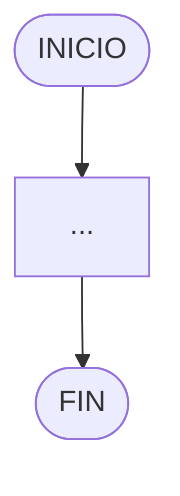
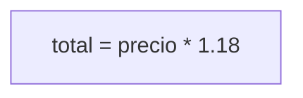
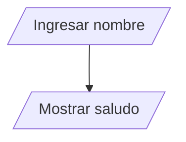
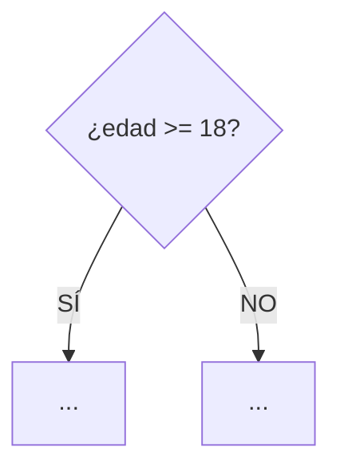
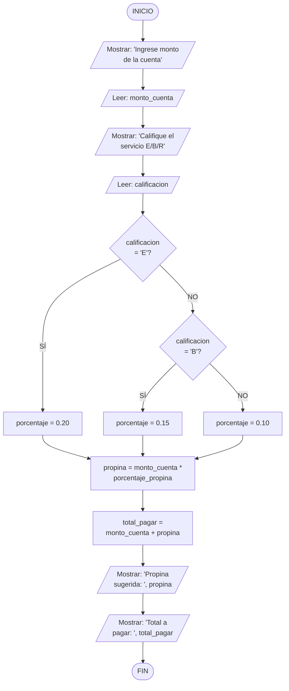
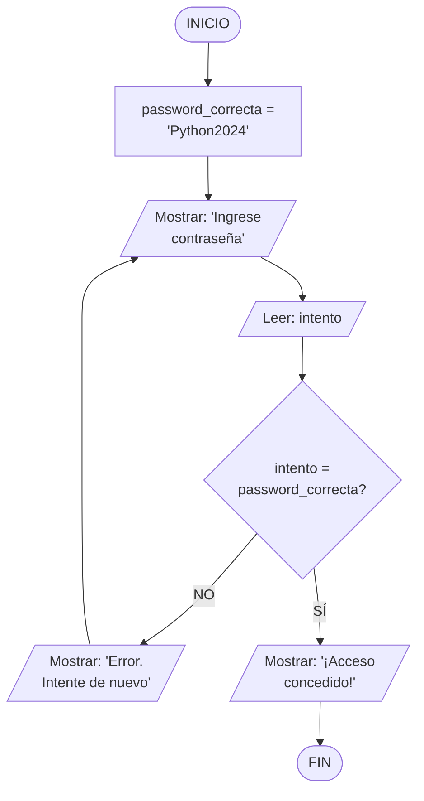
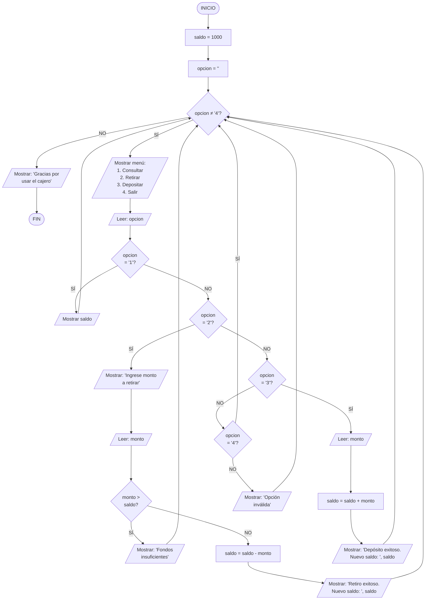
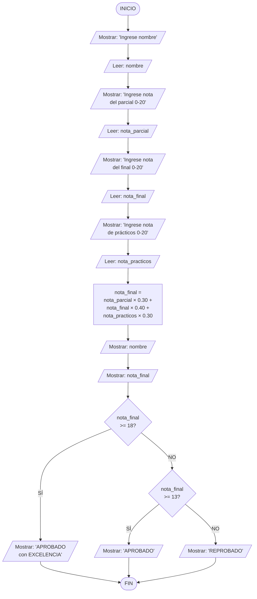

# Capítulo 1: Diagramas de Flujo — Visualiza la Lógica Antes de Codificar

## Introducción

Imagina que estás planeando un viaje por carretera. No simplemente subes al auto y aceleras sin rumbo fijo, ¿verdad? Primero consultas un mapa, identificas las rutas principales, decides dónde harás paradas para cargar combustible y planeas alternativas en caso de que encuentres tráfico o desvíos. Un diagrama de flujo cumple exactamente la misma función para tu código: es el mapa que traza el camino que seguirá tu programa antes de que escribas una sola línea de Python.

En el capítulo anterior aprendiste a pensar algorítmicamente, descomponiendo problemas en pasos precisos. Ahora vamos a darle forma visual a ese pensamiento. Los diagramas de flujo son herramientas poderosas que te permiten:

- **Visualizar** la lógica de tu programa antes de implementarlo
- **Identificar** posibles errores o casos especiales que no habías considerado
- **Comunicar** tus ideas de manera clara a otros programadores
- **Depurar** problemas de forma más eficiente al tener una representación gráfica de lo que debería ocurrir

> **💡 Perspectiva del Programador:** Los programadores experimentados raramente empiezan a escribir código directamente. Primero esbozan la estructura lógica de la solución en papel, en una pizarra o usando diagramas. Esta inversión inicial de tiempo te ahorra horas de frustración más adelante, porque es mucho más fácil detectar y corregir errores de lógica en un diagrama simple que en 200 líneas de código complejo.

## ¿Qué es un Diagrama de Flujo?

Un **diagrama de flujo** (o flowchart) es una representación gráfica de un algoritmo que muestra:

1. **La secuencia de pasos** que debe ejecutar un programa
2. **Las decisiones** que debe tomar en diferentes puntos
3. **Los bucles o repeticiones** de operaciones
4. **El flujo de información** desde la entrada hasta la salida

Piensa en un diagrama de flujo como el plano arquitectónico de una casa. Así como un arquitecto no comenzaría a construir sin un plano detallado que muestre dónde irá cada pared, cada puerta y cada ventana, un programador inteligente no escribe código sin primero visualizar cómo las diferentes partes de su programa se conectan entre sí.

### La Ventaja de Pensar Visualmente

Nuestro cerebro procesa información visual 60,000 veces más rápido que el texto. Cuando transformas un problema abstracto en un diagrama visual:

- **Reduces la carga cognitiva**: En lugar de mantener toda la lógica en tu cabeza simultáneamente, la externalizas en un formato visible y revisable.
- **Descubres patrones**: Los bucles infinitos, las condiciones contradictorias y los caminos sin salida se vuelven evidentes de inmediato.
- **Facilitas la colaboración**: Un diagrama bien construido permite que cualquier persona —incluso alguien sin conocimientos de programación— entienda qué hace tu programa.

## Símbolos Fundamentales del Diagrama de Flujo

Aunque existen docenas de símbolos especializados para diagramas de flujo complejos, dominar estos cinco símbolos esenciales te permitirá representar la mayoría de los algoritmos que escribirás en tus primeros años de programación:

### 1. Terminal (Inicio/Fin)



**Propósito**: Marca dónde comienza y termina tu algoritmo.

**Uso**: Todo diagrama de flujo debe tener exactamente un punto de inicio y al menos un punto de fin. Algunos algoritmos tienen múltiples puntos de fin (por ejemplo, cuando hay diferentes formas de salir dependiendo de condiciones específicas).

> **📝 Nota:** Piensa en el símbolo de inicio como la línea de salida en una carrera y el símbolo de fin como la meta. Todo lo que ocurre entre estos dos puntos es el recorrido que hace tu programa.

### 2. Proceso/Acción



**Propósito**: Representa una operación, cálculo o cualquier acción que transforme datos.

**Ejemplos comunes**:
- Realizar un cálculo matemático: `area = base * altura`
- Modificar una variable: `contador = contador + 1`
- Llamar a una función: `guardar_en_archivo(datos)`
- Asignar un valor: `nombre = "Ana"`

> **💡 Consejo:** Dentro de cada caja de proceso, escribe exactamente lo que sucede. Si estás calculando el IVA, no escribas solo "calcular impuesto" (demasiado vago), escribe `impuesto = subtotal * 0.18` (preciso y claro).

### 3. Entrada/Salida



**Propósito**: Indica cuándo el programa solicita información al usuario (entrada) o presenta resultados (salida).

**Ejemplos de entrada**:
- Pedir un número al usuario
- Leer datos desde un archivo
- Recibir información desde un sensor o dispositivo

**Ejemplos de salida**:
- Mostrar un mensaje en pantalla
- Guardar resultados en un archivo
- Enviar un comando a una impresora

> **📝 Nota:** Estos símbolos representan los puntos de interacción entre tu programa y el mundo exterior. Son las "ventanas" a través de las cuales tu código se comunica con usuarios, archivos o sistemas externos.

### 4. Decisión



**Propósito**: Representa un punto donde el programa debe tomar una decisión basada en una condición. El flujo se divide en dos o más caminos dependiendo del resultado de evaluar esa condición.

**Estructura**: Siempre contiene una pregunta que puede responderse con SÍ o NO (o VERDADERO/FALSO). De esta forma salen dos flechas: una para el caso afirmativo y otra para el negativo.

**Ejemplo práctico**: Imagina un sistema de control de acceso a una discoteca:


> **⚠️ Advertencia:** Una trampa común es escribir acciones dentro del rombo de decisión. Incorrecto: `│ Validar edad │`. Correcto: `│ ¿edad >= 18? │`. El rombo solo hace preguntas, no ejecuta acciones.

### 5. Conector de Flujo (Flechas)

```
     │
     ▼
```

**Propósito**: Muestra la dirección en que fluye la ejecución del programa, conectando los diferentes símbolos.

**Convención**: Las flechas normalmente fluyen de arriba hacia abajo y de izquierda a derecha. Cuando necesites hacer que el flujo retroceda (como en un bucle), usa flechas que vayan hacia arriba con una anotación clara.

> **💡 Consejo:** Si tu diagrama tiene flechas cruzándose en todas direcciones como un plato de espagueti, es señal de que tu lógica es demasiado compleja. Simplifica el algoritmo o divídelo en sub-problemas más pequeños.

## Tu Primer Diagrama de Flujo: Calculadora de Propina

Vamos a construir juntos, paso a paso, un diagrama de flujo para un problema del mundo real: calcular cuánta propina dejar en un restaurante.

### Planteamiento del Problema

**Objetivo**: Crear un programa que ayude a calcular la propina apropiada según la calidad del servicio recibido.

**Entradas**:
- Monto total de la cuenta (en soles)
- Calificación del servicio (Excelente, Bueno o Regular)

**Salidas**:
- Cantidad sugerida de propina
- Total a pagar (cuenta + propina)

**Reglas de negocio**:
- Servicio Excelente → 20% de propina
- Servicio Bueno → 15% de propina
- Servicio Regular → 10% de propina

### Diseño del Algoritmo en Pseudocódigo

Antes de dibujar, escribamos la lógica en pseudocódigo:

```
INICIO
  Mostrar "Ingrese el monto de la cuenta"
  Leer monto_cuenta
  
  Mostrar "Califique el servicio (E=Excelente, B=Bueno, R=Regular)"
  Leer calificacion
  
  SI calificacion = "E" ENTONCES
    porcentaje_propina = 0.20
  SINO SI calificacion = "B" ENTONCES
    porcentaje_propina = 0.15
  SINO
    porcentaje_propina = 0.10
  FIN SI
  
  propina = monto_cuenta * porcentaje_propina
  total_pagar = monto_cuenta + propina
  
  Mostrar "Propina sugerida: ", propina
  Mostrar "Total a pagar: ", total_pagar
FIN
```

### Construcción del Diagrama de Flujo

Ahora transformemos ese pseudocódigo en un diagrama visual usando nuestros símbolos fundamentales:



### Análisis del Diagrama

Observa cómo cada elemento del pseudocódigo encuentra su lugar en el diagrama:

1. **Flujo secuencial claro**: Las operaciones se ejecutan de arriba hacia abajo en el orden preciso necesario.

2. **Decisiones anidadas**: La estructura SI-SINO SI-SINO se representa con rombos de decisión conectados. Primero preguntamos si es "E", si no, preguntamos si es "B", y si tampoco, asumimos "R".

3. **Convergencia de caminos**: Nota cómo los tres caminos posibles (Excelente, Bueno, Regular) eventualmente convergen en un solo punto donde calculamos la propina. Esto es eficiente porque evita repetir el mismo código de cálculo tres veces.

4. **Entrada y salida claras**: Puedes identificar fácilmente dónde el programa solicita información (los dos primeros bloques de entrada/salida) y dónde presenta resultados (los dos últimos).

> **🔍 Análisis Profundo:** Este patrón de múltiples decisiones que convergen en un punto común es extremadamente frecuente en programación. Se llama "bifurcación convergente" y es una técnica fundamental para escribir código eficiente y mantenible. En lugar de duplicar la lógica de cálculo en cada rama de la decisión, la centralizamos después de que todas las ramas han establecido los valores necesarios.

## Bucles en Diagramas de Flujo: Representando la Repetición

Muchos problemas requieren repetir una serie de pasos múltiples veces. Los **bucles** (o ciclos) son estructuras que permiten que tu programa ejecute el mismo bloque de código repetidamente hasta que se cumpla una condición de salida.

### Ejemplo: Validador de Contraseña

Imagina un sistema de login que debe seguir pidiendo la contraseña hasta que el usuario ingrese la correcta. No queremos que el programa termine después del primer intento fallido, ¿verdad?

**Planteamiento**:
- El programa conoce la contraseña correcta: "Python2024"
- Debe pedir al usuario que ingrese la contraseña
- Si es incorrecta, mostrar un mensaje de error y volver a pedir
- Si es correcta, mostrar un mensaje de bienvenida y terminar

**Diagrama de flujo**:



### Elementos Clave del Bucle

1. **Punto de decisión**: El rombo `¿intento = password_correcta?` actúa como guardián del bucle. Determina si continuamos repitiendo o salimos.

2. **Flecha de retorno**: La flecha que va de "Error. Intente de nuevo" de vuelta hacia arriba crea el ciclo. Esta flecha "hacia atrás" es la firma visual de un bucle.

3. **Condición de salida**: Cuando la contraseña es correcta (rama SÍ), el flujo sale del bucle y procede hacia el final.

> **⚠️ Advertencia Crítica - Bucles Infinitos:** Un error devastador que cometen los principiantes es crear bucles sin una forma garantizada de salir. Si no hay ninguna rama que eventualmente lleve al FIN, tu programa quedará atrapado en un ciclo eterno, consumiendo recursos del sistema hasta congelarse o ser forzosamente terminado.

**Pregunta de verificación**: ¿Hay algún camino en tu diagrama que, desde el INICIO, no pueda llegar al FIN? Si la respuesta es sí, tienes un bucle infinito.

## Caso de Estudio Completo: Sistema de Cajero Automático Simplificado

Vamos a integrar todo lo aprendido diseñando la lógica para un cajero automático básico. Este ejercicio te mostrará cómo los diagramas de flujo escalan para manejar problemas más complejos con múltiples decisiones y bucles.

### Especificaciones del Sistema

**Funcionalidad**: El cajero permite a un usuario:
1. Consultar su saldo actual
2. Retirar dinero (si tiene fondos suficientes)
3. Depositar dinero
4. Salir del sistema

**Reglas de negocio**:
- El saldo inicial es de S/. 1000
- En retiros, verificar que haya fondos suficientes
- Después de cada operación, mostrar el menú nuevamente
- Solo salir cuando el usuario elija la opción "Salir"

### Pseudocódigo del Sistema

```
INICIO
  saldo = 1000
  opcion = ""
  
  MIENTRAS opcion ≠ "4" HACER
    Mostrar "=== MENÚ ==="
    Mostrar "1. Consultar saldo"
    Mostrar "2. Retirar dinero"
    Mostrar "3. Depositar dinero"
    Mostrar "4. Salir"
    Mostrar "Elija opción: "
    Leer opcion
    
    SI opcion = "1" ENTONCES
      Mostrar "Su saldo es: ", saldo
      
    SINO SI opcion = "2" ENTONCES
      Mostrar "Ingrese monto a retirar: "
      Leer monto
      
      SI monto > saldo ENTONCES
        Mostrar "Fondos insuficientes"
      SINO
        saldo = saldo - monto
        Mostrar "Retiro exitoso. Nuevo saldo: ", saldo
      FIN SI
      
    SINO SI opcion = "3" ENTONCES
      Mostrar "Ingrese monto a depositar: "
      Leer monto
      saldo = saldo + monto
      Mostrar "Depósito exitoso. Nuevo saldo: ", saldo
      
    SINO SI opcion = "4" ENTONCES
      Mostrar "Gracias por usar el cajero"
      
    SINO
      Mostrar "Opción inválida"
    FIN SI
    
  FIN MIENTRAS
FIN
```

### Diagrama de Flujo del Cajero



> **📝 Nota sobre Complejidad:** Este diagrama es intencionalmente detallado para mostrar cómo se manejan múltiples decisiones anidadas. En la práctica profesional, a veces se crean "sub-diagramas" separados para cada opción del menú, manteniendo el diagrama principal más simple y creando diagramas auxiliares para los detalles de cada operación.

### Lecciones del Diagrama del Cajero

1. **Bucle principal controlado por condición**: Todo el sistema vive dentro de un bucle MIENTRAS que solo termina cuando el usuario elige "4". Esto permite que el cajero siga funcionando después de cada operación.

2. **Decisiones encadenadas (SI-SINO SI-SINO)**: Las cuatro opciones del menú se manejan con una cadena de decisiones mutuamente excluyentes. Solo uno de los caminos se ejecuta en cada iteración del bucle.

3. **Decisiones anidadas**: Dentro de la opción "2" (Retirar), hay otra decisión para verificar fondos suficientes. Esto muestra cómo las decisiones pueden contener otras decisiones.

4. **Actualización de estado**: La variable `saldo` se modifica en dos lugares diferentes (retiro y depósito), pero su valor persiste a través de múltiples iteraciones del bucle.

> **💡 Perspectiva del Programador:** En sistemas reales, nunca almacenarías el saldo directamente en el programa (se perdería al cerrarlo). Lo guardarías en una base de datos o archivo. Sin embargo, el patrón de lógica es exactamente el mismo: leer el estado actual, modificarlo según la operación, guardar el nuevo estado.

## Errores Comunes al Diseñar Diagramas de Flujo

Reconocer estos errores típicos te ahorrará horas de depuración frustante:

### Error 1: Condiciones Ambiguas

**Incorrecto**:
```
┌──────────────┐
│ ¿Es válido?  │
└──────────────┘
```

**Problema**: "¿Es válido?" es demasiado vago. ¿Qué estamos validando? ¿Bajo qué criterio?

**Correcto**:
```
┌───────────────────┐
│ ¿edad >= 18?      │
└───────────────────┘
```

> **⚠️ Solución de Problemas:** Una buena pregunta de decisión debe poder responderse objetivamente con SÍ o NO. Si necesitas pensar mucho para decidir qué responder, la pregunta está mal formulada.

### Error 2: Acciones en Símbolos de Decisión

**Incorrecto**:
```
┌──────────────────┐
│ Validar password │
└──────────────────┘
```

**Problema**: Esto es una acción (proceso), no una pregunta. Va en un rectángulo, no en un rombo.

**Correcto**:
```
┌──────────────────────────┐
│ intentos < max_intentos? │
└──────────────────────────┘
```

### Error 3: Flechas Sin Etiquetar en Decisiones

**Incorrecto**:
```
┌──────────┐
│ ¿x > 0?  │
└──────────┘
    │   │
    ▼   ▼
```

**Problema**: No sabemos qué camino tomar si x es positivo o negativo.

**Correcto**:
```
┌──────────┐
│ ¿x > 0?  │
└──────────┘
    │
┌───┴───┐
│       │
SÍ     NO
│       │
▼       ▼
```

### Error 4: Bucles Sin Condición de Salida

**Incorrecto**:
```
┌─────────┐
│ Proceso │ ◄───┐
└─────────┘     │
    │           │
    └───────────┘
```

**Problema**: Este bucle nunca termina. No hay decisión que permita salir del ciclo.

**Correcto**:
```
      ┌─────────┐  ◄───────┐
      │ Proceso │          │
      └─────────┘          │
           │               │
           ▼               │
      ┌──────────┐         │
      │¿Continuar│         │
      │    ?     │         │
      └──────────┘         │
           │               │
       ┌───┴───┐           │
      SÍ      NO           │
       │       │           │
       └───────┘           │
           ▼
```

> **⚠️ Advertencia:** El bucle infinito es uno de los errores más comunes y frustrantes en programación. Un diagrama de flujo bien diseñado te permite detectarlo visualmente antes de escribir una sola línea de código.

### Error 5: Múltiples Puntos de Inicio

**Incorrecto**:
```
┌────────┐       ┌────────┐
│ INICIO │       │ INICIO │
└────────┘       └────────┘
    │                │
    ▼                ▼
```

**Problema**: Un programa solo puede empezar en un lugar. Tener múltiples puntos de inicio genera ambigüedad.

**Correcto**: Un solo símbolo de INICIO, y si hay diferentes modos de operación, usa decisiones tempranas para ramificar:

```
┌────────────┐
│   INICIO   │
└────────────┘
      │
      ▼
┌──────────────┐
│ ¿Modo admin? │
└──────────────┘
      │
  ┌───┴───┐
 SÍ      NO
  │       │
  ▼       ▼
```

## Ejercicio Práctico: Sistema de Calificaciones

Ahora es tu turno de aplicar todo lo aprendido. Diseña un diagrama de flujo completo para el siguiente problema:

### Especificaciones

**Objetivo**: Calcular la calificación final de un estudiante y determinar si aprueba o reprueba el curso.

**Entradas**:
- Nombre del estudiante
- Nota del examen parcial (0-20 puntos)
- Nota del examen final (0-20 puntos)
- Nota de trabajos prácticos (0-20 puntos)

**Cálculo**:
- Nota final = (parcial × 0.30) + (final × 0.40) + (prácticos × 0.30)

**Criterios**:
- Si nota final ≥ 13: APROBADO
- Si nota final < 13: REPROBADO
- Si nota final ≥ 18: APROBADO con EXCELENCIA

**Salidas**:
- Nombre del estudiante
- Nota final calculada
- Estado (APROBADO/REPROBADO)
- Si aplica: mención de EXCELENCIA

### Pasos para Resolver

1. **Escribe el pseudocódigo primero**: No saltes directamente al diagrama. Lista los pasos en orden.

2. **Identifica los elementos clave**:
   - ¿Cuántas entradas necesitas? (4: nombre y 3 notas)
   - ¿Cuántos cálculos hay? (1: promedio ponderado)
   - ¿Cuántas decisiones? (Pista: necesitas al menos 2 decisiones para manejar los 3 estados posibles)

3. **Dibuja el diagrama**: Usa los símbolos que aprendiste. Recuerda etiquetar claramente todas las decisiones.

4. **Verifica con casos de prueba**:
   - **Caso 1**: Parcial=10, Final=12, Prácticos=11 → ¿Qué nota final da? ¿Qué estado?
   - **Caso 2**: Parcial=18, Final=19, Prácticos=18 → ¿Qué nota final? ¿Hay excelencia?
   - **Caso 3**: Parcial=20, Final=20, Prácticos=20 → ¿Funciona correctamente?

> **💡 Consejo:** Traza manualmente el recorrido de cada caso de prueba a través de tu diagrama, marcando con un dedo o lápiz el camino que seguiría. Si llegas a un punto donde no sabes qué flecha tomar, o si terminas en un lugar equivocado, encontraste un error en tu diseño.

### Solución Sugerida

Intenta resolver el ejercicio por tu cuenta antes de ver esta solución. La lucha con el problema es donde ocurre el aprendizaje real.

**Pseudocódigo**:
```
INICIO
  Mostrar "Ingrese nombre del estudiante"
  Leer nombre
  
  Mostrar "Ingrese nota del parcial (0-20)"
  Leer nota_parcial
  
  Mostrar "Ingrese nota del final (0-20)"
  Leer nota_final
  
  Mostrar "Ingrese nota de prácticos (0-20)"
  Leer nota_practicos
  
  nota_final = (nota_parcial * 0.30) + (nota_final * 0.40) + (nota_practicos * 0.30)
  
  Mostrar "Estudiante: ", nombre
  Mostrar "Nota final: ", nota_final
  
  SI nota_final >= 18 ENTONCES
    Mostrar "Estado: APROBADO con EXCELENCIA"
  SINO SI nota_final >= 13 ENTONCES
    Mostrar "Estado: APROBADO"
  SINO
    Mostrar "Estado: REPROBADO"
  FIN SI
FIN
```

**Diagrama de flujo**:



### Análisis de la Solución

**Decisiones en cascada**: Observa cómo primero verificamos la condición más restrictiva (≥18 para excelencia), luego la intermedia (≥13 para aprobado), y finalmente el caso por defecto (reprobado). Este orden importa.

**¿Por qué no preguntar primero por ≥13?**: Si preguntáramos primero "¿nota_final ≥ 13?", un estudiante con 19 de nota entraría por la rama SÍ y se marcaría simplemente como APROBADO, perdiéndose la mención de EXCELENCIA. Siempre ordena tus condiciones de la más específica a la más general.

**Convergencia limpia**: Los tres caminos posibles convergen en un solo punto de FIN. Esto garantiza que no importa qué estado tenga el estudiante, el programa siempre terminará correctamente.

## De Diagramas a Código: El Puente

Ahora que dominas los diagramas de flujo, traducirlos a código Python será sorprendentemente directo. Cada símbolo tiene su equivalente en Python:

| Símbolo de Diagrama | Concepto Python | Ejemplo |
|---------------------|-----------------|---------|
| Terminal (Inicio/Fin) | Estructura del programa | `# Inicio del programa` ... `# Fin` |
| Proceso | Asignación o operación | `total = precio * 1.18` |
| Entrada | Función `input()` | `nombre = input("Nombre: ")` |
| Salida | Función `print()` | `print(f"Hola, {nombre}")` |
| Decisión | Sentencia `if`/`elif`/`else` | `if edad >= 18:` |
| Bucle | `while` o `for` | `while opcion != "4":` |

En el próximo capítulo escribirás tu primer programa real en Python, y descubrirás que el diagrama de flujo que diseñes primero se convierte en un esqueleto perfecto para tu código.

> **💡 Perspectiva del Programador:** Los programadores profesionales pasan más tiempo pensando y diseñando que tecleando código. Un diagrama de flujo bien pensado de 30 minutos puede ahorrarte 3 horas de depuración. Es la diferencia entre construir una casa con planos detallados versus improvisar con martillo y clavos.

## Desafío Extra: Diseña Tu Propio Sistema

Para consolidar todo lo aprendido, diseña un diagrama de flujo completo para uno de estos problemas del mundo real:

### Opción A: Calculadora de IMC (Índice de Masa Corporal)

**Entradas**: Peso (kg), Altura (metros)

**Cálculo**: IMC = Peso / (Altura²)

**Clasificación**:
- IMC < 18.5 → Bajo peso
- 18.5 ≤ IMC < 25 → Peso normal
- 25 ≤ IMC < 30 → Sobrepeso
- IMC ≥ 30 → Obesidad

**Salida**: Valor de IMC y clasificación

### Opción B: Sistema de Descuentos de Tienda

**Entradas**: 
- Monto de compra
- ¿Es cliente frecuente? (Sí/No)
- ¿Tiene cupón? (Sí/No)

**Reglas**:
- Compras ≥ S/. 500 → 15% descuento
- Compras ≥ S/. 200 → 10% descuento
- Cliente frecuente → 5% adicional
- Con cupón → 8% adicional
- Los descuentos son acumulativos

**Salida**: Subtotal, descuento aplicado, total a pagar

### Opción C: Validador de Contraseña Segura

**Entrada**: Contraseña propuesta

**Criterios de validación** (deben cumplirse TODOS):
- Al menos 8 caracteres
- Contiene al menos una mayúscula
- Contiene al menos un número
- Contiene al menos un símbolo (!@#$%^&*)

**Salida**: "Contraseña aceptada" o lista de criterios que faltan

> **🔍 Análisis Profundo:** Estos problemas son intencionalmente más complejos que los ejemplos anteriores. Requieren que combines decisiones múltiples, cálculos secuenciales y validaciones. No te desanimes si tu primer intento no es perfecto. El diseño iterativo —crear una versión, probarla con casos, refinarla— es exactamente como trabajan los profesionales.

## Preguntas de Reflexión

Estas preguntas te ayudarán a conectar lo aprendido con tu proceso de pensamiento:

1. **Sobre la planificación**: Piensa en alguna actividad compleja que realizas regularmente (cocinar una receta elaborada, planear un viaje, organizar un evento). ¿Podrías descomponerla en un diagrama de flujo? ¿Dónde están las decisiones? ¿Dónde están los bucles?

2. **Sobre la complejidad**: ¿Qué te resulta más difícil de representar en un diagrama: las decisiones simples, las decisiones anidadas (decisiones dentro de decisiones), o los bucles? ¿Por qué crees que es así?

3. **Sobre los errores**: De los cinco errores comunes presentados, ¿cuál crees que es más probable que cometas tú? ¿Qué estrategia podrías usar para detectarlo antes de que cause problemas?

4. **Sobre la comunicación**: Si tuvieras que explicarle tu diagrama del cajero automático a alguien que nunca ha programado, ¿cómo lo harías? ¿Qué analogías usarías?

5. **Sobre el aprendizaje**: Antes de este capítulo, ¿cómo planificabas resolver problemas complejos? ¿Ha cambiado tu enfoque después de aprender sobre diagramas de flujo?

## Para Recordar

- **Un diagrama de flujo es tu mapa** antes de embarcarte en el viaje del código. Invierte tiempo en diseñarlo bien y te ahorrarás horas de frustración.

- **Cinco símbolos fundamentales** te permiten representar casi cualquier algoritmo: Terminal (inicio/fin), Proceso (acciones), Entrada/Salida (comunicación), Decisión (bifurcaciones) y Flechas (flujo).

- **Las decisiones siempre son preguntas** con respuestas de SÍ/NO. Si no puedes formular tu condición como una pregunta binaria clara, reformúlala.

- **Los bucles requieren condiciones de salida**. Siempre, sin excepción. Un bucle sin salida es un programa congelado.

- **Ordena las decisiones de específico a general** cuando tengas múltiples condiciones relacionadas. Pregunta primero por los casos más restrictivos.

- **Verifica con casos de prueba**. Traza manualmente el recorrido de diferentes entradas a través de tu diagrama. Si un caso no llega a donde debería, tienes un error de diseño.

- **Un buen diagrama se traduce naturalmente a código**. Cada símbolo tiene su equivalente en Python, como aprenderás en los próximos capítulos.

## Próximo Paso

En el Capítulo 2 darás el salto de la teoría a la práctica: escribirás tu primer programa en Python. Descubrirás que el diagrama de flujo que diseñes primero se convierte casi por arte de magia en las líneas de código que Python ejecutará. El pensamiento algorítmico que has desarrollado en estos dos primeros capítulos será tu superpoder secreto como programador.

¿Estás listo para ver tus diagramas cobrar vida?