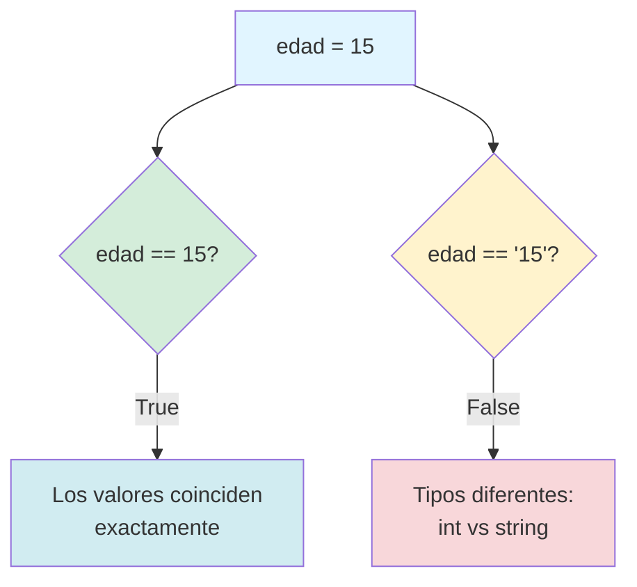
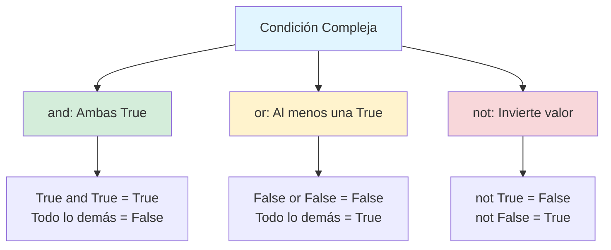
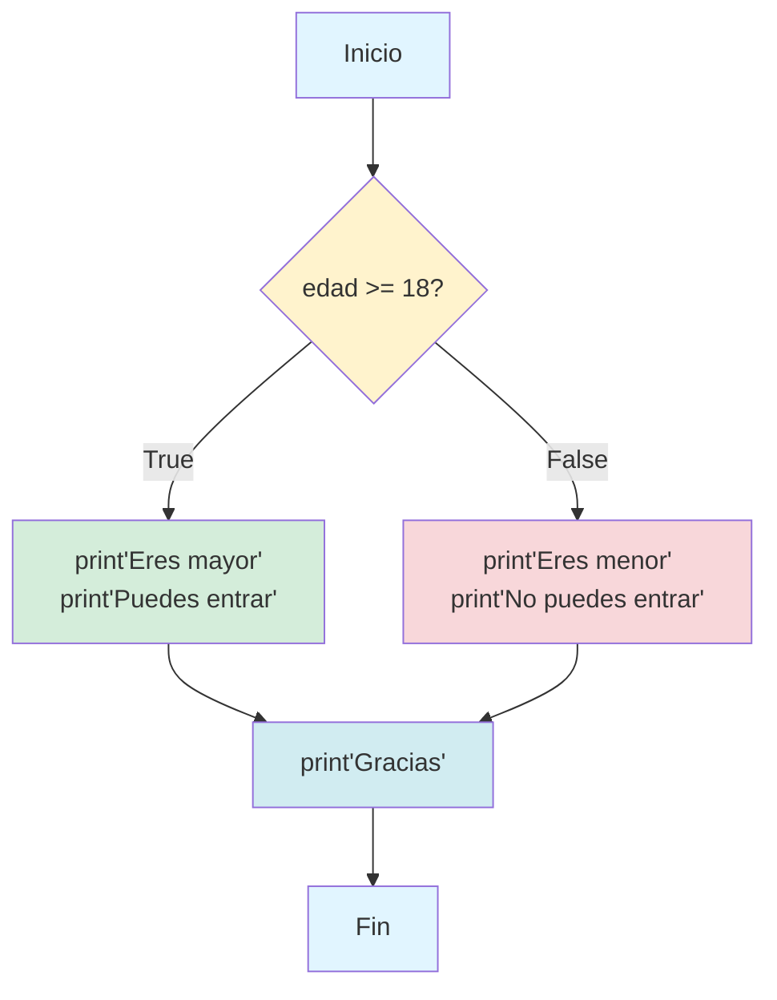
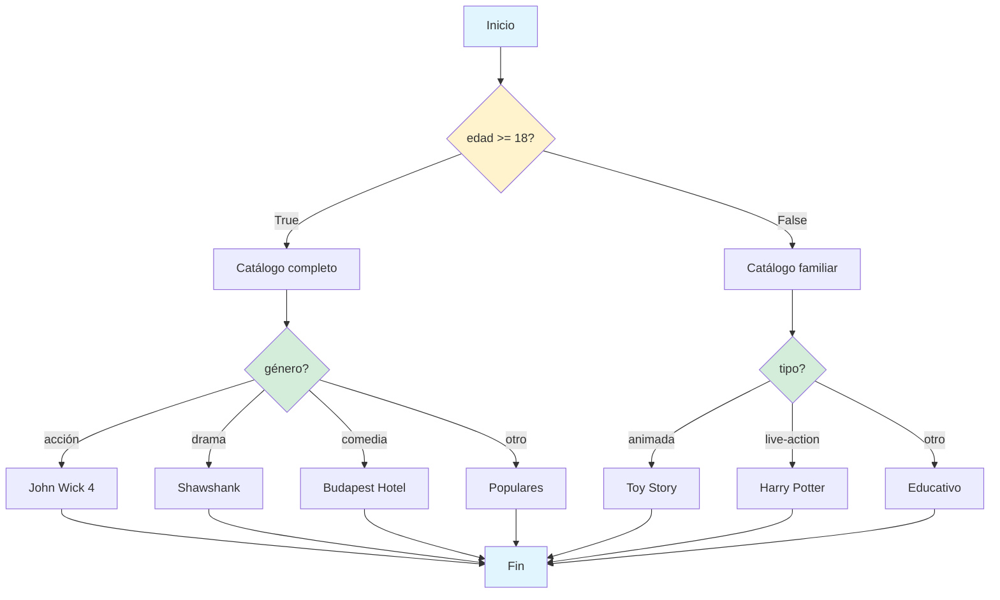

# Capítulo 4: El Cerebro Digital — Tomando Decisiones con Condicionales

## Introducción: El Momento en que tus Programas Aprenden a Pensar

Hasta este momento, tus programas han sido como trenes en vías rectas: ejecutan instrucciones en secuencia, de arriba hacia abajo, sin variación alguna. Le pides a Python que calcule algo y lo calcula, le pides que muestre algo y lo muestra, siempre siguiendo el mismo camino sin importar las circunstancias. Es como tener una receta de cocina que prepara exactamente el mismo plato sin considerar si hace calor o frío, si tienes hambre o estás satisfecho, si hay ingredientes disponibles o no.

Pero los programas verdaderamente útiles no funcionan así. Las aplicaciones que usas todos los días toman cientos de decisiones por segundo. Cuando abres Instagram, la app decide si mostrarte la pantalla de inicio de sesión o tu feed dependiendo de si ya iniciaste sesión. Cuando juegas un videojuego, el código decide constantemente si el enemigo debe atacar o huir, si ganaste puntos o los perdiste, si pasaste al siguiente nivel o debes reintentar. Cuando buscas algo en Google, el algoritmo decide qué resultados mostrarte primero basándose en miles de factores.

Todas estas decisiones se construyen sobre una estructura fundamental de la programación: las condicionales. En este capítulo vas a aprender a darle a tus programas la capacidad de evaluar situaciones y reaccionar de forma diferente según lo que encuentren. Vas a transformar tus scripts lineales en sistemas que piensan, que se adaptan, que responden inteligentemente a diferentes circunstancias.

La palabra clave aquí es "si". Si el usuario tiene más de dieciocho años, entonces permitir el acceso. Si la contraseña es correcta, entonces mostrar el contenido privado. Si el saldo es suficiente, entonces procesar la compra. Ese pequeño "si" es la puerta hacia la lógica condicional, y dominarla es dominar la esencia misma del pensamiento computacional.

> **💡 Objetivo del Capítulo:**
> Al finalizar este capítulo, dominarás los operadores de comparación y lógicos, comprenderás profundamente cómo funcionan las estructuras if-elif-else, sabrás cuándo y cómo anidar condicionales, y podrás construir sistemas de decisión complejos que responden inteligentemente a diferentes situaciones.

## Los Operadores de Comparación: Haciendo Preguntas que Python Puede Responder

Antes de que tu programa pueda tomar decisiones, necesita poder hacer preguntas sobre el mundo. No preguntas abiertas como "¿qué opinas del clima?", sino preguntas precisas que solo tienen dos respuestas posibles: verdadero o falso, sí o no, uno o cero.

Python tiene seis operadores de comparación que te permiten hacer estas preguntas binarias sobre valores. Piensa en ellos como las herramientas básicas de interrogación de tu programa.

### El Operador de Igualdad (==): ¿Son Exactamente lo Mismo?

El doble signo igual pregunta si dos valores son idénticos. Nota que son dos signos igual juntos, no uno solo. Esto es crucial porque un solo signo igual significa asignación (como viste en el capítulo anterior), mientras que dos signos igual significan comparación.

```python
edad = 15
print(edad == 15)  # True, porque edad contiene exactamente 15
print(edad == 16)  # False, porque edad no es 16
print(edad == "15")  # False, porque 15 (número) no es igual a "15" (texto)
```

Ese último ejemplo es importante. Python distingue estrictamente entre tipos. El número quince y el texto "quince" son entidades completamente diferentes, así como una manzana real y una foto de una manzana son cosas diferentes.



### El Operador de Desigualdad (!=): ¿Son Diferentes?

El signo de exclamación seguido de igual pregunta si dos valores NO son iguales. Es el opuesto lógico del operador de igualdad.

```python
nombre = "Ana"
print(nombre != "Carlos")  # True, porque son nombres diferentes
print(nombre != "Ana")  # False, porque son iguales
```

Este operador es especialmente útil cuando quieres ejecutar código solo si algo ha cambiado o es diferente de lo esperado.

### Los Operadores de Magnitud: Mayor, Menor y sus Variantes

Estos cuatro operadores te permiten comparar magnitudes, generalmente números, aunque también funcionan con textos (comparando alfabéticamente).

```python
temperatura = 25

print(temperatura > 30)   # False, 25 no es mayor que 30
print(temperatura < 30)   # True, 25 sí es menor que 30
print(temperatura >= 25)  # True, 25 es igual a 25
print(temperatura <= 20)  # False, 25 no es menor o igual a 20
```

La diferencia entre mayor que (`>`) y mayor o igual que (`>=`) puede parecer sutil, pero es crítica. Imagina que un juego te da un logro si alcanzas exactamente cien puntos. Si usas `puntos > 100`, te perderás el logro cuando tengas exactamente cien. Necesitas `puntos >= 100` para incluir el caso exacto.

Con textos, Python compara alfabéticamente usando el orden de los caracteres en el sistema de codificación:

```python
print("Ana" < "Carlos")  # True, A viene antes que C en el alfabeto
print("Python" > "Java")  # True, P viene después de J
```

Esto funciona, pero tiene matices complejos con mayúsculas, acentos y caracteres especiales. Por ahora, úsalo principalmente con números.

### Tabla Resumen de Operadores de Comparación

| Operador | Significado | Ejemplo | Resultado |
|----------|-------------|---------|-----------|
| `==` | Igual a | `5 == 5` | `True` |
| `!=` | Diferente de | `5 != 3` | `True` |
| `>` | Mayor que | `7 > 5` | `True` |
| `<` | Menor que | `3 < 8` | `True` |
| `>=` | Mayor o igual que | `5 >= 5` | `True` |
| `<=` | Menor o igual que | `4 <= 3` | `False` |

### Combinando Comparaciones en Expresiones

Puedes usar comparaciones directamente en lugares donde Python espera un valor booleano (verdadero o falso). El resultado de cualquier comparación es siempre un booleano.

```python
edad = 15
es_adolescente = edad >= 13
print(es_adolescente)  # True
print(type(es_adolescente))  # <class 'bool'>
```

Aquí, la expresión `edad >= 13` se evalúa primero, produciendo `True` o `False`, y ese resultado booleano se guarda en la variable `es_adolescente`. Esta técnica de guardar el resultado de una comparación en una variable con nombre descriptivo hace tu código mucho más legible.

> **⚠️ Errores Comunes:**
> **Error #1 - Confundir asignación (=) con comparación (==):**
> ```python
> if edad = 18:  # ❌ SyntaxError
>     print("Mayor de edad")
> # Correcto:
> if edad == 18:  # ✅
>     print("Mayor de edad")
> ```
>
> **Error #2 - Comparar tipos incompatibles sin conversión:**
> ```python
> edad_input = input("Tu edad: ")  # "16" como string
> if edad_input > 13:  # ❌ Compara strings, no números
>     print("Adolescente")
> # Correcto:
> edad = int(input("Tu edad: "))
> if edad > 13:  # ✅
>     print("Adolescente")
> ```

## Los Operadores Lógicos: Construyendo Preguntas Complejas

Los operadores de comparación te permiten hacer preguntas simples, pero la vida real raramente tiene condiciones simples. Generalmente necesitas combinar múltiples condiciones: "Si es fin de semana Y hace buen clima, entonces ir al parque". "Si tengo hambre O es hora de almorzar, entonces buscar comida". "Si NO está lloviendo, entonces salir sin paraguas".

Python tiene tres operadores lógicos que te permiten construir estas condiciones complejas: `and`, `or` y `not`. Son las palabras que conectan preguntas simples en preguntas sofisticadas.

### El Operador AND: Cuando Todo Debe Ser Verdadero

El operador `and` conecta dos condiciones y solo produce `True` si ambas condiciones individuales son verdaderas. Si cualquiera de las dos es falsa, el resultado completo es falso.

```python
edad = 15
tiene_permiso = True

puede_conducir = edad >= 18 and tiene_permiso
print(puede_conducir)  # False, porque aunque tiene permiso, no tiene 18 años
```

Piensa en `and` como una cadena: la cadena solo es fuerte si todos los eslabones están intactos. Un solo eslabón roto (una condición falsa) rompe toda la cadena.

**Tabla de verdad de AND:**

| Condición A | Condición B | A and B |
|-------------|-------------|---------|
| True | True | True |
| True | False | False |
| False | True | False |
| False | False | False |

Solo cuando ambas condiciones son `True`, el resultado es `True`.

### El Operador OR: Cuando al Menos Una Debe Ser Verdadera

El operador `or` conecta dos condiciones y produce `True` si al menos una de las condiciones individuales es verdadera. Solo produce `False` si ambas condiciones son falsas.

```python
es_fin_de_semana = True
es_feriado = False

puede_descansar = es_fin_de_semana or es_feriado
print(puede_descansar)  # True, porque es fin de semana (aunque no sea feriado)
```

Piensa en `or` como tener múltiples puertas de salida: solo necesitas que una esté abierta para poder salir.

**Tabla de verdad de OR:**

| Condición A | Condición B | A or B |
|-------------|-------------|--------|
| True | True | True |
| True | False | True |
| False | True | True |
| False | False | False |

Solo cuando ambas condiciones son `False`, el resultado es `False`.

### El Operador NOT: Invirtiendo la Verdad

El operador `not` invierte el valor de verdad de una condición. Si era `True`, la convierte en `False`. Si era `False`, la convierte en `True`.

```python
esta_lloviendo = False
puede_salir = not esta_lloviendo
print(puede_salir)  # True, porque NO está lloviendo
```

**Tabla de verdad de NOT:**

| Condición | not Condición |
|-----------|---------------|
| True | False |
| False | True |

### Combinando Múltiples Operadores Lógicos

Puedes combinar `and`, `or` y `not` para crear condiciones arbitrariamente complejas. Sin embargo, cuando combinas diferentes operadores, es crucial entender el orden de evaluación.

Python evalúa los operadores lógicos en este orden de precedencia:
1. `not` (primero)
2. `and` (segundo)
3. `or` (último)

```python
edad = 20
tiene_licencia = True
tiene_auto = False

# Sin paréntesis, se evalúa según precedencia
puede_viajar = edad >= 18 and tiene_licencia or tiene_auto
# Se evalúa como: (edad >= 18 and tiene_licencia) or tiene_auto
# Resultado: (True and True) or False = True or False = True
```

Para hacer tu intención cristalina y evitar confusiones, usa paréntesis explícitos:

```python
# Más claro con paréntesis
puede_viajar = (edad >= 18 and tiene_licencia) or tiene_auto
```

> **💡 Consejo:**
> Aunque Python tiene reglas de precedencia, nunca asumas que otros programadores (o tu yo futuro) las recordarán perfectamente. Usa paréntesis para hacer explícita tu intención. El código claro es mejor que el código compacto.



### Ejemplo Práctico: Sistema de Acceso

```python
edad = 17
tiene_id = True
acompañado_por_adulto = True

# Puede entrar si: tiene 18+ años, O (tiene 16+ Y está acompañado Y tiene ID)
puede_entrar = (edad >= 18) or (edad >= 16 and acompañado_por_adulto and tiene_id)

print(f"¿Puede entrar? {puede_entrar}")  # True
```

## La Estructura IF: El Punto de Bifurcación

Ahora que sabes cómo hacer preguntas y combinarlas, es momento de usar esas preguntas para tomar decisiones. La estructura `if` es el mecanismo fundamental que permite que tu código tome diferentes caminos según las circunstancias.

### Sintaxis Básica del IF

```python
if condicion:
    # Código que se ejecuta si la condición es True
    print("La condición fue verdadera")
```

Observa tres elementos críticos de esta estructura:

**1. La palabra clave `if`**: Le dice a Python que estás comenzando una estructura condicional.

**2. Los dos puntos (`:`)**: Marcan el final de la condición y el inicio del bloque de código dependiente.

**3. La indentación (espacios al inicio de la línea)**: Python usa la indentación para determinar qué líneas de código pertenecen al bloque del `if`. La convención es usar cuatro espacios (o una tecla Tab configurada como cuatro espacios). Todo el código indentado después del `if` solo se ejecuta si la condición es verdadera.

### Tu Primer IF en Acción

Abre tu notebook de Google Colab y ejecuta este código:

```python
edad = int(input("¿Cuántos años tienes? "))

if edad >= 18:
    print("Eres mayor de edad")
    print("Puedes votar en las elecciones")
    print("Tienes responsabilidades legales completas")

print("Este mensaje se muestra siempre, sin importar la edad")
```

Cuando ejecutes este código con diferentes edades, nota cómo las tres líneas indentadas solo aparecen cuando ingresas 18 o más. La última línea, que no está indentada, se ejecuta siempre porque no forma parte del bloque condicional.

> **⚠️ Advertencia Crítica - La Indentación No es Opcional:**
> En Python, la indentación no es solo una cuestión de estilo para hacer el código bonito. Es parte de la sintaxis del lenguaje. Código mal indentado produce errores:
> ```python
> if edad >= 18:
> print("Mayor de edad")  # ❌ IndentationError
> 
> # Correcto:
> if edad >= 18:
>     print("Mayor de edad")  # ✅
> ```

### Múltiples Condiciones IF Independientes

Puedes tener múltiples estructuras `if` que se evalúen de forma independiente:

```python
temperatura = 28

if temperatura > 30:
    print("Hace mucho calor")

if temperatura > 20:
    print("El clima es agradable")

if temperatura > 10:
    print("No hace frío")
```

Si la temperatura es 28, verás dos mensajes: "El clima es agradable" y "No hace frío". Cada `if` se evalúa de forma completamente independiente de los demás.

## La Estructura IF-ELSE: El Plan B

A menudo no solo necesitas ejecutar código cuando algo es verdadero, sino también ejecutar código diferente cuando es falso. Aquí es donde entra `else`.

### Sintaxis de IF-ELSE

```python
if condicion:
    # Código si la condición es True
else:
    # Código si la condición es False
```

El bloque `else` captura todos los casos donde la condición del `if` fue falsa. Es el "plan B", el camino alternativo.

### Ejemplo: Verificación de Edad

```python
edad = int(input("Tu edad: "))

if edad >= 18:
    print("Eres mayor de edad")
    print("Puedes entrar al evento")
else:
    print("Eres menor de edad")
    print("No puedes entrar sin un adulto")

print("Gracias por tu interés")
```

Ahora, sin importar qué edad ingreses, siempre se ejecutará uno de los dos bloques: o el del `if` o el del `else`. No hay caso donde no se ejecute ninguno.



## La Estructura IF-ELIF-ELSE: Múltiples Caminos

Cuando tienes más de dos opciones mutuamente excluyentes, necesitas `elif` (abreviación de "else if"). Esta estructura te permite evaluar múltiples condiciones en secuencia.

### Sintaxis de IF-ELIF-ELSE

```python
if condicion1:
    # Código si condicion1 es True
elif condicion2:
    # Código si condicion1 es False pero condicion2 es True
elif condicion3:
    # Código si condicion1 y condicion2 son False pero condicion3 es True
else:
    # Código si todas las condiciones anteriores son False
```

### Característica Crucial: Solo se Ejecuta UNO

Python evalúa las condiciones en orden de arriba hacia abajo. En cuanto encuentra una condición que es `True`, ejecuta ese bloque y **salta completamente** el resto de la estructura. Incluso si condiciones posteriores también serían verdaderas, nunca se evaluarán.

### Ejemplo: Clasificador de Notas

```python
nota = float(input("Ingresa tu nota (0-20): "))

if nota >= 18:
    print("Excelente - AD")
    print("¡Felicitaciones por tu rendimiento sobresaliente!")
elif nota >= 15:
    print("Bueno - A")
    print("Muy buen trabajo")
elif nota >= 13:
    print("Regular - B")
    print("Aprobado, pero hay espacio para mejorar")
elif nota >= 11:
    print("Deficiente - C")
    print("Aprobado por poco, necesitas reforzar")
else:
    print("Reprobado")
    print("Necesitas volver a rendir el curso")
```

Si ingresas 16, Python evalúa:
1. `nota >= 18`? → False (16 no es >= 18), continúa
2. `nota >= 15`? → True (16 sí es >= 15), ejecuta este bloque y sale
3. Las condiciones `>= 13`, `>= 11` y el `else` nunca se evalúan

> **⚠️ Advertencia - El Orden Importa Absolutamente:**
> Mira qué pasa si invertimos el orden de las condiciones:
> ```python
> if nota >= 11:      # ❌ MALO: condición muy general primero
>     print("Deficiente")
> elif nota >= 15:    # Nunca se alcanza porque 15 también es >= 11
>     print("Bueno")
> ```
> Si la nota es 16, entrará en el primer `if` (porque 16 >= 11) y mostrará "Deficiente", que es incorrecto. Siempre ordena las condiciones de más específica a más general, o de mayor a menor en rangos numéricos.

### Ejemplo: Calculadora de Impuestos Progresiva

```python
ingreso = float(input("Ingreso anual en soles: "))

if ingreso <= 15000:
    tasa = 0  # Exento
    impuesto = 0
elif ingreso <= 30000:
    tasa = 0.08  # 8%
    impuesto = (ingreso - 15000) * 0.08
elif ingreso <= 50000:
    tasa = 0.14  # 14%
    base_anterior = 15000 * 0.08
    impuesto = base_anterior + (ingreso - 30000) * 0.14
else:
    tasa = 0.20  # 20%
    base_anterior = 15000 * 0.08 + 20000 * 0.14
    impuesto = base_anterior + (ingreso - 50000) * 0.20

print(f"Ingreso: S/. {ingreso:,.2f}")
print(f"Tasa marginal: {tasa * 100}%")
print(f"Impuesto a pagar: S/. {impuesto:,.2f}")
print(f"Ingreso neto: S/. {ingreso - impuesto:,.2f}")
```

Este ejemplo muestra un sistema de impuestos progresivo real donde diferentes porciones del ingreso se gravan a tasas diferentes. Nota cómo cada condición construye sobre la anterior, calculando impuestos acumulativos.

## Condicionales Anidadas: Decisiones Dentro de Decisiones

A veces una decisión secundaria solo tiene sentido dentro del contexto de una decisión primaria. Por ejemplo, solo si el usuario es mayor de edad tiene sentido preguntarle si quiere alcohol. Aquí es donde anidar condicionales se vuelve útil.

### Sintaxis de Condicionales Anidadas

```python
if condicion_principal:
    # Código que se ejecuta si condicion_principal es True
    
    if condicion_secundaria:
        # Solo se ejecuta si AMBAS condiciones son True
    else:
        # Se ejecuta si condicion_principal es True pero condicion_secundaria es False
else:
    # Se ejecuta si condicion_principal es False
```

Cada nivel de anidamiento agrega cuatro espacios adicionales de indentación. Python usa esta indentación para saber qué `if` corresponde a qué `else`.

### Ejemplo: Sistema de Recomendación de Películas

```python
edad = int(input("Tu edad: "))

if edad >= 18:
    print("Acceso a catálogo completo")
    
    genero = input("¿Qué género prefieres? (acción/drama/comedia): ").lower()
    
    if genero == "acción":
        print("Recomendación: John Wick 4")
    elif genero == "drama":
        print("Recomendación: The Shawshank Redemption")
    elif genero == "comedia":
        print("Recomendación: The Grand Budapest Hotel")
    else:
        print("Género no reconocido. Mostrando películas populares")
else:
    print("Acceso a catálogo familiar solamente")
    
    tipo = input("¿Animada o live-action? ").lower()
    
    if tipo == "animada":
        print("Recomendación: Toy Story")
    elif tipo == "live-action":
        print("Recomendación: Harry Potter")
    else:
        print("Tipo no reconocido. Mostrando contenido educativo")
```

Este ejemplo muestra cómo las decisiones secundarias (qué género o tipo de película) solo se preguntan dentro del contexto de la decisión primaria (edad del usuario).



### Cuándo Anidar vs. Cuándo Usar Operadores Lógicos

Estas dos estructuras son funcionalmente equivalentes:

**Con anidamiento:**
```python
if edad >= 18:
    if tiene_licencia:
        print("Puede conducir")
```

**Con operador lógico:**
```python
if edad >= 18 and tiene_licencia:
    print("Puede conducir")
```

Ambas hacen lo mismo, pero el enfoque con `and` es más claro y conciso cuando ambas condiciones están al mismo nivel conceptual. Usa anidamiento cuando:

1. Las decisiones secundarias solo tienen sentido en el contexto de la primaria
2. Necesitas ejecutar código intermedio entre las evaluaciones
3. La lógica es más clara expresada como decisiones jerárquicas

Usa operadores lógicos (`and`, `or`) cuando:

1. Todas las condiciones están al mismo nivel conceptual
2. Quieres expresar una condición compuesta de forma compacta
3. La lógica es más clara expresada como una sola condición compleja

> **💡 Perspectiva del Programador:**
> Un error común de los principiantes es anidar demasiado profundamente. Si tu código tiene cuatro o cinco niveles de indentación (16-20 espacios), probablemente estás haciendo algo mal. En capítulos futuros aprenderás técnicas como funciones y estructuras de datos que te permiten simplificar lógica compleja sin anidamiento excesivo.

## Laboratorio 1: Validador de Contraseñas Seguras

### Objetivo
Crear un programa que evalúe la fortaleza de una contraseña usando múltiples condiciones.

### Instrucciones

Crea un validador que pida una contraseña al usuario y la evalúe según estos criterios:

**Criterios de seguridad:**
1. Debe tener al menos 8 caracteres
2. Debe contener al menos un número
3. Debe contener al menos una letra mayúscula
4. Debe contener al menos una letra minúscula

**Sistema de clasificación:**
- Si cumple los 4 criterios: "Contraseña muy segura"
- Si cumple 3 criterios: "Contraseña segura"
- Si cumple 2 criterios: "Contraseña débil"
- Si cumple 1 o ninguno: "Contraseña muy débil"

**Ejemplo de ejecución:**

```
=== VALIDADOR DE CONTRASEÑAS ===
Ingresa una contraseña: Python2024

Evaluando seguridad...
✓ Longitud suficiente (10 caracteres)
✓ Contiene números
✓ Contiene mayúsculas
✓ Contiene minúsculas

Resultado: Contraseña muy segura
```

### Pistas

- Usa `len(contraseña)` para verificar la longitud
- Usa `.isdigit()`, `.isupper()`, `.islower()` para verificar tipos de caracteres
- Puedes iterar sobre cada carácter usando un bucle (o si aún no sabes bucles, usa `any()` con comprensión)
- Cuenta cuántos criterios se cumplen usando una variable contador

### Criterio de Éxito

- El programa evalúa correctamente los cuatro criterios
- Muestra claramente cuáles criterios se cumplen y cuáles no
- Clasifica la contraseña correctamente según el número de criterios cumplidos
- La salida es clara y fácil de entender

## Laboratorio 2: Calculadora de Descuentos Multinivel

### Objetivo
Practicar condicionales con múltiples factores que afectan un cálculo.

### Instrucciones

Crea una calculadora para una tienda que aplica descuentos según múltiples reglas:

**Reglas de descuento:**
1. Descuento base por monto:
   - Compras >= S/. 500: 15%
   - Compras >= S/. 300: 10%
   - Compras >= S/. 100: 5%
   - Compras < S/. 100: 0%

2. Descuento adicional por membresía:
   - Miembro Gold: +10%
   - Miembro Silver: +5%
   - No miembro: +0%

3. Descuento adicional por día:
   - Lunes o martes: +5%
   - Otros días: +0%

**Importante:** El descuento total no puede exceder 30%

**Ejemplo de ejecución:**

```
=== CALCULADORA DE DESCUENTOS ===
Monto de compra: 450
Tipo de membresía (gold/silver/none): gold
Día de la semana: lunes

DESGLOSE:
Subtotal: S/. 450.00
Descuento por monto (>=300): 10%
Descuento por membresía Gold: +10%
Descuento por día (lunes): +5%
Descuento total: 25%
Ahorro: S/. 112.50
TOTAL A PAGAR: S/. 337.50
```

### Pistas

- Calcula cada tipo de descuento por separado
- Suma todos los descuentos
- Verifica que el total no exceda 30%, si excede, ajusta a 30%
- Usa f-strings con formato `.2f` para mostrar montos con dos decimales

### Criterio de Éxito

- Aplica correctamente cada regla de descuento
- Suma los descuentos correctamente
- Limita el descuento máximo a 30%
- Presenta el desglose de forma clara y profesional

## Laboratorio 3: Sistema de Admisión Universitaria

### Objetivo
Practicar condicionales anidadas con lógica compleja de decisión.

### Instrucciones

Crea un sistema que determine si un estudiante es admitido en una universidad según estos criterios:

**Requisitos básicos (todos obligatorios):**
- Promedio de notas >= 14
- Edad entre 16 y 25 años
- Haber completado educación secundaria (respuesta sí/no)

**Criterios de admisión:**
Si cumple los requisitos básicos:
- **Admisión directa** si promedio >= 17
- **Admisión con entrevista** si promedio >= 15
- **Admisión condicional** si promedio >= 14 Y tiene beca deportiva/artística
- **No admitido** en otros casos

Si NO cumple requisitos básicos: automáticamente no admitido

**Ejemplo de ejecución:**

```
=== SISTEMA DE ADMISIÓN UNIVERSITARIA ===

Promedio de notas (0-20): 16.5
Edad: 17
¿Completó educación secundaria? (si/no): si
¿Tiene beca deportiva o artística? (si/no): no

EVALUACIÓN:
✓ Promedio suficiente (16.5 >= 14)
✓ Edad válida (17 entre 16-25)
✓ Educación secundaria completa

RESULTADO: ADMISIÓN CON ENTREVISTA
El comité académico revisará tu caso.
```

### Pistas

- Primero valida los requisitos básicos
- Solo si pasa la validación básica, evalúa el tipo de admisión
- Usa condicionales anidadas: primero requisitos, luego tipo
- Muestra claramente qué requisitos se cumplen o no

### Criterio de Éxito

- Valida correctamente los tres requisitos básicos
- Determina el tipo correcto de admisión
- Maneja correctamente el caso de no cumplir requisitos básicos
- Presenta resultados de forma clara y profesional

## Desafío Extra: Sistema de Recomendación de Películas Completo

Este es un desafío de nivel avanzado que integra todo lo aprendido en el capítulo. No hay una plantilla de código proporcionada; deberás diseñar la estructura completa tú mismo.

### Objetivo

Crear un sistema inteligente de recomendación de películas que considere múltiples factores del usuario para sugerir tres películas apropiadas.

### Especificaciones

Tu programa debe:

**Paso 1: Recopilar información del usuario**
- Género favorito (acción, comedia, drama, terror, ciencia ficción)
- Estado de ánimo actual (feliz, triste, emocionado, relajado)
- Tiempo disponible (en minutos)
- Preferencia de época (clásica: antes del 2000, o reciente: 2000 en adelante)

**Paso 2: Validar las entradas**
- Verificar que el género esté en la lista de opciones válidas
- Verificar que el tiempo disponible sea un número positivo
- Si alguna validación falla, mostrar mensaje de error apropiado

**Paso 3: Generar recomendaciones**
Usando condicionales anidadas y operadores lógicos, recomendar tres películas que:
- Coincidan con el género seleccionado
- Se ajusten al estado de ánimo
- Tengan duración menor o igual al tiempo disponible
- Correspondan a la época preferida

**Paso 4: Presentar resultados**
Para cada película recomendada, mostrar:
- Título
- Año
- Duración
- Descripción breve
- Por qué se recomienda (qué criterios coincidieron)

**Paso 5 (Opcional - Nivel Experto): Sistema de Confianza**
Calcula un "nivel de confianza" de la recomendación (0-5 estrellas) basado en cuántos criterios del usuario coinciden exactamente con las características de la película.

### Ejemplo de Ejecución

```
=== SISTEMA DE RECOMENDACIÓN DE PELÍCULAS ===

¿Qué género prefieres? (acción/comedia/drama/terror/sci-fi): comedia
¿Cómo te sientes? (feliz/triste/emocionado/relajado): triste
¿Cuánto tiempo tienes? (minutos): 120
¿Época preferida? (clásica/reciente): reciente

VALIDANDO...
✓ Género válido
✓ Tiempo válido

RECOMENDACIONES PARA TI:

1. "The Grand Budapest Hotel" (2014) - 100 min
   Comedia visualmente deslumbrante con humor sofisticado
   Recomendada porque: ★★★★★ (5/5)
   - Género coincide perfectamente
   - Humor ligero ideal para levantar el ánimo
   - Se ajusta a tu tiempo disponible
   - Película reciente como preferiste

2. "Amélie" (2001) - 122 min
   Comedia romántica francesa encantadora
   Recomendada porque: ★★★★☆ (4/5)
   - Género coincide
   - Tono alegre perfecto para mejorar el ánimo
   - Excede ligeramente tu tiempo pero vale la pena

3. "Paddington 2" (2017) - 103 min
   Aventura familiar con corazón
   Recomendada porque: ★★★★★ (5/5)
   - Comedia familiar perfecta para sentirse mejor
   - Historia reconfortante
   - Duración ideal

¿Te gustaría buscar otro tipo de películas? (si/no)
```

### Estructura Sugerida (No Obligatoria)

```python
print("=== SISTEMA DE RECOMENDACIÓN DE PELÍCULAS ===\n")

# PASO 1: Recopilar información del usuario
# TODO: Pide género favorito (acción, comedia, drama, terror, ciencia ficción)
# TODO: Pide estado de ánimo (feliz, triste, emocionado, relajado)
# TODO: Pide tiempo disponible (en minutos)
# TODO: Pide preferencia de época (clásica o reciente)

# PASO 2: Validar que el género sea válido
# TODO: Usa una condición para verificar que el género esté en la lista permitida
# Si no es válido, muestra error y termina el programa

# PASO 3: Validar que el tiempo sea positivo
# TODO: Verifica que tiempo_disponible > 0

# PASO 4: Lógica de recomendación principal
# TODO: Usa condicionales anidadas combinando:
#       - género Y estado de ánimo Y tiempo Y época
# Ejemplo de estructura:
# if genero == "comedia":
#     if estado_animo == "triste":
#         # Recomendar comedias muy alegres
#     elif estado_animo == "feliz":
#         # Recomendar comedias ligeras
# elif genero == "acción":
#     ...

# PASO 5: Mostrar las tres recomendaciones
# TODO: Imprime cada película con su descripción y duración

# PASO 6 (OPCIONAL): Sistema de confianza
# TODO: Calcula cuántos criterios coinciden (máximo 4)
# TODO: Asigna estrellas según coincidencias
```

### Pistas de Implementación

- Necesitarás usar múltiples estructuras `if-elif-else` anidadas
- Combina operadores `and` y `or` para evaluar múltiples condiciones simultáneamente
- Crea variables descriptivas para guardar las respuestas del usuario, haciendo tu código más legible
- Usa f-strings para presentar las recomendaciones de forma profesional y atractiva
- Considera crear un catálogo mental de al menos diez películas ficticias con sus características (género, duración, época, tono) para poder recomendarlas según los criterios

Este desafío no tiene una única solución correcta. Lo importante es que practiques tomar decisiones complejas basadas en múltiples factores combinados, que es exactamente lo que hacen los algoritmos de recomendación reales en plataformas como Netflix o Spotify, solo que en una escala mucho mayor.

## Desde la Trinchera

"Durante mi primer año programando, me obsesioné con escribir condicionales perfectas con la menor cantidad de líneas posible. Combinaba condiciones con `and` y `or` de formas cada vez más complejas, orgulloso de poder expresar lógica complicada en una sola línea gigante. El problema llegó seis meses después cuando tuve que modificar ese código. No podía entender mi propia lógica sin dibujar diagramas en papel.

Un mentor me enseñó una regla simple que cambió todo: 'Si necesitas más de dos segundos para entender una condición al leerla, divídela en pasos más simples con nombres descriptivos.' Ahora escribo condiciones como: `es_usuario_valido = edad >= 18 and tiene_cuenta` y luego `if es_usuario_valido:`. Toma dos líneas en lugar de una, pero cuando vuelvo al código tres meses después, entiendo instantáneamente qué estoy evaluando y por qué.

El código más inteligente no es el más compacto, es el que tu yo del futuro puede entender sin esfuerzo."

— Desarrolladora Full Stack, cinco años de experiencia

## Para Recordar

Python te da seis operadores de comparación para hacer preguntas sobre valores: igual (`==`), diferente (`!=`), mayor (`>`), menor (`<`), mayor o igual (`>=`), y menor o igual (`<=`). Todos estos operadores producen siempre un valor booleano, verdadero o falso, como resultado. Estos operadores son tus herramientas básicas de interrogación.

Cuando necesitas combinar preguntas simples en condiciones complejas, usas los tres operadores lógicos. El operador `and` requiere que ambas condiciones sean verdaderas simultáneamente. El operador `or` requiere que al menos una sea verdadera. El operador `not` invierte el valor de verdad de una condición. Dominar cómo estos operadores interactúan es dominar el pensamiento lógico computacional.

La estructura `if` evalúa una condición y ejecuta el bloque indentado solo cuando la condición es verdadera. Si agregas `elif`, puedes evaluar múltiples condiciones en secuencia, ejecutando solo el bloque correspondiente a la primera condición que sea verdadera. Si agregas `else` al final, capturas todos los casos que ninguna condición anterior capturó. Recuerda que el orden importa absolutamente cuando usas múltiples `elif` con rangos numéricos.

Las condicionales anidadas permiten tomar decisiones jerárquicas donde algunas decisiones solo tienen sentido dentro del contexto de otras. Usa anidamiento cuando las decisiones son conceptualmente jerárquicas, y usa operadores lógicos cuando las condiciones están al mismo nivel conceptual. Evita anidar demasiado profundamente; si llegas a cuatro o cinco niveles de indentación, probablemente hay una forma más simple de estructurar tu lógica.

## Preguntas de Reflexión

1. Las decisiones que tomamos como humanos raramente son binarias simples. Generalmente consideramos múltiples factores, contextos y matices. Pero las computadoras solo pueden procesar condiciones que finalmente se reducen a verdadero o falso. ¿Qué se pierde en esa traducción de la complejidad humana a la lógica binaria? ¿Puedes pensar en decisiones que no pueden representarse fácilmente con estructuras `if-elif-else`?

2. Piensa en las decisiones que toman las aplicaciones que usas diariamente: Instagram decidiendo qué publicación mostrarte primero, Spotify eligiendo la siguiente canción, un videojuego determinando si ganaste un nivel. ¿Puedes imaginar la estructura de condicionales que hay detrás de alguna de estas decisiones? ¿Qué condiciones específicas crees que evalúan?

3. El anidamiento de condicionales puede volverse muy profundo: un `if` dentro de otro `if` dentro de otro `if`. ¿En qué punto crees que un diseño así se vuelve demasiado complejo para ser manejable? ¿Cómo decidirías cuándo dividir una lógica compleja en funciones separadas (concepto que aprenderás en capítulos futuros)?

4. Cada vez que usas un `if`, estás creando una bifurcación en el camino de ejecución de tu programa. En programas grandes con miles de condicionales, el número de caminos posibles se vuelve astronómico. ¿Cómo crees que los programadores profesionales se aseguran de que han probado todos los caminos posibles? ¿Es eso siquiera posible?

5. Los sesgos humanos pueden infiltrarse en las condiciones que escribimos. Si creas un programa que decide quién califica para un préstamo bancario usando condicionales, ¿cómo te asegurarías de que tus condiciones no discriminan injustamente contra ciertos grupos de personas? ¿Dónde está la línea entre una condición legítima y un sesgo problemático?

## Cierre: El Poder de la Decisión en tus Manos

Si has trabajado este capítulo con la profundidad que merece, has dado un salto cualitativo enorme en tu comprensión de la programación. Tus programas ya no son scripts que ejecutan órdenes ciegamente. Ahora son sistemas que observan, evalúan y responden de forma diferente según las circunstancias.

Las estructuras condicionales que aprendiste son las neuronas básicas del pensamiento computacional. Cada `if` es una pregunta, cada `elif` es una alternativa considerada, cada `else` es un plan de respaldo. Cuando combinas estas estructuras, estás construyendo árboles de decisión que pueden volverse tan complejos como necesites.

Pero aquí está la verdad profunda que necesitas entender: las condicionales son solo el primer tipo de estructura de control. Te dan bifurcaciones, elecciones binarias, caminos alternativos. Pero hay toda una dimensión del control de flujo que aún no has tocado: la repetición.

¿Qué haces cuando necesitas ejecutar el mismo código cien veces? ¿O mil veces? ¿O mientras una condición siga siendo verdadera? Escribir cien líneas idénticas de código claramente no es la solución. Necesitas una forma de decirle a Python: "Haz esto repetidamente hasta que te diga que pares".

En el próximo capítulo vas a descubrir los bucles: las estructuras que le dan a tus programas la capacidad de hacer trabajo repetitivo sin quejarse, sin cansarse, sin aburrirse. Vas a aprender sobre `while`, que repite mientras una condición sea verdadera, y sobre `for`, que recorre colecciones de datos ejecutando código para cada elemento.

Los bucles transformarán tu concepto de lo que un programa puede lograr. Con condicionales puedes tomar decisiones. Con bucles puedes procesar volúmenes de datos que serían imposibles de manejar manualmente. La combinación de ambos—decisiones dentro de repeticiones—es donde nace la verdadera automatización.

Pero antes de avanzar, asegúrate de que dominas completamente las condicionales. Vuelve a las actividades prácticas y experimenta modificándolas. Cambia las condiciones, añade nuevos casos, anida estructuras más profundamente. Juega con los operadores lógicos hasta que puedas predecir mentalmente el resultado de cualquier combinación de `and`, `or` y `not`.

El camino de la programación es acumulativo. Cada concepto se construye sobre el anterior. Las condicionales que aprendiste hoy serán herramientas que usarás dentro de los bucles que aprenderás mañana, que a su vez estarán dentro de las funciones que aprenderás la próxima semana. Es una torre de conocimiento, y necesitas que cada nivel esté sólido antes de construir el siguiente.

Has dado un paso gigante. Tus programas ahora piensan. Pronto aprenderán a trabajar incansablemente. Y después de eso, aprenderán a recordar y organizar información compleja. Cada capítulo te acerca más al punto donde podrás mirar un problema del mundo real y pensar: "Puedo automatizar esto. Puedo construir una solución para esto".

Ese momento está más cerca de lo que imaginas.