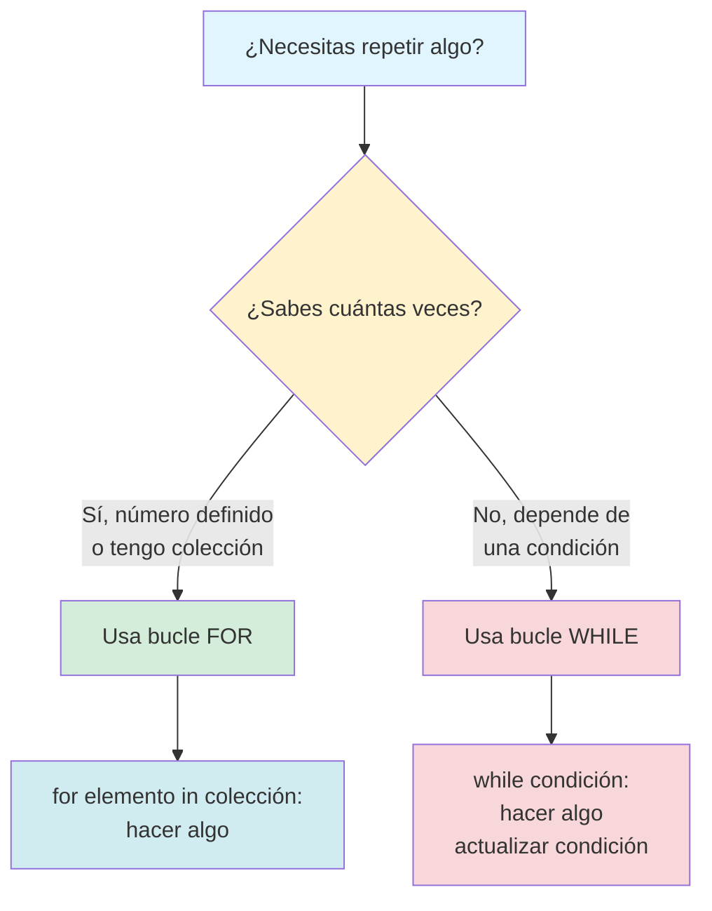
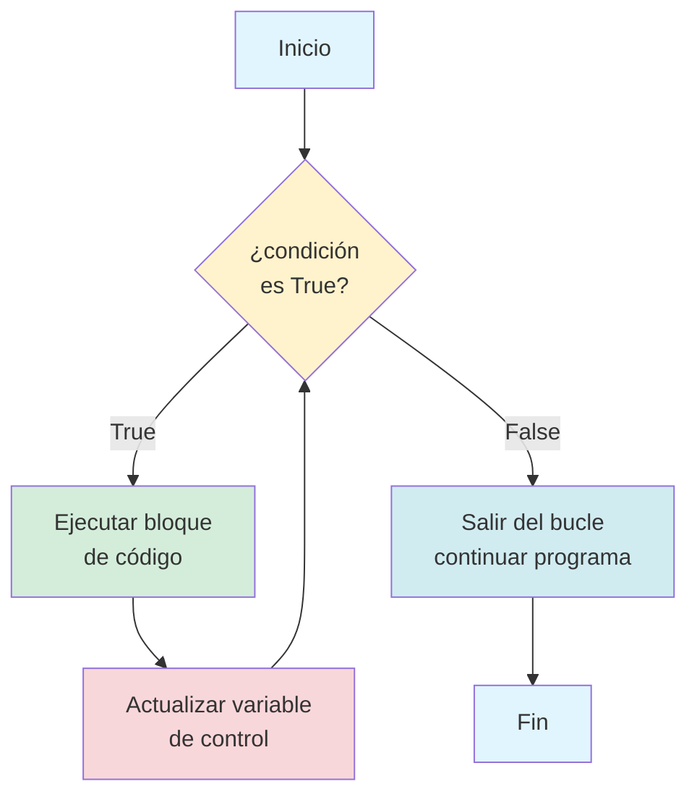
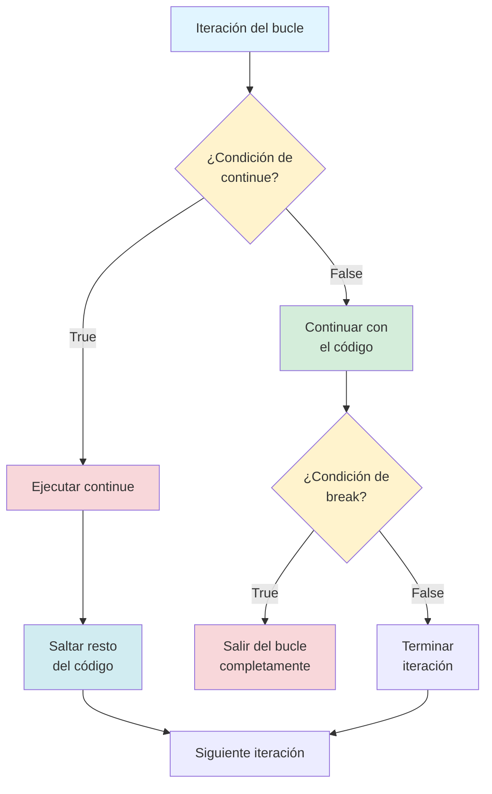

# Capítulo 5: El Poder del Bucle Infinito (y Cómo Controlarlo)

## Introducción: La Máquina que Nunca Se Cansa

Imagina que te pido hacer algo repetitivo: contar del uno al cien, escribir tu nombre mil veces, o revisar cada día del año para encontrar tu cumpleaños. Tu reacción inmediata sería: "¿En serio? ¡Eso va a tomar una eternidad!". Y tendrías razón, porque los humanos nos cansamos, nos aburrimos y cometemos errores cuando hacemos tareas repetitivas.

Pero aquí está lo extraordinario de las computadoras: ellas nunca se cansan. Pueden hacer la misma tarea mil, un millón, o incluso mil millones de veces sin perder velocidad, sin aburrirse y sin equivocarse. Esta capacidad de repetir acciones de forma automática es uno de los superpoderes más importantes de la programación, y se llama **iteración** o, en lenguaje más cotidiano, **bucles**.

En este capítulo vas a dominar dos herramientas fundamentales que transformarán tu forma de pensar sobre los problemas: el bucle `for` y el bucle `while`. Estos no son solo comandos de Python; son patrones de pensamiento que te permitirán automatizar tareas, procesar grandes cantidades de información y construir programas que escalan desde simples contadores hasta sistemas complejos.

La promesa de este capítulo es clara: al terminarlo, nunca más volverás a escribir código repetitivo línea por línea. En lugar de eso, le dirás a Python: "Haz esto cien veces", y Python lo hará sin cuestionarte.

> **💡 Objetivo del Capítulo:**
> Al finalizar este capítulo, dominarás los bucles `for` y `while`, comprenderás cuándo usar cada uno, sabrás cómo evitar y detectar bucles infinitos, entenderás el patrón del acumulador para procesar colecciones de datos, y podrás controlar el flujo de iteración usando `break` y `continue`.

## El Patrón Fundamental: La Repetición con Propósito

Antes de escribir una sola línea de código, necesitamos entender qué hace especial a un bucle. Un bucle no es simplemente "hacer algo muchas veces". Es algo más sofisticado: es **ejecutar un conjunto de instrucciones de manera controlada hasta que se cumpla una condición específica**.

Piensa en un bucle como una pista de atletismo. Los corredores dan vueltas a la pista, pero no lo hacen al azar. Tienen reglas claras: algunos corredores deben dar exactamente diez vueltas (tienen un número definido), otros siguen corriendo hasta que suene una campana (tienen una condición que deben monitorear), y todos siguen el mismo camino marcado en cada vuelta (ejecutan las mismas instrucciones).

En programación, estas dos estrategias se traducen en dos tipos de bucles:

**El bucle `for`** es como el corredor que sabe exactamente cuántas vueltas debe dar. Le dices: "Repite esta acción para cada elemento de este conjunto" o "Hazlo exactamente N veces". Es tu herramienta cuando conoces de antemano la cantidad de repeticiones o tienes una colección de elementos que procesar uno por uno.

**El bucle `while`** es como el corredor que sigue hasta escuchar la campana. Le dices: "Sigue repitiendo estas acciones mientras esta condición sea verdadera". Es tu herramienta cuando no sabes cuántas repeticiones necesitarás, porque dependes de que algo específico ocurra para detenerte.

La clave para dominar los bucles no está en memorizar su sintaxis, sino en desarrollar la intuición para reconocer cuál usar en cada situación. Y esa intuición la construirás con práctica.



## El Bucle FOR: Tu Iterador de Confianza

Empecemos con el bucle `for`, porque es el más intuitivo y el que usarás con mayor frecuencia. La idea central es simple: tienes una colección de elementos (pueden ser números, palabras, datos de cualquier tipo) y quieres hacer algo con cada uno de ellos, de principio a fin.

### La Anatomía de un Bucle FOR

Veamos primero cómo se estructura un bucle `for` en Python:

```python
for elemento in coleccion:
    # Haz algo con elemento
    print(elemento)
```

Descompongamos esta estructura palabra por palabra, porque cada una tiene un propósito específico:

**La palabra `for`** le dice a Python: "Prepárate, voy a pedirte que repitas algo". Es como decir "Para cada uno de los siguientes...".

**La palabra `elemento`** es una variable temporal que tú inventas. En cada repetición del bucle, esta variable tomará el valor de un elemento diferente de la colección. Puedes llamarla como quieras (numero, dato, item, letra), siempre y cuando el nombre tenga sentido para lo que estás procesando.

**La palabra `in`** conecta tu variable temporal con la colección. Literalmente dice: "elemento está en colección". Es la preposición que establece la relación.

**La palabra `coleccion`** es lo que vas a recorrer. Puede ser una lista, un rango de números, un texto (donde cada elemento es una letra), o cualquier estructura iterable.

**Los dos puntos `:`** marcan el final de la declaración del bucle y le dicen a Python: "Todo lo que viene indentado a continuación es lo que quiero que repitas".

**La indentación** (esos espacios al inicio de la siguiente línea) es crucial. En Python, la indentación no es decorativa, es funcional. Define qué instrucciones pertenecen al bucle y cuáles no.

### Tu Primer Bucle: El Contador Automático

Vamos a crear el bucle más clásico: un contador que va del uno al cinco. Pero antes de escribir el código, pensemos en lo que necesitamos. Queremos una colección de números del uno al cinco, y queremos imprimir cada número.

Para generar una secuencia de números en Python, usamos la función `range()`. Esta función crea un rango de números que podemos recorrer. Aquí está el primer detalle técnico importante: `range()` no crea una lista visible, sino un generador eficiente que produce números bajo demanda.

```python
# Contador del 1 al 5
for numero in range(1, 6):
    print(f"Contando: {numero}")
```

Cuando ejecutes este código, verás:

```
Contando: 1
Contando: 2
Contando: 3
Contando: 4
Contando: 5
```

Detente un momento y observa algo crucial: le pedimos `range(1, 6)` pero el último número que imprimió fue 5. Esto no es un error; es una convención de Python. `range(inicio, fin)` genera números desde `inicio` hasta `fin - 1`. El límite superior es **exclusivo**. Piensa en ello como "empieza en 1, pero detente antes de llegar a 6".

Esta convención puede parecer extraña al principio, pero tiene una razón matemática sólida: hace que `range(0, 10)` genere exactamente diez números (del cero al nueve), lo cual es más intuitivo cuando trabajas con índices de listas.

> **💡 Perspectiva del Programador: El Bucle como una Línea de Ensamblaje**
>
> Aquí está la analogía que te ayudará a visualizar cualquier bucle `for`: imagina una línea de ensamblaje en una fábrica. Tienes una cinta transportadora con objetos (tu colección) y una estación de trabajo (tu bloque de código indentado).
>
> Cada objeto pasa por la estación de trabajo uno a uno. Mientras un objeto está en la estación, tú puedes inspeccionarlo, modificarlo, empaquetarlo o descartarlo. Cuando terminas con ese objeto, la cinta automáticamente trae el siguiente. Esto continúa hasta que todos los objetos han pasado por la estación.
>
> En código, "la cinta transportadora" es tu colección, "cada objeto que pasa" es la variable que declaraste después de `for`, y "la estación de trabajo" es tu bloque de código indentado. Python es el supervisor que controla la cinta: trae cada elemento, ejecuta tus instrucciones, y pasa al siguiente sin que tú tengas que pedirlo.

### Variaciones de la Función range()

La función `range()` es increíblemente versátil y puede usarse de tres formas diferentes:

**Con un solo argumento** `range(n)`: genera números desde 0 hasta n-1

```python
for i in range(5):
    print(i)
# Imprime: 0, 1, 2, 3, 4
```

**Con dos argumentos** `range(inicio, fin)`: genera números desde inicio hasta fin-1

```python
for i in range(3, 8):
    print(i)
# Imprime: 3, 4, 5, 6, 7
```

**Con tres argumentos** `range(inicio, fin, paso)`: genera números desde inicio hasta fin-1, incrementando de `paso` en `paso`

```python
for i in range(0, 11, 2):
    print(i)
# Imprime: 0, 2, 4, 6, 8, 10 (solo números pares)

for i in range(10, 0, -1):
    print(i)
# Imprime: 10, 9, 8, 7, 6, 5, 4, 3, 2, 1 (cuenta regresiva)
```

### Recorriendo Listas: Procesando Datos Reales

Los bucles `for` brillan cuando trabajas con listas. Imagina que tienes una lista de calificaciones y necesitas calcular cuáles están por encima del promedio, o tienes una lista de nombres y quieres dar la bienvenida a cada persona individualmente.

```python
# Lista de nombres de un equipo
equipo = ["Ana", "Carlos", "Diana", "Eduardo", "Fernanda"]

# Saludar a cada miembro del equipo
for nombre in equipo:
    print(f"¡Bienvenido al proyecto, {nombre}!")
```

Output esperado:
```
¡Bienvenido al proyecto, Ana!
¡Bienvenido al proyecto, Carlos!
¡Bienvenido al proyecto, Diana!
¡Bienvenido al proyecto, Eduardo!
¡Bienvenido al proyecto, Fernanda!
```

Observa la elegancia de este código. No necesitaste decirle a Python cuántos nombres hay en la lista ni cómo acceder a cada uno. Simplemente dijiste "para cada nombre en el equipo" y Python se encargó del resto. Esta es la belleza del bucle `for`: abstrae la mecánica de la iteración y te deja enfocarte en qué quieres hacer con cada elemento.

### Procesando con Lógica: Condicionales Dentro de Bucles

Uno de los patrones más poderosos en programación es combinar bucles con condicionales. Esto te permite procesar selectivamente elementos de una colección basándote en algún criterio.

```python
# Lista de calificaciones de estudiantes
calificaciones = [85, 72, 90, 65, 88, 95, 70]

# Identificar y felicitar a los que sacaron A (90+)
print("Estudiantes con calificación sobresaliente:")
for nota in calificaciones:
    if nota >= 90:
        print(f"  ¡Excelente! Calificación: {nota}")
```

Output:
```
Estudiantes con calificación sobresaliente:
  ¡Excelente! Calificación: 90
  ¡Excelente! Calificación: 95
```

Este patrón de "filtrar mientras iteras" es extremadamente común. Estás recorriendo todos los elementos, pero solo actuando sobre aquellos que cumplen cierta condición.

### El Patrón del Acumulador: Sumando, Contando, Construyendo

Uno de los patrones más importantes que aprenderás es el **patrón del acumulador**. La idea es simple pero poderosa: empiezas con un valor inicial (generalmente cero o una lista vacía) y en cada iteración del bucle, agregas algo a ese acumulador.

**Ejemplo 1: Calculando el promedio de calificaciones**

```python
calificaciones = [85, 92, 78, 90, 88]

# Inicializar el acumulador
suma_total = 0

# Acumular la suma de todas las calificaciones
for nota in calificaciones:
    suma_total = suma_total + nota
    # Equivalente compacto: suma_total += nota

# Calcular el promedio después del bucle
promedio = suma_total / len(calificaciones)
print(f"Promedio del curso: {promedio}")
```

Output:
```
Promedio del curso: 88.6
```

Nota el patrón de tres pasos:
1. **Inicializar** el acumulador antes del bucle (`suma_total = 0`)
2. **Actualizar** el acumulador en cada iteración (`suma_total += nota`)
3. **Usar** el valor acumulado después del bucle (`promedio = suma_total / len(calificaciones)`)

**Ejemplo 2: Contando elementos que cumplen una condición**

```python
temperaturas = [22, 28, 31, 26, 33, 29, 35, 27]

# Contar cuántos días hizo calor (>30 grados)
dias_calurosos = 0

for temp in temperaturas:
    if temp > 30:
        dias_calurosos += 1

print(f"Hubo {dias_calurosos} días con más de 30 grados")
```

Output:
```
Hubo 3 días con más de 30 grados
```

**Ejemplo 3: Construyendo una nueva lista filtrada**

```python
numeros = [15, 8, 23, 4, 16, 42, 11, 7]

# Crear una lista solo con números pares
pares = []

for num in numeros:
    if num % 2 == 0:  # Si es divisible por 2
        pares.append(num)

print(f"Números pares: {pares}")
```

Output:
```
Números pares: [8, 4, 16, 42]
```

> **📝 Nota:**
> El patrón del acumulador es tan fundamental que aparece en prácticamente todos los programas que procesan datos. Ya sea sumando valores, contando ocurrencias, o construyendo nuevas estructuras, el patrón siempre es el mismo: inicializar, iterar y acumular, luego usar el resultado.

## El Bucle WHILE: Iteración Basada en Condiciones

Mientras que el bucle `for` es perfecto cuando sabes exactamente qué quieres iterar, el bucle `while` brilla en situaciones donde la cantidad de iteraciones depende de una condición dinámica que puede cambiar durante la ejecución del programa.

### La Anatomía de un Bucle WHILE

La estructura básica de un bucle `while` es:

```python
while condicion:
    # Código que se repite mientras la condición sea True
    # IMPORTANTE: Aquí debe haber algo que eventualmente haga la condición False
```

El bucle `while` evalúa la condición antes de cada iteración. Si la condición es `True`, ejecuta el bloque de código indentado. Si la condición es `False`, salta completamente el bucle y continúa con el resto del programa.



### Tu Primer Bucle WHILE: Cuenta Regresiva

Empecemos con un ejemplo simple: una cuenta regresiva desde 5 hasta 1.

```python
contador = 5

while contador > 0:
    print(f"Cuenta regresiva: {contador}")
    contador -= 1  # Esto es crucial: reduce el contador en 1

print("¡Despegue!")
```

Output:
```
Cuenta regresiva: 5
Cuenta regresiva: 4
Cuenta regresiva: 3
Cuenta regresiva: 2
Cuenta regresiva: 1
¡Despegue!
```

Observa la estructura:
1. **Antes del bucle**: Inicializamos `contador = 5`
2. **Condición del bucle**: `contador > 0` (se evalúa antes de cada iteración)
3. **Dentro del bucle**: Imprimimos el contador y luego lo decrementamos
4. **Después del bucle**: Cuando `contador` llega a 0, la condición se vuelve `False` y salimos

> **⚠️ Advertencia Crítica - El Peligro del Bucle Infinito:**
> La línea `contador -= 1` es absolutamente crucial. Sin ella, `contador` siempre valdría 5, la condición `contador > 0` siempre sería `True`, y el bucle nunca terminaría. Esto se llama un **bucle infinito** y es uno de los bugs más comunes (y frustrantes) en programación.
>
> Si accidentalmente creas un bucle infinito en Google Colab, tu celda seguirá ejecutándose indefinidamente. Verás un indicador giratorio que nunca se detiene. Para detenerlo, haz clic en el botón de "stop" (cuadrado) junto a la celda.

### Bucle WHILE para Validación de Entrada

Uno de los usos más prácticos del bucle `while` es validar la entrada del usuario, repitiéndose hasta que ingrese algo válido.

```python
# Pedir un número positivo hasta que el usuario lo haga correctamente
numero = -1  # Valor inicial que garantiza entrar al bucle

while numero <= 0:
    numero = int(input("Ingresa un número positivo: "))
    
    if numero <= 0:
        print("Error: el número debe ser mayor que cero. Intenta de nuevo.")

print(f"¡Perfecto! Ingresaste el número {numero}")
```

Este patrón es extremadamente común en programas interactivos. El bucle se repite mientras la entrada sea inválida, dando al usuario tantas oportunidades como necesite para corregir su error.

### Comparación: FOR vs WHILE con el Mismo Problema

Para entender cuándo usar cada bucle, veamos cómo resolverías el mismo problema con ambos:

**Problema**: Sumar los números del 1 al 10

**Solución con FOR:**
```python
suma = 0
for i in range(1, 11):
    suma += i
print(f"La suma es: {suma}")
```

**Solución con WHILE:**
```python
suma = 0
i = 1
while i <= 10:
    suma += i
    i += 1
print(f"La suma es: {suma}")
```

Ambos producen el mismo resultado (55), pero nota la diferencia:
- El bucle `for` es más conciso y menos propenso a errores (no puedes olvidar incrementar `i` porque Python lo hace automáticamente)
- El bucle `while` te da más control pero requiere que manejes manualmente la inicialización y actualización de la variable de control

**Regla práctica**: Si sabes cuántas iteraciones necesitas, usa `for`. Si la cantidad depende de una condición que puede cambiar impredeciblemente, usa `while`.

## Control Avanzado de Flujo: BREAK y CONTINUE

A veces necesitas un control más fino sobre tus bucles. Quizás quieras salir de un bucle antes de que termine naturalmente, o quizás quieras saltar el resto de la iteración actual y pasar a la siguiente. Para esto existen `break` y `continue`.

### La Instrucción BREAK: Salida de Emergencia

`break` termina el bucle inmediatamente, sin importar la condición o cuántos elementos quedan por procesar.

```python
# Buscar el primer número negativo en una lista
numeros = [15, 42, 8, -3, 22, 10]

for num in numeros:
    if num < 0:
        print(f"Encontré el primer número negativo: {num}")
        break  # Salir del bucle inmediatamente
    print(f"Revisando: {num}")

print("Búsqueda terminada")
```

Output:
```
Revisando: 15
Revisando: 42
Revisando: 8
Encontré el primer número negativo: -3
Búsqueda terminada
```

Nota que una vez que encontramos `-3`, el `break` terminó el bucle. Los números 22 y 10 nunca se procesaron, porque no era necesario.

**Caso de uso típico**: Buscar algo específico en una colección y detenerse tan pronto como lo encuentres, ahorrando tiempo de procesamiento.

### La Instrucción CONTINUE: Saltar a la Siguiente Iteración

`continue` salta el resto del código en la iteración actual y pasa inmediatamente a la siguiente iteración del bucle.

```python
# Imprimir solo números pares, saltando los impares
for i in range(1, 11):
    if i % 2 != 0:  # Si es impar
        continue  # Saltar al siguiente número
    print(f"Número par: {i}")
```

Output:
```
Número par: 2
Número par: 4
Número par: 6
Número par: 8
Número par: 10
```

Cuando `i` es impar, `continue` hace que Python salte el `print` y pase directamente al siguiente valor de `i`.

**Caso de uso típico**: Filtrar elementos que no quieres procesar sin anidar todo tu código en un `if`.



### Ejemplo Integrador: Sistema de Login con Límite de Intentos

Combinemos `while`, `break` y validación en un ejemplo realista:

```python
intentos = 0
max_intentos = 3
password_correcta = "Python2024"
acceso_concedido = False

while intentos < max_intentos:
    password = input("Ingresa la contraseña: ")
    intentos += 1
    
    if password == password_correcta:
        print("¡Acceso concedido!")
        acceso_concedido = True
        break  # Salir del bucle porque ya autenticamos
    else:
        intentos_restantes = max_intentos - intentos
        if intentos_restantes > 0:
            print(f"Contraseña incorrecta. Te quedan {intentos_restantes} intentos.")
        else:
            print("Contraseña incorrecta.")

if not acceso_concedido:
    print("Cuenta bloqueada. Has agotado tus intentos.")
```

Este ejemplo muestra varios patrones profesionales:
1. Límite de intentos con un contador
2. Uso de una variable booleana (`acceso_concedido`) para rastrear el estado
3. `break` para salir tan pronto como el objetivo se logra
4. Retroalimentación clara al usuario sobre cuántos intentos le quedan

## Bucles Anidados: Iteración Dentro de Iteración

Así como puedes anidar condicionales, también puedes anidar bucles. Esto significa tener un bucle dentro de otro bucle, lo cual es útil para trabajar con estructuras bidimensionales o cuando necesitas combinar elementos de múltiples colecciones.

### Entendiendo la Mecánica de Bucles Anidados

Cuando tienes un bucle dentro de otro, el bucle interno se ejecuta **completamente** en cada iteración del bucle externo.

```python
# Tabla de multiplicar del 1 al 3
for i in range(1, 4):  # Bucle externo: las tablas
    print(f"\nTabla del {i}:")
    for j in range(1, 6):  # Bucle interno: los multiplicadores
        resultado = i * j
        print(f"  {i} × {j} = {resultado}")
```

Output:
```
Tabla del 1:
  1 × 1 = 1
  1 × 2 = 2
  1 × 3 = 3
  1 × 4 = 4
  1 × 5 = 5

Tabla del 2:
  2 × 1 = 2
  2 × 2 = 4
  2 × 3 = 6
  2 × 4 = 8
  2 × 5 = 10

Tabla del 3:
  3 × 1 = 3
  3 × 2 = 6
  3 × 3 = 9
  3 × 4 = 12
  3 × 5 = 15
```

Para cada valor de `i` (1, 2, 3), el bucle interno ejecuta todas sus iteraciones (j de 1 a 5). Es como tener una rueda dentro de otra rueda: la rueda interna da vueltas completas por cada muesca que avanza la rueda externa.

### Ejemplo Práctico: Generador de Combinaciones

```python
colores = ["rojo", "azul", "verde"]
tamaños = ["S", "M", "L"]

print("Inventario de camisetas:")
for color in colores:
    for tamaño in tamaños:
        print(f"  - Camiseta {color} talla {tamaño}")
```

Output:
```
Inventario de camisetas:
  - Camiseta rojo talla S
  - Camiseta rojo talla M
  - Camiseta rojo talla L
  - Camiseta azul talla S
  - Camiseta azul talla M
  - Camiseta azul talla L
  - Camiseta verde talla S
  - Camiseta verde talla M
  - Camiseta verde talla L
```

Este patrón de bucles anidados genera todas las combinaciones posibles entre dos listas, que es extremadamente útil en comercio electrónico, análisis de datos y muchos otros contextos.

> **⚠️ Advertencia de Rendimiento:**
> Los bucles anidados pueden volverse muy costosos en términos de tiempo de ejecución. Si el bucle externo tiene N iteraciones y el interno M iteraciones, el bloque de código interno se ejecutará N × M veces. Con bucles de 1000 × 1000, estás hablando de un millón de ejecuciones. Ten esto en mente al diseñar algoritmos.

## Laboratorio 1: Generador de Tabla de Multiplicar Personalizada

### Objetivo
Crear un programa que genere tablas de multiplicar usando bucles `for` anidados y permita al usuario personalizar el rango.

### Instrucciones

Tu programa debe:

1. Pedir al usuario qué tabla quiere (número del 1 al 12)
2. Pedir hasta qué número quiere multiplicar (por ejemplo, hasta el 10 o hasta el 20)
3. Generar y mostrar la tabla completa con formato claro

**Ejemplo de ejecución:**

```
=== GENERADOR DE TABLAS DE MULTIPLICAR ===

¿Qué tabla quieres generar? (1-12): 7
¿Hasta qué número quieres multiplicar?: 15

TABLA DEL 7:
7 × 1 = 7
7 × 2 = 14
7 × 3 = 21
...
7 × 15 = 105
```

### Criterio de Éxito

- El programa genera correctamente la tabla solicitada
- Los cálculos son matemáticamente correctos
- El formato es claro y legible
- Maneja entrada del usuario usando `int(input())`

### Desafío Extra

Modifica tu programa para generar múltiples tablas en un solo rango. Por ejemplo, si el usuario pide "del 5 al 7", debe mostrar las tablas del 5, 6 y 7.

## Laboratorio 2: Calculadora de Promedio con Acumulador

### Objetivo
Practicar el patrón del acumulador procesando una lista de calificaciones.

### Contexto

Los profesores necesitan calcular promedios de calificaciones constantemente. Vas a crear una herramienta que automatice este cálculo usando bucles y acumuladores.

### Instrucciones

Tu programa debe procesar esta lista predefinida de calificaciones:

```python
calificaciones = [85, 92, 78, 90, 88, 76, 95, 82]
```

Pasos a seguir:

1. Crea dos acumuladores: `suma_total` (comienza en 0) y `contador` (comienza en 0)
2. Usa un bucle `for` para recorrer las calificaciones
3. En cada iteración, agrega la calificación a `suma_total` e incrementa `contador`
4. Después del bucle, calcula el promedio dividiendo `suma_total` entre `contador`
5. Imprime un reporte mostrando: cantidad de calificaciones, suma total y promedio (redondeado a un decimal)

**Criterio de éxito - Tu programa debe imprimir:**

```
Calificaciones procesadas: 8
Suma total de puntos: 686
Promedio: 85.8
```

### Desafío Extra

Modifica tu programa para que también identifique y muestre la calificación más alta y la más baja. Necesitarás acumuladores adicionales que empiecen con el primer valor de la lista.

## Laboratorio 3: Validador de Contraseñas Robusto

### Objetivo
Integrar bucles `while`, validación compleja, condicionales y control de flujo con `break` y `continue`.

### Contexto

Los sistemas de seguridad modernos no aceptan cualquier contraseña. Vas a crear un validador que implemente reglas de seguridad reales.

### Reglas de Seguridad

La contraseña debe cumplir TODAS estas reglas:
1. Tener al menos 8 caracteres de longitud
2. Contener al menos un número
3. El usuario tiene máximo 3 intentos

### Instrucciones Paso a Paso

1. Crea un contador de intentos que empiece en 0
2. Crea un bucle `while` que continúe mientras `intentos < 3`
3. Dentro del bucle, pide la contraseña al usuario
4. Verifica la longitud (Regla 1). Si falla, muestra mensaje de error y usa `continue`
5. Verifica si contiene números (Regla 2). Para esto, recorre cada carácter con un bucle `for` y usa `.isdigit()`. Si no encuentra números, muestra error y usa `continue`
6. Si pasa ambas verificaciones, muestra "¡Contraseña segura aceptada!" y usa `break`
7. Incrementa el contador de intentos
8. Después del bucle `while`, verifica si se agotaron los intentos y muestra mensaje apropiado

**Criterio de éxito - Caso 1:**

Input: "hola", "holamundo", "hola1234"

Output esperado:
```
Error: la contraseña debe tener al menos 8 caracteres
Error: la contraseña debe contener al menos un número
¡Contraseña segura aceptada!
```

**Criterio de éxito - Caso 2:**

Input: "hola", "hi", "bye"

Output esperado:
```
Error: la contraseña debe tener al menos 8 caracteres
Error: la contraseña debe tener al menos 8 caracteres
Error: la contraseña debe tener al menos 8 caracteres
Acceso bloqueado. Intentos agotados.
```

### Desafío Extra

Agrega una regla adicional: la contraseña debe contener al menos una letra mayúscula. Verifica esto con `.isupper()`.

## Para Recordar

Para ayudarte a decidir rápidamente qué tipo de bucle usar en cada situación, aquí tienes una guía de referencia:

| Aspecto | Bucle FOR | Bucle WHILE |
|---------|-----------|-------------|
| **Cuándo usarlo** | Cuando conoces cuántas repeticiones necesitas o tienes una colección definida para recorrer | Cuando la cantidad de repeticiones depende de una condición que puede cambiar dinámicamente |
| **Control del contador** | Automático (Python maneja la variable de iteración por ti) | Manual (tú debes inicializar y actualizar la variable de control) |
| **Riesgo de bucle infinito** | Muy bajo (el bucle termina automáticamente al acabar la colección) | Alto si olvidas actualizar la condición dentro del bucle |
| **Ejemplo típico** | Recorrer una lista de nombres para saludar a cada persona | Validar entrada del usuario hasta que ingrese un valor correcto |
| **Código ejemplo** | `for i in range(10):` | `while saldo > 0:` |

El patrón del acumulador es fundamental en programación. Siempre sigue tres pasos: inicializar el acumulador antes del bucle, actualizar el acumulador en cada iteración, y usar el valor acumulado después del bucle.

Las instrucciones `break` y `continue` te dan control fino sobre el flujo de iteración. `break` termina el bucle inmediatamente, mientras que `continue` salta al siguiente ciclo sin ejecutar el resto del código en la iteración actual.

Los bucles anidados ejecutan el bucle interno completamente por cada iteración del bucle externo. Esto es útil para generar combinaciones, trabajar con estructuras bidimensionales, o procesar relaciones entre múltiples colecciones. Ten cuidado con el rendimiento cuando ambos bucles tienen muchas iteraciones.

## Preguntas de Reflexión

1. Piensa en una tarea repetitiva que hagas regularmente en tu vida diaria (puede ser algo físico o digital). ¿Cómo describirías esa tarea como un algoritmo con un bucle? ¿Sería más apropiado un bucle `for` o un bucle `while`? ¿Por qué?

2. Los bucles infinitos son generalmente errores, pero hay situaciones donde son intencionales (como un servidor que debe estar siempre escuchando conexiones). ¿Puedes pensar en otros ejemplos del mundo real donde un "bucle infinito" es exactamente lo que necesitas?

3. El patrón del acumulador es tan fundamental que aparece en casi todos los programas de procesamiento de datos. ¿Puedes identificar ejemplos de "acumuladores" en aplicaciones que usas diariamente? Por ejemplo, ¿cómo crees que Instagram cuenta tus likes totales, o cómo Spotify calcula tus minutos escuchados?

4. Los bucles anidados pueden volverse muy profundos (un bucle dentro de otro dentro de otro). ¿En qué punto crees que esto se vuelve demasiado complejo? ¿Cómo decidirías cuándo simplificar la lógica?

5. Ahora que puedes automatizar tareas repetitivas, ¿qué tipo de problemas se vuelven más fáciles de resolver? ¿Hay algún proyecto personal que podrías abordar usando bucles?

## Cierre: El Camino Recorrido y lo que Viene

En este capítulo has dado un salto gigantesco en tu poder como programador. Antes de este capítulo, tus programas ejecutaban instrucciones secuencialmente, una después de otra, tomando decisiones ocasionales con `if`. Ahora puedes crear programas que procesan cientos, miles o millones de elementos sin escribir código repetitivo.

Dominar los bucles cambia tu forma de pensar. Ya no te preguntas "¿Cómo hago esta tarea cinco veces?", sino "¿Cómo puedo automatizar este proceso independientemente de cuántas veces necesite ejecutarse?". Esta es la mentalidad de un verdadero programador.

Pero hay algo que aún falta en tu arsenal de herramientas: una forma elegante de organizar y acceder a grandes cantidades de datos relacionados. Hasta ahora has trabajado con listas simples, pero ¿qué pasa cuando necesitas guardar información más compleja, como los datos de contacto de cien personas, cada una con nombre, teléfono y correo electrónico? ¿O cuando necesitas representar un inventario donde cada producto tiene múltiples atributos?

En el próximo capítulo descubrirás las estructuras de datos más versátiles de Python: listas (que ya conoces pero expandirás), tuplas (listas inmutables con superpoderes específicos) y diccionarios (la estructura que cambiará para siempre cómo piensas sobre organizar información). Estas herramientas, combinadas con el poder de iteración que acabas de dominar, te permitirán construir programas que manejen datos complejos del mundo real con elegancia y eficiencia.

Prepárate para organizar información como nunca antes lo habías imaginado.