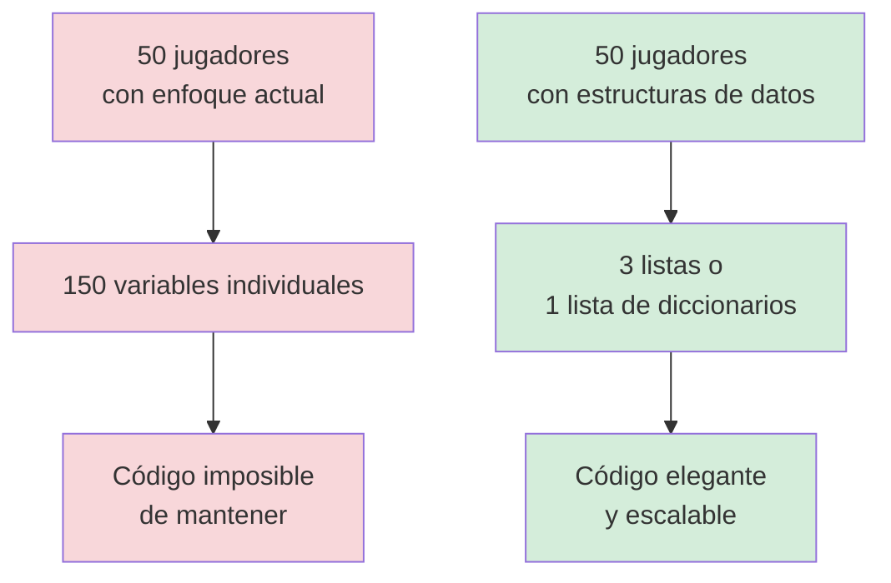
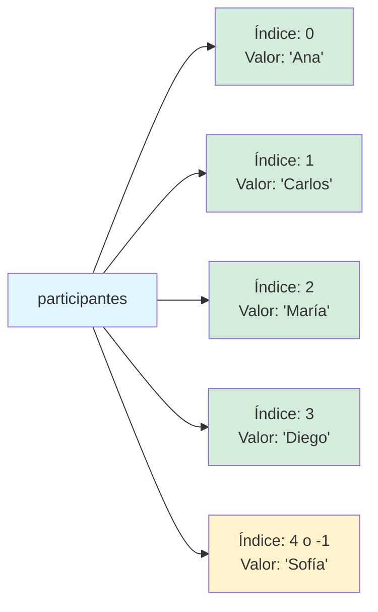
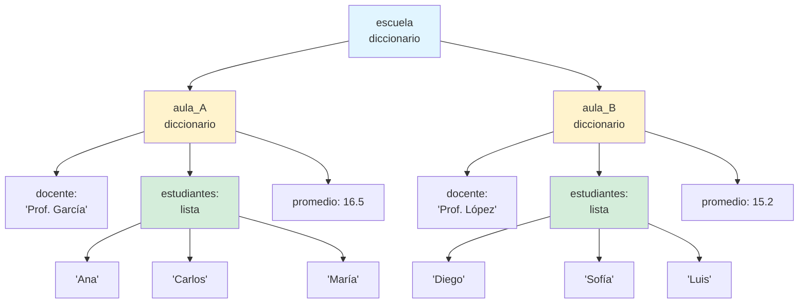
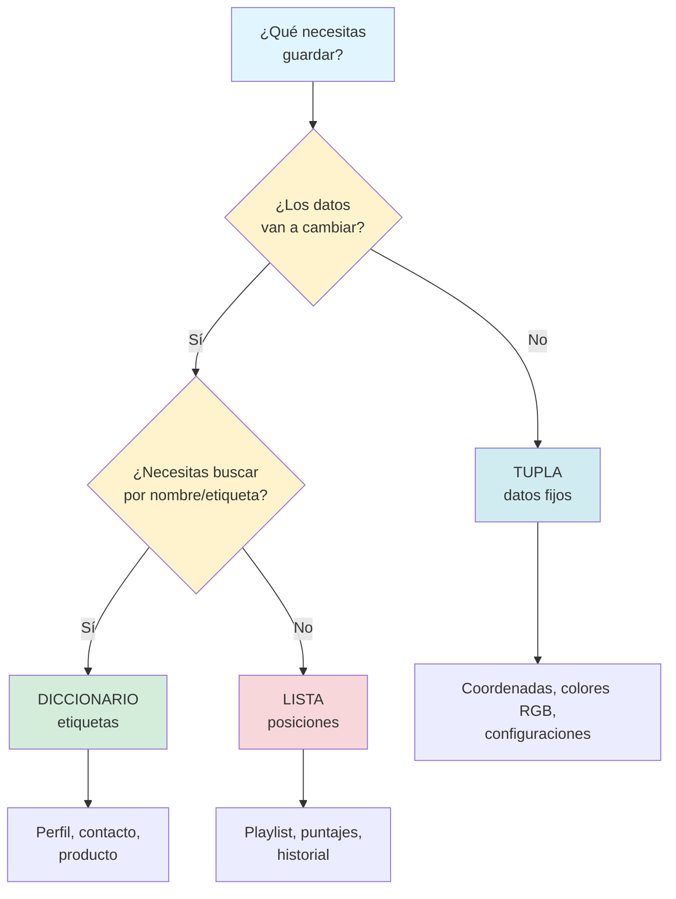

# Capítulo 6: Cajas Mágicas y Estanterías Ordenadas — Listas, Tuplas y Diccionarios

## Introducción: El Problema de la Memoria Desbordada

Imagina que estás organizando un torneo de tu videojuego favorito. Necesitas registrar el nombre de cada participante, su puntaje y su nivel de experiencia. Con lo que has aprendido hasta ahora, tu código podría verse así:

```python
jugador1_nombre = "Ana"
jugador1_puntaje = 850
jugador1_nivel = "Avanzado"

jugador2_nombre = "Carlos"
jugador2_puntaje = 620
jugador2_nivel = "Intermedio"

jugador3_nombre = "María"
jugador3_puntaje = 950
jugador3_nivel = "Experto"
```

Ahora imagina que tienes 50 jugadores. O 100. O 1,000. ¿Vas a crear 3,000 variables diferentes? Claramente, hay un problema aquí. Necesitas una forma de organizar información relacionada sin crear una variable para cada pequeño dato. Necesitas lo que los programadores llaman **estructuras de datos**.

En este capítulo descubrirás tres herramientas fundamentales que te permitirán organizar información de forma inteligente: las **listas** (para colecciones ordenadas que puedes modificar), las **tuplas** (para datos que no deben cambiar) y los **diccionarios** (para relacionar información mediante etiquetas). Son como diferentes tipos de contenedores, cada uno diseñado para un propósito específico.

> **💡 Objetivo del Capítulo:**
> Al finalizar este capítulo, dominarás las tres estructuras de datos fundamentales de Python: listas, tuplas y diccionarios. Comprenderás cuándo usar cada una, cómo manipularlas eficientemente, cómo anidarlas para crear estructuras complejas, y cómo elegir la estructura correcta para cada situación de programación.

## Perspectiva del Programador: El Problema de Escala

Detente un momento y piensa en lo que acabas de ver. Para tres jugadores necesitaste nueve variables diferentes. Si tuvieras que escribir código para calcular el promedio de puntajes de estos tres jugadores, tendrías que escribir algo como:

```python
promedio = (jugador1_puntaje + jugador2_puntaje + jugador3_puntaje) / 3
```

Ahora imagina que tienes cincuenta jugadores. La línea de código para calcular el promedio tendría que sumar cincuenta variables diferentes, una línea de código de más de quinientos caracteres. ¿Y si luego quieres agregar un jugador más? Tendrías que crear tres variables nuevas y modificar esa línea gigante de código.

Aquí está la revelación: los programas reales no manejan tres datos, manejan miles o millones. Un sistema de registro escolar tiene información de todos los estudiantes. Una tienda en línea tiene catálogos de todos sus productos. Una red social almacena perfiles de millones de usuarios. Si usaras el enfoque de una variable por cada dato, sería literalmente imposible programar estas aplicaciones.

Las estructuras de datos resuelven exactamente este problema. Te permiten agrupar información relacionada bajo un solo nombre y trabajar con ella usando patrones repetibles en lugar de escribir código único para cada elemento. Este es uno de los conceptos más fundamentales en toda la programación, la diferencia entre código que funciona con tres elementos y código que funciona con tres millones.



## Las Listas: Tu Inventario Digital Flexible

Piensa en el inventario de un personaje en un videojuego de aventuras. Tienes espacios numerados donde guardas objetos: en la posición 1 tienes una espada, en la posición 2 una poción, en la posición 3 un mapa. Puedes agregar objetos nuevos cuando los encuentras, eliminar los que usas y reordenar todo según tus necesidades. Eso es exactamente lo que hace una lista en Python.

Una lista es una colección ordenada de elementos donde cada elemento tiene una posición específica, llamada **índice**. La característica más importante de las listas es que son **mutables**, lo que significa que puedes cambiar su contenido después de crearlas.

### Creando tu Primera Lista

La sintaxis para crear una lista es simple: usas corchetes `[]` y separas los elementos con comas.

```python
# Una lista de nombres de participantes
participantes = ["Ana", "Carlos", "María", "Diego", "Sofía"]

# Una lista de puntajes correspondientes
puntajes = [850, 620, 950, 720, 880]

# Una lista vacía que llenarás después
nuevos_registros = []

# Incluso puedes tener listas con tipos de datos mezclados
informacion_jugador = ["Ana", 850, "Avanzado", True]
```

Observa cómo ahora cinco participantes ocupan una sola variable en lugar de cinco. Este es el primer superpoder de las listas: la capacidad de agrupar información relacionada.

### El Sistema de Índices: Contando Desde Cero

Aquí viene algo que al principio puede parecer extraño, pero que pronto entenderás como completamente lógico: en programación, **siempre contamos desde cero**. El primer elemento de una lista está en la posición 0, el segundo en la posición 1, y así sucesivamente.

¿Por qué? Imagina que los índices no son números de posición, sino **desplazamientos desde el inicio**. El primer elemento no necesita desplazamiento (está en la posición 0), el segundo necesita un desplazamiento de 1 posición, el tercero de 2 posiciones, y así sucesivamente. Esta lógica hace que muchas operaciones matemáticas en programación sean más simples.

```python
participantes = ["Ana", "Carlos", "María", "Diego", "Sofía"]

# Acceder a elementos individuales
primer_participante = participantes[0]  # "Ana"
segundo_participante = participantes[1]  # "Carlos"
ultimo_participante = participantes[4]  # "Sofía"

print(f"El primer participante es {primer_participante}")
print(f"El último participante es {ultimo_participante}")
```

Output esperado:
```
El primer participante es Ana
El último participante es Sofía
```

Python también te permite acceder a elementos desde el final usando índices negativos. Piensa en esto como contar hacia atrás: `-1` es el último elemento, `-2` es el penúltimo, y así sucesivamente.

```python
participantes = ["Ana", "Carlos", "María", "Diego", "Sofía"]

# Acceder desde el final
ultimo = participantes[-1]      # "Sofía"
penultimo = participantes[-2]   # "Diego"

print(f"Último: {ultimo}, Penúltimo: {penultimo}")
```

Output esperado:
```
Último: Sofía, Penúltimo: Diego
```



### Modificando Listas: Agregar, Eliminar y Cambiar

Las listas son dinámicas. Puedes cambiar su contenido de muchas maneras diferentes, y cada método tiene su propósito específico.

**Agregar elementos:**

```python
participantes = ["Ana", "Carlos", "María"]

# append() añade un elemento al final
participantes.append("Diego")
print(f"Después de append: {participantes}")

# insert() añade un elemento en una posición específica
participantes.insert(1, "Laura")  # Inserta en la posición 1
print(f"Después de insert: {participantes}")
```

Output esperado:
```
Después de append: ['Ana', 'Carlos', 'María', 'Diego']
Después de insert: ['Ana', 'Laura', 'Carlos', 'María', 'Diego']
```

Observa cómo `append()` es como agregar un objeto al final de tu inventario, mientras que `insert()` es como hacer espacio en medio para colocar algo específico allí.

**Eliminar elementos:**

```python
participantes = ["Ana", "Carlos", "María", "Diego", "Sofía"]

# remove() elimina la primera aparición de un valor específico
participantes.remove("María")
print(f"Después de remove: {participantes}")

# pop() elimina y retorna el elemento en una posición específica
ultimo_eliminado = participantes.pop()  # Sin argumento, elimina el último
print(f"Eliminado: {ultimo_eliminado}")
print(f"Lista actual: {participantes}")

# pop con índice específico
segundo_eliminado = participantes.pop(1)  # Elimina el elemento en posición 1
print(f"Eliminado: {segundo_eliminado}")
print(f"Lista actual: {participantes}")
```

Output esperado:
```
Después de remove: ['Ana', 'Carlos', 'Diego', 'Sofía']
Eliminado: Sofía
Lista actual: ['Ana', 'Carlos', 'Diego']
Eliminado: Carlos
Lista actual: ['Ana', 'Diego']
```

**Modificar elementos existentes:**

```python
puntajes = [850, 620, 950, 720, 880]

# Cambiar un valor específico accediendo por índice
puntajes[1] = 700  # Cambiar el puntaje de Carlos de 620 a 700

print(f"Puntajes actualizados: {puntajes}")
```

Output esperado:
```
Puntajes actualizados: [850, 700, 950, 720, 880]
```

> **⚠️ Errores Comunes:**
> **Error #1 - Índice fuera de rango:**
> ```python
> participantes = ["Ana", "Carlos", "María"]
> print(participantes[5])  # ❌ IndexError: list index out of range
> # La lista solo tiene 3 elementos (índices 0, 1, 2)
> ```
>
> **Error #2 - Intentar eliminar un valor que no existe:**
> ```python
> participantes = ["Ana", "Carlos"]
> participantes.remove("María")  # ❌ ValueError: 'María' not in list
> ```
>
> **Error #3 - Confundir remove() con pop():**
> ```python
> # remove() busca por valor
> lista.remove("Ana")  # Elimina el elemento que contiene "Ana"
> 
> # pop() trabaja con posiciones
> lista.pop(0)  # Elimina el elemento en la posición 0
> ```

### Métodos Útiles de Listas

Python proporciona muchos métodos incorporados para trabajar con listas eficientemente:

```python
numeros = [3, 1, 4, 1, 5, 9, 2, 6]

# len() - Longitud de la lista
cantidad = len(numeros)
print(f"La lista tiene {cantidad} elementos")

# sort() - Ordenar la lista en su lugar (modifica la original)
numeros.sort()
print(f"Lista ordenada: {numeros}")

# sorted() - Retorna una nueva lista ordenada (no modifica la original)
numeros = [3, 1, 4, 1, 5, 9, 2, 6]
ordenados = sorted(numeros)
print(f"Original: {numeros}")
print(f"Ordenados: {ordenados}")

# reverse() - Invertir el orden de la lista
numeros.reverse()
print(f"Invertida: {numeros}")

# count() - Contar cuántas veces aparece un valor
apariciones = numeros.count(1)
print(f"El número 1 aparece {apariciones} veces")

# index() - Encontrar la posición de un valor
posicion = numeros.index(5)
print(f"El número 5 está en la posición {posicion}")
```

### Slicing: Cortando Rebanadas de Listas

El slicing (rebanado) te permite extraer porciones de una lista usando la sintaxis `lista[inicio:fin:paso]`.

```python
participantes = ["Ana", "Carlos", "María", "Diego", "Sofía", "Luis", "Elena"]

# Obtener los primeros 3 participantes
primeros_tres = participantes[0:3]  # O simplemente: participantes[:3]
print(f"Primeros tres: {primeros_tres}")

# Obtener desde la posición 2 hasta el final
desde_tercero = participantes[2:]
print(f"Desde el tercero: {desde_tercero}")

# Obtener los últimos 2
ultimos_dos = participantes[-2:]
print(f"Últimos dos: {ultimos_dos}")

# Obtener elementos alternados (cada 2 posiciones)
alternados = participantes[::2]
print(f"Alternados: {alternados}")

# Invertir la lista usando slicing
invertida = participantes[::-1]
print(f"Invertida: {invertida}")
```

Output esperado:
```
Primeros tres: ['Ana', 'Carlos', 'María']
Desde el tercero: ['María', 'Diego', 'Sofía', 'Luis', 'Elena']
Últimos dos: ['Luis', 'Elena']
Alternados: ['Ana', 'María', 'Sofía', 'Elena']
Invertida: ['Elena', 'Luis', 'Sofía', 'Diego', 'María', 'Carlos', 'Ana']
```

> **📝 Nota:**
> El slicing no modifica la lista original, sino que crea una nueva lista con los elementos seleccionados. Esto es útil cuando quieres trabajar con una porción de datos sin alterar los originales.

### Listas y Bucles: El Dúo Dinámico

Las listas fueron hechas para trabajar con bucles. Recuerda el patrón que aprendiste en el capítulo anterior:

```python
puntajes = [850, 620, 950, 720, 880]

# Procesar cada puntaje
for puntaje in puntajes:
    if puntaje >= 800:
        print(f"Puntaje sobresaliente: {puntaje}")

# Calcular el promedio usando el patrón del acumulador
suma = 0
for puntaje in puntajes:
    suma += puntaje
promedio = suma / len(puntajes)
print(f"Promedio del torneo: {promedio}")
```

Output esperado:
```
Puntaje sobresaliente: 850
Puntaje sobresaliente: 950
Puntaje sobresaliente: 880
Promedio del torneo: 804.0
```

Cuando necesitas tanto el índice como el valor, usa `enumerate()`:

```python
participantes = ["Ana", "Carlos", "María"]

for indice, nombre in enumerate(participantes):
    print(f"Posición {indice + 1}: {nombre}")
```

Output esperado:
```
Posición 1: Ana
Posición 2: Carlos
Posición 3: María
```

## Las Tuplas: Datos Inmutables para Seguridad y Eficiencia

Las tuplas son como listas con un superpoder especial: una vez creadas, no puedes modificarlas. Esta inmutabilidad puede parecer una limitación, pero en realidad es una característica poderosa que Python usa para garantizar que ciertos datos permanezcan constantes.

### ¿Por Qué Usar Tuplas?

Imagina que estás programando un juego y defines las coordenadas del punto de inicio: `(0, 0)`. No quieres que este valor cambie accidentalmente durante la ejecución del juego. O piensa en los colores RGB donde cada color se define por tres valores fijos. Las tuplas son perfectas para estos casos.

### Creando Tuplas

Las tuplas se crean usando paréntesis `()` en lugar de corchetes:

```python
# Tupla de coordenadas
punto = (10, 20)

# Color RGB (Rojo, Verde, Azul)
color_favorito = (255, 128, 0)  # Naranja

# Información que no debe cambiar
configuracion = ("1920x1080", 60, "Alta")  # Resolución, FPS, Calidad

# Tupla de un solo elemento (nota la coma)
singleton = (42,)  # La coma es necesaria para distinguirla de paréntesis matemáticos
```

### Accediendo a Elementos de Tuplas

El acceso es idéntico al de las listas:

```python
coordenadas = (15, 25, 35)

x = coordenadas[0]  # 15
y = coordenadas[1]  # 25
z = coordenadas[2]  # 35

print(f"Coordenadas: X={x}, Y={y}, Z={z}")
```

### Desempaquetado de Tuplas

Una de las características más elegantes de las tuplas es el **desempaquetado**, que te permite asignar todos los elementos a variables en una sola línea:

```python
# Tupla con información de un jugador
jugador = ("Ana", 850, "Avanzado")

# Desempaquetar en variables individuales
nombre, puntaje, nivel = jugador

print(f"{nombre} tiene {puntaje} puntos y es nivel {nivel}")
```

Output esperado:
```
Ana tiene 850 puntos y es nivel Avanzado
```

El desempaquetado es especialmente útil cuando funciones retornan múltiples valores:

```python
def calcular_estadisticas(numeros):
    minimo = min(numeros)
    maximo = max(numeros)
    promedio = sum(numeros) / len(numeros)
    return (minimo, maximo, promedio)  # Retorna una tupla

puntajes = [85, 92, 78, 90, 88]
min_puntaje, max_puntaje, prom_puntaje = calcular_estadisticas(puntajes)

print(f"Mínimo: {min_puntaje}, Máximo: {max_puntaje}, Promedio: {prom_puntaje:.1f}")
```

### La Inmutabilidad en Acción

Intentar modificar una tupla genera un error:

```python
coordenadas = (10, 20, 30)
coordenadas[0] = 15  # ❌ TypeError: 'tuple' object does not support item assignment
```

Si necesitas "modificar" una tupla, debes crear una nueva:

```python
coordenadas_viejas = (10, 20, 30)
# "Modificar" creando una nueva tupla
coordenadas_nuevas = (15, 20, 30)
```

> **💡 Perspectiva del Programador:**
> Las tuplas son más eficientes en memoria que las listas porque Python sabe que nunca cambiarán de tamaño. Si tienes datos que no necesitan modificarse, usar tuplas en lugar de listas puede mejorar el rendimiento de tu programa, especialmente cuando trabajas con grandes cantidades de datos.

### Cuándo Usar Tuplas vs Listas

| Usa Listas Cuando... | Usa Tuplas Cuando... |
|----------------------|----------------------|
| Los datos cambiarán durante la ejecución | Los datos deben permanecer constantes |
| Necesitas agregar/eliminar elementos | Tienes un conjunto fijo de valores |
| El orden puede cambiar | El orden y valores son parte de la estructura |
| Ejemplo: Playlist de canciones | Ejemplo: Coordenadas geográficas, colores RGB |

## Los Diccionarios: Organizando con Etiquetas Descriptivas

Los diccionarios son quizás la estructura de datos más poderosa y versátil de Python. En lugar de acceder a elementos por posición numérica como en listas y tuplas, los diccionarios te permiten usar **etiquetas descriptivas** llamadas claves.

### La Analogía del Diccionario Real

Piensa en un diccionario de lenguaje tradicional. No buscas la palabra "python" yendo a la página 247, línea 15. La buscas directamente por su nombre en orden alfabético. Los diccionarios de Python funcionan de la misma manera: asocias una **clave** (como una palabra) con un **valor** (como su definición).

### Creando Diccionarios

Los diccionarios se crean usando llaves `{}` con pares clave-valor separados por dos puntos:

```python
# Perfil de un jugador
jugador = {
    "nombre": "Ana",
    "puntaje": 850,
    "nivel": "Avanzado",
    "activo": True
}

# Información de un producto
producto = {
    "id": "PROD-001",
    "nombre": "Laptop",
    "precio": 3500.00,
    "stock": 15,
    "categoría": "Electrónica"
}

# Diccionario vacío
inventario = {}
```

### Accediendo a Valores

Accedes a los valores usando la clave entre corchetes:

```python
jugador = {
    "nombre": "Ana",
    "puntaje": 850,
    "nivel": "Avanzado"
}

# Acceder por clave
nombre = jugador["nombre"]
puntaje = jugador["puntaje"]

print(f"{nombre} tiene {puntaje} puntos")
```

Output esperado:
```
Ana tiene 850 puntos
```

También puedes usar el método `.get()`, que es más seguro porque no genera error si la clave no existe:

```python
# Si la clave existe, retorna su valor
nivel = jugador.get("nivel")  # "Avanzado"

# Si la clave no existe, retorna None (o un valor por defecto)
edad = jugador.get("edad")  # None
edad_default = jugador.get("edad", 18)  # 18 (valor por defecto)

print(f"Nivel: {nivel}")
print(f"Edad: {edad}")
print(f"Edad con default: {edad_default}")
```

> **⚠️ Advertencia:**
> Intentar acceder a una clave inexistente con corchetes genera un `KeyError`:
> ```python
> jugador = {"nombre": "Ana"}
> print(jugador["edad"])  # ❌ KeyError: 'edad'
> 
> # Más seguro usar .get()
> print(jugador.get("edad", "No especificada"))  # ✅ "No especificada"
> ```

### Modificando Diccionarios

Los diccionarios son mutables, puedes agregar, modificar y eliminar pares clave-valor:

```python
jugador = {
    "nombre": "Ana",
    "puntaje": 850
}

# Modificar un valor existente
jugador["puntaje"] = 900
print(f"Puntaje actualizado: {jugador}")

# Agregar una nueva clave-valor
jugador["nivel"] = "Experto"
print(f"Con nivel agregado: {jugador}")

# Eliminar una clave-valor
del jugador["nivel"]
print(f"Después de eliminar nivel: {jugador}")

# Eliminar y retornar el valor
puntaje_eliminado = jugador.pop("puntaje")
print(f"Puntaje eliminado: {puntaje_eliminado}")
print(f"Diccionario final: {jugador}")
```

Output esperado:
```
Puntaje actualizado: {'nombre': 'Ana', 'puntaje': 900}
Con nivel agregado: {'nombre': 'Ana', 'puntaje': 900, 'nivel': 'Experto'}
Después de eliminar nivel: {'nombre': 'Ana', 'puntaje': 900}
Puntaje eliminado: 900
Diccionario final: {'nombre': 'Ana'}
```

### Métodos Útiles de Diccionarios

```python
jugador = {
    "nombre": "Ana",
    "puntaje": 850,
    "nivel": "Avanzado"
}

# keys() - Obtener todas las claves
claves = jugador.keys()
print(f"Claves: {list(claves)}")

# values() - Obtener todos los valores
valores = jugador.values()
print(f"Valores: {list(valores)}")

# items() - Obtener pares clave-valor
items = jugador.items()
print(f"Items: {list(items)}")

# Verificar si una clave existe
if "nombre" in jugador:
    print("El jugador tiene nombre registrado")

if "edad" not in jugador:
    print("El jugador no tiene edad registrada")
```

Output esperado:
```
Claves: ['nombre', 'puntaje', 'nivel']
Valores: ['Ana', 850, 'Avanzado']
Items: [('nombre', 'Ana'), ('puntaje', 850), ('nivel', 'Avanzado')]
El jugador tiene nombre registrado
El jugador no tiene edad registrada
```

### Iterando sobre Diccionarios

Puedes recorrer diccionarios de varias formas:

```python
jugador = {
    "nombre": "Ana",
    "puntaje": 850,
    "nivel": "Avanzado"
}

# Iterar sobre las claves
print("Solo claves:")
for clave in jugador:
    print(f"  {clave}")

# Iterar sobre los valores
print("\nSolo valores:")
for valor in jugador.values():
    print(f"  {valor}")

# Iterar sobre claves y valores simultáneamente
print("\nClaves y valores:")
for clave, valor in jugador.items():
    print(f"  {clave}: {valor}")
```

Output esperado:
```
Solo claves:
  nombre
  puntaje
  nivel

Solo valores:
  Ana
  850
  Avanzado

Claves y valores:
  nombre: Ana
  puntaje: 850
  nivel: Avanzado
```

## Estructuras Anidadas: Construyendo Complejidad

El verdadero poder de las estructuras de datos emerge cuando las combinas. Puedes tener listas de diccionarios, diccionarios de listas, listas de listas, y cualquier combinación que necesites para modelar datos complejos.

### Listas de Diccionarios: El Patrón más Común

Este es probablemente el patrón que más usarás en programación real:

```python
# Lista de jugadores, donde cada jugador es un diccionario
jugadores = [
    {"nombre": "Ana", "puntaje": 850, "nivel": "Avanzado"},
    {"nombre": "Carlos", "puntaje": 620, "nivel": "Intermedio"},
    {"nombre": "María", "puntaje": 950, "nivel": "Experto"}
]

# Procesar cada jugador
for jugador in jugadores:
    nombre = jugador["nombre"]
    puntaje = jugador["puntaje"]
    print(f"{nombre}: {puntaje} puntos")

# Encontrar el jugador con mayor puntaje
mejor_jugador = max(jugadores, key=lambda j: j["puntaje"])
print(f"\nMejor jugador: {mejor_jugador['nombre']} con {mejor_jugador['puntaje']} puntos")
```

Output esperado:
```
Ana: 850 puntos
Carlos: 620 puntos
María: 950 puntos

Mejor jugador: María con 950 puntos
```

Este patrón te permite trabajar con múltiples entidades (jugadores, productos, estudiantes) donde cada una tiene múltiples atributos, y puedes procesarlas todas con un bucle.

### Diccionarios de Listas: Agrupando Datos Relacionados

```python
# Inventario de una tienda por categoría
inventario = {
    "frutas": ["manzana", "plátano", "naranja"],
    "verduras": ["lechuga", "tomate", "zanahoria"],
    "lácteos": ["leche", "queso", "yogurt"]
}

# Mostrar el inventario por categoría
for categoria, productos in inventario.items():
    print(f"\n{categoria.upper()}:")
    for producto in productos:
        print(f"  - {producto}")

# Agregar un producto a una categoría
inventario["frutas"].append("uva")
print(f"\nFrutas actualizadas: {inventario['frutas']}")
```

Output esperado:
```
FRUTAS:
  - manzana
  - plátano
  - naranja

VERDURAS:
  - lechuga
  - tomate
  - zanahoria

LÁCTEOS:
  - leche
  - queso
  - yogurt

Frutas actualizadas: ['manzana', 'plátano', 'naranja', 'uva']
```

### Diccionarios Anidados: Estructuras Jerárquicas

```python
# Sistema de registro escolar
escuela = {
    "aula_A": {
        "docente": "Prof. García",
        "estudiantes": ["Ana", "Carlos", "María"],
        "promedio": 16.5
    },
    "aula_B": {
        "docente": "Prof. López",
        "estudiantes": ["Diego", "Sofía", "Luis"],
        "promedio": 15.2
    }
}

# Acceder a datos anidados
docente_A = escuela["aula_A"]["docente"]
estudiantes_B = escuela["aula_B"]["estudiantes"]

print(f"Docente del Aula A: {docente_A}")
print(f"Estudiantes del Aula B: {', '.join(estudiantes_B)}")

# Iterar sobre aulas
for aula, info in escuela.items():
    print(f"\n{aula}:")
    print(f"  Docente: {info['docente']}")
    print(f"  Cantidad de estudiantes: {len(info['estudiantes'])}")
    print(f"  Promedio: {info['promedio']}")
```



## Laboratorio 1: Gestor de Playlist Musical

### Objetivo
Crear un sistema de gestión de playlist usando listas y practicar todos los métodos de manipulación.

### Contexto
Vas a construir un mini reproductor de música que permita gestionar una playlist.

### Instrucciones

**Nivel 1 (Funcional):**

1. Crea una lista con 5 canciones predefinidas
2. Muestra la playlist numerada
3. Permite al usuario seleccionar una canción por número y "reproducirla" (mostrar mensaje)

**Nivel 2 (Mejorado):**

1. Agrega funcionalidad para añadir nuevas canciones a la playlist
2. Permite eliminar canciones por nombre
3. Muestra la cantidad total de canciones

**Nivel 3 (Personalizado):**

1. Crea un menú con opciones: ver playlist, reproducir canción, agregar canción, eliminar canción, salir
2. Implementa cada opción con validaciones apropiadas
3. El programa debe correr en un bucle hasta que el usuario elija salir

**Ejemplo de ejecución (Nivel 3):**

```
=== MI REPRODUCTOR ===
1. Ver playlist
2. Reproducir canción
3. Agregar canción
4. Eliminar canción
5. Salir

Elige una opción: 1

PLAYLIST ACTUAL:
1. Bohemian Rhapsody
2. Stairway to Heaven
3. Hotel California
4. Imagine
5. Hey Jude

Elige una opción: 2
¿Qué canción quieres escuchar? (1-5): 3
▶ Reproduciendo: Hotel California
```

### Criterio de Éxito

Tu programa debe poder mostrar la playlist, permitir seleccionar canciones por número, agregar nuevas canciones y mostrar los cambios. En el Nivel 3, el menú debe funcionar en un bucle hasta que el usuario decida salir.

## Laboratorio 2: El Traductor de Coordenadas

### Objetivo
Practicar tuplas trabajando con coordenadas y cálculos geométricos.

### Contexto
En videojuegos y aplicaciones de mapas, las posiciones se almacenan frecuentemente como tuplas de coordenadas.

### Instrucciones

**Nivel 1 (Funcional):**

1. Crea una tupla `punto_inicio` con coordenadas `(0, 0)`
2. Pide al usuario movimiento en X y movimiento en Y
3. Calcula la nueva posición sumando el movimiento a la posición inicial
4. Crea una nueva tupla con las coordenadas finales
5. Calcula la distancia recorrida usando: `distancia = (x² + y²)^0.5`

**Nivel 2 (Mejorado):**

1. Permite múltiples movimientos consecutivos
2. La posición final de un movimiento se convierte en la posición inicial del siguiente
3. Pregunta al usuario si quiere hacer otro movimiento después de cada uno

**Nivel 3 (Personalizado):**

1. Mantén un historial de todas las posiciones visitadas en una lista
2. Al final, muestra el recorrido completo
3. Calcula la distancia total recorrida sumando las distancias entre cada par de posiciones consecutivas

**Ejemplo de ejecución (Nivel 1):**

```
=== TRADUCTOR DE COORDENADAS ===
Posición inicial: (0, 0)

Movimiento en X: 3
Movimiento en Y: 4

Nueva posición: (3, 4)
Distancia recorrida: 5.0 unidades
```

### Criterio de Éxito

El programa debe calcular correctamente las nuevas coordenadas después de cada movimiento. En el Nivel 3, debe poder mostrar el historial completo del recorrido y calcular la distancia total.

## Laboratorio 3: La Base de Datos de Contactos

### Objetivo
Crear un sistema de gestión de contactos usando diccionarios.

### Contexto
Vas a construir una agenda digital que almacene información de contactos.

### Instrucciones

**Nivel 1 (Funcional):**

1. Crea un diccionario vacío llamado `agenda`
2. Pide datos para 3 contactos: nombre, teléfono y email
3. Guarda cada contacto usando el nombre como clave y un diccionario con teléfono y email como valor
4. Muestra todos los contactos guardados
5. Permite buscar un contacto por nombre

**Nivel 2 (Mejorado):**

1. Agrega funcionalidad para actualizar el teléfono o email de un contacto existente
2. El usuario debe elegir qué contacto modificar y qué campo cambiar
3. Valida que el contacto existe antes de modificar

**Nivel 3 (Personalizado):**

1. Crea un menú completo con opciones:
   - Agregar contacto
   - Buscar contacto
   - Actualizar contacto
   - Eliminar contacto
   - Mostrar todos los contactos
   - Salir
2. Implementa validaciones: no permitir nombres duplicados, verificar que contacto existe antes de modificar/eliminar

**Ejemplo de ejecución (Nivel 2):**

```
=== AGENDA DE CONTACTOS ===

Ingresando contacto 1:
Nombre: Ana García
Teléfono: 987654321
Email: ana@email.com

Ingresando contacto 2:
Nombre: Carlos López
Teléfono: 912345678
Email: carlos@email.com

Ingresando contacto 3:
Nombre: María Torres
Teléfono: 998877665
Email: maria@email.com

CONTACTOS GUARDADOS:
- Ana García: 987654321, ana@email.com
- Carlos López: 912345678, carlos@email.com
- María Torres: 998877665, maria@email.com

¿Qué contacto quieres actualizar? Ana García
¿Qué campo? (telefono/email): telefono
Nuevo teléfono: 999111222

✓ Contacto actualizado
Ana García: 999111222, ana@email.com
```

### Criterio de Éxito

Debes poder agregar contactos, buscarlos por nombre y ver su información. En el Nivel 2, puedes actualizar información existente. En el Nivel 3, el menú completo funciona con todas las operaciones y validaciones.

## Para Recordar

Las **listas** son colecciones ordenadas y mutables que te permiten almacenar múltiples valores relacionados en una sola variable. Usas corchetes para crearlas y puedes modificarlas después agregando, eliminando o cambiando elementos. Recuerda que Python cuenta desde cero, por lo que el primer elemento está en el índice 0.

Las **tuplas** son similares a las listas pero inmutables, es decir, no puedes cambiarlas después de crearlas. Las usas para proteger datos que no deben modificarse. Se crean con paréntesis y son más eficientes que las listas cuando no necesitas modificar el contenido.

Los **diccionarios** te permiten organizar información usando pares clave-valor, lo que hace tu código más legible porque accedes a los datos mediante etiquetas descriptivas en lugar de posiciones numéricas. Se crean con llaves y son ideales para representar objetos del mundo real con múltiples atributos.

Las tres estructuras pueden **anidarse** entre sí, permitiéndote modelar datos complejos como listas de diccionarios o diccionarios que contienen listas. Esta capacidad de anidar estructuras es fundamental para trabajar con datos reales en proyectos más grandes.

Siempre usa el **método correcto para el trabajo**: listas para colecciones que cambian, tuplas para datos constantes y diccionarios para asociaciones clave-valor. Elegir la estructura adecuada hace que tu código sea más claro, eficiente y menos propenso a errores.

### Guía Rápida de Decisión: ¿Qué Estructura Usar?



## Preguntas de Reflexión

1. ¿Qué tipo de información de tu vida diaria organizarías mejor con listas, cuál con tuplas y cuál con diccionarios? Piensa en tus contactos, tus horarios, tu música favorita o tus metas. ¿Cuál estructura sería la más natural para cada caso y por qué?

2. Cuando trabajas en un proyecto largo y revisas tu código después de varios días, ¿crees que preferirías encontrar una lista de 10 elementos donde tienes que recordar qué significa cada posición, o un diccionario con claves descriptivas? ¿Por qué crees que la legibilidad del código es tan importante incluso cuando solo tú lo vas a leer?

3. Los errores `IndexError` y `KeyError` ocurren cuando intentas acceder a algo que no existe. ¿En qué se parecen estos errores a situaciones de tu vida diaria? Por ejemplo, buscar un libro en un estante donde ya no está, o llamar a un amigo con un número equivocado. ¿Qué estrategias usas en la vida real para evitar esos "errores" y cómo podrías aplicarlas al programar?

4. Las estructuras anidadas (listas de diccionarios, diccionarios de listas) pueden volverse muy complejas. ¿En qué punto crees que una estructura se vuelve demasiado complicada? ¿Cómo decidirías cuándo simplificar?

5. Piensa en una aplicación que uses frecuentemente (Instagram, Spotify, WhatsApp). ¿Cómo crees que esa aplicación organiza internamente tus datos? ¿Qué combinación de listas, tuplas y diccionarios imaginas que usa?

## Cierre: Las Herramientas para Organizar el Mundo Digital

Has completado uno de los capítulos más fundamentales de tu viaje como programador. Las estructuras de datos que acabas de aprender son las herramientas que usarás todos los días en cualquier proyecto de programación, desde scripts simples hasta aplicaciones complejas.

Con listas, tuplas y diccionarios puedes modelar prácticamente cualquier tipo de información del mundo real: inventarios de productos, perfiles de usuarios, resultados de búsqueda, datos científicos, configuraciones de sistema, y mucho más. La habilidad de elegir la estructura correcta para cada situación es lo que separa al programador principiante del programador experimentado.

Pero hay algo que aún falta en tu arsenal: la capacidad de crear tus propias herramientas reutilizables. Hasta ahora has usado funciones que Python proporciona (`print()`, `len()`, `append()`, etc.), pero ¿qué pasa cuando necesitas una operación que vas a repetir muchas veces en diferentes partes de tu código? ¿O cuando quieres compartir una solución con otros programadores de forma que puedan usarla fácilmente?

En el próximo capítulo descubrirás las **funciones**: bloques de código reutilizables que puedes definir una vez y usar cuantas veces quieras. Aprenderás a crear tus propias herramientas personalizadas, a organizar tu código en módulos lógicos, y a pensar en términos de abstracción y reutilización. Las funciones, combinadas con las estructuras de datos que acabas de dominar, te permitirán construir programas verdaderamente profesionales.

Prepárate para dar el siguiente salto en tu evolución como programador.