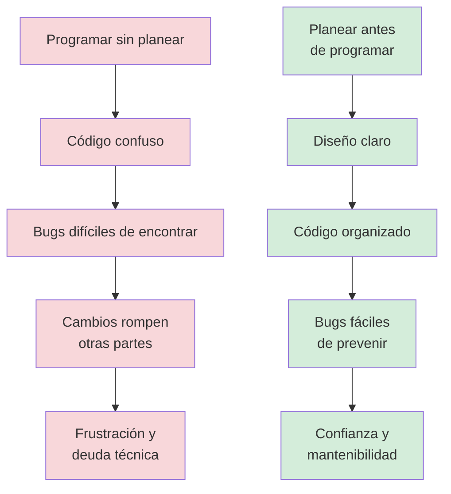
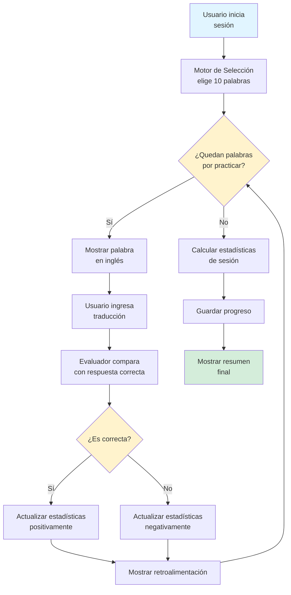

# Capítulo 8: Arquitectura de Soluciones — Pensar Antes de Programar

## Introducción: La Lección del Constructor Impaciente

Imagina que decides construir una casa. Tienes todos los materiales: ladrillos, cemento, madera, clavos, herramientas. Pero en lugar de hacer un plano primero, comienzas a apilar ladrillos directamente. Pones una pared aquí, otra allá, colocas vigas donde te parece que deberían ir. Tres semanas después, te das cuenta de que olvidaste planear dónde irían las puertas, las ventanas están a diferentes alturas, y la cocina quedó en el segundo piso sin forma de subir agua.

Este es exactamente el error que cometen muchos programadores principiantes, y probablemente tú también lo has cometido en los capítulos anteriores. Recibes un problema, te emocionas, abres tu editor de código y empiezas a escribir líneas de Python esperando que de alguna forma mágica todo encaje al final. El resultado es siempre el mismo: código confuso, lleno de bugs que no entiendes, y una sensación de frustración que te hace preguntarte si realmente estás hecho para programar.

La verdad es que la programación profesional es como la construcción: el ochenta por ciento del éxito se decide antes de escribir la primera línea de código. Los programadores experimentados no son más inteligentes que tú, simplemente han aprendido algo fundamental que cambia todo: **pensar es más importante que teclear**.

En este capítulo vas a aprender la habilidad más valiosa de un programador, aquella que separa a quien escribe código que funciona de quien escribe código que es elegante, mantenible y profesional. Vas a dominar el arte de la planificación algorítmica, el diseño de soluciones y la arquitectura de software. Vas a aprender a pensar como un arquitecto antes de trabajar como un constructor.

> **💡 Objetivo del Capítulo:**
> Al finalizar este capítulo, dominarás el método profesional de desarrollo de software en cuatro fases: entender el problema profundamente, diseñar la solución antes de programar, implementar de forma incremental, y validar sistemáticamente. Aprenderás a pensar arquitectónicamente, diseñar estructuras de datos conscientes, definir interfaces claras, y construir sistemas robustos y mantenibles.

## El Costo Real de No Planificar

Antes de sumergirnos en las técnicas de planificación, necesitas entender por qué esto es tan importante. Cuando escribes código sin planear, cada línea que agregas es como una apuesta. Estás apostando a que esa variable que nombraste de cierta forma seguirá teniendo sentido cincuenta líneas después. Estás apostando a que esa estructura de datos funcionará para todos los casos, no solo para el ejemplo que tienes en mente ahora.

El problema es que estas apuestas se acumulan. Tal vez las primeras diez líneas funcionen bien, pero en la línea veinte descubres que necesitas cambiar algo del principio. Haces el cambio, y ahora las líneas treinta a cuarenta ya no funcionan. Arreglas eso, pero rompes algo más adelante. Es como jugar al whack-a-mole, ese juego de feria donde golpeas un topo que sale de un agujero pero inmediatamente otro aparece en otro lugar.

Los programadores profesionales llaman a esto "deuda técnica". Cada decisión apresurada, cada línea de código escrita sin pensar, es como pedir dinero prestado que tendrás que pagar después con intereses. Y los intereses en programación son brutales: lo que te tomaría diez minutos arreglar si lo hubieras pensado bien desde el inicio puede convertirse en horas de debugging frustrante.

Pero aquí está la buena noticia: con las herramientas correctas de planificación, puedes evitar casi toda esa frustración. Puedes escribir código que funcione a la primera, que sea fácil de entender cuando vuelvas a él después de una semana, y que otros programadores puedan leer sin sentir que están descifrando jeroglíficos egipcios.



## El Método de las Cuatro Fases

Los proyectos de programación exitosos siguen un patrón predecible. No importa si estás construyendo un videojuego, una aplicación para gestionar tu biblioteca personal o un sistema para analizar datos científicos, el proceso siempre es el mismo. Lo llamamos el Método de las Cuatro Fases, y se ve así:

```
FASE 1: Entender          →  ¿Qué problema resuelvo realmente?
        ↓
FASE 2: Diseñar           →  ¿Cómo lo voy a resolver (sin código)?
        ↓
FASE 3: Implementar       →  ¿Qué código necesito escribir?
        ↓
FASE 4: Validar           →  ¿Funciona en todos los casos?
```

La mayoría de los principiantes saltan directamente a la Fase 3. Es comprensible, después de todo, viniste aquí a aprender Python, no a hacer filosofía. Pero aquí está el secreto que nadie te cuenta: los mejores programadores pasan el setenta por ciento de su tiempo en las Fases 1 y 2. Solo cuando tienen un plan sólido, cuando entienden cada aspecto del problema y han diseñado una solución elegante, entonces y solo entonces, abren su editor de código.

Vamos a explorar cada fase en detalle, porque dominar este proceso es lo que te convertirá en un verdadero solucionador de problemas.

| Fase | Lo que SÍ haces | Lo que NO haces | Tiempo aproximado |
|------|-----------------|-----------------|-------------------|
| **1. Entender** | Hacer preguntas, definir requisitos | Pensar en código Python | 20% del tiempo |
| **2. Diseñar** | Dibujar flujos, decidir estructuras | Abrir el editor de código | 30% del tiempo |
| **3. Implementar** | Escribir código incremental | Escribir todo de una vez | 30% del tiempo |
| **4. Validar** | Buscar casos límite, romper tu código | Asumir que funciona | 20% del tiempo |

## Fase 1: Entender el Problema (La Fase Ignorada)

Esta es probablemente la fase más subestimada y, paradójicamente, la más importante. Antes de poder resolver un problema, necesitas entenderlo completamente. No superficialmente, no "más o menos", sino con una claridad cristalina que te permita explicárselo a alguien que nunca ha oído hablar de él.

### La Técnica de los Cinco Por Qué

La técnica más poderosa para esta fase se llama "Los Cinco Por Qué". Viene del mundo de la manufactura japonesa, pero funciona perfectamente en programación. Consiste en preguntarte "¿por qué?" cinco veces seguidas hasta llegar al corazón real del problema.

Imagina que tu reto es: "Necesito un programa que me ayude a estudiar vocabulario en inglés". Apliquemos Los Cinco Por Qué:

**¿Por qué necesitas ayuda para estudiar vocabulario?**
Porque olvido las palabras que aprendo y necesito repasarlas.

**¿Por qué olvidas las palabras?**
Porque estudio todas las palabras por igual, sin distinguir cuáles ya sé bien y cuáles me cuestan más.

**¿Por qué no distingues entre palabras que sabes y palabras difíciles?**
Porque uso listas simples y siempre repaso todo en el mismo orden.

**¿Por qué siempre repasas en el mismo orden?**
Porque no tengo una forma de marcar qué palabras necesito practicar más.

**¿Por qué necesitas marcar las palabras que te cuestan más?**
Porque quiero enfocar mi tiempo limitado de estudio en lo que realmente necesito mejorar.

Acabas de descubrir que el problema real no es simplemente "estudiar vocabulario". El problema verdadero es optimizar el tiempo de estudio enfocándote en las palabras que más te cuestan. Esto cambia completamente cómo diseñarás tu solución. En lugar de un simple programa que muestra palabras al azar, ahora sabes que necesitas un sistema que rastree tu desempeño y ajuste la frecuencia de repaso.

### Descomposición en Requisitos Específicos

Otra técnica poderosa es descomponer el problema en requisitos específicos. Toma una hoja de papel, real o digital, y escribe estas cuatro categorías:

**Entradas:** ¿Qué información necesita el programa para funcionar?

**Salidas:** ¿Qué debe producir o mostrar el programa?

**Restricciones:** ¿Qué limitaciones existen (tiempo, memoria, capacidades)?

**Casos Especiales:** ¿Qué situaciones inusuales podrían ocurrir?

Para nuestro programa de vocabulario, quedaría así:

**Entradas:**
- Lista de palabras en inglés con sus traducciones
- Respuestas del usuario a las preguntas
- Histórico de cuántas veces acertó o falló cada palabra

**Salidas:**
- Palabras a practicar (priorizando las que más necesita)
- Estadísticas de progreso
- Retroalimentación inmediata sobre cada respuesta

**Restricciones:**
- Debe funcionar sin conexión a internet (después de cargar las palabras)
- Debe ser rápido de usar (idealmente menos de 20 segundos por sesión de 10 palabras)
- Debe guardar el progreso automáticamente

**Casos Especiales:**
- ¿Qué pasa si el usuario ingresa una respuesta casi correcta (con un error de escritura)?
- ¿Qué pasa si una palabra nueva se agrega al sistema?
- ¿Qué pasa si el usuario no ha practicado en varios días?

> **💡 Perspectiva del Programador:**
> Los casos especiales son donde vive la complejidad real. Un programa que funciona perfectamente con el "camino feliz" (cuando todo sale bien) pero falla miserablemente con casos especiales no es un programa profesional. Identificar estos casos temprano te ahorra semanas de debugging después.

## Fase 2: Diseñar la Solución (Antes del Código)

Ahora que entiendes el problema profundamente, es momento de diseñar la solución. Nota que dije "diseñar", no "programar". En esta fase, todavía no abres tu editor de código. En su lugar, trabajas con papel, pizarras, o herramientas de diagramación para visualizar cómo funcionará tu solución.

### Identificando Componentes del Sistema

El primer paso del diseño es identificar los componentes principales de tu sistema. Un componente es una pieza lógica que tiene una responsabilidad clara y bien definida. Para nuestro sistema de vocabulario, podríamos identificar estos componentes:

**Gestor de Palabras**: Responsable de almacenar y organizar las palabras con sus traducciones.

**Motor de Selección**: Decide qué palabras mostrar según el historial de desempeño.

**Evaluador de Respuestas**: Compara la respuesta del usuario con la correcta y actualiza estadísticas.

**Interfaz de Usuario**: Maneja la interacción con el usuario (mostrar preguntas, capturar respuestas, mostrar estadísticas).

**Sistema de Persistencia**: Guarda y carga el progreso del usuario.

Cada uno de estos componentes podría convertirse en una o más funciones en tu código Python, pero por ahora solo los identificas conceptualmente.

### Diseñando Estructuras de Datos

Una vez que tienes tus componentes, necesitas decidir cómo representarás la información en tu programa. Las estructuras de datos que elijas tendrán un impacto enorme en qué tan fácil o difícil será implementar tu solución.

Para nuestro sistema de vocabulario, podríamos diseñar:

```python
# Estructura para una palabra individual
palabra = {
    "ingles": "apple",
    "español": "manzana",
    "veces_vista": 10,
    "veces_correcta": 7,
    "ultima_practica": "2024-01-15",
    "nivel_dificultad": 0.3  # 0.0 (fácil) a 1.0 (difícil)
}

# Colección de todas las palabras
vocabulario = [palabra1, palabra2, palabra3, ...]

# Historial de una sesión de estudio
sesion = {
    "fecha": "2024-01-15",
    "palabras_practicadas": 10,
    "aciertos": 8,
    "tiempo_total_segundos": 180
}
```

Nota que tomamos decisiones específicas aquí: usamos un diccionario para cada palabra porque tiene múltiples atributos, una lista para el vocabulario completo porque el orden podría importar, y representamos la dificultad como un número entre 0 y 1 en lugar de categorías como "fácil/medio/difícil" porque los números son más fáciles de calcular.

Estas decisiones no son arbitrarias. Son el resultado de pensar en cómo usarás los datos. Por ejemplo, al representar dificultad como número, puedes fácilmente calcular una dificultad promedio o ajustarla gradualmente basándote en el desempeño.

### Mapeando el Flujo de Información

El siguiente paso es mapear cómo fluirá la información a través de tu sistema. Esto se puede hacer con diagramas de flujo o simplemente con descripciones narrativas claras.

Para una sesión de estudio en nuestro sistema:



Este diagrama te muestra exactamente qué debe pasar en qué orden. Cuando eventualmente escribas código, este diagrama será tu guía.

> **📝 Nota:**
> No necesitas herramientas sofisticadas para diseñar. Un cuaderno y un bolígrafo funcionan perfectamente. Lo importante no es la belleza del diagrama, sino la claridad de tu pensamiento.

### Definiendo Interfaces Entre Componentes

Finalmente, necesitas definir cómo se comunicarán tus componentes entre sí. En términos de Python, esto significa decidir qué funciones necesitarás y qué parámetros recibirán y qué retornarán.

Por ejemplo, para el Motor de Selección:

```python
def seleccionar_palabras_para_practicar(vocabulario, cantidad=10):
    """
    Selecciona palabras para una sesión de práctica.
    
    EXPECTATIVAS (lo que esta función necesita):
    - vocabulario: lista de diccionarios de palabras con estadísticas
    - cantidad: número de palabras a seleccionar (default: 10)
    
    GARANTÍAS (lo que esta función promete):
    - Retorna una lista de exactamente 'cantidad' palabras (o menos si no hay suficientes)
    - Las palabras están ordenadas de más difícil a menos difícil
    - Nunca retorna None o una lista vacía si hay al menos una palabra disponible
    - No modifica la lista original de vocabulario
    
    CASOS ESPECIALES:
    - Si vocabulario está vacío, retorna lista vacía
    - Si cantidad > len(vocabulario), retorna todas las palabras disponibles
    """
    pass  # Implementación vendrá después
```

Nota cómo definimos la función con un docstring detallado **antes** de escribir una sola línea de código de implementación. Esto es diseño de interfaz: estás estableciendo un "contrato" que esta función cumplirá.

Este contrato tiene tres partes críticas que todo buen diseño de interfaz debe incluir:

**EXPECTATIVAS**: Lo que la función necesita para trabajar correctamente. También conocido como "precondiciones".

**GARANTÍAS**: Lo que la función promete hacer si se cumplen las expectativas. También conocido como "postcondiciones".

**CASOS ESPECIALES**: Cómo la función maneja situaciones inusuales o límite.

Cuando diseñas interfaces de esta forma, estás creando un "contrato" claro. Cualquiera que use tu función (incluido tu yo futuro) sabe exactamente qué puede esperar.

## Fase 3: Implementar de Forma Incremental

Ahora sí, es momento de escribir código. Pero no todo de una vez. La implementación incremental es la clave para mantener la cordura en proyectos complejos.

### El Principio del Incremento Mínimo Viable

En lugar de intentar construir todo el sistema de vocabulario de una vez, construyes la versión más simple que podría posiblemente funcionar, la pruebas exhaustivamente, y solo entonces agregas más funcionalidad.

**Incremento 1: Estructura de datos básica**

Empieza solo con la capacidad de crear palabras y almacenarlas en una lista:

```python
def crear_palabra(ingles, español):
    """Crea un diccionario representando una palabra con estadísticas iniciales."""
    return {
        "ingles": ingles,
        "español": español,
        "veces_vista": 0,
        "veces_correcta": 0,
        "nivel_dificultad": 0.5  # Neutral al inicio
    }

# Prueba del Incremento 1
palabra1 = crear_palabra("apple", "manzana")
palabra2 = crear_palabra("house", "casa")
vocabulario = [palabra1, palabra2]

print("✓ Incremento 1 completo: Podemos crear y almacenar palabras")
print(vocabulario)
```

Ejecutas esto, verificas que funciona, y solo entonces continúas.

**Incremento 2: Selección básica de palabras**

Ahora implementas la función de selección, inicialmente de forma muy simple:

```python
def seleccionar_palabras_para_practicar(vocabulario, cantidad=10):
    """
    Versión simple: solo toma las primeras 'cantidad' palabras.
    (Mejoraremos esto después para considerar dificultad)
    """
    if not vocabulario:
        return []
    
    cantidad_real = min(cantidad, len(vocabulario))
    return vocabulario[:cantidad_real]

# Prueba del Incremento 2
palabras_seleccionadas = seleccionar_palabras_para_practicar(vocabulario, 2)
print("✓ Incremento 2 completo: Podemos seleccionar palabras")
print(f"Seleccionadas: {len(palabras_seleccionadas)} palabras")
```

**Incremento 3: Evaluación de respuestas**

Agregas la capacidad de evaluar si una respuesta es correcta:

```python
def evaluar_respuesta(palabra, respuesta_usuario):
    """
    Compara la respuesta del usuario con la traducción correcta.
    Por ahora, comparación exacta (case-insensitive).
    """
    correcta = palabra["español"].lower()
    usuario = respuesta_usuario.strip().lower()
    return correcta == usuario

# Prueba del Incremento 3
palabra = crear_palabra("apple", "manzana")
print(evaluar_respuesta(palabra, "manzana"))  # True
print(evaluar_respuesta(palabra, "MANZANA"))  # True
print(evaluar_respuesta(palabra, "casa"))     # False
print("✓ Incremento 3 completo: Podemos evaluar respuestas")
```

Nota el patrón: cada incremento agrega una pieza pequeña de funcionalidad que puedes probar de forma aislada. Esto tiene varias ventajas enormes. Primero, cada paso es lo suficientemente pequeño que no te abruma. Segundo, si algo sale mal, sabes exactamente dónde buscar porque solo cambiaste una cosa. Tercero, siempre tienes un programa funcional, incluso si hace menos de lo que eventualmente quieres.

### Escribiendo Código que se Explica a Sí Mismo

Cuando finalmente escribes código, hazlo de forma que sea obvio qué está pasando. Esto significa nombres de variables descriptivos, funciones pequeñas y enfocadas, y una estructura lógica clara.

Compara estos dos fragmentos que hacen lo mismo:

**Código opaco:**
```python
def p(v, c=10):
    if not v:
        return []
    r = []
    for i in v:
        if i["d"] > 0.5:
            r.append(i)
    r.sort(key=lambda x: x["d"], reverse=True)
    return r[:c]
```

**Código auto-explicativo:**
```python
def seleccionar_palabras_dificiles(vocabulario, cantidad_maxima=10):
    """Selecciona las palabras más difíciles para practicar."""
    if not vocabulario:
        return []
    
    # Filtrar solo palabras que el usuario encuentra difíciles
    palabras_dificiles = []
    for palabra in vocabulario:
        if palabra["nivel_dificultad"] > 0.5:
            palabras_dificiles.append(palabra)
    
    # Ordenar de más difícil a menos difícil
    palabras_dificiles.sort(key=lambda p: p["nivel_dificultad"], reverse=True)
    
    # Retornar solo la cantidad solicitada
    return palabras_dificiles[:cantidad_maxima]
```

El segundo fragmento es más largo, pero infinitamente más claro. Alguien que lo lee puede entender qué hace sin ejecutarlo. Los comentarios explican el "por qué" de cada sección, no el "qué" (que ya es obvio por el código).

> **⚠️ Advertencia:**
> Los comentarios que simplemente repiten lo que el código ya dice son inútiles:
> ```python
> # Sumar 1 a contador
> contador = contador + 1  # ❌ Comentario redundante
> 
> # Incrementar intentos fallidos para triggerar bloqueo de cuenta
> intentos_fallidos += 1  # ✅ Explica el propósito, no la mecánica
> ```

## Fase 4: Validar Sistemáticamente

La validación no es algo que haces una vez al final. Es un proceso continuo que ocurre después de cada incremento. Pero hay técnicas específicas que hacen la validación más efectiva.

### La Estrategia de Casos de Prueba

Para cada función importante, necesitas pensar en al menos estos cuatro tipos de casos de prueba:

**Caso normal**: La situación más común y esperada.

**Casos límite**: Situaciones en los extremos de lo que la función debería manejar.

**Casos especiales**: Situaciones inusuales pero posibles.

**Casos de error**: Entradas inválidas o situaciones que no deberían ocurrir.

Por ejemplo, para la función `seleccionar_palabras_para_practicar`:

```python
# Caso normal: vocabulario con suficientes palabras
vocabulario_normal = [crear_palabra("apple", "manzana"), 
                      crear_palabra("house", "casa"),
                      crear_palabra("water", "agua")]
resultado = seleccionar_palabras_para_practicar(vocabulario_normal, 2)
assert len(resultado) == 2, "Debe retornar exactamente 2 palabras"

# Caso límite: solicitar más palabras de las disponibles
resultado = seleccionar_palabras_para_practicar(vocabulario_normal, 10)
assert len(resultado) == 3, "Debe retornar todas las disponibles (3)"

# Caso límite: solicitar cero palabras
resultado = seleccionar_palabras_para_practicar(vocabulario_normal, 0)
assert len(resultado) == 0, "Debe retornar lista vacía si cantidad es 0"

# Caso especial: vocabulario vacío
resultado = seleccionar_palabras_para_practicar([], 5)
assert resultado == [], "Debe retornar lista vacía si vocabulario está vacío"

# Caso especial: una sola palabra
vocabulario_uno = [crear_palabra("apple", "manzana")]
resultado = seleccionar_palabras_para_practicar(vocabulario_uno, 5)
assert len(resultado) == 1, "Debe retornar la única palabra disponible"

print("✓ Todos los casos de prueba pasaron")
```

Esta batería de pruebas te da confianza de que tu función se comporta correctamente en una amplia variedad de situaciones.

### El Arte de "Romper tu Propio Código"

Una técnica avanzada es intentar activamente romper tu programa. Piensa como un usuario malintencionado o descuidado. ¿Qué podría hacer que causara problemas?

```python
# Intentando romper evaluar_respuesta
palabra = crear_palabra("apple", "manzana")

# ¿Qué pasa con espacios extra?
print(evaluar_respuesta(palabra, "  manzana  "))  # Debería ser True

# ¿Qué pasa con mayúsculas mezcladas?
print(evaluar_respuesta(palabra, "MaNzAnA"))  # Debería ser True

# ¿Qué pasa con acentos?
palabra_con_acento = crear_palabra("tree", "árbol")
print(evaluar_respuesta(palabra_con_acento, "arbol"))  # ¿True o False?

# ¿Qué pasa si el usuario ingresa vacío?
print(evaluar_respuesta(palabra, ""))  # Debería ser False

# ¿Qué pasa si la respuesta correcta tiene espacios?
palabra_compuesta = crear_palabra("living room", "sala de estar")
print(evaluar_respuesta(palabra_compuesta, "saladeestar"))  # ¿Debería ser False?
```

Cada una de estas pruebas revela una decisión de diseño que necesitas tomar. Por ejemplo, ¿deberías aceptar "arbol" si la respuesta correcta es "árbol"? No hay una respuesta universalmente correcta, pero necesitas decidir conscientemente y documentar tu decisión.

## El Refactoring: Mejorando Código que Ya Funciona

Refactoring es el proceso de mejorar la estructura interna de tu código sin cambiar su comportamiento externo. Es como reorganizar los muebles de una habitación para que fluya mejor, sin cambiar qué muebles tienes.

### Cuándo Refactorizar

Deberías considerar refactorizar cuando notes alguna de estas señales:

Has copiado y pegado el mismo código en múltiples lugares. Si cambias algo, tendrás que cambiarlo en todos lados. Este es el momento perfecto para extraer ese código a una función.

Una función hace demasiadas cosas. Si tu función tiene más de 30 líneas o si no puedes describirla sin usar la palabra "y", probablemente necesita dividirse.

Los nombres de variables no tienen sentido. Si tienes variables llamadas `temp`, `data`, `result` sin más contexto, es difícil entender qué representan.

Tienes condicionales profundamente anidados. Si tienes cuatro o cinco niveles de indentación, tu lógica es probablemente demasiado compleja.

### Ejemplo Práctico de Refactoring

Imagina que empezaste con este código funcional pero confuso:

```python
# Versión original - funciona pero es difícil de mantener
def procesar_sesion(vocab, cant):
    c = 0
    total = 0
    for i in range(cant):
        if i >= len(vocab):
            break
        p = vocab[i]
        print(f"Traduce: {p['ingles']}")
        r = input("Tu respuesta: ")
        if r.lower().strip() == p["español"].lower():
            print("✓ Correcto")
            c += 1
            p["veces_correcta"] += 1
        else:
            print(f"✗ Incorrecto. La respuesta era: {p['español']}")
        p["veces_vista"] += 1
        total += 1
    print(f"Resultado: {c}/{total} correctas")
    return c, total
```

Este código funciona, pero tiene varios problemas. Los nombres de variables son crípticos (¿qué es `c`? ¿qué es `r`?), mezcla lógica de presentación con lógica de negocio, y hace demasiadas cosas en una sola función.

Aquí está la versión refactorizada:

```python
# Versión refactorizada - misma funcionalidad, mejor estructura

def preguntar_traduccion(palabra):
    """Muestra una palabra y captura la respuesta del usuario."""
    print(f"Traduce: {palabra['ingles']}")
    respuesta = input("Tu respuesta: ")
    return respuesta.strip()

def actualizar_estadisticas_palabra(palabra, fue_correcta):
    """Actualiza las estadísticas de una palabra después de una respuesta."""
    palabra["veces_vista"] += 1
    if fue_correcta:
        palabra["veces_correcta"] += 1

def mostrar_retroalimentacion(fue_correcta, respuesta_correcta):
    """Muestra al usuario si acertó o no."""
    if fue_correcta:
        print("✓ Correcto")
    else:
        print(f"✗ Incorrecto. La respuesta era: {respuesta_correcta}")

def ejecutar_sesion_practica(vocabulario, cantidad_palabras):
    """
    Ejecuta una sesión de práctica completa.
    
    Retorna (aciertos, total_preguntas).
    """
    aciertos = 0
    palabras_a_practicar = min(cantidad_palabras, len(vocabulario))
    
    for i in range(palabras_a_practicar):
        palabra = vocabulario[i]
        respuesta_usuario = preguntar_traduccion(palabra)
        fue_correcta = evaluar_respuesta(palabra, respuesta_usuario)
        
        mostrar_retroalimentacion(fue_correcta, palabra["español"])
        actualizar_estadisticas_palabra(palabra, fue_correcta)
        
        if fue_correcta:
            aciertos += 1
    
    print(f"\nResultado final: {aciertos}/{palabras_a_practicar} correctas")
    return aciertos, palabras_a_practicar
```

La versión refactorizada es más larga, pero cada función tiene una responsabilidad clara. Si necesitas cambiar cómo se muestra la retroalimentación, sabes exactamente dónde buscar. Si quieres agregar un sistema de puntos, puedes modificar `actualizar_estadisticas_palabra` sin tocar el resto del código.

> **💡 Perspectiva del Programador:**
> El refactoring no es "tiempo perdido". Es una inversión. Código bien estructurado es más fácil de modificar, más fácil de extender, y menos propenso a bugs. Los programadores profesionales refactorizan constantemente, manteniendo su código limpio y organizado como un chef mantiene su cocina ordenada.

## Laboratorio 1: Planificación de Sistema de Notas

### Objetivo
Practicar la Fase 1 (Entender) y Fase 2 (Diseñar) del método de las cuatro fases.

### Contexto
Vas a planificar (sin programar todavía) un sistema de gestión de calificaciones para estudiantes.

### Instrucciones

**Nivel 1: Aplicar Los Cinco Por Qué**

Empieza con este problema: "Necesito un programa para gestionar las calificaciones de los estudiantes".

Aplica la técnica de Los Cinco Por Qué para descubrir el problema real que estás resolviendo. Documenta cada pregunta y respuesta.

**Nivel 2: Definir Requisitos**

Completa las cuatro categorías de requisitos:

- **Entradas**: ¿Qué información necesita el sistema?
- **Salidas**: ¿Qué debe producir?
- **Restricciones**: ¿Qué limitaciones existen?
- **Casos Especiales**: ¿Qué situaciones inusuales podrían ocurrir?

**Nivel 3: Diseñar Componentes y Estructuras**

1. Identifica al menos 4 componentes principales del sistema
2. Diseña las estructuras de datos que usarías (usando diccionarios y listas de Python)
3. Define las interfaces (docstrings con expectativas y garantías) de al menos 3 funciones clave

**Criterio de Éxito:**

Tu documentación de planificación debe ser lo suficientemente detallada que otro programador podría implementar el sistema basándose solo en ella, sin preguntarte nada.

## Laboratorio 2: Refactoring de Código Existente

### Objetivo
Practicar el arte del refactoring mejorando código funcional pero mal estructurado.

### Contexto
Te proporcionamos código que funciona pero viola principios de buen diseño. Tu tarea es mejorarlo.

### Código Inicial

```python
def procesar_numeros(datos):
    """Procesa una lista de números y retorna estadísticas."""
    t = 0
    for n in datos:
        t += n
    p = t / len(datos)
    
    nums2 = sorted(datos)
    if len(nums2) % 2 == 0:
        m = (nums2[len(nums2)//2-1] + nums2[len(nums2)//2]) / 2
    else:
        m = nums2[len(nums2)//2]
    
    return {"t": t, "p": p, "m": m, "max": max(datos), "min": min(datos)}

# Uso
datos = [4, 2, 7, 1, 9, 3, 5]
resultado = procesar_numeros(datos)
print(resultado)
```

**Nivel 1: Nombres Descriptivos**

Mejora los nombres de variables y funciones sin cambiar la lógica. Cada nombre debe explicar qué representa. Las claves del diccionario retornado también deben tener nombres completos.

**Nivel 2: Extraer Funciones**

Divide `procesar_numeros` en funciones más pequeñas y enfocadas. Crea funciones separadas para calcular suma, promedio, mediana, máximo y mínimo. Cada función debe tener un docstring con expectativas y garantías claras.

Escribe al menos dos casos de prueba para cada función nueva antes de modificar el código principal.

**Nivel 3: Manejo Robusto de Errores**

El código original asume que siempre recibirá una lista no vacía de números. Hazlo más robusto:

1. Agrega validación de entrada que verifique que la lista no está vacía y contiene solo números
2. Decide y documenta cómo manejarás casos especiales: listas vacías, listas con un solo elemento, listas con valores None
3. Actualiza los docstrings para reflejar estas decisiones
4. Escribe casos de prueba que verifiquen el comportamiento en todos estos casos especiales

**Criterio de Éxito:**

Tu código debe manejar elegantemente todos los casos de entrada, retornando valores sensatos o lanzando errores informativos según corresponda, nunca crasheando con errores crípticos.

## Laboratorio 3: El Proyecto de Diseño Completo

### Objetivo
Aplicar todo el método de las cuatro fases en un proyecto completo desde cero.

### Contexto
Vas a diseñar e implementar un "Gestor de Hábitos" que ayude a las personas a rastrear hábitos diarios y analizar su constancia. El programa debe permitir agregar hábitos (como "hacer ejercicio", "leer 30 minutos", "beber 2 litros de agua"), marcar cada día si se completó el hábito, y mostrar estadísticas como rachas actuales, porcentaje de cumplimiento, y tendencias.

**Nivel 1: Planificación Completa**

Antes de escribir una sola línea de código Python, crea un documento de diseño completo:

1. **Fase 1 - Entender**: Aplica Los Cinco Por Qué y define requisitos en las cuatro categorías
2. **Fase 2 - Diseñar**: Identifica componentes, diseña estructuras de datos, y mapea el flujo de información
3. **Interfaces**: Define la interfaz (docstrings con expectativas y garantías) para al menos cinco funciones clave
4. **Plan de Validación**: Lista diez casos de prueba que validarían que el sistema funciona correctamente

**Nivel 2: Implementación Incremental**

Implementa tu diseño en al menos cuatro incrementos pequeños:

1. **Incremento 1**: Estructura de datos básica y persistencia (cargar/guardar)
2. **Incremento 2**: Agregar hábitos y registrar cumplimiento diario
3. **Incremento 3**: Cálculo de estadísticas (rachas, promedios, porcentajes)
4. **Incremento 4**: Interfaz de usuario para interactuar con todo

Después de cada incremento, prueba exhaustivamente esa funcionalidad antes de continuar al siguiente.

**Nivel 3: Documentación y Pulido**

Ahora que tu código funciona, hazlo profesional:

1. Agrega documentación que explique decisiones de diseño no obvias
2. Identifica y refactoriza al menos tres lugares donde el código podría ser más claro
3. Crea una batería de pruebas que cubra los diez casos de validación que identificaste en el diseño
4. Escribe un archivo README.txt que explique cómo usar el programa, qué archivos crea, y qué limitaciones conocidas tiene

**Criterio de Éxito:**

Nivel 1: Tu documento de diseño debe ser tan completo que otro programador podría implementar el sistema basándose únicamente en él.

Nivel 2: Al final de cada incremento, deberías tener un programa parcialmente funcional que hace menos cosas que el objetivo final, pero hace esas pocas cosas perfectamente.

Nivel 3: Otro programador debería poder entender tu código, modificarlo si es necesario, y usarlo confiadamente, todo sin necesidad de preguntarte nada.

## Para Recordar

El método de las cuatro fases es tu mapa para cualquier proyecto de programación. Primero entiendes el problema profundamente usando técnicas como Los Cinco Por Qué y descomposición en requisitos. Segundo diseñas la solución identificando componentes, estructuras de datos y flujos de información antes de escribir código. Tercero implementas de forma incremental, construyendo y validando una pieza pequeña a la vez. Cuarto validas sistemáticamente con casos de prueba que cubren situaciones normales, límite, especiales y de error.

El diseño de interfaces claras es fundamental para código mantenible. Cada función debe tener expectativas claras sobre qué necesita para trabajar correctamente, garantías sobre qué promete hacer, y documentación sobre cómo maneja casos especiales. Esta claridad te permite trabajar en diferentes partes del sistema de forma independiente.

El refactoring no es tiempo perdido sino inversión en mantenibilidad. Código bien estructurado con nombres descriptivos, funciones enfocadas y responsabilidades claras es infinitamente más fácil de modificar y extender que código que simplemente funciona pero es confuso.

La implementación incremental te mantiene siempre con un programa funcional. Cada incremento agrega una capacidad nueva que puedes probar de forma aislada antes de continuar. Esto hace que encontrar y corregir bugs sea mucho más simple porque sabes exactamente qué cambió desde la última vez que todo funcionaba.

La validación sistemática requiere pensar en cuatro tipos de casos: normales (uso típico), límite (extremos del rango válido), especiales (situaciones inusuales pero posibles), y de error (entradas inválidas). Cubrir estos cuatro tipos te da confianza de que tu código es robusto.

## Preguntas de Reflexión

1. **Conexión con Experiencias:** Piensa en algún proyecto o tarea personal (no necesariamente de programación) donde saltaste directamente a la acción sin planear. ¿Qué problemas enfrentaste? ¿Cómo habrías abordado esa situación diferente si hubieras aplicado el Método de las Cuatro Fases?

2. **Aplicación Personal:** De las técnicas de planificación que aprendiste en este capítulo (Los Cinco Por Qué, definición de requisitos, diseño de componentes), ¿cuál te pareció más valiosa y por qué? ¿Cómo podrías aplicarla no solo a programación, sino a otros aspectos de tu vida?

3. **Visión a Futuro:** Imagina que dentro de un año estás trabajando en un proyecto de programación significativo, algo que realmente te importa. Basándote en lo que aprendiste en este capítulo, ¿qué harías diferente en tu proceso de desarrollo en comparación con cómo probablemente lo habrías abordado antes de leer esto?

## Cierre: Del Pensamiento a la Acción

Has llegado al final de este capítulo, pero en realidad estás al comienzo de tu viaje como arquitecto de software. Las habilidades que has aprendido aquí —planificar antes de programar, diseñar estructuras de datos conscientemente, definir interfaces claras, validar sistemáticamente— son las que separan a los programadores profesionales de los aficionados entusiastas.

Aquí está la verdad incómoda: muchas personas pueden aprender sintaxis Python en unas semanas. Pueden memorizar cómo funciona un bucle for, qué hace un diccionario, cómo se define una función. Pero aprender a pensar arquitectónicamente, a diseñar sistemas que sean elegantes, mantenibles y robustos, eso toma años de práctica deliberada. Y ahora tienes una ventaja porque comenzaste a practicarlo desde ahora.

Cuando trabajes en tus proyectos futuros, resistirás la tentación de abrir el editor de código inmediatamente. Te tomarás el tiempo para entender realmente el problema. Diseñarás en papel primero. Pensarás en términos de componentes e interfaces. Y cuando finalmente escribas código, lo harás con confianza porque sabrás exactamente a dónde vas.

En el próximo capítulo, aplicarás todas estas habilidades de planificación y diseño a algo concreto y tangible: trabajar con datos del mundo real almacenados en archivos. Aprenderás a leer y escribir archivos de texto, a procesar archivos CSV con miles de líneas de datos, y a transformar información cruda en conocimiento útil. Pero lo harás como un arquitecto, no como un constructor impaciente. Diseñarás sistemas de procesamiento de datos que sean robustos, eficientes y elegantes.

Porque ahora eres más que alguien que escribe código. Eres alguien que diseña soluciones.