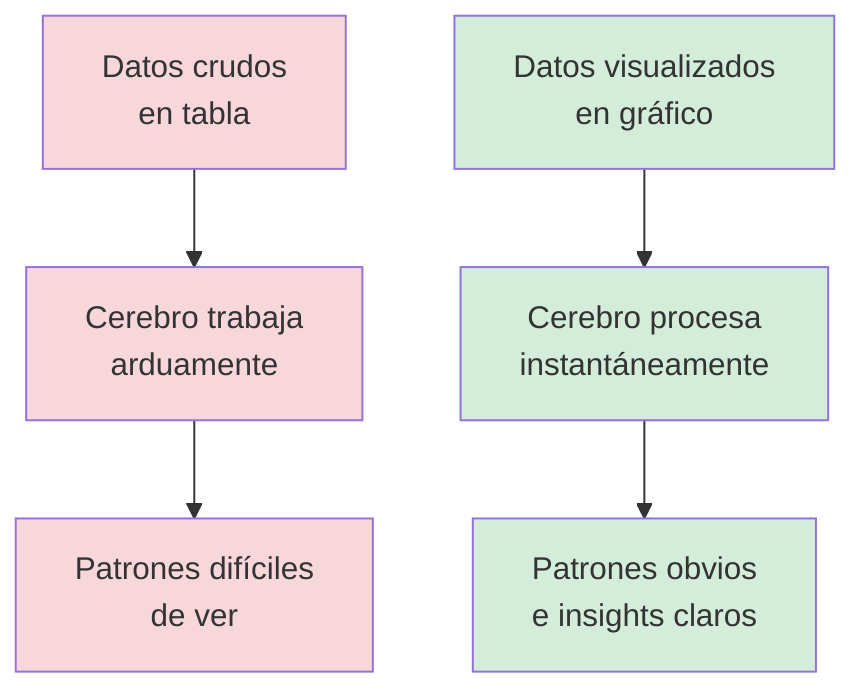

# Capítulo 10: Ver para Creer — Visualización de Datos para Contar Historias

## Introducción: La Transformación de los Números en Narrativas

Imagina que has estado recopilando datos durante semanas: las temperaturas de tu ciudad, tus puntajes en un videojuego, el crecimiento de tus seguidores en redes sociales, o las ventas de una tienda. Tienes archivos CSV llenos de números, listas repletas de información, diccionarios organizados... pero cuando miras esos datos crudos, ¿qué ves realmente?

Probablemente solo veas filas y columnas de números. Como mirar un mapa del tesoro escrito en un idioma que apenas comprendes.

Aquí está la verdad fundamental que todo programador descubre: **los datos por sí solos no comunican nada**. Son como ingredientes crudos en una cocina: tienen potencial, pero necesitan transformarse para revelar su verdadera historia.

Piénsalo así: si te muestro el número `85`, ¿es bueno o malo? ¿Alto o bajo? Imposible saberlo sin contexto. Pero si te muestro una línea que asciende desde `20` hasta `85` a lo largo de seis meses, inmediatamente entiendes una historia de progreso y mejora.

**Eso es exactamente lo que hace la visualización de datos**: transforma información invisible en comprensión instantánea.

En este capítulo vas a dominar el arte de convertir datos en historias visuales poderosas. Aprenderás a elegir el gráfico correcto para cada tipo de mensaje, a usar colores y etiquetas para guiar la atención, y a crear visualizaciones tan claras que cualquiera pueda entender tus conclusiones en segundos.

Porque en el mundo real, los mejores programadores no son solo aquellos que pueden analizar datos, sino aquellos que pueden **hacer que otros vean lo que ellos ven**.

> **💡 Objetivo del Capítulo:**
> Al finalizar este capítulo, dominarás la biblioteca Matplotlib para crear visualizaciones profesionales, comprenderás cuándo usar cada tipo de gráfico (líneas, barras, dispersión, circulares), sabrás personalizar gráficos con títulos, colores y leyendas efectivas, podrás crear paneles con múltiples gráficos usando subplots, y aprenderás a transformar archivos CSV en insights visuales que cuentan historias convincentes.

## El Poder Invisible de lo Visual: Por Qué Importa

Antes de escribir una sola línea de código, necesitas comprender por qué la visualización no es un "adorno bonito" sobre tus datos, sino una herramienta analítica fundamental.

### El Cerebro Humano: Una Máquina de Patrones Visuales

Tu cerebro procesa imágenes 60,000 veces más rápido que texto. Cuando miras una tabla con 100 números, tu cerebro tiene que trabajar arduamente para encontrar patrones, valores extremos o tendencias. Pero cuando miras un gráfico de esos mismos 100 números, los patrones saltan instantáneamente a la vista.

Piensa en esto como la diferencia entre datos crudos donde lees "Enero: 23°C, Febrero: 25°C, Marzo: 27°C, Abril: 31°C, Mayo: 35°C..." versus una visualización donde una línea que asciende suavemente revela al instante que hay un calentamiento progresivo.

### Visualización como Herramienta de Descubrimiento

Aquí está el secreto que muchos principiantes no comprenden: no creas gráficos solo para mostrar conclusiones que ya conoces. **Creas gráficos para descubrir conclusiones que aún no conoces**.

Imagina que estás analizando tus hábitos de estudio. Tienes datos de cuántas horas estudias cada día. Al crear un gráfico de barras, podrías descubrir de repente que todos tus peores resultados ocurren los lunes. Esa información estaba ahí todo el tiempo en tus datos, pero era invisible hasta que la visualizaste.



## Tu Nueva Aliada: La Biblioteca Matplotlib

En Python, la biblioteca más poderosa y ampliamente usada para crear visualizaciones es **Matplotlib**. Piensa en ella como un set completo de herramientas de dibujo profesional, pero en lugar de crear arte, estás creando comprensión.

La estructura básica de Matplotlib funciona como un lienzo en blanco que vas construyendo por capas. Primero creas un lienzo o figura, luego añades datos al lienzo creando el gráfico, después personalizas la apariencia con títulos, colores y etiquetas, y finalmente muestras el resultado final.

Veamos el código más simple posible para crear tu primera visualización:

```python
import matplotlib.pyplot as plt

# Datos de ejemplo: días de la semana y horas de estudio
dias = ['Lun', 'Mar', 'Mié', 'Jue', 'Vie']
horas = [2, 3, 2.5, 4, 1.5]

# Crear el gráfico de línea
plt.plot(dias, horas)

# Añadir título
plt.title('Mis Horas de Estudio Esta Semana')

# Mostrar el gráfico
plt.show()
```

Qué está ocurriendo aquí: `import matplotlib.pyplot as plt` importa las herramientas de gráficos y las llama `plt` para escribir menos. La función `plt.plot(dias, horas)` le dice a Matplotlib "dibuja una línea conectando estos puntos". Luego `plt.title()` añade un título descriptivo, y finalmente `plt.show()` renderiza y muestra el gráfico final.

Output esperado: verás una línea que conecta cinco puntos, mostrando claramente que estudiaste más el jueves y menos el viernes. La historia de tu semana aparece instantáneamente.

## El Arsenal de Gráficos: Eligiendo la Herramienta Correcta

Así como no usarías un martillo para cortar madera, no usas cualquier tipo de gráfico para cualquier tipo de dato. Cada tipo de visualización tiene un propósito específico.

### 1. Gráfico de Líneas: Para Mostrar Cambios en el Tiempo

Úsalo cuando quieras mostrar cómo algo evoluciona, crece o cambia a lo largo del tiempo. Los ejemplos perfectos incluyen temperatura diaria, crecimiento de seguidores, evolución de puntajes, y precio de acciones.

```python
import matplotlib.pyplot as plt

# Evolución del precio de un videojuego en diferentes tiendas durante 6 meses
meses = ['Ene', 'Feb', 'Mar', 'Abr', 'May', 'Jun']
precio_tienda_a = [59.99, 54.99, 49.99, 44.99, 39.99, 34.99]
precio_tienda_b = [59.99, 57.99, 55.99, 52.99, 49.99, 45.99]

# Crear dos líneas en el mismo gráfico
plt.plot(meses, precio_tienda_a, label='Tienda A', marker='o')
plt.plot(meses, precio_tienda_b, label='Tienda B', marker='s')

# Personalización
plt.title('Evolución de Precios: ¿Cuándo Comprar?')
plt.xlabel('Mes')
plt.ylabel('Precio (USD)')
plt.legend()  # Muestra la leyenda con los nombres de las líneas
plt.grid(True, alpha=0.3)  # Añade una rejilla sutil para facilitar la lectura

plt.show()
```

Lo que revela este gráfico: instantáneamente ves que la Tienda A baja sus precios más agresivamente. Si esperas hasta junio, ahorras casi el 40% comparado con la Tienda B.

### 2. Gráfico de Barras: Para Comparar Categorías

Úsalo cuando quieras comparar valores entre diferentes categorías o grupos. Los ejemplos perfectos incluyen ventas por producto, calificaciones por materia, población por ciudad, y likes por publicación.

```python
import matplotlib.pyplot as plt

# Cantidad de libros leídos por género este año
generos = ['Ficción', 'Ciencia', 'Historia', 'Biografía', 'Fantasía']
libros_leidos = [12, 5, 3, 7, 15]

# Crear gráfico de barras
plt.bar(generos, libros_leidos, color='steelblue', edgecolor='black')

# Personalización
plt.title('Mi Año en Lecturas: ¿Qué Leo Más?')
plt.xlabel('Género')
plt.ylabel('Cantidad de Libros')
plt.ylim(0, 18)  # Establece el límite del eje Y para mejor visualización

plt.show()
```

Por qué funciona: las barras te permiten comparar alturas instantáneamente. Ves de inmediato que Fantasía domina tus lecturas.

### 3. Gráfico de Dispersión: Para Encontrar Relaciones

Úsalo cuando quieras descubrir si existe una relación entre dos variables. Los ejemplos perfectos incluyen preguntas como ¿las horas de estudio correlacionan con las calificaciones? o ¿la temperatura afecta las ventas de helado?

```python
import matplotlib.pyplot as plt

# ¿Existe relación entre horas de práctica y puntaje en un juego?
horas_practicadas = [1, 2, 3, 4, 5, 6, 7, 8, 9, 10]
puntajes = [120, 150, 180, 220, 250, 290, 310, 350, 380, 410]

# Crear gráfico de dispersión
plt.scatter(horas_practicadas, puntajes, color='crimson', s=100, alpha=0.6)

# Personalización
plt.title('¿La Práctica Hace al Maestro?')
plt.xlabel('Horas Practicadas')
plt.ylabel('Puntaje Obtenido')
plt.grid(True, alpha=0.3)

plt.show()
```

Lo que descubres: hay una clara correlación positiva. A más horas de práctica, mejor puntaje. Esto confirma visualmente lo que sospechabas.

### 4. Gráfico Circular (Pie Chart): Para Mostrar Proporciones

Úsalo cuando quieras mostrar cómo un todo se divide en partes. Los ejemplos perfectos incluyen distribución de presupuesto, composición demográfica, y porcentaje de tiempo dedicado a actividades.

```python
import matplotlib.pyplot as plt

# ¿En qué gastas tu tiempo diario?
actividades = ['Dormir', 'Estudio', 'Entretenimiento', 'Comida', 'Otros']
horas_dedicadas = [8, 6, 4, 2, 4]

# Crear gráfico circular
plt.pie(horas_dedicadas, labels=actividades, autopct='%1.1f%%', startangle=90)

# Personalización
plt.title('Mi Día en 24 Horas')
plt.axis('equal')  # Asegura que el círculo sea circular, no elíptico

plt.show()
```

Por qué es efectivo: los porcentajes aparecen automáticamente en cada segmento, y el tamaño visual de cada rebanada comunica instantáneamente la proporción.

> **⚠️ Advertencia sobre Gráficos Circulares:**
> Aunque son populares, los gráficos circulares tienen limitaciones. Son difíciles de leer cuando tienes más de 5-6 categorías, y el cerebro humano no es bueno comparando ángulos. Si tienes muchas categorías, considera usar un gráfico de barras horizontal en su lugar.

## Personalización: Haciendo que tus Gráficos Hablen

Un gráfico sin título, sin etiquetas en los ejes, y sin leyenda es como un mapa sin nombres de calles. Técnicamente contiene información, pero nadie puede usarlo efectivamente.

### Los Elementos Esenciales de Todo Buen Gráfico

Todo gráfico profesional debe tener estos elementos fundamentales: un título descriptivo que explica qué muestra el gráfico, etiquetas en los ejes que indican qué representa cada dimensión, una leyenda cuando hay múltiples series de datos, y colores intencionales que guían la atención y facilitan la interpretación.

```python
import matplotlib.pyplot as plt

# Datos de ejemplo: evolución de seguidores en dos plataformas
meses = ['Ene', 'Feb', 'Mar', 'Abr', 'May', 'Jun']
instagram = [100, 150, 225, 340, 510, 765]
tiktok = [50, 120, 280, 550, 980, 1650]

# Crear el gráfico con personalización completa
plt.figure(figsize=(10, 6))  # Tamaño del lienzo en pulgadas

# Graficar las dos líneas
plt.plot(meses, instagram, 
         marker='o',           # Marcador circular en cada punto
         color='#E4405F',      # Color oficial de Instagram
         linewidth=2,          # Grosor de línea
         label='Instagram')    # Nombre para la leyenda

plt.plot(meses, tiktok,
         marker='s',           # Marcador cuadrado
         color='#000000',      # Negro (similar a logo TikTok)
         linewidth=2,
         linestyle='--',       # Línea punteada
         label='TikTok')

# Personalización completa
plt.title('Crecimiento de Seguidores: Instagram vs TikTok', 
          fontsize=16, 
          fontweight='bold',
          pad=20)  # Espacio entre título y gráfico

plt.xlabel('Mes', fontsize=12)
plt.ylabel('Número de Seguidores', fontsize=12)

plt.legend(loc='upper left',  # Ubicación de la leyenda
          frameon=True,       # Marco alrededor de la leyenda
          shadow=True)        # Sombra para destacarla

plt.grid(True, alpha=0.3, linestyle=':', linewidth=0.5)  # Rejilla sutil
plt.tight_layout()  # Ajusta automáticamente para que nada se corte

plt.show()
```

Este gráfico es profesional porque cada elemento tiene un propósito. El título te dice inmediatamente qué estás viendo. Las etiquetas de los ejes eliminan cualquier ambigüedad sobre qué representan los números. Los colores reflejan las marcas reales de cada plataforma, haciendo el gráfico intuitivo. La leyenda te permite identificar cada línea sin confusión.

### Colores: La Psicología Visual

Los colores no son decorativos, son comunicativos. Cada color transmite un mensaje psicológico que tu cerebro procesa subconscientemente. El rojo sugiere peligro, urgencia o pérdida. El verde sugiere crecimiento, éxito o ganancia. El azul transmite confianza, estabilidad y profesionalismo. El amarillo llama la atención pero puede ser difícil de leer.

```python
import matplotlib.pyplot as plt

# Ventas mensuales: positivas y negativas
meses = ['Ene', 'Feb', 'Mar', 'Abr', 'May', 'Jun']
ganancias = [5000, -2000, 3000, 8000, -1000, 6000]

# Crear colores intencionales: verde para ganancias, rojo para pérdidas
colores = ['green' if x > 0 else 'red' for x in ganancias]

plt.bar(meses, ganancias, color=colores, edgecolor='black', linewidth=1.5)
plt.title('Ganancias/Pérdidas Mensuales: Análisis Rápido')
plt.xlabel('Mes')
plt.ylabel('Ganancia (USD)')
plt.axhline(y=0, color='black', linestyle='-', linewidth=0.8)  # Línea en cero
plt.grid(axis='y', alpha=0.3)

plt.show()
```

En este gráfico, ni siquiera necesitas leer los números para entender la historia. Los meses verdes fueron buenos, los rojos fueron malos. La línea negra en cero proporciona una referencia visual clara.

## Subplots: Múltiples Historias en un Panel

A veces necesitas mostrar varias perspectivas de tus datos simultáneamente. Los subplots te permiten crear un panel con múltiples gráficos organizados en una cuadrícula.

### Creando un Panel de Análisis

```python
import matplotlib.pyplot as plt

# Datos de ejemplo: análisis de productividad
dias = ['Lun', 'Mar', 'Mié', 'Jue', 'Vie', 'Sáb', 'Dom']
tareas_completadas = [8, 12, 10, 15, 9, 5, 3]
horas_trabajadas = [6, 8, 7, 9, 6, 3, 2]
satisfaccion = [7, 8, 7, 9, 6, 8, 9]

# Crear figura con 3 subplots (3 filas, 1 columna)
fig, (ax1, ax2, ax3) = plt.subplots(3, 1, figsize=(10, 12))

# Subplot 1: Tareas completadas
ax1.bar(dias, tareas_completadas, color='steelblue')
ax1.set_title('Tareas Completadas por Día', fontsize=14, fontweight='bold')
ax1.set_ylabel('Cantidad')
ax1.grid(axis='y', alpha=0.3)

# Subplot 2: Horas trabajadas
ax2.plot(dias, horas_trabajadas, marker='o', color='darkgreen', linewidth=2)
ax2.set_title('Horas Trabajadas', fontsize=14, fontweight='bold')
ax2.set_ylabel('Horas')
ax2.grid(True, alpha=0.3)

# Subplot 3: Nivel de satisfacción
ax3.plot(dias, satisfaccion, marker='s', color='purple', linewidth=2)
ax3.fill_between(range(len(dias)), satisfaccion, alpha=0.3, color='purple')
ax3.set_title('Nivel de Satisfacción (1-10)', fontsize=14, fontweight='bold')
ax3.set_xlabel('Día de la Semana')
ax3.set_ylabel('Satisfacción')
ax3.grid(True, alpha=0.3)

plt.tight_layout()  # Previene superposiciones entre subplots
plt.show()
```

Este panel te permite ver tres dimensiones de productividad simultáneamente. Puedes identificar correlaciones que serían invisibles viendo los gráficos por separado. Por ejemplo, ¿notas que los días con más horas trabajadas no siempre coinciden con más tareas completadas?

### Subplots en Cuadrícula

Para comparaciones más complejas, puedes organizar subplots en una cuadrícula de filas y columnas:

```python
import matplotlib.pyplot as plt

# Datos de ventas de 4 productos en 6 meses
meses = ['Ene', 'Feb', 'Mar', 'Abr', 'May', 'Jun']
producto_a = [120, 150, 180, 210, 240, 280]
producto_b = [80, 75, 85, 90, 95, 100]
producto_c = [200, 210, 190, 220, 230, 250]
producto_d = [150, 140, 160, 170, 180, 190]

# Crear cuadrícula de 2x2
fig, ((ax1, ax2), (ax3, ax4)) = plt.subplots(2, 2, figsize=(14, 10))

# Subplot superior izquierdo
ax1.plot(meses, producto_a, marker='o', color='red', linewidth=2)
ax1.set_title('Producto A: Crecimiento Fuerte')
ax1.set_ylabel('Ventas')
ax1.grid(True, alpha=0.3)

# Subplot superior derecho
ax2.plot(meses, producto_b, marker='o', color='blue', linewidth=2)
ax2.set_title('Producto B: Estable')
ax2.grid(True, alpha=0.3)

# Subplot inferior izquierdo
ax3.plot(meses, producto_c, marker='o', color='green', linewidth=2)
ax3.set_title('Producto C: Líder del Mercado')
ax3.set_xlabel('Mes')
ax3.set_ylabel('Ventas')
ax3.grid(True, alpha=0.3)

# Subplot inferior derecho
ax4.plot(meses, producto_d, marker='o', color='orange', linewidth=2)
ax4.set_title('Producto D: Crecimiento Moderado')
ax4.set_xlabel('Mes')
ax4.grid(True, alpha=0.3)

plt.tight_layout()
plt.show()
```

Este panel te permite comparar el desempeño de cuatro productos lado a lado. Inmediatamente identificas que el Producto A tiene el crecimiento más pronunciado, mientras que el Producto B se mantiene plano.

## Integración con CSV: De Archivos a Insights Visuales

La verdadera magia ocurre cuando combinas todo lo que has aprendido: leer datos desde archivos CSV y transformarlos en visualizaciones que revelan historias ocultas.

### Proyecto Completo: Análisis de Ventas desde CSV

```python
import matplotlib.pyplot as plt
import csv

# Primero, creamos un archivo CSV de ejemplo
ventas_data = """mes,producto_a,producto_b,producto_c
Enero,12000,8000,15000
Febrero,15000,8500,14500
Marzo,18000,9000,16000
Abril,21000,9500,17500
Mayo,24000,10000,19000
Junio,28000,10500,20000"""

with open('ventas_mensuales.csv', 'w') as f:
    f.write(ventas_data)

# Ahora leemos y procesamos el CSV
meses = []
producto_a = []
producto_b = []
producto_c = []

with open('ventas_mensuales.csv', 'r') as archivo:
    lector = csv.DictReader(archivo)
    for fila in lector:
        meses.append(fila['mes'])
        producto_a.append(int(fila['producto_a']))
        producto_b.append(int(fila['producto_b']))
        producto_c.append(int(fila['producto_c']))

# Crear panel de análisis completo
fig, (ax1, ax2) = plt.subplots(2, 1, figsize=(12, 10))

# Gráfico 1: Líneas comparativas
ax1.plot(meses, producto_a, marker='o', linewidth=2, label='Producto A')
ax1.plot(meses, producto_b, marker='s', linewidth=2, label='Producto B')
ax1.plot(meses, producto_c, marker='^', linewidth=2, label='Producto C')
ax1.set_title('Evolución de Ventas por Producto', fontsize=16, fontweight='bold')
ax1.set_ylabel('Ventas (USD)', fontsize=12)
ax1.legend(loc='upper left')
ax1.grid(True, alpha=0.3)

# Gráfico 2: Ventas totales mensuales
ventas_totales = [a + b + c for a, b, c in zip(producto_a, producto_b, producto_c)]
ax2.bar(meses, ventas_totales, color='teal', edgecolor='black')
ax2.set_title('Ventas Totales Mensuales', fontsize=16, fontweight='bold')
ax2.set_xlabel('Mes', fontsize=12)
ax2.set_ylabel('Total (USD)', fontsize=12)
ax2.grid(axis='y', alpha=0.3)

# Añadir valores en las barras
for i, total in enumerate(ventas_totales):
    ax2.text(i, total + 1000, f'${total:,}', ha='center', fontweight='bold')

plt.tight_layout()
plt.show()

print(f"✅ Análisis completo generado desde {len(meses)} meses de datos")
print(f"💰 Ventas totales del período: ${sum(ventas_totales):,}")
```

Este código completo demuestra el flujo profesional completo: crear o leer datos desde CSV, procesarlos en estructuras de Python, generar visualizaciones múltiples que cuentan diferentes aspectos de la historia, y añadir personalización que hace el análisis inmediatamente comprensible.

## Guardando tus Visualizaciones

Los gráficos en la pantalla son útiles, pero a menudo necesitas guardarlos como imágenes para incluirlos en reportes, presentaciones o compartirlos con otros.

```python
import matplotlib.pyplot as plt

# Tu código de visualización aquí
plt.plot([1, 2, 3, 4], [1, 4, 9, 16])
plt.title('Mi Gráfico Importante')

# Guardar como imagen de alta calidad
plt.savefig('mi_grafico.png', 
            dpi=300,              # Resolución alta (300 DPI es estándar profesional)
            bbox_inches='tight',  # Elimina espacios en blanco extra
            facecolor='white')    # Fondo blanco

print("✅ Gráfico guardado como 'mi_grafico.png'")

# Mostrar también en pantalla si lo deseas
plt.show()
```

También puedes guardar en otros formatos como PDF (ideal para documentos impresos), SVG (formato vectorial escalable sin pérdida de calidad), o JPEG (para web cuando el tamaño del archivo importa).

## Laboratorio: Dashboard de Análisis Personal

### Objetivo
Crear un dashboard completo que analice datos reales o realistas desde archivos CSV y genere múltiples visualizaciones en un panel profesional.

### Contexto
Vas a construir un sistema de análisis que lea datos desde CSV y genere un panel de 4 gráficos que cuenten una historia completa sobre los datos.

### Instrucciones

**Nivel 1 (Funcional):**

Crea tres archivos CSV con datos simples pero realistas:

1. `temperaturas.csv` con columnas: mes, temperatura_promedio
2. `gastos.csv` con columnas: categoria, monto
3. `productividad.csv` con columnas: dia, tareas_completadas

Luego escribe código que lea estos archivos y genere un gráfico separado para cada uno mostrando los datos de la forma más apropiada (líneas para temperaturas, barras para gastos, líneas para productividad).

**Nivel 2 (Mejorado):**

Organiza los tres gráficos en un panel usando subplots. Cada gráfico debe tener título descriptivo, etiquetas en los ejes, colores intencionales, y una rejilla para facilitar la lectura. Añade un título general al panel completo.

**Nivel 3 (Profesional):**

Expande a cuatro gráficos en una cuadrícula de 2x2. Añade un cuarto análisis que combine datos de los CSV de alguna forma interesante (por ejemplo, correlación entre gastos y productividad). Implementa personalización avanzada como anotaciones con `plt.annotate()`, colores condicionales, y leyendas detalladas. Exporta el panel completo como imagen PNG de alta resolución.

**Criterio de Éxito:**

Los datos en los CSV son procesados correctamente sin errores. Los gráficos comunican insights claramente sin necesidad de explicación adicional. El código está organizado con comentarios explicativos en cada sección. El panel exportado se ve profesional y podría incluirse en un reporte real.

## Actividades Prácticas

### Actividad 1: El Análisis de Popularidad Musical

Contexto: tienes datos sobre las reproducciones de tus 5 artistas favoritos durante el último año.

**Nivel 1 (Funcional):**
Define listas con los nombres de 5 artistas y sus reproducciones totales (números ficticios de 6 cifras). Crea un gráfico de barras horizontal. Añade título y etiquetas de ejes. Muestra el gráfico.

**Nivel 2 (Mejorado):**
Ordena los artistas de mayor a menor cantidad de reproducciones antes de graficar usando `sorted()`. Usa un color diferente para destacar al artista más escuchado. Añade los valores exactos al final de cada barra usando `plt.text()`. Incluye una rejilla en el eje X para facilitar la lectura.

**Nivel 3 (Personalizado):**
Añade tus artistas y datos reales si tienes acceso a tus estadísticas de Spotify. Crea un segundo subplot que muestre la distribución porcentual usando un gráfico circular. Exporta ambos gráficos como una imagen PNG de alta resolución. Bonus: añade una línea vertical marcando el promedio de reproducciones.

Criterio de éxito: debes poder identificar instantáneamente quién es tu artista número uno y qué porcentaje de tu tiempo total de escucha representa.

### Actividad 2: Evolución de Habilidades en Programación

Contexto: vas a simular tu propio progreso de aprendizaje en Python durante 12 semanas.

**Nivel 1 (Funcional):**
Crea una lista con 12 valores numéricos (del 0 al 100) representando tu nivel cada semana. Crea una lista con los números de semana (1 a 12). Genera un gráfico de línea básico con título y etiquetas.

**Nivel 2 (Optimizado):**
Añade marcadores (círculos) en cada punto de dato. Usa `plt.fill_between()` para rellenar el área bajo la curva con transparencia. Añade una línea horizontal punteada en el valor 70 etiquetada como "Nivel Competente". Personaliza el color de la línea usando un código hexadecimal.

**Nivel 3 (Creativo):**
Crea dos líneas en el mismo gráfico: una para "Habilidad Técnica" y otra para "Confianza Personal", mostrando que pueden evolucionar a ritmos diferentes. Añade una leyenda para diferenciar ambas líneas. Resalta con una anotación textual (`plt.annotate()`) el punto de inflexión donde ocurrió el mayor salto de aprendizaje.

Criterio de éxito: el gráfico debe mostrar claramente una tendencia de crecimiento, con puntos de aceleración visible en ciertas semanas.

### Actividad 3: Análisis de Presupuesto Personal con CSV

Contexto: vas a analizar tus gastos mensuales desde un archivo CSV.

**Nivel 1 (Funcional):**
Crea manualmente el CSV con 5 categorías de gastos (Comida, Transporte, Entretenimiento, Ahorros, Otros) y valores ficticios para 3 meses. Escribe código que lea el CSV. Genera un gráfico de barras agrupadas mostrando las tres columnas de meses para cada categoría.

**Nivel 2 (Mejorado):**
Calcula automáticamente el total gastado cada mes. Crea un segundo gráfico (subplot) que muestre solo los totales mensuales como un gráfico de línea. Añade etiquetas de datos mostrando los valores exactos.

**Nivel 3 (Proyecto Completo):**
Expande el CSV a 6 meses de datos. Crea un panel de 3 gráficos: barras agrupadas por categoría y mes, línea mostrando evolución de gastos totales, y pie chart del último mes mostrando distribución porcentual. Añade un título general al panel. Exporta como PDF.

Criterio de éxito: debes poder responder mirando tus gráficos: ¿En qué mes gasté más? ¿Qué categoría consume la mayor parte de mi presupuesto? ¿Mis gastos están aumentando o disminuyendo con el tiempo?

## Para Recordar

El gráfico de líneas muestra cambios en el tiempo, úsalo cuando tienes datos secuenciales temporales. El gráfico de barras compara categorías discretas, úsalo cuando quieres rankings o comparaciones directas. El gráfico de dispersión revela relaciones entre variables, úsalo cuando buscas correlaciones o patrones. El gráfico circular muestra partes de un todo, úsalo cuando quieres destacar proporciones o porcentajes.

La personalización busca claridad sobre belleza. Siempre incluye títulos descriptivos, etiquetas claras en los ejes, y colores intencionales que guíen la comprensión. Los subplots permiten múltiples perspectivas en un panel, perfectos para análisis comparativos o dashboards.

La ecuación del éxito en visualización es: datos correctos más gráfico apropiado más personalización clara igual a comprensión instantánea.

## Preguntas de Reflexión

1. Piensa en una decisión importante que hayas tomado recientemente (qué estudiar, qué comprar, dónde ir). Si hubieras tenido datos visualizados sobre las opciones, ¿habría cambiado tu decisión? ¿Por qué?

2. Elige una estadística que encuentres en redes sociales o noticias esta semana. ¿Qué tipo de gráfico usarías para presentarla de forma más clara? ¿Qué intentaría ocultar o resaltar ese gráfico según cómo lo diseñes?

3. Reflexiona sobre tu propia relación con los números. ¿Te resultan intimidantes las tablas con muchos datos? ¿Cambió tu percepción después de aprender a visualizarlos? ¿Qué te da más confianza: ver números o ver gráficos?

## Cierre: El Puente hacia el Mundo Real

Has dado un salto monumental en este capítulo. No solo aprendiste a crear gráficos, aprendiste a pensar visualmente.

Esta habilidad te acompañará mucho más allá de Python. Cuando presentes un proyecto escolar y necesites que tu audiencia comprenda tus hallazgos, cuando analices tus propios hábitos y quieras encontrar patrones para mejorar, o cuando entres al mundo laboral y necesites comunicar análisis complejos a personas que no son técnicas, esta habilidad será fundamental.

Pero hay algo más profundo aquí. La visualización de datos es también una forma de honestidad intelectual. Un buen gráfico no puede mentir fácilmente porque los patrones y las verdades emergen visualmente. En una era donde la desinformación es común, ser capaz de analizar y visualizar datos críticamente es un superpoder cívico.

En el próximo capítulo, daremos el paso final en tu transformación: hablaremos sobre programación ética y responsable. Porque el poder de manipular datos, automatizar decisiones y crear sistemas viene con responsabilidades profundas.

Ya no solo estás aprendiendo Python. Estás desarrollando una forma de pensar que te convertirá en alguien capaz de encontrar verdades ocultas en el ruido de la información.

Y eso, en el siglo XXI, es uno de los poderes más valiosos que puedes adquirir.